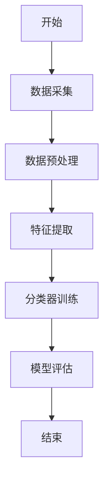
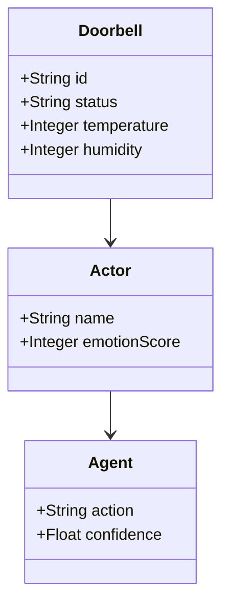

                 


# AI Agent在智能门铃中的访客情绪识别

> 关键词：AI Agent, 智能门铃, 访客情绪识别, 情绪识别技术, 系统架构设计

> 摘要：本文深入探讨了AI Agent在智能门铃中的应用，重点分析了访客情绪识别的技术实现。通过背景介绍、核心概念、算法原理、系统架构设计、项目实战和最佳实践等多维度的详细阐述，本文为读者提供了从理论到实践的全面指南，帮助理解并应用AI技术提升智能门铃的功能与用户体验。

---

# 第一部分: AI Agent在智能门铃中的访客情绪识别概述

# 第1章: 背景介绍

## 1.1 问题背景

### 1.1.1 智能门铃的发展历程
智能门铃作为智能家居的重要组成部分，经历了从机械门铃到智能传感器，再到AI驱动的智能设备的演变。早期的智能门铃主要实现远程通知和视频监控功能，而随着AI技术的发展，现在的智能门铃开始具备更复杂的功能，如访客情绪识别。

### 1.1.2 情绪识别技术的现状
情绪识别技术基于语音、语调、语速和面部表情等多种特征，近年来在机器学习和深度学习的推动下取得了显著进展。然而，目前情绪识别技术在实际应用中仍面临数据多样性不足、实时性要求高等挑战。

### 1.1.3 AI Agent在智能门铃中的应用潜力
AI Agent（智能体）能够通过自然语言处理和机器学习模型实时分析访客的情绪，从而为用户提供更智能化的交互体验。这种结合不仅提升了门铃的功能，还为智能家居的未来发展提供了新的可能性。

## 1.2 问题描述

### 1.2.1 智能门铃的访客情绪识别需求
访客情绪识别需求包括实时监测访客情绪、自动调整交互方式以及在特定情绪下触发预设响应（如报警或开启特定服务）。

### 1.2.2 当前访客情绪识别的主要挑战
主要挑战包括复杂环境下的数据采集问题、算法实时性要求、模型泛化能力不足以及隐私保护问题。

### 1.2.3 问题解决的目标与意义
目标是通过AI Agent实现准确、实时的访客情绪识别，意义在于提升用户体验、增强安全性以及推动智能家居技术的创新。

## 1.3 问题解决

### 1.3.1 AI Agent的核心作用
AI Agent通过整合多种传感器数据和AI算法，实现对访客情绪的实时分析和响应。

### 1.3.2 情绪识别技术的实现路径
实现路径包括数据采集、特征提取、模型训练和实时识别。

### 1.3.3 智能门铃系统与AI Agent的结合方式
结合方式包括数据接口集成、算法模块嵌入和系统功能协同。

## 1.4 边界与外延

### 1.4.1 情绪识别的适用场景
适用场景包括访客情绪监测、异常行为预警和个性化服务提供。

### 1.4.2 情绪识别的局限性
局限性包括数据采集干扰、模型误判和用户隐私保护。

### 1.4.3 智能门铃系统的边界条件
边界条件包括系统功能范围、数据处理能力、硬件性能限制和用户权限设置。

## 1.5 概念结构与核心要素组成

### 1.5.1 情绪识别的核心要素
核心要素包括数据采集、特征提取、模型训练和结果输出。

### 1.5.2 AI Agent的功能模块
功能模块包括数据处理模块、特征提取模块、情绪识别模块和交互控制模块。

### 1.5.3 智能门铃系统的整体架构
整体架构包括硬件设备、数据采集模块、AI Agent处理模块和用户交互界面。

---

# 第2章: 核心概念与联系

## 2.1 情绪识别的基本原理

### 2.1.1 情绪识别的定义
情绪识别是通过分析语音、语调、语速和面部表情等特征，判断个体情绪状态的技术。

### 2.1.2 情绪识别的主要技术
主要技术包括基于语音的识别技术、基于面部表情的识别技术和基于文本的情感分析技术。

### 2.1.3 情绪识别的关键特征
关键特征包括语调变化、词汇选择、停顿时间、面部表情和声音频率。

## 2.2 核心概念的特征对比

### 2.2.1 不同情绪识别方法的特征对比
| 情绪识别方法 | 基于语音 | 基于面部表情 | 基于文本分析 |
|---------------|----------|--------------|---------------|
| 数据来源     | 音频信号 | 图像数据      | 文本内容      |
| 实时性       | 较高     | 较低         | 一般          |
| 适用场景     | 电话对话 | 视频会议      | 文本交互      |

### 2.2.2 情绪识别与语音识别的差异
- 语音识别关注语音内容，情绪识别关注情感特征。
- 语音识别是模式识别，情绪识别是情感分析。

### 2.2.3 情绪识别与面部表情识别的联系
两者都依赖于非语言特征，但面部表情识别更依赖视觉数据，情绪识别可以结合语音和视觉数据。

## 2.3 ER实体关系图

```mermaid
er
    Actor(访客) --> Doorbell(智能门铃)
    Doorbell --> EmotionData(情绪数据)
    Actor --> Interaction(交互记录)
    EmotionData --> Agent(AI Agent)
    Doorbell --> Agent
```

---

# 第3章: 算法原理讲解

## 3.1 算法概述

### 3.1.1 基于语音的情绪识别算法
基于语音的情绪识别算法通常包括特征提取、模型训练和分类器设计三个步骤。

### 3.1.2 基于语调的情绪识别模型
语调模型通过分析语音的声学特征（如音高、音强和语速）来判断情绪状态。

### 3.1.3 基于语速的情绪识别方法
语速分析方法通过计算语音中的停顿、重复和语速变化来判断情绪。

## 3.2 算法实现

### 3.2.1 数据预处理
数据预处理包括语音信号的降噪、分割和标准化处理。

### 3.2.2 特征提取
特征提取包括时域特征（如均方差、偏度）和频域特征（如谱熵、能量）的提取。

### 3.2.3 分类器设计
分类器设计基于支持向量机（SVM）或长短期记忆网络（LSTM）等深度学习模型。

## 3.3 算法流程图



## 3.4 数学

### 情绪识别分类器的损失函数
损失函数定义为：
$$ L = \frac{1}{N}\sum_{i=1}^{N} (y_i - \hat{y_i})^2 $$

其中，\( y_i \) 是真实标签，\( \hat{y_i} \) 是预测结果。

### 支持向量机的数学模型
支持向量机的目标函数为：
$$ \min_{w,b,\xi} \frac{1}{2}||w||^2 + C\sum_{i=1}^{N}\xi_i $$
$$ y_i(w \cdot x_i + b) \geq 1 - \xi_i $$
$$ \xi_i \geq 0 $$

---

# 第4章: 系统分析与架构设计

## 4.1 问题场景介绍

### 4.1.1 项目背景
本项目旨在通过AI Agent实现智能门铃的访客情绪识别功能，提升用户交互体验。

### 4.1.2 项目介绍
项目目标是开发一个能够实时识别访客情绪的智能门铃系统。

## 4.2 系统功能设计

### 4.2.1 领域模型


### 4.2.2 系统架构


### 4.2.3 系统接口设计
- **输入接口**：麦克风、摄像头和触摸屏。
- **输出接口**：扬声器、显示屏和网络接口。

### 4.2.4 系统交互
```mermaid
sequenceDiagram
    Actor -> Doorbell: 触发门铃
    Doorbell -> Agent: 获取情绪数据
    Agent -> Database: 查询历史数据
    Agent -> Doorbell: 返回情绪状态
    Doorbell -> Client: 显示结果
```

---

# 第5章: 项目实战

## 5.1 环境安装

### 5.1.1 开发环境
- 操作系统：Linux
- 开发工具：PyCharm
- 依赖库：numpy, scipy, scikit-learn

### 5.1.2 硬件安装
- 摄像头：支持视频采集
- 麦克风：支持语音采集
- 网络接口：支持数据传输

## 5.2 核心代码实现

### 5.2.1 数据预处理代码
```python
import numpy as np
from scipy.io import wavfile

def preprocess_audio(wav_path):
    # 读取音频数据
    sampling_rate, data = wavfile.read(wav_path)
    # 标准化处理
    data = (data - np.mean(data)) / np.std(data)
    return data, sampling_rate
```

### 5.2.2 特征提取代码
```python
import numpy as np
from scipy import signal

def extract_features(audio_data, sampling_rate):
    # 时域特征
    zcr = np.count_nonzero(np.diff(np.sign(audio_data))) / len(audio_data)
    energy = np.mean(audio_data**2)
    # 频域特征
    fft = np.abs(signal.fft(audio_data))
    spectral_energy = np.mean(fft**2)
    return [zcr, energy, spectral_energy]
```

### 5.2.3 分类器实现代码
```python
from sklearn import svm

def train_emotion_classifier(features, labels):
    # 训练支持向量机模型
    clf = svm.SVC()
    clf.fit(features, labels)
    return clf
```

## 5.3 案例分析

### 5.3.1 实际案例
分析一个访客与智能门铃的交互案例，展示情绪识别的过程和结果。

### 5.3.2 分析结果
通过模型预测和实际结果对比，评估系统的准确性和稳定性。

## 5.4 项目总结

### 5.4.1 项目成果
成功实现了AI Agent在智能门铃中的情绪识别功能。

### 5.4.2 经验总结
包括数据采集质量、算法优化和系统稳定性的经验教训。

---

# 第6章: 最佳实践

## 6.1 小结

### 6.1.1 核心技术总结
总结情绪识别的关键技术，包括数据处理、特征提取和模型训练。

### 6.1.2 系统设计总结
总结系统设计中的模块划分和架构选择。

## 6.2 注意事项

### 6.2.1 数据隐私保护
强调数据采集和处理中的隐私保护措施。

### 6.2.2 系统稳定性保障
提出系统运行中的稳定性保障策略。

## 6.3 拓展阅读

### 6.3.1 推荐技术书籍
推荐相关的技术书籍和论文。

### 6.3.2 推荐实践项目
推荐相关的实践项目和开源库。

---

# 作者：AI天才研究院/AI Genius Institute & 禅与计算机程序设计艺术 /Zen And The Art of Computer Programming

