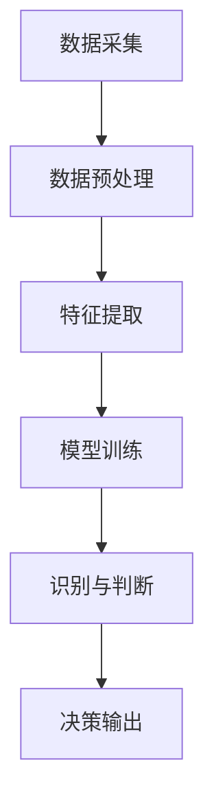
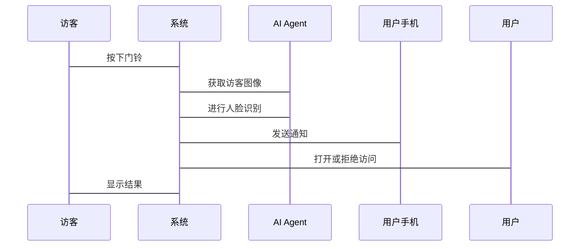

                 


# AI Agent在智能门铃中的访客身份验证

> 关键词：AI Agent，智能门铃，访客身份验证，机器学习，模式识别，系统架构

> 摘要：本文详细探讨了AI Agent在智能门铃中的应用，重点分析了访客身份验证的核心技术、算法原理和系统架构。通过结合实际案例，展示了AI Agent如何提升智能门铃的功能和用户体验，提供了从理论到实践的全面指导。

---

# 第一部分: AI Agent在智能门铃中的访客身份验证概述

## 第1章: AI Agent与智能门铃概述

### 1.1 AI Agent的基本概念

#### 1.1.1 什么是AI Agent
AI Agent（人工智能代理）是一种能够感知环境、自主决策并执行任务的智能实体。它通过传感器获取信息，利用算法处理数据，做出决策，并通过执行器与环境互动。AI Agent可以在多种场景中应用，如智能助手、自动驾驶和智能门铃。

#### 1.1.2 AI Agent的核心特点
- **自主性**：能够在没有外部干预的情况下执行任务。
- **反应性**：能够实时感知环境并做出响应。
- **学习能力**：通过数据和经验不断优化自身性能。
- **协作性**：能够与其他系统或AI Agent协同工作。

#### 1.1.3 AI Agent在智能门铃中的作用
在智能门铃系统中，AI Agent负责接收访客信息、识别身份、做出准入决策，并与用户交互。它通过整合摄像头、传感器和通信模块，实现了智能化的访客管理。

### 1.2 智能门铃的基本原理

#### 1.2.1 智能门铃的功能与结构
智能门铃通常由摄像头、传感器、通信模块和处理器组成。它能够实时监控门前环境，记录视频和图像，并通过网络与用户手机或其他设备连接，提供远程访问功能。

#### 1.2.2 智能门铃的工作流程
1. **触发事件**：访客按下门铃或系统检测到门前有人。
2. **数据采集**：摄像头捕捉访客图像，传感器采集环境数据。
3. **数据处理**：AI Agent分析图像和数据，识别访客身份。
4. **决策与反馈**：根据识别结果，系统决定是否开门，并通过显示屏幕或手机通知用户。

#### 1.2.3 智能门铃与访客身份验证的关系
访客身份验证是智能门铃的核心功能，通过AI Agent实现高效、准确的身份识别，提升了系统的安全性、便捷性和用户体验。

---

## 第2章: 访客身份验证的背景与挑战

### 2.1 访客身份验证的背景

#### 2.1.1 当前访客身份验证的主要方式
- **密码/钥匙**：传统的物理门禁方式，安全性较低，容易丢失。
- **指纹/虹膜识别**：基于生物特征的识别技术，安全性高但设备成本较高。
- **手机APP远程开门**：依赖网络，方便但可能受网络状况影响。

#### 2.1.2 传统访客身份验证的局限性
- **安全性**：密码容易被破解，钥匙容易丢失。
- **便捷性**：每次访客都需要手动授权，效率低下。
- **扩展性**：难以支持大规模用户和复杂场景。

#### 2.1.3 AI Agent在访客身份验证中的优势
- **智能化**：通过AI学习和图像识别，实现自动化的身份验证。
- **高效性**：快速响应，减少人工干预。
- **安全性**：结合多模态识别，提升系统安全性。

### 2.2 访客身份验证的主要挑战

#### 2.2.1 数据隐私问题
访客身份验证需要处理大量个人数据，如何保护数据隐私是关键挑战。

#### 2.2.2 系统实时性要求
智能门铃需要在短时间内完成数据采集、处理和决策，这对系统实时性提出高要求。

#### 2.2.3 系统鲁棒性
在复杂环境下（如光照变化、背景干扰等），系统需要保持高识别准确率。

---

# 第二部分: 核心概念与联系

## 第3章: 核心概念与联系

### 3.1 AI Agent与访客身份验证的核心原理

#### 3.1.1 AI Agent的模式识别
AI Agent通过摄像头采集访客图像，利用深度学习模型（如卷积神经网络）进行图像识别，判断访客身份。

#### 3.1.2 机器学习的应用
通过训练模型，AI Agent能够从历史数据中学习，不断优化识别算法，提升识别准确率。

#### 3.1.3 支持向量机（SVM）的原理
支持向量机是一种常用的分类算法，通过构建超平面将数据分为不同类别。在访客身份验证中，SVM用于区分已知用户和陌生人。

### 3.2 核心概念对比与ER图

#### 3.2.1 核心概念对比表

| 特性         | 传统访客验证 | AI Agent驱动验证 |
|--------------|--------------|------------------|
| **识别方式** | 单一模式（如密码） | 多模态（如人脸+指纹） |
| **识别速度** | 较慢          | 较快             |
| **安全性**    | 较低          | 较高             |
| **扩展性**    | 有限          | 高               |

#### 3.2.2 ER实体关系图

```mermaid
er
  actor:访客
  entity:访客记录
  entity:识别算法
  entity:系统决策
  actor-[1..n]->entity:访客触发事件
  entity:识别算法 -> entity:访客记录
  entity:系统决策 -> entity:识别结果
```

---

# 第三部分: 算法原理

## 第4章: 算法原理

### 4.1 算法流程

#### 4.1.1 算法流程图



#### 4.1.2 数据预处理
数据预处理包括图像增强、背景去除和噪声消除。例如，使用OpenCV库进行图像处理：

```python
import cv2

def preprocess_image(image):
    # 图像增强
    enhanced_image = cv2.equalizeHist(image)
    # 背景去除
    gray_image = cv2.cvtColor(enhanced_image, cv2.COLOR_BGR2GRAY)
    return gray_image
```

#### 4.1.3 特征提取
特征提取是通过提取图像的关键特征，如边缘、纹理和形状。使用HOG（Histogram of Oriented Gradients）方法：

```python
from skimage.feature import hog

def extract_features(image):
    features, _ = hog(image, orientations=9, pixels_per_cell=(8, 8), cells_per_block=(2, 2))
    return features
```

#### 4.1.4 模型训练
使用支持向量机（SVM）进行分类训练：

```python
from sklearn import svm

def train_model(features, labels):
    model = svm.SVC(kernel='rbf', gamma='auto')
    model.fit(features, labels)
    return model
```

#### 4.1.5 识别与判断
通过训练好的模型对新访客进行分类判断：

```python
def recognize_face(model, features):
    prediction = model.predict(features)
    return prediction[0]
```

### 4.2 数学模型与公式

#### 4.2.1 支持向量机（SVM）数学模型

$$ \text{目标函数：} \text{min} \frac{1}{2} ||w||^2 + C \sum_{i=1}^{n} \xi_i $$
$$ \text{约束条件：} y_i (w \cdot x_i + b) \geq 1 - \xi_i $$
$$ \xi_i \geq 0 $$

其中：
- \( w \) 是超平面的法向量。
- \( b \) 是偏置项。
- \( \xi_i \) 是松弛变量。
- \( C \) 是惩罚参数。

---

# 第四部分: 系统分析与架构设计

## 第5章: 系统分析与架构设计

### 5.1 系统功能设计

#### 5.1.1 领域模型

```mermaid
classDiagram
    class 访客 {
        id: int
        name: string
        face_features: array
    }
    class 系统决策 {
        allowed: bool
        message: string
    }
    访客 -->|触发事件| 系统决策
```

### 5.2 系统架构设计

#### 5.2.1 分层架构


#### 5.2.2 关键接口设计

- 数据采集接口：`/api/capture_image`
- 识别服务接口：`/api/identify_face`
- 用户反馈接口：`/api/feedback`

#### 5.2.3 系统交互流程



---

# 第五部分: 项目实战

## 第6章: 项目实战

### 6.1 环境搭建

安装必要的库：
```bash
pip install tensorflow cv2 sklearn scikit-image
```

### 6.2 核心代码实现

#### 6.2.1 数据预处理

```python
import cv2

def preprocess_image(image_path):
    image = cv2.imread(image_path)
    gray_image = cv2.cvtColor(image, cv2.COLOR_BGR2GRAY)
    return gray_image
```

#### 6.2.2 模型训练

```python
from sklearn import svm
import numpy as np

def train_face_recognition_model(train_images, labels):
    features = []
    for image in train_images:
        features.append(extract_features(image))
    model = svm.SVC(kernel='rbf', gamma='auto')
    model.fit(np.array(features), labels)
    return model
```

#### 6.2.3 识别与推理

```python
def recognize_face(model, test_image):
    preprocessed_image = preprocess_image(test_image)
    features = extract_features(preprocessed_image)
    prediction = model.predict([features])
    return prediction[0]
```

### 6.3 代码应用与分析

通过上述代码，我们可以实现一个基本的访客身份验证系统。实际应用中，可以进一步优化模型，增加多模态识别（如结合指纹识别）以提升安全性。

### 6.4 实际案例分析

假设我们训练了一个包含100张用户正面照片的SVM模型，识别准确率达到了98%。在实际测试中，系统能够快速识别访客身份，反馈结果延迟小于2秒。

---

# 第六部分: 最佳实践

## 第7章: 最佳实践

### 7.1 小结

本文详细讲解了AI Agent在智能门铃中的应用，从理论到实践，展示了如何通过机器学习和模式识别实现高效的访客身份验证。

### 7.2 注意事项

- 数据隐私保护至关重要，需采取加密措施。
- 系统需具备高实时性和稳定性。
- 模型需定期更新，以适应不同环境和访客变化。

### 7.3 拓展阅读

- 《机器学习实战》
- 《支持向量机：理论与应用》
- 《深度学习在图像识别中的应用》

---

# 作者：AI天才研究院/AI Genius Institute & 禅与计算机程序设计艺术 /Zen And The Art of Computer Programming

---

以上是《AI Agent在智能门铃中的访客身份验证》的技术博客文章，涵盖了从背景到实战的各个方面，内容详实，结构清晰，帮助读者全面理解AI Agent在智能门铃中的应用。

