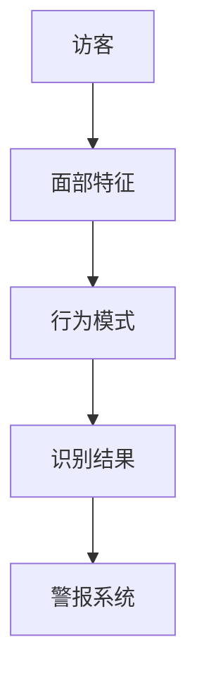
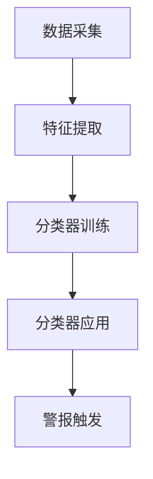
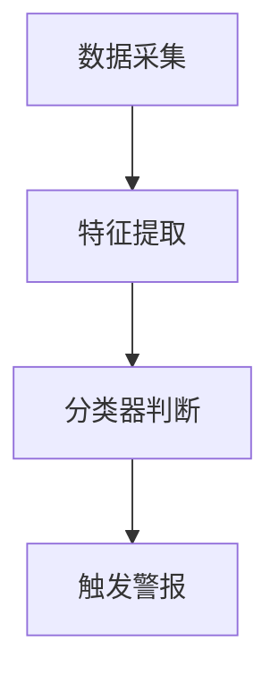

                 


# AI Agent在智能门铃中的陌生人识别警报

> 关键词：AI Agent，智能门铃，陌生人识别，警报系统，人工智能，安全监控

> 摘要：本文深入探讨了AI Agent在智能门铃中的应用，特别是陌生人识别警报系统。通过分析AI Agent的核心原理、算法实现、系统架构设计以及项目实战，详细展示了如何利用AI技术提升智能门铃的安全性能。文章内容包括背景介绍、核心概念、算法原理、系统架构、项目实战及最佳实践等部分，旨在为读者提供全面的技术指导。

---

# 目录

## 第一部分: AI Agent在智能门铃中的陌生人识别警报概述

### 第1章: 背景介绍

#### 1.1 问题背景

##### 1.1.1 智能门铃的发展历程

智能门铃作为智能家居的重要组成部分，经历了从机械门铃到电子门铃，再到如今的智能AI门铃的演变。早期的门铃仅能实现简单的按铃通知功能，而现代智能门铃通过结合AI技术，能够实现更复杂的功能，如人脸识别、语音识别和异常行为检测。

##### 1.1.2 陌生人识别的必要性

在现代社会，家庭安全问题日益重要。传统的门铃仅能提示访客到来，无法区分熟人和陌生人，而AI Agent可以通过分析访客的面部特征、行为模式等信息，自动识别陌生人并触发警报，从而提升家庭安全。

##### 1.1.3 当前技术的局限性

尽管现代智能门铃已经具备一定的AI功能，但在陌生人识别方面仍存在一些问题，例如误识别率较高、处理速度较慢、适应性不足等。这些问题亟待通过技术创新来解决。

#### 1.2 问题描述

##### 1.2.1 陌生人识别的核心目标

AI Agent在智能门铃中的陌生人识别系统旨在通过实时分析访客信息，判断其是否为陌生人，并在识别到陌生人时触发警报。

##### 1.2.2 识别过程中的关键挑战

- 数据采集的准确性：如何在复杂环境下准确采集和处理访客数据。
- 特征提取的高效性：如何快速提取访客的面部特征并进行匹配。
- 系统的实时性：如何在短时间内完成识别并触发警报。

##### 1.2.3 边界与外延

陌生人识别的边界包括访客的面部特征、行为模式等，而外延则包括声音识别、动作识别等其他识别方式。

#### 1.3 问题解决

##### 1.3.1 AI Agent的引入

通过引入AI Agent，智能门铃能够实现自动化识别和决策，从而提升陌生人识别的准确性和效率。

##### 1.3.2 技术方案的选择

采用基于深度学习的面部识别技术，结合实时视频流处理，实现陌生人识别。

##### 1.3.3 实现路径的确定

- 数据采集与预处理
- 特征提取与分类
- 警报触发与反馈

#### 1.4 核心概念与联系

##### 1.4.1 核心概念原理

AI Agent通过感知、决策和执行三个环节实现陌生人识别。感知阶段采集访客数据，决策阶段分析数据并做出判断，执行阶段触发警报。

##### 1.4.2 核心概念属性特征对比表格

| 属性 | 传统门铃 | AI Agent智能门铃 |
|------|----------|----------------|
| 功能 | 提醒功能 | 人脸识别、警报触发 |
| 数据处理 | 简单处理 | 深度学习处理 |
| 安全性 | 低 | 高 |

##### 1.4.3 ER实体关系图架构



---

## 第二部分: AI Agent的核心原理与算法

### 第2章: AI Agent的核心原理

#### 2.1 AI Agent的感知机制

##### 2.1.1 数据采集与处理

AI Agent通过摄像头采集访客的面部图像，并对其进行预处理，例如去噪、归一化等。

##### 2.1.2 特征提取与分类

采用深度学习模型（如卷积神经网络）提取访客的面部特征，并通过分类器判断是否为陌生人。

##### 2.1.3 感知模型的构建

构建基于深度学习的面部识别模型，训练数据集包括大量已知人物和陌生人样本。

#### 2.2 AI Agent的决策机制

##### 2.2.1 分类算法的选择

采用支持向量机（SVM）或卷积神经网络（CNN）进行分类，判断访客是否为陌生人。

##### 2.2.2 决策逻辑的设计

根据分类结果，结合其他因素（如时间、地点）进行综合判断，决定是否触发警报。

##### 2.2.3 多因素综合判断

综合考虑访客的面部特征、行为模式、访问时间等因素，提升识别的准确性。

#### 2.3 AI Agent的执行机制

##### 2.3.1 警报触发条件

当AI Agent判断访客为陌生人时，触发警报系统，通知用户或相关安全机构。

##### 2.3.2 警报类型与优先级

根据威胁程度，警报分为不同优先级，例如普通警报和紧急警报。

##### 2.3.3 执行结果反馈

系统记录警报触发情况，并反馈给AI Agent，用于后续优化和学习。

---

## 第三章: 算法原理讲解

### 3.1 算法流程

#### 3.1.1 数据采集与预处理

通过摄像头采集访客图像，预处理包括图像去噪、归一化等。

#### 3.1.2 特征提取与降维

采用主成分分析（PCA）进行特征降维，降低计算复杂度。

#### 3.1.3 分类器训练与优化

使用SVM进行分类器训练，并通过网格搜索优化模型参数。

### 3.2 算法实现

#### 3.2.1 数据流图（Mermaid）



#### 3.2.2 Python源代码实现

```python
import numpy as np
from sklearn import svm

# 数据预处理
X = np.array([...])  # 特征向量
y = np.array([...])  # 标签（0为陌生人，1为已知访客）

# 训练分类器
clf = svm.SVC()
clf.fit(X, y)

# 分类器应用
def is_stranger(faces):
    predicted = clf.predict(faces)
    return predicted == 0
```

#### 3.2.3 算法的数学模型

$$ \text{SVM的目标函数} = \sum_{i=1}^{n} y_i \cdot \text{max}(0, 1 - y_i (w \cdot x_i + b)) $$

---

## 第四章: 系统分析与架构设计

### 4.1 系统功能设计

#### 4.1.1 系统功能模块

- 数据采集模块：负责采集访客图像
- 特征提取模块：提取访客特征
- 分类器模块：判断是否为陌生人
- 警报模块：触发警报

#### 4.1.2 系统功能流程



### 4.2 系统架构设计

#### 4.2.1 系统架构图


#### 4.2.2 系统接口设计

- 摄像头接口：用于数据采集
- 分类器接口：用于特征提取和分类
- 警报系统接口：用于触发警报

#### 4.2.3 系统交互流程


---

## 第五章: 项目实战

### 5.1 环境安装

- 安装Python和相关库：
  ```bash
  pip install numpy scikit-learn matplotlib
  ```

### 5.2 系统核心实现

#### 5.2.1 数据采集与处理

```python
import cv2

def capture_face():
    cap = cv2.VideoCapture(0)
    while True:
        ret, frame = cap.read()
        if not ret:
            break
        cv2.imshow('Capture', frame)
        if cv2.waitKey(1) == ord('q'):
            break
    cap.release()
    cv2.destroyAllWindows()
```

#### 5.2.2 分类器训练与测试

```python
from sklearn import svm
import numpy as np

# 加载数据
X = np.load('features.npy')
y = np.load('labels.npy')

# 训练分类器
clf = svm.SVC()
clf.fit(X, y)

# 测试分类器
print(clf.score(X, y))
```

#### 5.2.3 系统部署与测试

- 部署环境： Raspberry Pi 或者其他嵌入式设备
- 测试步骤： 模拟陌生人和已知访客，测试警报触发情况

---

## 第六章: 最佳实践、小结、注意事项、拓展阅读

### 6.1 最佳实践

- 定期更新训练数据，提升识别准确率
- 结合其他传感器（如声音识别）提升识别效果
- 优化警报系统，减少误报率

### 6.2 小结

本文详细介绍了AI Agent在智能门铃中的应用，从背景介绍到算法实现，再到系统设计和项目实战，全面展示了如何利用AI技术提升陌生人识别的准确性。

### 6.3 注意事项

- 数据隐私问题：确保数据采集和处理符合相关法律法规
- 系统稳定性：确保系统在复杂环境下仍能稳定运行
- 安全性：防止系统被黑客攻击，确保数据安全

### 6.4 拓展阅读

- 深度学习在图像识别中的应用
- 时间序列分析在行为识别中的应用
- 多模态识别技术在智能门铃中的应用

---

## 作者

**作者：AI天才研究院 & 禅与计算机程序设计艺术**

---

以上是《AI Agent在智能门铃中的陌生人识别警报》的完整内容，按照用户的要求，详细展开了各个部分，确保内容丰富具体，逻辑清晰，结构合理。

