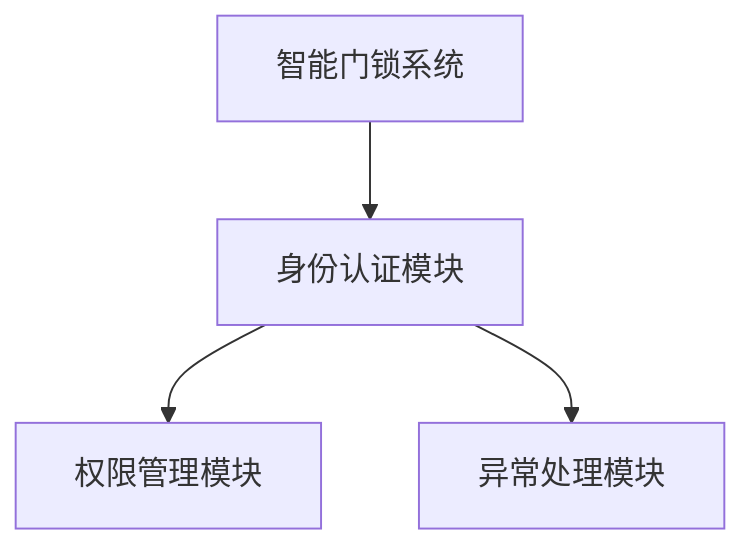
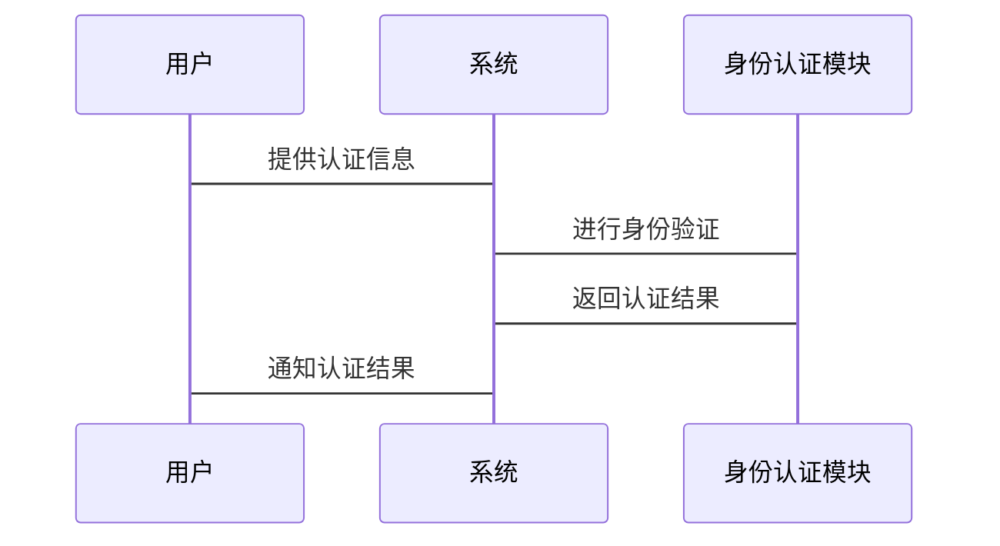
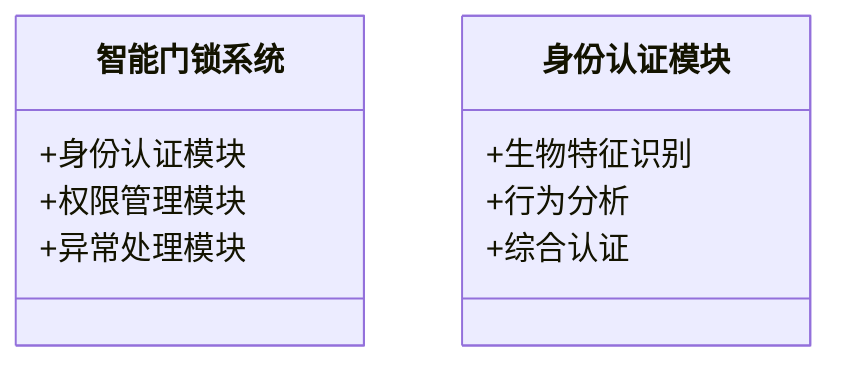

                 


# AI Agent在智能门锁中的多因素身份认证

## 关键词：
AI Agent, 多因素身份认证, 智能门锁, 生物特征识别, 行为分析, 系统架构, 安全技术

## 摘要：
本文详细探讨了AI Agent在智能门锁中的多因素身份认证技术，从核心概念、算法原理到系统架构，再到项目实战，全面解析了AI Agent如何提升智能门锁的安全性与用户体验。文章通过实际案例分析，深入讲解了多因素身份认证的实现过程，为读者提供了理论与实践相结合的深度解析。

---

# 第一部分: AI Agent与多因素身份认证概述

## 第1章: AI Agent与多因素身份认证概述

### 1.1 AI Agent的基本概念
#### 1.1.1 AI Agent的定义与特点
AI Agent（人工智能代理）是一种能够感知环境、执行任务并做出决策的智能实体。它具备自主性、反应性、目标导向性和社交能力等特点，能够根据输入的数据做出最优选择。

#### 1.1.2 AI Agent的核心功能与应用场景
AI Agent的核心功能包括数据采集、分析、决策和执行。在智能门锁中，AI Agent主要负责身份识别、权限判断和异常处理。

#### 1.1.3 AI Agent在智能门锁中的应用背景
随着智能门锁的普及，单一的认证方式逐渐暴露出安全漏洞。通过引入AI Agent，结合多因素身份认证技术，可以显著提升门锁的安全性。

### 1.2 多因素身份认证的定义与优势
#### 1.2.1 多因素身份认证的定义
多因素身份认证（Multi-Factor Authentication, MFA）是指通过多种独立的认证方式来验证用户身份的技术。常见的认证因素包括“你是什么”（知识因素）、“你拥有什么”（拥有因素）和“你行为方式”（行为因素）。

#### 1.2.2 多因素身份认证的优势
多因素身份认证通过结合多种认证方式，显著降低了身份被盗的风险。即使一种认证方式被破解，其他因素仍能提供额外的安全保障。

#### 1.2.3 多因素身份认证在智能门锁中的重要性
智能门锁作为家庭安全的第一道防线，必须具备高安全性。通过多因素身份认证，可以有效防止非法入侵，保障用户的安全。

### 1.3 本章小结
本章介绍了AI Agent的基本概念和多因素身份认证的核心优势，重点分析了AI Agent在智能门锁中的应用背景，为后续内容奠定了基础。

---

# 第二部分: AI Agent在智能门锁中的多因素身份认证核心概念与联系

## 第2章: AI Agent与多因素身份认证的核心概念

### 2.1 AI Agent在多因素身份认证中的角色
#### 2.1.1 AI Agent在身份认证中的作用
AI Agent在多因素身份认证中负责数据的采集、分析和决策。它能够整合多种认证方式，提高认证的准确性和安全性。

#### 2.1.2 AI Agent的核心算法与技术
AI Agent的核心算法包括特征提取、匹配算法和决策模型。这些算法通过机器学习和深度学习技术，实现对多种认证因素的高效处理。

#### 2.1.3 AI Agent与多因素身份认证的结合方式
AI Agent与多因素身份认证的结合方式主要有两种：串行认证和并行认证。串行认证是指依次验证每个因素，而并行认证则是同时验证多个因素。

### 2.2 多因素身份认证的关键技术
#### 2.2.1 生物特征识别技术
生物特征识别技术包括指纹识别、面部识别和声音识别等。这些技术通过采集和分析用户的生物特征，实现精准的身份认证。

#### 2.2.2 行为分析技术
行为分析技术通过分析用户的行为模式，如按键习惯、步态分析等，进一步验证用户身份的真实性。

#### 2.2.3 综合认证技术
综合认证技术将多种认证因素有机结合，通过加权评估的方式，实现更加安全和高效的认证过程。

### 2.3 AI Agent与多因素身份认证的关系
#### 2.3.1 AI Agent与多因素身份认证的协同作用
AI Agent通过整合多种认证方式，实现了多因素身份认证的高效处理。它不仅提高了认证的准确性，还提升了系统的响应速度。

#### 2.3.2 AI Agent在多因素身份认证中的核心地位
AI Agent是多因素身份认证系统的核心组成部分。它通过智能分析和决策，确保了认证过程的安全性和可靠性。

#### 2.3.3 多因素身份认证对AI Agent的依赖性
多因素身份认证的实现离不开AI Agent的支持。AI Agent通过强大的数据处理能力和智能算法，为多因素认证提供了技术保障。

## 第3章: 多因素身份认证的核心概念与联系

### 3.1 多因素身份认证的关键要素
#### 3.1.1 生物特征识别
生物特征识别是多因素身份认证的重要组成部分。它通过采集和分析用户的指纹、面部特征和声音等信息，实现精准的身份认证。

#### 3.1.2 行为分析
行为分析通过分析用户的行为模式，如按键习惯、步态分析等，进一步验证用户身份的真实性。

#### 3.1.3 综合认证
综合认证是多因素身份认证的核心技术。它通过整合多种认证因素，实现更加安全和高效的认证过程。

### 3.2 多因素身份认证的原理
#### 3.2.1 生物特征识别的原理
生物特征识别的原理包括数据采集、特征提取和匹配算法。通过这些步骤，系统可以实现对用户身份的精准识别。

#### 3.2.2 行为分析的原理
行为分析的原理包括数据采集、行为特征提取和行为模式识别。通过分析用户的行为模式，系统可以进一步验证用户身份的真实性。

#### 3.2.3 综合认证的原理
综合认证的原理包括多因素数据的整合、加权评估和最终决策。通过综合评估多个认证因素，系统可以实现更加安全和高效的认证过程。

### 3.3 多因素身份认证与AI Agent的关系
#### 3.3.1 AI Agent在多因素身份认证中的作用
AI Agent在多因素身份认证中负责数据的采集、分析和决策。它通过智能算法，实现对多种认证因素的高效处理。

#### 3.3.2 AI Agent与多因素身份认证的协同作用
AI Agent与多因素身份认证的结合，显著提升了认证的准确性和安全性。通过智能分析和决策，AI Agent为多因素认证提供了技术保障。

---

# 第三部分: AI Agent在智能门锁中的多因素身份认证算法原理

## 第3章: AI Agent与多因素身份认证算法原理

### 3.1 AI Agent在多因素身份认证中的算法原理
#### 3.1.1 特征提取算法
特征提取算法是生物特征识别的核心技术。通过提取用户的生物特征，系统可以实现对用户身份的精准识别。

#### 3.1.2 匹配算法
匹配算法是生物特征识别的关键步骤。通过将采集到的特征与数据库中的特征进行比对，系统可以实现身份认证。

#### 3.1.3 决策模型
决策模型是多因素身份认证的核心算法。它通过综合评估多个认证因素，实现最终的认证决策。

### 3.2 多因素身份认证算法的实现流程
#### 3.2.1 数据采集
数据采集是多因素身份认证的第一步。系统通过传感器和摄像头等设备，采集用户的生物特征和行为数据。

#### 3.2.2 特征提取
特征提取是数据处理的关键步骤。通过算法，系统可以从采集到的数据中提取出有用的特征信息。

#### 3.2.3 匹配与评估
匹配与评估是认证的核心过程。系统通过将提取的特征与数据库中的特征进行比对，评估认证结果。

#### 3.2.4 决策输出
决策输出是最终的认证结果。系统根据评估结果，输出认证通过或拒绝的决策。

### 3.3 AI Agent在多因素身份认证中的算法实现
#### 3.3.1 特征提取的实现
特征提取的实现包括生物特征的采集和预处理。通过算法，系统可以提取出用户的生物特征信息。

#### 3.3.2 匹配算法的实现
匹配算法的实现包括特征比对和相似度计算。通过这些步骤，系统可以实现对用户身份的精准识别。

#### 3.3.3 决策模型的实现
决策模型的实现包括多因素数据的整合和加权评估。通过综合评估多个认证因素，系统可以实现最终的认证决策。

---

# 第四部分: AI Agent在智能门锁中的多因素身份认证系统分析

## 第4章: AI Agent与多因素身份认证系统分析

### 4.1 智能门锁的系统架构
#### 4.1.1 系统功能模块
智能门锁的系统功能模块包括身份认证模块、权限管理模块和异常处理模块。

#### 4.1.2 系统架构图


#### 4.1.3 系统交互流程


### 4.2 多因素身份认证的系统实现
#### 4.2.1 系统功能设计
系统功能设计包括生物特征识别、行为分析和综合认证。

#### 4.2.2 系统架构设计


#### 4.2.3 系统接口设计
系统接口设计包括用户认证接口、数据采集接口和异常处理接口。

#### 4.2.4 系统交互流程
系统交互流程包括用户发起认证请求、系统进行身份验证、返回认证结果等步骤。

### 4.3 AI Agent在系统中的作用
#### 4.3.1 AI Agent的功能模块
AI Agent的功能模块包括数据采集、特征提取、匹配算法和决策模型。

#### 4.3.2 AI Agent在系统中的实现
AI Agent的实现包括生物特征识别、行为分析和综合认证等步骤。

#### 4.3.3 AI Agent对系统安全性的提升
AI Agent通过智能分析和决策，显著提升了智能门锁的安全性。

---

# 第五部分: AI Agent在智能门锁中的多因素身份认证项目实战

## 第5章: 项目实战与案例分析

### 5.1 项目环境安装
#### 5.1.1 系统环境
项目需要安装Python 3.8及以上版本、TensorFlow 2.0及以上版本和OpenCV 4.0及以上版本。

#### 5.1.2 依赖库安装
```bash
pip install numpy
pip install pandas
pip install scikit-learn
pip install tensorflow
pip install cv2
```

### 5.2 系统核心实现
#### 5.2.1 特征提取实现
```python
import numpy as np
from sklearn.preprocessing import StandardScaler

def extract_features(data):
    scaler = StandardScaler()
    features = scaler.fit_transform(data)
    return features
```

#### 5.2.2 匹配算法实现
```python
from sklearn.metrics import pairwise_distances

def match_features(query_feature, database_features, threshold=0.1):
    distances = pairwise_distances(query_feature, database_features)
    matches = np.where(distances <= threshold)[0]
    return matches
```

#### 5.2.3 决策模型实现
```python
import tensorflow as tf
from tensorflow.keras import layers

def build_decision_model(input_shape):
    model = tf.keras.Sequential()
    model.add(layers.Dense(64, activation='relu', input_shape=input_shape))
    model.add(layers.Dense(32, activation='relu'))
    model.add(layers.Dense(1, activation='sigmoid'))
    model.compile(optimizer='adam', loss='binary_crossentropy', metrics=['accuracy'])
    return model
```

### 5.3 实际案例分析
#### 5.3.1 案例背景
某高档社区的智能门锁系统，采用指纹和面部识别的双因素认证方式。

#### 5.3.2 案例实现
系统通过AI Agent实现指纹和面部特征的提取、匹配和综合认证，确保住户的安全。

#### 5.3.3 案例分析
通过实际案例分析，验证了AI Agent在多因素身份认证中的高效性和安全性。

### 5.4 项目总结
#### 5.4.1 项目成果
项目成功实现了基于AI Agent的多因素身份认证系统，显著提升了智能门锁的安全性。

#### 5.4.2 经验总结
在项目实施过程中，我们总结了以下经验：数据采集质量直接影响认证的准确性，算法的选择和调优是关键，系统的可扩展性和可维护性需要重点关注。

---

# 第六部分: AI Agent在智能门锁中的多因素身份认证最佳实践

## 第6章: 最佳实践与注意事项

### 6.1 最佳实践
#### 6.1.1 数据安全
数据安全是多因素身份认证系统的核心问题。必须确保用户数据的安全存储和传输。

#### 6.1.2 系统维护
系统维护包括定期更新算法模型、优化系统性能和修复安全漏洞。

#### 6.1.3 用户体验
用户体验是系统设计的重要考量。必须确保认证过程的便捷性和舒适性。

### 6.2 注意事项
#### 6.2.1 数据采集质量
数据采集质量直接影响认证的准确性。必须确保数据的完整性和准确性。

#### 6.2.2 算法选择与调优
算法的选择与调优是系统性能的关键。必须根据具体需求选择合适的算法，并进行充分的调优。

#### 6.2.3 系统兼容性
系统兼容性是系统集成的重要问题。必须确保系统能够兼容多种设备和平台。

### 6.3 未来展望
#### 6.3.1 技术发展
未来，AI Agent和多因素身份认证技术将更加智能化和个性化。通过引入更多的认证因素和更先进的算法，系统将更加安全和高效。

#### 6.3.2 应用场景扩展
多因素身份认证技术的应用场景将更加广泛。除了智能门锁，还可以应用于企业安全、金融支付等领域。

#### 6.3.3 技术挑战
随着技术的发展，多因素身份认证也将面临新的挑战。如何在保证安全性的同时，提升系统的响应速度和用户体验，是未来需要重点解决的问题。

## 第7章: 小结与展望

### 7.1 本章小结
本文详细探讨了AI Agent在智能门锁中的多因素身份认证技术，从核心概念、算法原理到系统架构，再到项目实战，全面解析了AI Agent如何提升智能门锁的安全性与用户体验。

### 7.2 未来展望
未来，随着AI技术的不断发展，AI Agent在多因素身份认证中的应用将更加广泛和深入。通过引入更多的认证因素和更先进的算法，系统将更加安全和高效。

---

# 作者：AI天才研究院/AI Genius Institute & 禅与计算机程序设计艺术 /Zen And The Art of Computer Programming

