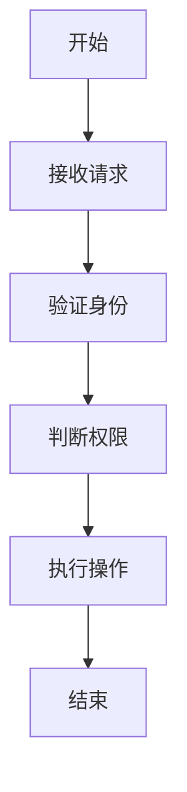
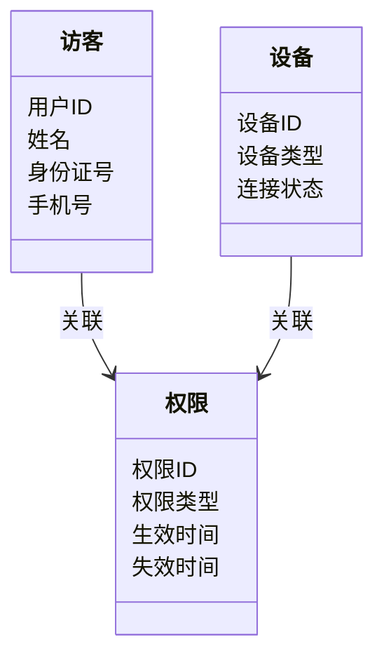
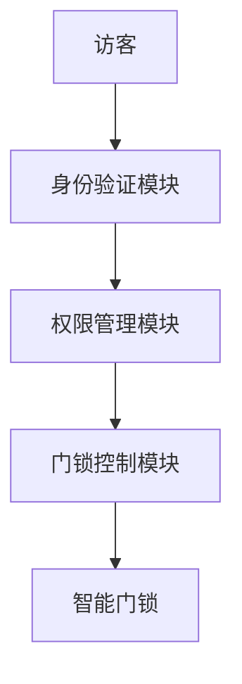
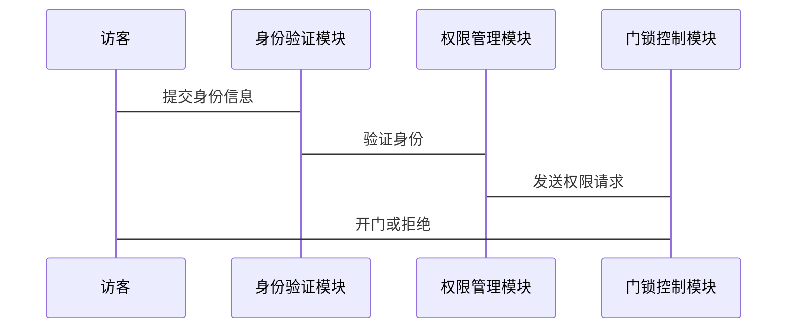
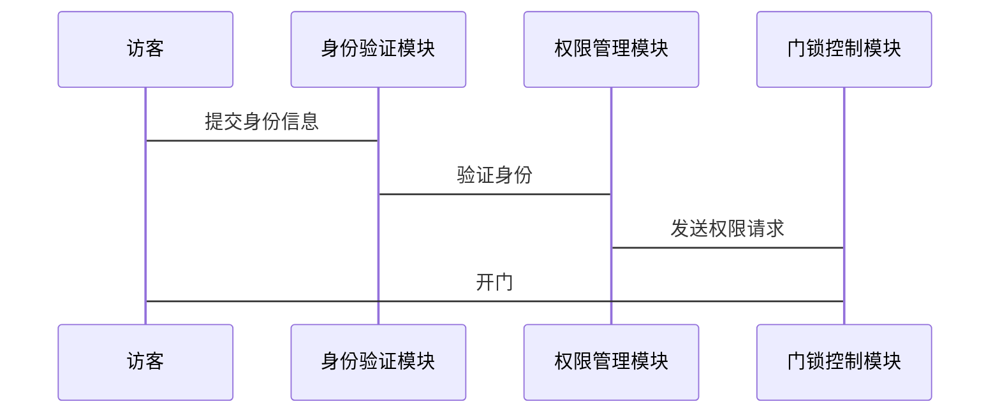
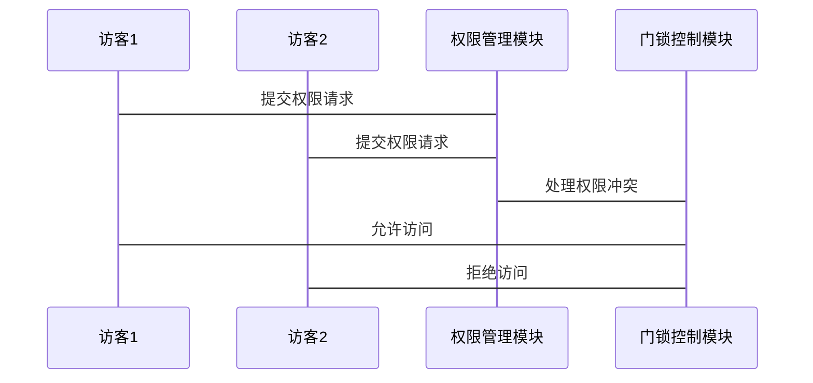

                 


# AI Agent在智能门锁中的访客权限管理

## 关键词
AI Agent, 智能门锁, 访客权限管理, 智能家居, 物联网, 人工智能

## 摘要
本文详细探讨了AI Agent在智能门锁中的应用，特别是在访客权限管理方面的创新与实践。通过系统化的分析与设计，本文提出了一种基于AI Agent的访客权限管理方案，结合智能门锁的技术特点，构建了一个高效、安全、智能的访客访问控制系统。本文从算法原理、系统架构、项目实现等多个维度进行了深入分析，并通过实际案例展示了该方案的应用效果。

# 第1章 背景介绍

## 1.1 问题背景
### 1.1.1 当前智能门锁的发展现状
随着智能家居的普及，智能门锁作为重要的入口设备，逐渐成为家庭和办公场所的标配。传统的机械锁钥匙管理复杂，容易丢失或被盗，而电子锁虽然解决了部分问题，但在访客权限管理上仍存在诸多痛点。

### 1.1.2 访客权限管理的痛点与挑战
1. **权限分配复杂**：访客权限的分配需要实时动态管理，传统的基于卡片或密码的权限管理方式效率低下，难以满足多样化的管理需求。
2. **安全性不足**：访客权限的临时性和动态性增加了管理难度，容易出现权限泄露或滥用的情况。
3. **智能化水平有限**：现有的访客权限管理系统多为静态管理，难以根据实际情况动态调整权限。

### 1.1.3 AI Agent技术的引入与应用前景
AI Agent（人工智能代理）是一种能够感知环境、自主决策并执行任务的智能体。通过引入AI Agent技术，智能门锁的访客权限管理可以实现智能化、动态化和精细化，显著提升系统的安全性和管理效率。

## 1.2 问题描述
### 1.2.1 访客权限管理的核心问题
1. **实时动态管理**：访客权限需要根据时间、地点、访问者身份等多种因素动态调整。
2. **多维度身份认证**：访客权限的分配需要结合多种身份认证方式（如指纹、人脸识别、身份证验证等）。
3. **权限冲突与协调**：在多人协作或访客较多的场景中，权限分配需要协调各方的需求，避免冲突。

### 1.2.2 AI Agent在权限管理中的作用
AI Agent通过感知环境、分析数据、自主决策，能够实时动态地调整访客权限，确保权限管理的高效性和安全性。AI Agent还能够与其他智能设备和系统协同工作，实现访客权限管理的智能化和自动化。

### 1.2.3 系统边界与外延
智能门锁访客权限管理系统的边界主要包含门锁设备、访客身份验证设备（如人脸识别、指纹识别等）、权限管理服务器以及相关的网络通信模块。系统的外延则包括与智能家居其他设备的联动（如智能灯光、空调等）以及与物业管理系统的集成。

## 1.3 核心概念与组成
### 1.3.1 AI Agent的定义与特点
AI Agent是一种能够感知环境、自主决策并执行任务的智能体。它具有以下特点：
1. **自主性**：能够在没有外部干预的情况下自主决策。
2. **反应性**：能够实时感知环境变化并做出相应的反应。
3. **主动性**：能够主动发起任务或调整策略。
4. **社会性**：能够与其他智能体或系统协同工作。

### 1.3.2 智能门锁系统的组成
智能门锁系统主要由以下部分组成：
1. **门锁设备**：包括电子锁、传感器等硬件设备。
2. **身份验证模块**：用于验证访客的身份，如指纹识别、人脸识别等。
3. **权限管理服务器**：负责处理权限请求、分配权限。
4. **网络通信模块**：用于设备之间的数据传输和通信。

### 1.3.3 访客权限管理的流程与规则
访客权限管理的流程包括：
1. **访客身份验证**：通过多种方式验证访客身份。
2. **权限请求处理**：访客提出权限请求，系统进行验证。
3. **权限分配与调整**：根据规则和策略动态分配或调整权限。
4. **权限撤销**：在权限到期或特定条件下撤销权限。

# 第2章 核心概念与联系

## 2.1 AI Agent的原理
### 2.1.1 感知层
AI Agent通过各种传感器和数据接口感知环境中的信息，如访客的身份信息、时间信息、地理位置等。

### 2.1.2 决策层
基于感知到的信息，AI Agent利用预设的规则或学习到的模型进行决策，确定是否授予访客权限。

### 2.1.3 执行层
根据决策结果，AI Agent通过控制门锁设备或其他相关设备执行相应的操作，如打开门锁、发送通知等。

## 2.2 概念属性特征对比
| 特征                | AI Agent权限管理 | 传统权限管理 |
|---------------------|------------------|--------------|
| **动态性**           | 高              | 低           |
| **智能化**           | 高              | 低           |
| **安全性**           | 高              | 中           |
| **灵活性**           | 高              | 低           |
| **可扩展性**         | 高              | 低           |
| **响应速度**         | 快              | 慢           |
| **管理复杂度**       | 低              | 高           |

## 2.3 ER实体关系图
```mermaid
er
  entity 访客 {
    key 用户ID
    attribute 姓名, 身份证号, 手机号
  }
  entity 设备 {
    key 设备ID
    attribute 设备类型, 连接状态
  }
  entity 权限 {
    key 权限ID
    attribute 权限类型, 生效时间, 失效时间
  }
  relation 访客权限分配 {
    key (用户ID, 设备ID)
    role 访客 -> 设备
  }
```

# 第3章 算法原理讲解

## 3.1 算法概述
### 3.1.1 基于规则的推理算法
基于规则的推理算法通过预设的规则库对权限请求进行判断和推理，适用于规则明确、场景简单的访客权限管理。

### 3.1.2 基于学习的推理算法
基于学习的推理算法利用机器学习模型对历史数据进行训练，学习权限分配的模式和规律，适用于规则复杂、场景多变的情况。

## 3.2 算法流程图


## 3.3 算法实现
### 3.3.1 基于规则的权限分配
```python
def allocate_permission(visitor_info):
    # 访客信息：姓名、身份证号、手机号
    # 规则1：访客必须是授权的联系人
    if visitor_info['身份证号'] in authorized_contacts:
        return '允许访问'
    # 规则2：访客必须在允许的时间段内访问
    if current_time >= allowed_start_time and current_time <= allowed_end_time:
        return '允许访问'
    # 规则3：访客必须通过多重认证
    if visitor_info['指纹认证'] and visitor_info['人脸识别']:
        return '允许访问'
    # 其他情况拒绝访问
    return '拒绝访问'
```

### 3.3.2 基于学习的权限分配
```python
import numpy as np
from sklearn import tree

# 假设X为输入特征，包括访客身份特征、时间特征、设备状态特征等
# y为标签，1表示允许访问，0表示拒绝访问
model = tree.DecisionTreeClassifier()
model.fit(X, y)

def predict_permission(visitor_features):
    return model.predict(visitor_features)
```

## 3.4 数学模型与公式
基于规则的权限分配可以表示为多个条件判断的逻辑组合：
$$
\text{允许访问} = (\text{规则1} \land \text{规则2} \land \text{规则3}) \lor (\text{规则4} \land \text{规则5})
$$

基于学习的权限分配可以表示为决策树模型的预测结果：
$$
y = f(X)
$$
其中，$X$ 是输入特征向量，$f$ 是训练好的决策树模型。

# 第4章 系统分析与架构设计方案

## 4.1 系统分析
### 4.1.1 项目介绍
本项目旨在设计和实现一个基于AI Agent的智能门锁访客权限管理系统，实现访客权限的智能化管理。

### 4.1.2 系统功能设计
#### 4.1.2.1 访客管理模块
- 访客信息录入与管理
- 权限请求处理
- 权限动态调整

#### 4.1.2.2 权限分配模块
- 基于规则的权限分配
- 基于学习的权限分配
- 权限冲突处理

#### 4.1.2.3 状态监控模块
- 访客访问记录
- 设备状态监控
- 系统日志管理

## 4.2 系统架构设计
### 4.2.1 领域模型类图


### 4.2.2 系统架构图


### 4.2.3 系统接口设计
1. **访客权限请求接口**：
    - 输入：访客身份信息、请求时间
    - 输出：权限分配结果

2. **权限状态查询接口**：
    - 输入：设备ID、访客ID
    - 输出：当前权限状态

3. **权限动态调整接口**：
    - 输入：调整规则
    - 输出：权限调整结果

## 4.3 系统交互流程
### 4.3.1 访客请求开门


# 第5章 项目实战

## 5.1 环境安装
### 5.1.1 安装Python环境
```bash
python --version
pip install --upgrade pip
```

### 5.1.2 安装相关库
```bash
pip install numpy scikit-learn mermaid
```

## 5.2 系统核心实现
### 5.2.1 权限管理模块实现
```python
import numpy as np
from sklearn import tree

# 示例数据
X = np.array([[0, 0, 0], [1, 1, 1], [2, 2, 2], [3, 3, 3]])
y = np.array([0, 1, 1, 0])

model = tree.DecisionTreeClassifier()
model.fit(X, y)

def predict_permission(visitor_features):
    return model.predict(visitor_features)
```

### 5.2.2 门锁控制模块实现
```python
class DoorLock:
    def __init__(self, lock_id):
        self.lock_id = lock_id
        self.status = 'closed'

    def open(self):
        self.status = 'open'
        print(f"Door lock {self.lock_id} opened.")

    def close(self):
        self.status = 'closed'
        print(f"Door lock {self.lock_id} closed.")
```

## 5.3 代码应用解读与分析
### 5.3.1 权限管理模块解读
- 使用决策树模型进行权限预测，能够处理复杂的权限分配规则。
- 模型通过训练数据学习权限分配的模式，适用于规则复杂的情况。

### 5.3.2 门锁控制模块解读
- 门锁设备通过简单的状态控制实现开门和关门操作。
- 状态的改变通过日志记录，便于后续的监控和分析。

## 5.4 实际案例分析
### 5.4.1 案例1：普通访客访问


### 5.4.2 案例2：权限冲突处理


## 5.5 项目小结
- **优势**：
  - 实现了智能化的访客权限管理。
  - 提高了系统的安全性和管理效率。
- **不足**：
  - 系统的复杂性较高，需要专业的技术人员进行维护。
  - 对网络环境的依赖较强，可能出现网络中断导致的权限管理问题。

# 第6章 最佳实践

## 6.1 小结
通过引入AI Agent技术，智能门锁的访客权限管理实现了智能化和动态化，显著提升了系统的安全性和管理效率。本文从算法原理、系统架构、项目实现等多个维度进行了深入分析，并通过实际案例展示了该方案的应用效果。

## 6.2 注意事项
1. **安全性**：确保系统的安全性，防止权限泄露或滥用。
2. **可扩展性**：系统设计需要考虑未来的扩展性，方便功能的扩展和升级。
3. **可靠性**：确保系统的稳定性和可靠性，避免因系统故障导致的权限管理问题。

## 6.3 拓展阅读
1. **推荐书籍**：
   - 《人工智能：一种现代的方法》
   - 《机器学习实战》
2. **推荐资源**：
   - [OpenCV](https://opencv.org/)
   - [TensorFlow](https://www.tensorflow.org/)

# 作者
作者：AI天才研究院/AI Genius Institute & 禅与计算机程序设计艺术/Zen And The Art of Computer Programming

