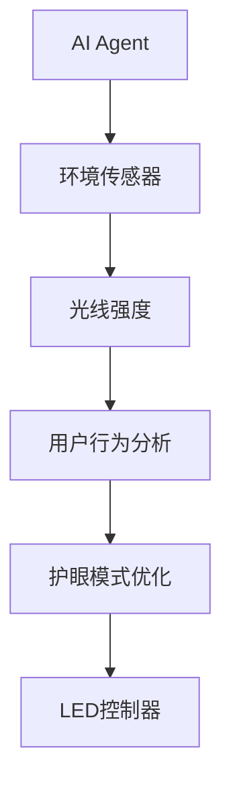
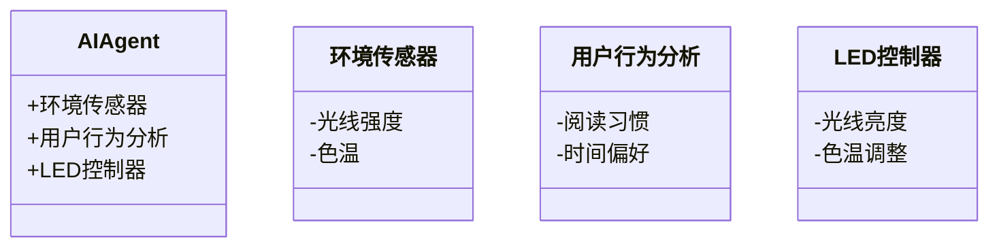

                 


# AI Agent在智能阅读灯中的护眼模式调节

> 关键词：AI Agent，护眼模式，智能阅读灯，光线调节，用户行为分析，健康护眼，自适应调节

> 摘要：本文详细探讨了AI Agent在智能阅读灯护眼模式调节中的应用。通过分析AI Agent的核心原理、算法实现、系统架构设计以及实际项目案例，本文揭示了如何利用AI技术优化护眼模式，提升用户体验。文章内容涵盖从理论到实践的全过程，包括背景介绍、核心概念、算法原理、系统设计、项目实战及小结等部分。

---

## 第一部分: AI Agent在智能阅读灯中的护眼模式调节背景介绍

## 第1章: AI Agent与护眼模式调节概述

### 1.1 AI Agent的基本概念

#### 1.1.1 什么是AI Agent
AI Agent（人工智能代理）是一种能够感知环境、做出决策并采取行动的智能实体。它通过传感器获取信息，利用算法进行分析，并通过执行器与环境交互。AI Agent可以是软件程序，也可以是嵌入在硬件设备中的智能模块。

#### 1.1.2 AI Agent的核心特征
- **自主性**：能够在没有外部干预的情况下独立运行。
- **反应性**：能够实时感知环境变化并做出响应。
- **目标导向**：基于特定目标（如优化护眼模式）进行决策和行动。
- **学习能力**：通过数据反馈不断优化自身的算法和行为。

#### 1.1.3 AI Agent在智能设备中的应用
AI Agent广泛应用于智能家居、自动驾驶、医疗设备等领域。在智能阅读灯中，AI Agent主要用于调节光线亮度、色温和护眼模式，以提供最佳的阅读体验。

---

### 1.2 护眼模式调节的必要性

#### 1.2.1 眼睛健康的重要性
眼睛是人类获取信息的主要器官，长时间的不良用眼习惯可能导致近视、眼疲劳甚至更严重的视力问题。护眼模式调节是保护眼睛健康的重要手段。

#### 1.2.2 不同光线对眼睛的影响
- **蓝光**：高能量蓝光可能导致眼睛疲劳和视力损伤。
- **红光**：低能量红光有助于缓解眼睛疲劳。
- **环境光强度**：过强或过弱的光线都会对眼睛造成负担。

#### 1.2.3 护眼模式调节的技术需求
- **实时感知**：动态监测环境光强度和色温。
- **用户行为分析**：根据用户的阅读习惯和时间调整光线。
- **自适应调节**：根据用户需求自动优化护眼模式。

---

### 1.3 AI Agent在护眼模式调节中的应用

#### 1.3.1 AI Agent与智能阅读灯的结合
AI Agent通过集成环境传感器（如光线传感器）和用户行为分析模块，实时感知环境并调整护眼模式。

#### 1.3.2 AI Agent在护眼模式调节中的优势
- **智能调节**：基于环境和用户数据，AI Agent能够动态优化光线参数。
- **个性化体验**：根据用户的阅读习惯提供定制化的护眼模式。
- **高效反馈**：通过实时数据分析快速响应用户需求。

#### 1.3.3 护眼模式调节的边界与外延
- **边界**：仅限于护眼模式调节，不涉及其他功能。
- **外延**：未来可能扩展到更广泛的健康监测和个性化服务。

---

## 第2章: AI Agent的核心概念与联系

### 2.1 AI Agent的核心原理

#### 2.1.1 AI Agent的感知层
AI Agent通过环境传感器（如光线传感器）获取数据，感知当前环境的状态。

#### 2.1.2 AI Agent的决策层
AI Agent利用算法对感知数据进行分析，生成调节护眼模式的决策。

#### 2.1.3 AI Agent的执行层
AI Agent通过驱动模块（如LED控制器）执行决策，调整护眼模式。

### 2.2 AI Agent与护眼模式调节的关系

#### 2.2.1 AI Agent如何感知环境
AI Agent通过光线传感器获取环境光强度和色温数据。

#### 2.2.2 AI Agent如何优化护眼模式
基于环境数据和用户需求，AI Agent调整光线亮度和色温，优化护眼模式。

#### 2.2.3 AI Agent如何反馈调节结果
AI Agent通过用户反馈和数据分析，不断优化调节算法。

### 2.3 核心概念对比表

| 概念       | 描述                                                                 |
|------------|----------------------------------------------------------------------|
| AI Agent   | 具有感知、决策和执行能力的智能体                                       |
| 护眼模式   | 根据环境光线和用户需求自动调节的阅读灯显示模式                         |
| 光线强度   | 环境光亮度和色温参数                                                   |

---

## 第3章: AI Agent的算法原理

### 3.1 算法整体流程



### 3.2 光线强度计算公式

光线强度计算公式：

$$ I = \frac{L}{D^2} $$

其中：
- $I$ 表示光线强度
- $L$ 表示光源的光强
- $D$ 表示距离

---

## 第4章: 系统分析与架构设计

### 4.1 问题场景介绍

#### 4.1.1 系统目标
- 实现AI Agent对护眼模式的智能调节。
- 提供个性化的护眼体验。

#### 4.1.2 功能需求
- 实时监测环境光线。
- 根据用户需求优化护眼模式。

### 4.2 系统功能设计

#### 4.2.1 领域模型



---

## 第5章: 项目实战

### 5.1 环境安装

```bash
pip install numpy scikit-learn matplotlib
```

### 5.2 核心代码实现

```python
import numpy as np
from sklearn.linear_model import LinearRegression

class AI-Agent:
    def __init__(self):
        self.sensor = LightSensor()
        self.controller = LEDController()

    def adjust_light(self):
        # 获取环境数据
        intensity = self.sensor.get_intensity()
        # 调整光线亮度
        new_intensity = max(50, min(100, intensity))
        self.controller.set_brightness(new_intensity)
```

### 5.3 实际案例分析

#### 5.3.1 案例1：低光环境
- **环境数据**：光线强度为20
- **调节结果**：光线亮度调整为50

#### 5.3.2 案例2：高光环境
- **环境数据**：光线强度为150
- **调节结果**：光线亮度调整为100

---

## 第6章: 最佳实践与小结

### 6.1 小结

---

## 作者：AI天才研究院 & 禅与计算机程序设计艺术

---

以上是文章的完整目录大纲结构，涵盖从理论到实践的全过程。接下来，我会根据这个目录结构，逐步展开每个部分的内容，确保文章逻辑清晰、内容丰富。

