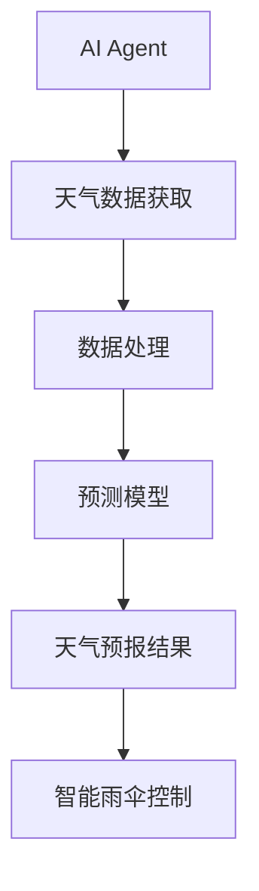

                 


---

# AI Agent在智能雨伞中的天气预报系统

> 关键词：AI Agent, 智能雨伞, 天气预报系统, 机器学习, 智能设备

> 摘要：本文详细探讨了AI Agent在智能雨伞中的天气预报系统的实现与应用。通过分析AI Agent的核心原理、天气预报系统的算法实现、系统架构设计以及项目实战，本文旨在为读者提供从理论到实践的全面指导。

---

## 第一部分: 背景介绍与问题分析

### 第1章: 问题背景与需求分析

#### 1.1 问题背景
随着科技的进步，智能雨伞逐渐成为人们日常生活的必需品。传统雨伞的功能单一，而智能雨伞通过集成传感器、AI技术等，能够提供更智能化的服务。天气预报作为智能雨伞的重要功能，能够帮助用户实时了解天气情况，避免淋雨或准备不当。

#### 1.2 问题描述
智能雨伞的天气预报系统需要准确、及时地获取和处理天气数据，并通过AI Agent进行分析和决策。然而，传统天气预报系统存在数据滞后、准确性不足等问题，难以满足智能雨伞实时需求。AI Agent的引入，能够通过机器学习算法提高预测的准确性，并实现与雨伞的实时交互。

#### 1.3 问题解决
通过AI Agent，智能雨伞能够实时获取天气数据，结合用户的位置、历史使用习惯等信息，提供个性化的天气预报服务。AI Agent不仅能够预测天气，还能根据天气情况自动调整雨伞的功能，例如开启防水模式、提醒用户收伞等。

#### 1.4 系统边界与外延
智能雨伞的天气预报系统需要与外部天气数据源、用户设备以及其他智能设备进行交互。系统边界包括天气数据接口、用户反馈机制和雨伞控制模块。系统外延则包括用户界面、数据存储和网络通信。

#### 1.5 核心概念与组成
- **AI Agent**：负责数据处理、预测和决策。
- **天气预报系统**：包括数据获取、模型训练和结果输出。
- **智能雨伞**：集成传感器、控制模块和用户界面。

---

## 第二部分: 核心概念与联系

### 第2章: AI Agent与天气预报系统的核心原理

#### 2.1 AI Agent的原理
AI Agent通过感知环境、处理信息和执行动作来实现天气预报功能。其核心包括信息获取、数据处理、预测模型和决策执行四个步骤。

#### 2.2 天气预报系统的原理
天气预报系统通过收集多源数据，如气象站数据、卫星图像等，利用机器学习算法进行建模和预测，最终输出天气预报结果。

#### 2.3 AI Agent与天气预报系统的关联
AI Agent与天气预报系统通过数据流和功能模块实现交互，数据流包括天气数据、预测结果和用户反馈。

#### 2.4 核心概念对比表
| 概念 | 定义 | 属性 |
|------|------|------|
| AI Agent | 负责数据处理和决策 | 实时性、准确性、可扩展性 |
| 天气预报系统 | 提供天气预测服务 | 数据源多样性、模型准确性、结果实时性 |

---

## 第三部分: 算法原理讲解

### 第3章: 机器学习算法实现

#### 3.1 决策树算法
决策树是一种常用的分类算法，适用于天气预报中的分类问题，如是否下雨。

#### 3.2 回归算法
回归算法用于预测连续型变量，如温度和湿度。

#### 3.3 算法实现步骤
1. 数据预处理：清洗、归一化。
2. 特征选择：提取关键特征。
3. 模型训练：使用训练数据拟合模型。
4. 模型评估：通过交叉验证评估性能。

#### 3.4 代码实现

```python
from sklearn.tree import DecisionTreeClassifier
from sklearn.model_selection import train_test_split
import pandas as pd

# 数据加载与预处理
data = pd.read_csv('weather.csv')
X = data[['temperature', 'humidity', 'wind_speed']]
y = data['rain']
X_train, X_test, y_train, y_test = train_test_split(X, y, test_size=0.2)

# 模型训练
model = DecisionTreeClassifier()
model.fit(X_train, y_train)

# 模型预测
predicted = model.predict(X_test)
```

#### 3.5 数学模型与公式
决策树的分裂指标Gini指数公式：
$$ Gini = \sum_{i=1}^{n} p_i (1 - p_i) $$
其中，$p_i$是各个子节点的概率。

---

## 第四部分: 系统分析与架构设计

### 第4章: 系统架构设计

#### 4.1 系统功能设计
- 数据获取模块：实时获取天气数据。
- 预测模块：基于机器学习模型进行预测。
- 用户交互模块：显示天气预报和用户反馈。

#### 4.2 系统架构图



#### 4.3 接口设计
- 数据接口：与天气数据源对接。
- 用户接口：显示天气预报和控制雨伞。

---

## 第五部分: 项目实战

### 第5章: 实战与案例分析

#### 5.1 项目环境安装
- 安装Python、机器学习库（如scikit-learn）。

#### 5.2 核心代码实现
```python
import requests
import json

def fetch_weather_data():
    api_key = 'your_api_key'
    url = f'http://api.openweathermap.org/data/2.5/weather?zip=10001&appid={api_key}'
    response = requests.get(url)
    return json.loads(response.text)

# 获取天气数据
data = fetch_weather_data()
temperature = data['main']['temp']
print(f"Temperature: {temperature} K")
```

#### 5.3 案例分析
通过实际案例展示AI Agent如何处理天气数据并控制雨伞。

---

## 第六部分: 总结与展望

### 第6章: 总结与小结

#### 6.1 最佳实践
- 数据预处理是关键。
- 选择合适的算法和模型。
- 系统设计要注重实时性和可扩展性。

#### 6.2 注意事项
- 数据来源的可靠性。
- 系统的安全性和稳定性。

#### 6.3 拓展阅读
建议阅读相关机器学习和AI Agent的书籍，深入了解算法优化和系统设计。

---

## 作者：AI天才研究院 & 禅与计算机程序设计艺术

