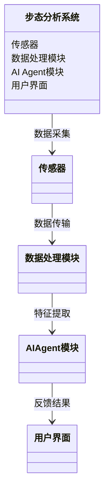
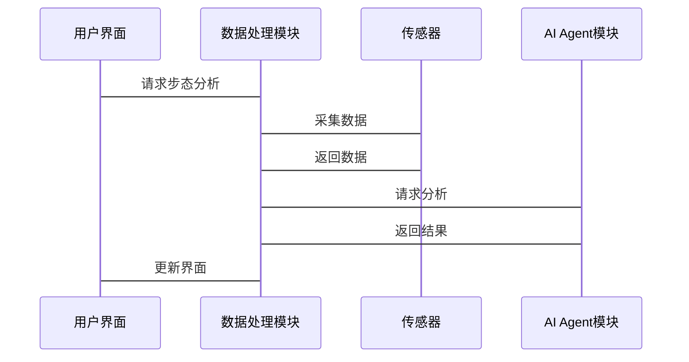

                 


# AI Agent在智能鞋中的步态分析

**关键词**：AI Agent, 步态分析, 智能鞋, 人工智能, 传感器, 运动分析

**摘要**：本文探讨AI Agent在智能鞋中的步态分析应用，详细讲解AI Agent与步态分析的核心概念、算法原理、系统设计、项目实战等内容，通过理论与实践结合，展示AI技术在智能鞋领域的创新应用。

---

## 第1章: AI Agent与步态分析概述

### 1.1 AI Agent的基本概念

#### 1.1.1 AI Agent的定义与特点
- **定义**：AI Agent（人工智能代理）是指能够感知环境、自主决策并执行任务的智能实体。
- **特点**：自主性、反应性、目标导向、学习能力。

#### 1.1.2 AI Agent的核心功能与作用
- **感知环境**：通过传感器获取数据。
- **决策与规划**：基于数据进行分析和决策。
- **执行任务**：通过执行机构完成任务。

#### 1.1.3 AI Agent在智能鞋中的应用前景
- **健康监测**：步态分析用于健康评估。
- **运动优化**：提供运动建议和反馈。
- **智能交互**：实现人与设备的智能互动。

### 1.2 步态分析的基本概念

#### 1.2.1 步态分析的定义与原理
- **定义**：通过对步态特征的分析，评估人体运动状态的技术。
- **原理**：基于传感器数据和AI算法提取步态特征。

#### 1.2.2 步态分析的主要指标与特征
- **步长**：单步的长度。
- **步频**：单位时间内的步数。
- **步态周期**：完成一个步态周期的时间。

#### 1.2.3 步态分析在健康与运动中的应用
- **健康评估**：检测步态异常，辅助诊断健康问题。
- **运动优化**：提供个性化的运动建议。

### 1.3 AI Agent在步态分析中的结合与应用

#### 1.3.1 AI Agent与步态分析的结合方式
- **数据采集**：AI Agent通过传感器收集步态数据。
- **特征提取**：AI Agent对数据进行分析和特征提取。
- **决策反馈**：AI Agent根据分析结果提供反馈。

#### 1.3.2 智能鞋中的步态分析应用场景
- **健康监测**：实时监测步态特征，评估健康状况。
- **运动优化**：提供运动建议，提升运动表现。
- **智能交互**：通过步态分析实现智能化的人机交互。

#### 1.3.3 步态分析在智能鞋中的技术挑战与解决方案
- **数据采集精度**：传感器精度对分析结果的影响。
- **算法实时性**：算法需要在实时条件下运行。
- **用户隐私**：数据安全与隐私保护。

### 1.4 本章小结
本章介绍了AI Agent和步态分析的基本概念，探讨了AI Agent在智能鞋中的应用前景，为后续章节奠定了理论基础。

---

## 第2章: AI Agent与步态分析的核心概念

### 2.1 AI Agent的核心概念与原理

#### 2.1.1 AI Agent的感知与决策机制
- **感知**：通过传感器获取环境数据。
- **决策**：基于感知数据进行分析和决策。

#### 2.1.2 AI Agent的行为规划与执行
- **规划**：制定行动方案。
- **执行**：通过执行机构完成任务。

#### 2.1.3 AI Agent的学习与自适应能力
- **学习**：通过数据训练模型。
- **自适应**：根据反馈调整行为。

### 2.2 步态分析的核心概念与原理

#### 2.2.1 步态分析的关键特征提取
- **关键点检测**：提取步态特征点。
- **特征提取**：从数据中提取有意义的特征。

#### 2.2.2 步态分析的特征提取方法
- **基于传感器的方法**：使用加速度计、陀螺仪等传感器数据提取特征。
- **基于视觉的方法**：通过图像处理技术提取步态特征。

#### 2.2.3 步态分析的模型与算法
- **传统算法**：如隐马尔可夫模型。
- **深度学习算法**：如卷积神经网络、循环神经网络。

### 2.3 AI Agent与步态分析的结合模型

#### 2.3.1 AI Agent与步态分析的系统架构
- **数据采集层**：传感器采集步态数据。
- **处理层**：AI Agent对数据进行分析和处理。
- **应用层**：提供健康监测、运动优化等功能。

#### 2.3.2 AI Agent与步态分析的交互机制
- **数据流**：数据从传感器到AI Agent的流动。
- **反馈机制**：AI Agent根据分析结果提供反馈。

#### 2.3.3 AI Agent与步态分析的协同工作流程
- **数据采集**：传感器采集步态数据。
- **特征提取**：AI Agent提取步态特征。
- **决策反馈**：AI Agent根据分析结果提供反馈。

### 2.4 核心概念对比与ER实体关系图

#### 2.4.1 AI Agent与步态分析的核心概念对比
| 特性 | AI Agent | 步态分析 |
|------|----------|----------|
| 定义 | 智能代理 | 运动分析 |
| 功能 | 感知、决策、执行 | 数据采集、特征提取、分析 |
| 应用 | 智能鞋、健康监测 | 运动优化、健康评估 |

#### 2.4.2 步态分析的ER实体关系图（Mermaid流程图）
```mermaid
erDiagram
    class 步态分析系统 {
        传感器
        步态数据
        AI Agent
        分析结果
    }
    步态分析系统 --> 传感器 : 采集数据
    传感器 --> 步态数据 : 提供
    步态数据 --> AI Agent : 分析
    AI Agent --> 分析结果 : 输出
```

### 2.5 本章小结
本章详细探讨了AI Agent与步态分析的核心概念，通过对比和ER实体关系图，展示了两者之间的协同关系。

---

## 第3章: 步态分析的算法原理与实现

### 3.1 步态分析的算法原理

#### 3.1.1 步态分析的主要算法
- **传统算法**：如隐马尔可夫模型。
- **深度学习算法**：如卷积神经网络、循环神经网络。

#### 3.1.2 基于深度学习的步态分析模型
- **模型结构**：如ResNet、LSTM。
- **训练方法**：使用大量标注数据进行训练。

#### 3.1.3 步态分析的特征提取方法
- **时间特征**：步长、步频等。
- **空间特征**：步幅、步态周期等。

### 3.2 AI Agent的算法原理

#### 3.2.1 AI Agent的感知与决策算法
- **感知算法**：如基于传感器的数据融合算法。
- **决策算法**：如强化学习算法。

#### 3.2.2 AI Agent的行为规划算法
- **规划算法**：如A*算法。
- **执行算法**：如模糊控制算法。

#### 3.2.3 AI Agent的学习与优化算法
- **监督学习**：如随机森林、支持向量机。
- **无监督学习**：如聚类算法。
- **强化学习**：如Q-learning。

### 3.3 步态分析的数学模型与公式

#### 3.3.1 步态分析的关键公式
$$ \text{步长} = \frac{\text{步频} \times \text{步速}}{2} $$

#### 3.3.2 AI Agent的算法模型
- **感知模型**：$$ P(x|z) $$
- **决策模型**：$$ Q(s, a) $$

### 3.4 步态分析的Python实现示例

#### 3.4.1 步态分析的特征提取代码
```python
import numpy as np

def extract_features(data):
    features = []
    for window in data:
        # 提取时间特征
        time_features = window['time']
        # 提取空间特征
        space_features = window['space']
        features.append(np.concatenate((time_features, space_features)))
    return features
```

#### 3.4.2 AI Agent的决策算法代码
```python
from sklearn.ensemble import RandomForestClassifier

def decision-making(data):
    model = RandomForestClassifier()
    model.fit(data['features'], data['labels'])
    return model.predict(data['test_features'])
```

### 3.5 本章小结
本章详细讲解了步态分析和AI Agent的算法原理，并通过Python代码示例展示了其实现过程。

---

## 第4章: 智能鞋中的步态分析系统设计

### 4.1 步态分析系统的应用场景

#### 4.1.1 健康监测
- **目标**：实时监测步态特征，评估健康状况。
- **实现**：通过传感器采集数据，AI Agent进行分析。

#### 4.1.2 运动优化
- **目标**：提供个性化的运动建议。
- **实现**：基于步态分析结果，AI Agent提供优化建议。

### 4.2 系统功能设计

#### 4.2.1 领域模型（Mermaid类图）


### 4.3 系统架构设计

#### 4.3.1 系统架构（Mermaid架构图）


### 4.4 系统接口设计

#### 4.4.1 接口设计
- **数据接口**：传感器与数据处理模块的接口。
- **反馈接口**：AI Agent与用户界面的接口。

### 4.5 系统交互设计

#### 4.5.1 交互流程（Mermaid序列图）


### 4.6 本章小结
本章详细设计了智能鞋中的步态分析系统，从功能设计到系统架构，展示了系统的实现方案。

---

## 第5章: 项目实战

### 5.1 环境安装

#### 5.1.1 系统需求
- **操作系统**：Windows/Mac/Linux
- **Python版本**：Python 3.8+
- **依赖库**：numpy, scikit-learn, pymermaid

#### 5.1.2 安装步骤
```bash
pip install numpy scikit-learn pymermaid
```

### 5.2 系统核心实现

#### 5.2.1 步态分析核心代码
```python
import numpy as np
from sklearn.ensemble import RandomForestClassifier

def extract_features(data):
    features = []
    for window in data:
        time_features = window['time']
        space_features = window['space']
        features.append(np.concatenate((time_features, space_features)))
    return features

def train_model(features, labels):
    model = RandomForestClassifier()
    model.fit(features, labels)
    return model

def predict_model(model, test_features):
    return model.predict(test_features)
```

#### 5.2.2 AI Agent核心代码
```python
class AI_Agent:
    def __init__(self, model):
        self.model = model

    def analyze(self, data):
        features = extract_features(data)
        return self.model.predict(features)
```

### 5.3 实际案例分析

#### 5.3.1 数据采集
- **传感器数据**：来自智能鞋的加速度计、陀螺仪等传感器。

#### 5.3.2 数据分析
- **特征提取**：使用上述代码提取步态特征。
- **模型训练**：训练随机森林分类器。

#### 5.3.3 结果反馈
- **健康评估**：根据分析结果给出健康建议。
- **运动优化**：根据分析结果提供运动优化建议。

### 5.4 项目小结
本章通过实际案例展示了AI Agent在智能鞋中的步态分析应用，详细讲解了项目的实现过程。

---

## 第6章: 最佳实践与注意事项

### 6.1 最佳实践

#### 6.1.1 数据采集
- **传感器校准**：确保传感器数据的准确性。
- **数据预处理**：去除噪声，提高数据质量。

#### 6.1.2 算法优化
- **模型调参**：通过交叉验证优化模型参数。
- **算法选择**：根据具体需求选择合适的算法。

#### 6.1.3 系统设计
- **模块化设计**：便于维护和扩展。
- **安全性设计**：保护用户隐私。

### 6.2 注意事项

#### 6.2.1 数据安全
- **数据加密**：防止数据泄露。
- **权限控制**：确保只有授权用户可以访问数据。

#### 6.2.2 系统稳定性
- **容错设计**：确保系统在异常情况下仍能正常运行。
- **故障恢复**：系统能够快速恢复故障。

### 6.3 拓展阅读
- **相关书籍**：《深度学习》、《机器学习实战》。
- **论文推荐**：关于步态分析和AI Agent的最新研究论文。

### 6.4 本章小结
本章总结了AI Agent在智能鞋中的步态分析应用中的最佳实践和注意事项，为读者提供了宝贵的参考。

---

## 作者：AI天才研究院/AI Genius Institute & 禅与计算机程序设计艺术 /Zen And The Art of Computer Programming

---

**摘要**：本文详细探讨了AI Agent在智能鞋中的步态分析应用，从基础概念到实际应用，通过理论与实践结合，展示了AI技术在智能鞋领域的创新应用。

