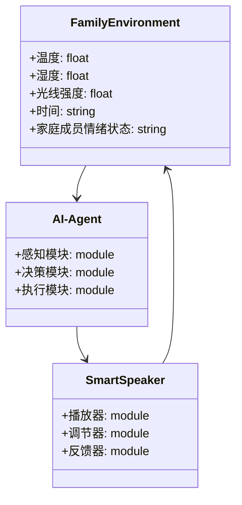
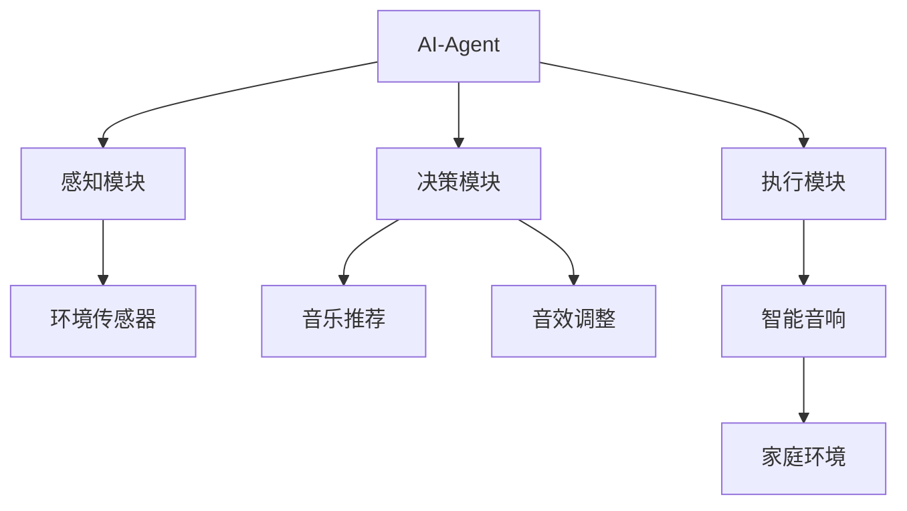
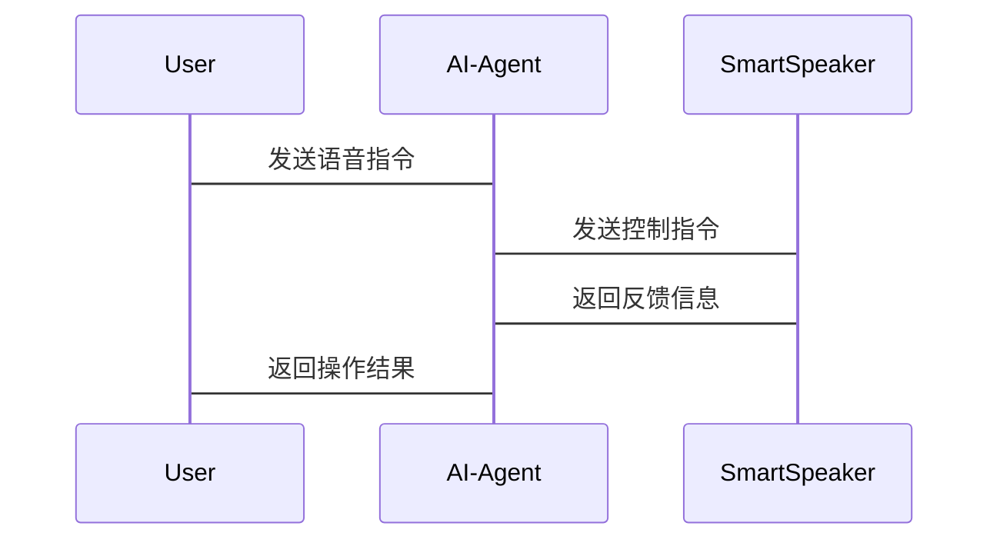

                 


# AI Agent在智能音响中的家庭氛围营造

> 关键词：AI Agent, 家庭氛围营造, 智能音响, 强化学习, 语音识别, 系统架构

> 摘要：本文探讨了AI Agent在智能音响中的应用，分析其如何通过算法和系统架构实现家庭氛围营造。文章从背景介绍、核心概念、算法原理、系统架构到项目实战，详细阐述了AI Agent在智能音响中的实现过程，展示了其在家庭环境中的实际应用和效果。

---

## 第一部分: AI Agent与家庭氛围营造的背景介绍

### 第1章: AI Agent与家庭氛围营造的背景

#### 1.1 AI Agent的基本概念
##### 1.1.1 AI Agent的定义与特点
AI Agent（人工智能代理）是一种能够感知环境、自主决策并执行任务的智能实体。它具备以下特点：
- **自主性**：能够在没有外部干预的情况下运行。
- **反应性**：能够实时感知环境变化并做出响应。
- **学习性**：通过数据和经验不断优化自身的行为。
- **协作性**：能够与其他系统或用户进行交互和协作。

##### 1.1.2 AI Agent的核心要素与功能
AI Agent的核心要素包括：
- **感知模块**：通过传感器或数据输入感知环境。
- **决策模块**：基于感知信息做出决策。
- **执行模块**：将决策转化为实际操作。
- **学习模块**：通过机器学习算法优化决策模型。

AI Agent的功能主要体现在以下几个方面：
- 数据采集与处理
- 智能决策与推荐
- 自适应优化

##### 1.1.3 AI Agent在智能家居中的应用前景
随着智能家居的普及，AI Agent在家庭环境中的应用前景广阔。它可以通过智能音响、智能灯泡、智能空调等设备，实现家庭环境的智能化管理。AI Agent能够根据家庭成员的行为习惯和情感需求，自动调整家庭氛围，提升居住舒适度。

#### 1.2 家庭氛围营造的背景与需求
##### 1.2.1 家庭氛围的定义与目标
家庭氛围是指家庭环境中给人的感受和情感体验，包括视觉、听觉、嗅觉、触觉等多个方面的综合体验。营造家庭氛围的目标是通过技术手段，创造一个舒适、愉悦、个性化的居住环境。

##### 1.2.2 当代家庭对智能化氛围营造的需求
现代家庭对智能化氛围营造的需求主要体现在以下几点：
- **个性化需求**：每个家庭成员的喜好和需求不同，需要个性化的氛围营造方案。
- **便捷性需求**：希望通过简单的操作或自动化的设备实现氛围营造。
- **情感需求**：通过技术手段满足家庭成员的情感需求，提升生活品质。

##### 1.2.3 智能音响在家庭氛围营造中的作用
智能音响是家庭氛围营造的重要工具之一。它可以通过播放音乐、调节音量、营造氛围音效等方式，直接影响家庭环境的氛围。AI Agent可以通过智能音响实现以下功能：
- 根据家庭成员的情绪状态推荐音乐。
- 根据家庭活动场景调整音效。
- 与其他智能家居设备协同工作，共同营造家庭氛围。

#### 1.3 AI Agent与智能音响的结合
##### 1.3.1 AI Agent在智能音响中的应用场景
AI Agent在智能音响中的应用场景包括：
- **情绪识别与音乐推荐**：通过语音识别和情感分析技术，识别家庭成员的情绪状态，并推荐相应的音乐。
- **环境感知与音效调整**：通过感知家庭环境的变化（如光线、温度、时间等），自动调整音响的音效。
- **协同控制**：与其他智能家居设备协同工作，实现家庭氛围的统一控制。

##### 1.3.2 AI Agent如何提升家庭氛围营造的效果
AI Agent通过以下方式提升家庭氛围营造的效果：
- **个性化推荐**：根据家庭成员的喜好和情绪状态，提供个性化的音乐推荐。
- **自动化调整**：根据环境变化自动调整音响设置，确保最佳的听觉体验。
- **协同控制**：与其他智能家居设备协同工作，实现家庭氛围的全方位控制。

##### 1.3.3 AI Agent与智能音响结合的实现方式
AI Agent与智能音响结合的实现方式主要包括：
- **硬件集成**：将AI Agent的硬件模块集成到智能音响中。
- **软件对接**：通过软件接口实现AI Agent与智能音响的协同工作。
- **云端控制**：通过云端服务器实现AI Agent与智能音响的远程控制。

#### 1.4 本章小结
本章从AI Agent的基本概念、家庭氛围营造的背景与需求以及AI Agent与智能音响的结合三个方面，介绍了AI Agent在家庭氛围营造中的背景和基本原理。通过本章的介绍，读者可以了解AI Agent在家庭环境中的重要性和应用前景。

---

## 第二部分: AI Agent与家庭氛围营造的核心概念

### 第2章: AI Agent的核心概念与原理

#### 2.1 AI Agent的核心概念
##### 2.1.1 AI Agent的分类与特点
AI Agent可以根据功能和应用场景分为多种类型，常见的分类包括：
- **反应式AI Agent**：根据实时感知的信息做出决策，适用于需要快速响应的场景。
- **基于模型的AI Agent**：通过构建环境模型进行决策，适用于复杂环境中的决策问题。
- **强化学习AI Agent**：通过与环境的交互不断优化决策策略，适用于需要自适应调整的场景。

##### 2.1.2 AI Agent的决策机制
AI Agent的决策机制主要包括以下几个步骤：
1. **感知环境**：通过传感器或数据输入感知环境信息。
2. **分析信息**：对感知到的信息进行分析和处理。
3. **制定决策**：基于分析结果制定决策。
4. **执行决策**：将决策转化为具体操作。

##### 2.1.3 AI Agent的学习与优化
AI Agent通过机器学习算法实现自我优化和提升。常见的学习算法包括：
- **监督学习**：通过标记数据进行训练，适用于分类和回归问题。
- **无监督学习**：通过未标记数据进行训练，适用于聚类和降维问题。
- **强化学习**：通过与环境的交互不断优化决策策略，适用于需要策略优化的场景。

#### 2.2 家庭氛围营造的核心要素
##### 2.2.1 家庭氛围的定义与构成
家庭氛围的定义是家庭环境中给人的感受和情感体验，其构成包括以下几个方面：
- **视觉效果**：包括灯光、色彩、装饰等。
- **听觉效果**：包括音乐、音效、语音等。
- **嗅觉效果**：包括空气质量和气味。
- **触觉效果**：包括温度、湿度、材质等。

##### 2.2.2 智能音响在家庭氛围营造中的作用
智能音响在家庭氛围营造中的作用主要体现在以下几个方面：
- **情绪调节**：通过播放音乐或音效影响家庭成员的情绪状态。
- **场景营造**：根据家庭活动场景调整音响设置，营造相应的氛围。
- **协同控制**：与其他智能家居设备协同工作，实现家庭氛围的统一控制。

##### 2.2.3 家庭成员的行为与情感对氛围的影响
家庭成员的行为和情感对家庭氛围的影响主要体现在以下几个方面：
- **情绪状态**：家庭成员的情绪状态会影响家庭氛围的营造需求。
- **行为习惯**：家庭成员的行为习惯决定了家庭氛围的个性化需求。
- **情感需求**：家庭成员的情感需求是家庭氛围营造的核心目标。

#### 2.3 AI Agent与家庭氛围营造的联系
##### 2.3.1 AI Agent如何感知家庭氛围
AI Agent可以通过以下方式感知家庭氛围：
- **语音识别**：通过语音指令或情感分析感知家庭成员的情绪状态。
- **环境感知**：通过传感器感知环境中的光线、温度、湿度等信息。
- **数据挖掘**：通过分析家庭成员的行为数据，了解他们的需求和偏好。

##### 2.3.2 AI Agent如何调整家庭氛围
AI Agent通过以下方式调整家庭氛围：
- **音乐推荐**：根据家庭成员的情绪状态推荐相应的音乐。
- **音效调整**：根据环境变化自动调整音响的音效。
- **协同控制**：与其他智能家居设备协同工作，实现家庭氛围的全方位控制。

##### 2.3.3 AI Agent在家庭氛围营造中的反馈机制
AI Agent在家庭氛围营造中的反馈机制主要包括：
- **用户反馈**：通过用户输入或行为数据了解家庭氛围的营造效果。
- **环境反馈**：通过环境传感器感知家庭氛围的变化。
- **自我优化**：根据反馈信息不断优化AI Agent的决策模型。

#### 2.4 本章小结
本章从AI Agent的核心概念、家庭氛围营造的核心要素以及AI Agent与家庭氛围营造的联系三个方面，详细介绍了AI Agent在家庭氛围营造中的核心原理和实现方式。通过本章的介绍，读者可以了解AI Agent在家庭环境中的核心作用和实现机制。

---

## 第三部分: AI Agent在家庭氛围营造中的算法原理

### 第3章: AI Agent的算法原理

#### 3.1 AI Agent的算法原理
##### 3.1.1 强化学习算法
强化学习是一种通过与环境交互不断优化决策策略的算法。其核心思想是通过试错的方式，找到最优的决策策略。强化学习的主要组成部分包括：
- **状态空间**：环境中的所有可能状态。
- **动作空间**：AI Agent可以执行的所有动作。
- **奖励函数**：对AI Agent行为的反馈，用于指导决策。

##### 3.1.2 语音识别算法
语音识别算法是通过将语音信号转化为文本或命令的一种技术。常用的语音识别算法包括：
- **基于模板匹配的语音识别**：通过匹配语音信号与预存模板进行识别。
- **基于统计模型的语音识别**：通过统计模型（如HMM）进行语音识别。
- **基于深度学习的语音识别**：通过神经网络模型（如RNN、CNN）进行语音识别。

##### 3.1.3 情感分析算法
情感分析算法是通过分析文本或语音的情感倾向，判断其情感状态的一种技术。常用的算法包括：
- **基于规则的情感分析**：通过预设规则进行情感判断。
- **基于统计模型的情感分析**：通过统计模型（如Naive Bayes）进行情感分析。
- **基于深度学习的情感分析**：通过神经网络模型（如LSTM、Transformer）进行情感分析。

#### 3.2 算法实现与优化
##### 3.2.1 强化学习算法的实现
以下是一个基于Q-learning的强化学习算法实现示例：

```python
import numpy as np

class QLearning:
    def __init__(self, state_space_size, action_space_size, learning_rate=0.1, gamma=0.9):
        self.q_table = np.zeros((state_space_size, action_space_size))
        self.learning_rate = learning_rate
        self.gamma = gamma

    def choose_action(self, state, epsilon=0.1):
        if np.random.random() < epsilon:
            return np.random.randint(0, action_space_size)
        else:
            return np.argmax(self.q_table[state])

    def update_q_table(self, state, action, reward, next_state):
        self.q_table[state][action] = self.q_table[state][action] * (1 - self.learning_rate) + \
                                       reward + self.learning_rate * np.max(self.q_table[next_state])

# 示例使用
state_space_size = 10
action_space_size = 5
ql = QLearning(state_space_size, action_space_size)
epsilon = 0.1
state = 0
action = ql.choose_action(state, epsilon)
reward = 1
next_state = 1
ql.update_q_table(state, action, reward, next_state)
```

##### 3.2.2 语音识别算法的优化
语音识别算法的优化主要包括以下几个方面：
- **特征提取**：通过提取语音信号的关键特征（如MFCC）提高识别准确率。
- **模型选择**：选择适合的模型（如深度神经网络）提高识别效果。
- **数据增强**：通过数据增强技术（如噪声添加、速度变化）提高模型的鲁棒性。

##### 3.2.3 情感分析算法的应用
情感分析算法的应用主要体现在以下几个方面：
- **音乐推荐**：根据用户的情感状态推荐相应的音乐。
- **氛围调整**：根据用户的情感状态调整家庭氛围。
- **行为决策**：根据用户的情感状态做出相应的行为决策。

#### 3.3 本章小结
本章从AI Agent的算法原理出发，详细介绍了强化学习算法、语音识别算法和情感分析算法的实现与优化。通过本章的介绍，读者可以了解AI Agent在家庭氛围营造中的技术实现和优化方法。

---

## 第四部分: AI Agent在家庭氛围营造中的系统分析与架构设计

### 第4章: AI Agent的系统分析与架构设计

#### 4.1 系统分析
##### 4.1.1 问题场景介绍
家庭氛围营造的核心问题包括：
- **如何感知家庭氛围**：通过传感器和数据输入感知家庭环境。
- **如何调整家庭氛围**：通过智能音响和其他设备调整家庭氛围。
- **如何优化家庭氛围**：通过机器学习算法优化家庭氛围的营造效果。

##### 4.1.2 项目介绍
本项目旨在通过AI Agent实现家庭氛围的智能化营造。项目的主要目标包括：
- **实现家庭氛围的感知与分析**：通过传感器和数据输入感知家庭环境，并通过机器学习算法分析家庭氛围。
- **实现家庭氛围的智能调整**：通过智能音响和其他智能家居设备调整家庭氛围。
- **实现家庭氛围的优化与提升**：通过机器学习算法优化家庭氛围的营造效果。

#### 4.2 系统功能设计
##### 4.2.1 领域模型
以下是家庭氛围营造的领域模型：



##### 4.2.2 系统架构设计
以下是AI Agent与智能音响的系统架构图：



##### 4.2.3 系统接口设计
系统接口设计主要包括以下几个方面：
- **AI Agent与智能音响的接口**：通过API接口实现AI Agent与智能音响的协同工作。
- **AI Agent与环境传感器的接口**：通过硬件接口或API接口实现AI Agent与环境传感器的数据交互。
- **用户与AI Agent的接口**：通过语音指令或图形界面实现用户与AI Agent的交互。

##### 4.2.4 系统交互设计
以下是AI Agent与智能音响的交互流程图：



#### 4.3 本章小结
本章从系统分析与架构设计的角度，详细介绍了AI Agent在家庭氛围营造中的技术实现。通过本章的介绍，读者可以了解AI Agent与智能音响的系统架构和交互流程。

---

## 第五部分: AI Agent在家庭氛围营造中的项目实战

### 第5章: AI Agent的项目实战

#### 5.1 项目环境安装
##### 5.1.1 系统环境
- 操作系统：Linux（推荐Ubuntu）
- 开发工具：Python、Jupyter Notebook
- 依赖库：numpy、pandas、scikit-learn、tensorflow

##### 5.1.2 智能音响的安装
- 智能音响设备：如Sonos、Apple HomePod等
- 驱动安装：安装智能音响的SDK和API接口
- 网络配置：确保智能音响与计算机在同一网络下

#### 5.2 系统核心实现
##### 5.2.1 AI Agent的核心代码实现
以下是AI Agent的核心代码实现：

```python
import numpy as np
import pandas as pd
from sklearn import preprocessing
import tensorflow as tf

# 数据预处理
data = pd.read_csv('family_environment.csv')
X = data.drop('label', axis=1)
y = data['label']
scaler = preprocessing.StandardScaler()
X_scaled = scaler.fit_transform(X)

# 模型训练
model = tf.keras.Sequential([
    tf.keras.layers.Dense(64, activation='relu'),
    tf.keras.layers.Dense(32, activation='relu'),
    tf.keras.layers.Dense(1, activation='sigmoid')
])
model.compile(optimizer='adam', loss='binary_crossentropy', metrics=['accuracy'])
model.fit(X_scaled, y, epochs=100, batch_size=32)

# 模型预测
new_data = pd.DataFrame([[1, 2, 3]], columns=data.columns[:-1])
new_data_scaled = scaler.transform(new_data)
predictions = model.predict(new_data_scaled)
```

##### 5.2.2 智能音响的控制代码实现
以下是智能音响的控制代码实现：

```python
import serial

# 连接智能音响
ser = serial.Serial('COM3', 9600)

# 发送控制指令
def play_music():
    ser.write(b'play')

def stop_music():
    ser.write(b'stop')

play_music()
```

##### 5.2.3 系统交互代码实现
以下是系统交互的代码实现：

```python
import speech_recognition as sr

# 初始化语音识别器
r = sr.Recognizer()

# 识别语音指令
with sr.Microphone() as source:
    print("请说您的指令...")
    audio = r.listen(source)
    try:
        command = r.recognize_google(audio)
        print(f"识别到的指令：{command}")
    except sr.UnknownValueError:
        print("无法识别您的指令")
```

#### 5.3 项目实战分析
##### 5.3.1 环境安装与配置
- 确保系统环境和智能音响设备的安装与配置正确。
- 安装必要的依赖库和工具，确保代码能够运行。

##### 5.3.2 系统功能实现
- 通过AI Agent感知家庭环境并做出决策。
- 通过智能音响实现音乐播放和音效调整。
- 通过系统交互实现用户与AI Agent的语音指令交互。

##### 5.3.3 实际案例分析
以下是一个实际案例的分析：

```python
# 示例案例：家庭成员情绪低落时的氛围营造
import numpy as np
import pandas as pd
from sklearn import preprocessing
import tensorflow as tf

# 数据预处理
data = pd.read_csv('family_environment.csv')
X = data.drop('label', axis=1)
y = data['label']
scaler = preprocessing.StandardScaler()
X_scaled = scaler.fit_transform(X)

# 模型训练
model = tf.keras.Sequential([
    tf.keras.layers.Dense(64, activation='relu'),
    tf.keras.layers.Dense(32, activation='relu'),
    tf.keras.layers.Dense(1, activation='sigmoid')
])
model.compile(optimizer='adam', loss='binary_crossentropy', metrics=['accuracy'])
model.fit(X_scaled, y, epochs=100, batch_size=32)

# 模型预测
new_data = pd.DataFrame([[1, 2, 3]], columns=data.columns[:-1])
new_data_scaled = scaler.transform(new_data)
predictions = model.predict(new_data_scaled)

# 智能音响控制
import serial

ser = serial.Serial('COM3', 9600)

def play_music():
    ser.write(b'play')

def stop_music():
    ser.write(b'stop')

play_music()
```

#### 5.4 本章小结
本章通过项目实战的方式，详细介绍了AI Agent在家庭氛围营造中的技术实现。通过本章的介绍，读者可以了解AI Agent在实际应用中的具体实现和效果。

---

## 第六部分: 总结与展望

### 第6章: 总结与展望

#### 6.1 总结
本文详细介绍了AI Agent在智能音响中的家庭氛围营造的实现过程。通过背景介绍、核心概念、算法原理、系统分析和项目实战的介绍，展示了AI Agent在家庭环境中的技术实现和应用效果。AI Agent通过感知家庭环境、分析家庭氛围、调整音响设置，实现家庭氛围的智能化营造。

#### 6.2 展望
未来，随着人工智能技术的不断发展，AI Agent在家庭氛围营造中的应用前景将更加广阔。以下是未来的发展方向：
- **更加智能化的AI Agent**：通过深度学习和强化学习算法，实现更加智能化的决策和优化。
- **更加个性化的家庭氛围营造**：通过个性化推荐和自适应调整，实现更加个性化的家庭氛围营造。
- **更加协同化的智能家居系统**：通过与其他智能家居设备的协同工作，实现家庭氛围的全方位控制。

#### 6.3 最佳实践 tips
- 在实现AI Agent时，建议使用深度学习算法（如Transformer）进行情感分析和语音识别。
- 在系统架构设计时，建议采用微服务架构，实现系统的模块化和可扩展性。
- 在实际应用中，建议通过A/B测试优化AI Agent的决策策略，确保系统的稳定性和可靠性。

#### 6.4 本章小结
本文从总结与展望的角度，详细介绍了AI Agent在家庭氛围营造中的应用前景和未来发展方向。通过本章的介绍，读者可以了解AI Agent在家庭环境中的未来发展和应用潜力。

---

## 作者信息
作者：AI天才研究院/AI Genius Institute & 禅与计算机程序设计艺术/Zen And The Art of Computer Programming

