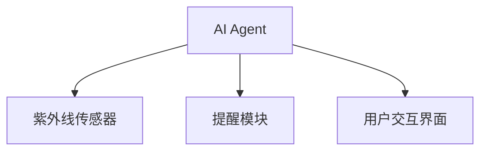

                 


# AI Agent在智能项链中的紫外线防护提醒

> 关键词：AI Agent，紫外线防护，智能项链，健康监测，实时提醒

> 摘要：本文深入探讨了AI Agent在智能项链中的紫外线防护提醒功能，从技术原理到系统设计，再到实际应用，全面解析了这一创新技术的核心逻辑与实现方案。通过详细的技术分析和实际案例，本文展示了如何利用AI Agent实现高效、智能的紫外线防护提醒，为智能设备的设计与应用提供了新的思路。

---

# 第一部分: AI Agent在智能项链中的紫外线防护提醒概述

## 第1章: 背景介绍

### 1.1 问题背景与描述

#### 1.1.1 紫外线辐射对人体的危害
紫外线（UV）是太阳光中的一部分，分为UV-A、UV-B和UV-C三种类型。其中，UV-B是主要的有害辐射，能够穿透大气层，对皮肤和眼睛造成伤害，导致晒伤、皮肤癌和白内障等问题。现代社会中，人们越来越关注紫外线防护，尤其是在户外活动时。

#### 1.1.2 智能设备在健康防护中的作用
随着技术的进步，智能设备逐渐成为健康监测的重要工具。智能项链作为一种可穿戴设备，不仅可以作为装饰，还可以集成多种传感器和AI算法，实时监测环境数据并提供健康建议。

#### 1.1.3 AI Agent在智能项链中的应用价值
AI Agent（人工智能代理）是一种能够感知环境、自主决策并执行任务的智能体。将其应用于智能项链，可以实时监测紫外线强度，并根据用户需求提供个性化防护提醒，显著提升了紫外线防护的效率和用户体验。

---

## 第2章: AI Agent的核心概念与原理

### 2.1 AI Agent的基本原理

#### 2.1.1 AI Agent的定义与分类
AI Agent是一种智能体，能够通过感知环境、分析数据并采取行动来实现特定目标。根据智能水平，AI Agent可以分为反应式和认知式两类。在智能项链中，AI Agent主要用于实时数据分析和决策。

#### 2.1.2 基于AI Agent的紫外线防护机制
AI Agent通过紫外线传感器获取环境数据，结合用户的皮肤敏感度和活动场景，计算出紫外线强度，并在超过安全阈值时发出提醒。

#### 2.1.3 AI Agent与传统算法的区别
AI Agent的核心优势在于其自主性和适应性。与传统算法相比，AI Agent能够根据动态环境调整行为，具有更强的实时性和灵活性。

---

## 第3章: 紫外线检测技术与AI Agent的结合

### 3.1 紫外线检测技术原理

#### 3.1.1 紫外线传感器的工作原理
紫外线传感器通过光电效应将紫外线辐射强度转化为电信号。常用的紫外线传感器包括光电二极管和光电池。

#### 3.1.2 不同类型紫外线的检测方法
UV-A、UV-B和UV-C的检测需要使用不同的传感器和滤光片。本文主要关注UV-B的检测，因为其对人体的危害最大。

#### 3.1.3 紫外线强度与防护需求的关系
紫外线强度与防护需求呈正相关。AI Agent通过分析紫外线强度，决定是否需要发出提醒。

### 3.2 AI Agent在紫外线防护中的应用

#### 3.2.1 数据采集与预处理
AI Agent通过紫外线传感器采集数据，并对数据进行滤波和归一化处理，确保数据的准确性。

#### 3.2.2 紫外线防护模型的构建
基于机器学习算法，AI Agent构建紫外线防护模型，预测紫外线对人体的潜在危害。

#### 3.2.3 实时提醒机制的设计
当紫外线强度超过阈值时，AI Agent通过震动或声音提醒用户采取防护措施。

---

## 第4章: 系统架构与功能设计

### 4.1 系统架构设计

#### 4.1.1 系统模块划分
系统主要包括紫外线传感器、AI Agent处理模块、提醒模块和用户交互界面。

#### 4.1.2 系统功能设计
- 数据采集：实时采集紫外线强度
- 数据分析：AI Agent分析数据并决定是否发出提醒
- 提醒机制：震动或声音提醒用户

#### 4.1.3 系统架构图


### 4.2 系统接口设计

#### 4.2.1 紫外线传感器接口
```python
class UV_Sensor:
    def __init__(self):
        self.intensity = 0
    def get_uv(self):
        return self.intensity
```

#### 4.2.2 提醒模块接口
```python
class Reminder:
    def __init__(self):
        pass
    def trigger(self):
        print("紫外线强度过高，请采取防护措施！")
```

---

## 第5章: 算法原理与实现

### 5.1 算法原理

#### 5.1.1 数据预处理
紫外线数据可能受到环境噪声的影响，因此需要进行滤波处理。

#### 5.1.2 紫外线强度预测模型
基于历史数据，使用回归算法预测紫外线强度。

#### 5.1.3 实时提醒逻辑
当预测值超过阈值时，触发提醒。

### 5.2 算法实现

#### 5.2.1 数据预处理代码
```python
import numpy as np
from scipy import signal

def preprocess(data):
    filtered_data = signal.filtfilt(b, a, data)
    return filtered_data
```

#### 5.2.2 紫外线强度预测模型
```python
from sklearn.linear_model import LinearRegression

model = LinearRegression()
model.fit(X_train, y_train)
```

---

## 第6章: 项目实战

### 6.1 环境搭建

#### 6.1.1 开发工具
- Python 3.8+
- TensorFlow 2.0+
- Mermaid-diagram

### 6.2 核心代码实现

#### 6.2.1 紫外线传感器数据采集
```python
import serial
import time

ser = serial.Serial('COM3', 9600)
while True:
    data = ser.readline().decode().strip()
    print(data)
    time.sleep(1)
```

#### 6.2.2 AI Agent实现
```python
class AI_Agent:
    def __init__(self, sensor, reminder):
        self.sensor = sensor
        self.reminder = reminder
    def monitor(self):
        while True:
            intensity = self.sensor.get_uv()
            if intensity > threshold:
                self.reminder.trigger()
            time.sleep(1)
```

---

## 第7章: 总结与展望

### 7.1 总结
本文详细介绍了AI Agent在智能项链中的紫外线防护提醒功能，从技术原理到系统设计，再到实际应用，全面解析了这一创新技术的核心逻辑与实现方案。

### 7.2 未来展望
未来，AI Agent在智能设备中的应用将更加广泛。通过不断优化算法和提升硬件性能，紫外线防护提醒功能将更加智能化和个性化。

---

# 作者：AI天才研究院/AI Genius Institute & 禅与计算机程序设计艺术 /Zen And The Art of Computer Programming

