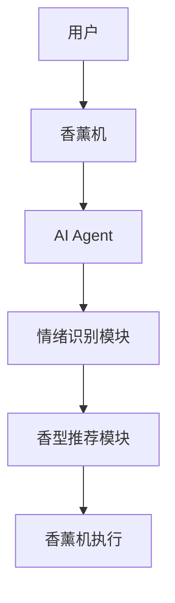
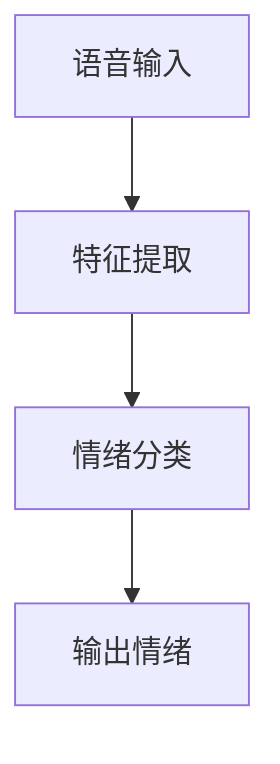
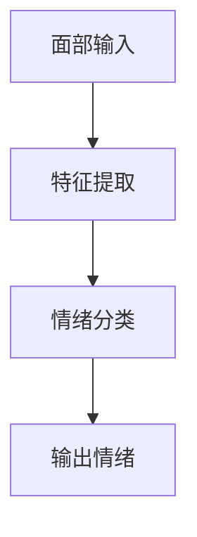

                 


# AI Agent在智能香薰机中的情绪管理助手

## 关键词：AI Agent, 智能香薰机, 情绪管理, 多模态交互, 智能硬件

## 摘要：
本文将探讨AI Agent在智能香薰机中的情绪管理应用。通过分析情绪识别算法、系统架构设计和项目实战，详细阐述AI Agent如何通过感知用户情绪，调整香薰机的香型和强度，从而达到情绪调节的目的。文章将从背景介绍、核心概念、算法原理、系统架构、项目实战等多个方面展开，结合理论与实践，为读者提供一个全面的技术视角。

---

## 第一部分: AI Agent与智能香薰机的背景介绍

### 第1章: AI Agent与智能香薰机概述

#### 1.1 从传统香薰到智能香薰的演变
- 传统香薰的功能与局限性
- 智能香薰机的核心概念与特点
  - 网络连接：支持Wi-Fi/蓝牙控制
  - 多设备协同：与智能家居系统的联动
  - 智能控制：通过手机APP或语音助手（如Alexa、Siri）进行操作
- 智能香薰机的市场现状与发展趋势
  - 智能家居生态的普及推动了智能香薰机的增长
  - 用户对个性化和智能化体验的需求日益增加

#### 1.2 情绪管理与智能香薰的结合
- 情绪管理的基本原理与方法
  - 情绪是人类对特定情境的主观感受
  - 情绪管理是通过调节外部环境和内在认知来改善情绪状态
- 智能香薰在情绪管理中的独特优势
  - 香气对人类情绪的直接影响
  - 个性化香型推荐：根据用户情绪偏好调整香薰种类和浓度
- 情绪管理与智能香薰的结合场景
  - 家庭场景：缓解压力、提升睡眠质量
  - 办公场景：提高工作效率、缓解焦虑
  - 公共空间：营造舒适的氛围

#### 1.3 AI Agent的核心概念与工作流程
- AI Agent的定义与核心要素
  - AI Agent：一种能够感知环境、做出决策并执行动作的智能实体
  - 核心要素：感知能力、决策能力、执行能力
- AI Agent在智能香薰机中的具体应用场景
  - 用户情绪识别：通过语音、表情、生理数据等多模态输入进行情绪分析
  - 情绪分析与香薰推荐：基于用户情绪状态推荐合适的香型和浓度
  - 系统反馈与优化：根据用户反馈不断优化推荐算法
- AI Agent的工作流程与核心算法
  - 感知层：获取用户情绪数据
  - 决策层：分析数据并生成香薰推荐方案
  - 执行层：控制香薰机按照推荐方案工作

---

## 第二部分: AI Agent的核心概念与联系

### 第2章: AI Agent的原理与实现

#### 2.1 AI Agent的感知层
- 情绪识别的多模态输入
  - 语音：通过语音语调分析情绪
  - 面部表情：通过摄像头捕捉面部表情
  - 生理数据：心率、皮肤温度等生理指标
- 不同情绪识别方法的优缺点对比（表格形式）

| 方法      | 优点                           | 缺点                             |
|-----------|--------------------------------|----------------------------------|
| 语音      | 实时性强，易于实现             | 易受环境噪音干扰                 |
| 面部表情   | 直观，准确性高                  | 需要摄像头支持，隐私问题         |
| 生理数据   | 客观性强，准确性高              | 实施复杂，成本较高               |

- 使用 Mermaid 绘制AI Agent 的工作流程图


---

## 第三部分: 情绪识别算法原理与实现

### 第3章: 情绪识别算法详解

#### 3.1 基于语音的情绪识别
- 语音特征提取与情绪分类算法
  - 音调、音量、语速等特征提取
  - 基于支持向量机（SVM）的情绪分类模型
- 使用 Mermaid 绘制算法流程图


#### 3.2 基于面部表情的情绪识别
- 面部表情识别的核心算法
  - 使用OpenCV进行面部特征点提取
  - 基于深度学习的情绪分类模型
- 使用 Mermaid 绘制算法流程图


#### 3.3 AI Agent的核心算法实现
- 使用Python实现情绪分类模型
```python
# 情绪分类模型实现
from sklearn.svm import SVC
from sklearn.model_selection import train_test_split
from sklearn.metrics import accuracy_score

# 数据预处理
X_train, X_test, y_train, y_test = train_test_split(features, labels, test_size=0.2)

# 模型训练
model = SVC()
model.fit(X_train, y_train)

# 模型预测
y_pred = model.predict(X_test)
print("Accuracy:", accuracy_score(y_test, y_pred))
```

---

## 第四部分: 系统分析与架构设计方案

### 第4章: 系统架构设计

#### 4.1 项目背景介绍
- 智能香薰机的应用场景
  - 家庭场景：卧室、客厅
  - 办公场景：办公室、会议室
  - 公共空间：酒店、商场

#### 4.2 系统功能设计
- 领域模型设计
  - 用户：发送情绪指令
  - 香薰机：接收指令并执行
  - AI Agent：处理用户情绪数据并生成推荐方案

#### 4.3 系统架构设计
- 使用 Mermaid 绘制系统架构图


#### 4.4 系统接口设计
- 用户与香薰机的交互接口
  - 手机APP：用户输入情绪需求
  - 语音助手：用户通过语音指令控制香薰机
- 系统内部接口
  - AI Agent与香薰机的数据交互接口

---

## 第五部分: 项目实战

### 第5章: 项目实战

#### 5.1 环境安装
- 安装Python和相关库
  - 安装步骤：
    ```bash
    pip install numpy
    pip install scikit-learn
    pip install mermaid
    ```

#### 5.2 系统核心实现
- 情绪识别模块实现
  - 使用SVM实现情绪分类
  ```python
  from sklearn.svm import SVC
  model = SVC()
  model.fit(X_train, y_train)
  ```

- 香型推荐模块实现
  - 根据情绪推荐香型
  ```python
  def recommend_scent(mood):
      if mood == 'happy':
          return 'rose'
      elif mood == 'stressed':
          return 'lavender'
      else:
          return 'citrus'
  ```

#### 5.3 实际案例分析
- 案例一：用户情绪为“快乐”，推荐“玫瑰”香型
  - 系统输出：香薰机开启玫瑰香型，香薰强度适中
- 案例二：用户情绪为“紧张”，推荐“薰衣草”香型
  - 系统输出：香薰机开启薰衣草香型，香薰强度较高

#### 5.4 项目小结
- 成果：成功实现AI Agent在智能香薰机中的情绪管理功能
- 不足：模型准确率有待提高，需要更多的数据训练

---

## 第六部分: 最佳实践与小结

### 第6章: 最佳实践与小结

#### 6.1 最佳实践
- 使用建议
  - 定期更新模型：提高情绪识别的准确性
  - 隐私保护：确保用户数据的安全性
- 注意事项
  - 硬件设备的稳定性：避免香薰机故障影响用户体验
  - 网络连接的可靠性：确保AI Agent与香薰机的通信顺畅

#### 6.2 未来发展方向
- 深度学习在情绪识别中的应用
- 多模态交互的进一步优化
- 智能香薰机与其他智能家居设备的协同工作

---

## 作者：AI天才研究院 & 禅与计算机程序设计艺术

---

以上是《AI Agent在智能香薰机中的情绪管理助手》的文章内容，希望对您有所帮助！

