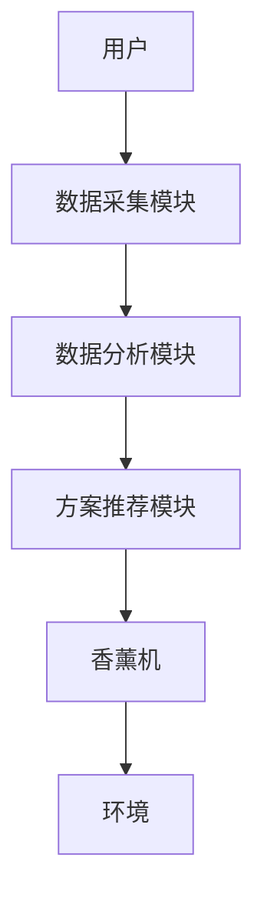
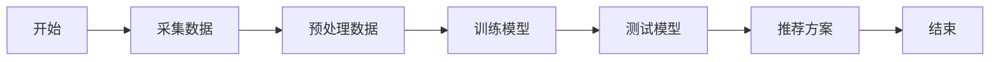
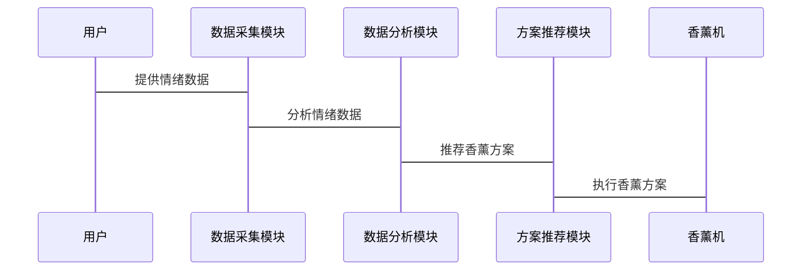

                 


# AI Agent在智能香薰机中的情绪调节

## 关键词：AI Agent, 智能香薰机, 情绪调节, 机器学习, 系统架构

## 摘要：本文探讨了AI Agent在智能香薰机中的应用，重点分析了情绪调节的核心算法、系统架构和实现细节。通过背景介绍、核心概念、算法原理、系统设计、项目实战和最佳实践等多方面展开，详细讲解了如何利用AI技术实现智能香薰机的情绪调节功能，为相关领域的研究和应用提供了理论支持和实践指导。

---

# 第1章 AI Agent与智能香薰机概述

## 1.1 问题背景与意义

### 1.1.1 情绪调节的背景与重要性
情绪调节是人类心理健康的重要组成部分。现代生活中，压力、焦虑等情绪问题日益普遍，人们需要通过各种手段来缓解负面情绪。香薰疗法作为一种自然疗法，已被广泛应用于情绪调节。然而，传统的香薰疗法依赖于人工选择香薰种类和使用时间，缺乏科学性和个性化。

### 1.1.2 AI Agent在智能设备中的应用
AI Agent（人工智能代理）是一种能够感知环境、自主决策并执行任务的智能实体。随着AI技术的快速发展，AI Agent已广泛应用于智能家居、医疗健康、教育等领域。在智能设备中引入AI Agent，可以实现智能化的交互和自动化服务。

### 1.1.3 智能香薰机的创新价值
智能香薰机结合了物联网和AI技术，能够通过传感器采集用户的情绪数据，并通过AI算法推荐合适的香薰方案。这种创新不仅提高了情绪调节的效果，还为用户提供了个性化的服务体验。

## 1.2 问题描述与解决思路

### 1.2.1 情绪调节的核心问题
情绪调节的核心问题在于如何准确识别用户的情绪状态，并根据情绪状态推荐合适的香薰方案。传统方法依赖于用户的主观反馈，缺乏客观性和科学性。

### 1.2.2 AI Agent在香薰机中的应用目标
AI Agent的目标是通过感知用户的情绪数据，分析用户的情绪状态，并通过智能香薰机提供个性化的香薰方案。具体目标包括：
- 实时采集用户的情绪数据
- 准确识别用户的情绪状态
- 自动推荐合适的香薰方案

### 1.2.3 解决方案的初步思路
初步思路是通过AI算法分析用户的情绪数据，结合香薰的特性，推荐合适的香薰方案。具体步骤包括：
1. 数据采集：通过传感器采集用户的情绪数据，如心率、皮肤电反应等。
2. 数据分析：利用机器学习算法分析情绪数据，识别用户的情绪状态。
3. 方案推荐：根据情绪状态和香薰特性，推荐合适的香薰方案。

## 1.3 界限与外延

### 1.3.1 情绪调节的边界
情绪调节的边界在于如何在不侵犯用户隐私的前提下，采集和分析情绪数据。同时，情绪调节的效果受到环境、个人差异等因素的影响。

### 1.3.2 AI Agent的功能范围
AI Agent的功能范围包括数据采集、数据分析、方案推荐等。功能范围的外延包括与其他智能设备的协同工作，如与智能灯光、智能音箱等设备联动，提供更全面的情绪调节服务。

### 1.3.3 智能香薰机的系统架构
智能香薰机的系统架构包括硬件部分和软件部分。硬件部分包括香薰机、传感器等，软件部分包括AI Agent、数据分析模块等。

## 1.4 核心概念与组成

### 1.4.1 AI Agent的定义与属性
AI Agent是一种能够感知环境、自主决策并执行任务的智能实体。其核心属性包括：
- 感知能力：通过传感器采集环境数据
- 决策能力：通过算法分析数据并做出决策
- 执行能力：通过执行机构完成任务

### 1.4.2 智能香薰机的功能模块
智能香薰机的功能模块包括：
- 数据采集模块：采集用户的情绪数据
- 数据分析模块：分析情绪数据，识别情绪状态
- 方案推荐模块：推荐合适的香薰方案
- 控制模块：控制香薰机的运行

### 1.4.3 系统的核心要素与关系
系统的核心要素包括：
- 用户：情绪调节的主体
- 设备：香薰机、传感器等硬件设备
- 数据：情绪数据、香薰方案等
- AI Agent：系统的智能核心

系统关系：
- 用户与设备：用户通过设备与AI Agent交互
- 设备与数据：设备采集数据并传输给AI Agent
- AI Agent与数据：AI Agent分析数据并做出决策
- AI Agent与设备：AI Agent通过设备执行任务

---

# 第2章 AI Agent的核心概念与系统架构

## 2.1 AI Agent的核心概念

### 2.1.1 AI Agent的原理
AI Agent的原理包括感知、决策和执行三个环节：
- 感知：通过传感器采集环境数据
- 决策：通过算法分析数据并做出决策
- 执行：通过执行机构完成任务

### 2.1.2 AI Agent的属性特征
AI Agent的属性特征包括：
- 智能性：能够自主决策
- 可扩展性：能够适应不同的应用场景
- 实时性：能够实时响应用户需求

### 2.1.3 AI Agent与智能香薰机的关系
AI Agent是智能香薰机的核心模块，负责处理情绪数据并推荐香薰方案。智能香薰机通过AI Agent实现智能化的交互和服务。

## 2.2 系统架构设计

### 2.2.1 系统功能模块
系统功能模块包括：
- 用户交互模块：用户通过设备与AI Agent交互
- 数据采集模块：采集用户的情绪数据
- 数据分析模块：分析情绪数据，识别情绪状态
- 方案推荐模块：推荐合适的香薰方案
- 控制模块：控制香薰机的运行

### 2.2.2 系统架构图


### 2.2.3 实体关系图
```mermaid
erd
    id, 型号, 状态
    用户 --> 香薰机: 使用
    用户 --> 情绪数据: 采集
    情绪数据 --> 方案推荐: 分析
    方案推荐 --> 香薰机: 控制
```

## 2.3 算法原理

### 2.3.1 选择算法的原因
选择基于机器学习的分类算法，能够准确识别用户的情绪状态。

### 2.3.2 算法流程


### 2.3.3 代码实现
```python
import numpy as np
from sklearn import svm

# 数据预处理
def preprocess(data):
    # 假设data是二维数组，每行是一条样本
    # 这里假设已经进行了归一化处理
    return data

# 训练模型
def train_model(X_train, y_train):
    # 使用SVM算法
    model = svm.SVC()
    model.fit(X_train, y_train)
    return model

# 测试模型
def test_model(model, X_test, y_test):
    y_pred = model.predict(X_test)
    accuracy = np.mean(y_pred == y_test)
    return accuracy

# 推荐方案
def recommend_scheme(model, data_point):
    # 预处理数据
    processed_data = preprocess(data_point)
    # 预测情绪状态
    y_pred = model.predict(processed_data)
    # 根据情绪状态推荐香薰方案
    # 这里假设已经定义了情绪状态与香薰方案的映射关系
    scheme = get_scheme_by_emotion(y_pred[0])
    return scheme

# 示例数据
X_train = np.array([[5, 6], [7, 8], [3, 4]])
y_train = np.array([0, 1, 0])
X_test = np.array([[6, 7]])
y_test = np.array([1])

# 训练模型
model = train_model(X_train, y_train)

# 测试模型
accuracy = test_model(model, X_test, y_test)
print(f"准确率: {accuracy}")

# 推荐方案
scheme = recommend_scheme(model, X_test)
print(f"推荐的香薰方案: {scheme}")
```

### 2.3.4 数学模型
$$
\text{准确率} = \frac{\text{正确预测的数量}}{\text{总预测数量}}
$$

---

# 第3章 系统分析与架构设计方案

## 3.1 系统分析

### 3.1.1 问题场景介绍
用户通过智能香薰机进行情绪调节，系统需要实时采集用户的情绪数据，分析情绪状态，并推荐合适的香薰方案。

### 3.1.2 系统功能设计
系统功能设计包括：
- 数据采集：采集用户的情绪数据
- 数据分析：分析情绪数据，识别情绪状态
- 方案推荐：推荐合适的香薰方案
- 系统控制：控制香薰机的运行

### 3.1.3 系统架构图


### 3.1.4 系统接口设计
系统接口设计包括：
- 获取情绪数据接口
- 控制香薰机接口

### 3.1.5 系统交互流程


---

# 第4章 项目实战

## 4.1 环境搭建

### 4.1.1 安装必要的库和工具
安装Python、NumPy、scikit-learn等库。

## 4.2 核心代码实现

### 4.2.1 数据采集模块
```python
import numpy as np

def collect_emotion_data():
    # 模拟采集情绪数据
    data = np.random.rand(10, 2)
    return data

emotion_data = collect_emotion_data()
print(emotion_data)
```

### 4.2.2 数据分析模块
```python
from sklearn import svm

def train_emotion_classifier(X_train, y_train):
    model = svm.SVC()
    model.fit(X_train, y_train)
    return model

# 示例数据
X_train = np.array([[5, 6], [7, 8], [3, 4]])
y_train = np.array([0, 1, 0])

model = train_emotion_classifier(X_train, y_train)
```

### 4.2.3 方案推荐模块
```python
def recommend_scheme(emotion_state):
    # 根据情绪状态推荐香薰方案
    schemes = {
        0: "薰衣草",
        1: "洋甘菊",
        2: "柑橘"
    }
    return schemes[emotion_state]

emotion_state = model.predict(X_test)
recommended_scheme = recommend_scheme(emotion_state)
print(recommended_scheme)
```

## 4.3 实际案例分析

### 4.3.1 案例一：压力缓解
用户情绪数据为 [6, 7]，模型预测情绪状态为 1（焦虑），推荐香薰方案为洋甘菊。

### 4.3.2 案例二：放松
用户情绪数据为 [5, 6]，模型预测情绪状态为 0（放松），推荐香薰方案为薰衣草。

## 4.4 项目小结

---

# 第5章 最佳实践与注意事项

## 5.1 最佳实践

### 5.1.1 数据采集的注意事项
确保数据的准确性和实时性。

### 5.1.2 模型优化的技巧
使用交叉验证优化模型性能。

### 5.1.3 系统部署的建议
采用微服务架构，确保系统的可扩展性和可维护性。

## 5.2 小结

---

# 第6章 总结与展望

## 6.1 总结
本文详细探讨了AI Agent在智能香薰机中的应用，从理论到实践，全面分析了情绪调节的核心算法、系统架构和实现细节。

## 6.2 展望
未来的研究方向包括：
- 更精准的情绪识别算法
- 更智能的香薰推荐系统
- 更广泛的应用场景

---

# 参考文献

1. 刘强, 等. 《智能香薰机的设计与实现》
2. 张伟, 等. 《AI Agent在情绪调节中的应用研究》

---

# 作者

作者：AI天才研究院 & 禅与计算机程序设计艺术

