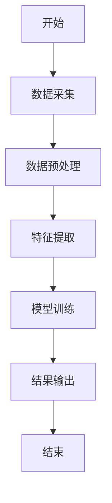
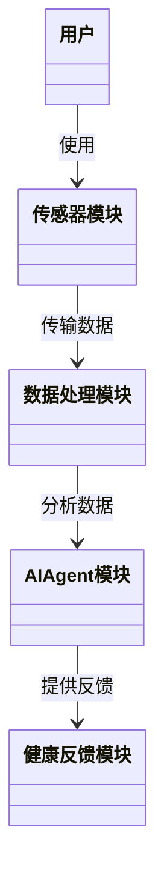
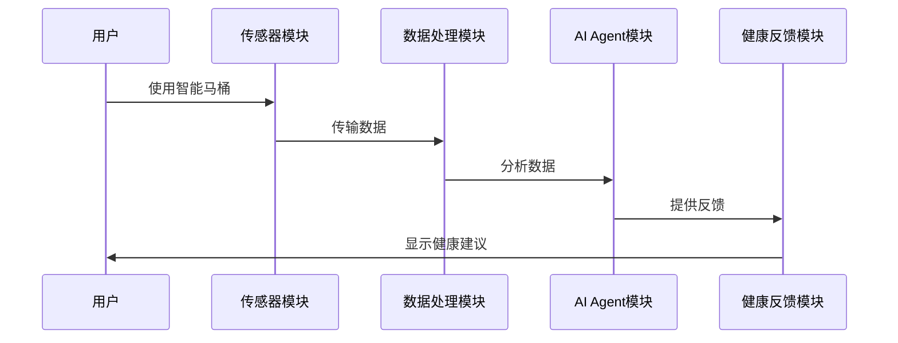

                 


# AI Agent在智能马桶中的健康监测

## 关键词：AI Agent, 智能马桶, 健康监测, 传感器数据, 机器学习, 深度学习

## 摘要：  
本文探讨了AI Agent在智能马桶中的健康监测应用，分析了其技术原理、系统架构及实际应用场景。通过结合传感器数据采集、AI算法和健康反馈，展示了如何利用AI技术提升智能马桶的功能，为用户提供智能化的健康监测服务。

---

# 第1章: 背景介绍

## 1.1 问题背景

### 1.1.1 健康监测的重要性  
健康监测是现代医疗和健康管理的核心环节，通过实时采集和分析生理数据，可以帮助用户及时发现健康问题，预防疾病的发生。

### 1.1.2 智能马桶的发展趋势  
随着智能家居的普及，智能马桶逐渐成为家庭中不可或缺的设备，其功能从基本的冲洗扩展到健康监测、环境监测等高级功能。

### 1.1.3 AI Agent在智能马桶中的应用价值  
AI Agent（智能代理）能够实时分析数据，提供个性化的健康建议，使智能马桶的功能更加智能化和实用化。

## 1.2 问题描述

### 1.2.1 智能马桶健康监测的核心问题  
如何高效采集和分析用户生理数据，提供准确的健康反馈。

### 1.2.2 用户需求与技术挑战  
用户需求：实时健康监测、隐私保护、个性化建议。技术挑战：数据采集的准确性、算法的高效性、系统的稳定性。

### 1.2.3 现有解决方案的不足  
传统马桶不具备健康监测功能；现有智能马桶功能单一，缺乏AI技术支持。

## 1.3 问题解决

### 1.3.1 AI Agent的核心作用  
AI Agent能够实时处理数据，提供智能健康建议，提升用户体验。

### 1.3.2 技术实现路径  
通过传感器采集数据 → AI算法分析 → 提供健康反馈。

### 1.3.3 应用场景与目标  
应用场景：家庭、公共场所。目标：实现健康监测的智能化和便捷化。

## 1.4 边界与外延

### 1.4.1 系统边界定义  
智能马桶内部的健康监测功能，不涉及外部医疗系统。

### 1.4.2 相关领域的关联  
与传感器技术、AI算法、用户界面设计相关。

### 1.4.3 技术实现的限制与扩展  
技术限制：数据采集精度、算法复杂度。扩展：接入更多健康指标。

## 1.5 概念结构与核心要素

### 1.5.1 核心概念框架  
用户 → 传感器 → 数据 → AI Agent → 健康反馈。

### 1.5.2 核心要素对比表  
| 要素 | 描述 | 传统马桶 | 智能马桶 | AI Agent |
|------|------|----------|----------|----------|
| 数据采集 | 无 | 无 | 基本数据 | 多维数据 |
| 数据分析 | 无 | 无 | 基础分析 | AI分析 |
| 反馈 | 无 | 无 | 基本反馈 | 智能反馈 |

### 1.5.3 ER实体关系图  
```mermaid
erDiagram
    user {
        用户
        传感器
        数据
        AI Agent
        健康反馈
    }
    用户 --> 传感器 : 使用
    传感器 --> 数据 : 采集
    数据 --> AI Agent : 分析
    AI Agent --> 健康反馈 : 提供
```

---

# 第2章: 核心概念与联系

## 2.1 AI Agent的原理

### 2.1.1 AI Agent的基本概念  
AI Agent是一种能够感知环境并自主决策的智能实体，能够根据输入数据执行任务。

### 2.1.2 AI Agent的核心算法  
- 机器学习：监督学习、无监督学习。
- 深度学习：神经网络、卷积神经网络（CNN）。

### 2.1.3 AI Agent与智能马桶的结合  
通过传感器采集数据，AI Agent分析数据并提供健康建议。

## 2.2 智能马桶的健康监测功能

### 2.2.1 健康数据采集  
- 传感器类型：温度、湿度、pH值传感器。
- 数据采集流程：传感器 → 数据采集模块 → 数据预处理。

### 2.2.2 数据分析与处理  
- 数据特征提取：降维、主成分分析（PCA）。
- 数据分析方法：聚类分析、分类算法。

### 2.2.3 健康反馈与建议  
- 提供健康报告：基于数据分析结果。
- 个性化建议：根据用户数据调整使用习惯。

## 2.3 核心概念对比

### 2.3.1 AI Agent与传统传感器的对比  
| 特性 | AI Agent | 传统传感器 |
|------|----------|------------|
| 功能 | 数据分析 | 数据采集 |
| 智能性 | 高 | 无 |
| 应用场景 | 智能马桶 | 一般设备 |

### 2.3.2 智能马桶与传统马桶的功能对比  
| 功能 | 智能马桶 | 传统马桶 |
|------|----------|------------|
| 健康监测 | 有 | 无 |
| 自动清洁 | 有 | 无 |
| 远程控制 | 有 | 无 |

### 2.3.3 健康监测与传统医疗监测的差异  
| 方面 | 健康监测 | 传统医疗监测 |
|------|----------|---------------|
| 场景 | 家庭 | 医院、诊所 |
| 频率 | 实时 | 定期 |
| 数据类型 | 多维数据 | 单一数据 |

## 2.4 ER实体关系图

```mermaid
erDiagram
    用户 {
        用户
        传感器
        数据
        AI Agent
        健康反馈
    }
    用户 --> 传感器 : 使用
    传感器 --> 数据 : 采集
    数据 --> AI Agent : 分析
    AI Agent --> 健康反馈 : 提供
```

---

# 第3章: 算法原理讲解

## 3.1 数据采集与处理

### 3.1.1 传感器数据采集流程  
1. 数据采集：传感器采集生理数据。
2. 数据预处理：去除噪声，标准化数据。
3. 数据特征提取：提取关键特征，如pH值、温度。

### 3.1.2 数据预处理方法  
- 去噪处理：滤波算法。
- 数据归一化：标准化数据范围。

### 3.1.3 数据特征提取  
- 使用主成分分析（PCA）提取关键特征。

## 3.2 AI Agent的核心算法

### 3.2.1 机器学习算法  
- 线性回归：预测健康指标。
- 支持向量机（SVM）：分类健康状态。

### 3.2.2 深度学习算法  
- 卷积神经网络（CNN）：图像识别。
- 循环神经网络（RNN）：时间序列分析。

### 3.2.3 自然语言处理技术  
- 分析用户反馈，提供个性化建议。

## 3.3 算法实现流程

### 3.3.1 数据输入  
传感器采集的数据输入AI Agent。

### 3.3.2 模型训练  
使用训练数据训练机器学习模型。

### 3.3.3 结果输出  
AI Agent根据模型预测结果提供健康反馈。

## 3.4 算法流程图



## 3.5 数学模型与公式

### 3.5.1 数据分析模型

#### 线性回归模型
$$ y = \beta_0 + \beta_1x + \epsilon $$

#### 聚类分析模型
$$ d(x, y) = \sqrt{(x_1 - y_1)^2 + (x_2 - y_2)^2} $$

#### 分类算法模型
$$ P(y|x) = \frac{P(x|y)P(y)}{P(x)} $$

### 3.5.2 AI Agent的数学基础

#### 机器学习数学基础
$$ \text{损失函数} = \sum_{i=1}^n (y_i - \hat{y}_i)^2 $$

#### 深度学习数学基础
$$ \text{激活函数} = \sigma(x) = \frac{1}{1 + e^{-x}} $$

---

# 第4章: 系统架构设计

## 4.1 系统组成部分

### 4.1.1 传感器模块  
负责采集用户生理数据。

### 4.1.2 数据处理模块  
对数据进行预处理和特征提取。

### 4.1.3 AI Agent模块  
执行数据分析和健康反馈。

## 4.2 系统功能设计

### 4.2.1 数据采集功能  
采集用户生理数据，如温度、pH值。

### 4.2.2 数据分析功能  
分析数据，识别健康问题。

### 4.2.3 健康反馈功能  
提供健康建议和报告。

## 4.3 系统架构图



## 4.4 系统接口设计

### 4.4.1 数据接口  
- 数据采集接口：传感器模块与数据处理模块之间的接口。
- 数据分析接口：数据处理模块与AI Agent模块之间的接口。

### 4.4.2 用户接口  
- 用户界面：显示健康反馈和建议。
- 用户输入：用户输入健康数据或反馈意见。

## 4.5 系统交互流程



---

# 第5章: 项目实战

## 5.1 环境安装

### 5.1.1 开发环境  
- 操作系统：Linux或Windows。
- 开发工具：Python、TensorFlow、Keras。

### 5.1.2 传感器安装  
安装温度和pH值传感器，确保数据采集准确。

## 5.2 系统核心实现源代码

### 5.2.1 数据采集代码

```python
import numpy as np
import pandas as pd

# 传感器数据采集
def collect_data():
    # 模拟传感器数据
    data = np.random.rand(100, 2)
    return data
```

### 5.2.2 数据分析代码

```python
from sklearn.linear_model import LinearRegression

# 数据分析
def analyze_data(data):
    model = LinearRegression()
    model.fit(data[:, 0].reshape(-1, 1), data[:, 1])
    return model
```

### 5.2.3 健康反馈代码

```python
def provide_feedback(model, new_data):
    prediction = model.predict(new_data.reshape(-1, 1))
    return prediction
```

## 5.3 代码应用解读与分析

### 5.3.1 数据采集功能  
传感器采集用户生理数据，存储为数据集。

### 5.3.2 数据分析功能  
使用线性回归模型分析数据，识别健康问题。

### 5.3.3 健康反馈功能  
根据模型预测结果，提供健康建议。

## 5.4 实际案例分析

### 5.4.1 案例背景  
用户使用智能马桶，系统采集并分析数据，提供健康反馈。

### 5.4.2 案例分析  
传感器采集数据 → 数据分析 → 提供健康建议。

## 5.5 项目小结

### 5.5.1 项目总结  
项目实现了AI Agent在智能马桶中的健康监测功能。

### 5.5.2 经验与教训  
- 数据采集的准确性影响系统性能。
- 算法选择需根据实际需求调整。

---

# 第6章: 最佳实践

## 6.1 最佳实践 tips

### 6.1.1 数据隐私保护  
确保用户数据的安全性和隐私性。

### 6.1.2 系统稳定性保障  
设计可靠的系统架构，确保系统稳定运行。

### 6.1.3 用户体验优化  
提供友好的用户界面和个性化的健康建议。

## 6.2 小结

### 6.2.1 项目总结  
本文详细介绍了AI Agent在智能马桶中的健康监测应用，展示了其技术实现和实际价值。

## 6.3 注意事项

### 6.3.1 数据采集的准确性  
确保传感器数据的准确性和实时性。

### 6.3.2 算法的可解释性  
选择可解释性强的算法，便于用户理解和信任。

## 6.4 拓展阅读

### 6.4.1 推荐书籍  
- 《机器学习实战》
- 《深度学习入门：基于Python和Keras》

### 6.4.2 推荐博客  
- 人工智能领域技术博客
- 智能家居相关技术博客

---

# 结语

通过本文的详细介绍，读者可以全面了解AI Agent在智能马桶中的健康监测应用。从背景介绍到系统架构设计，再到项目实战，每一步都详细展开，帮助读者掌握相关技术原理和实现方法。未来，随着AI技术的不断发展，智能马桶的功能将更加智能化，为用户带来更好的健康监测体验。

---

# 作者：AI天才研究院 & 禅与计算机程序设计艺术

