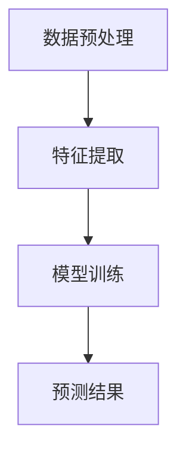
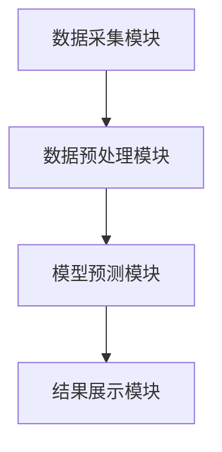
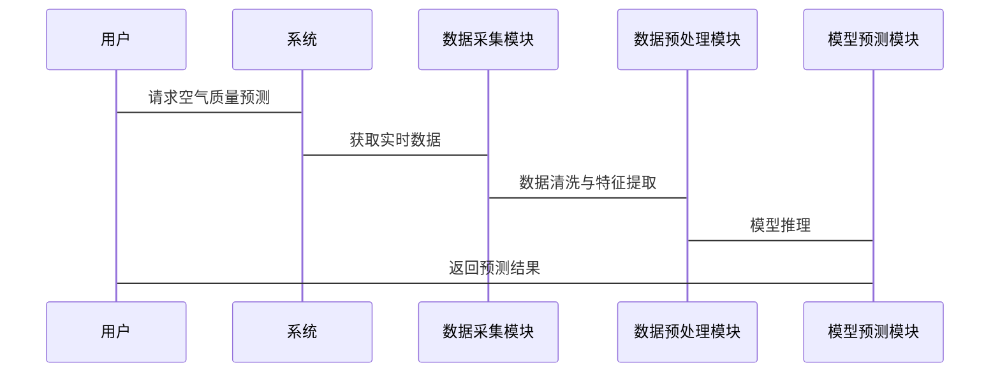

                 


# AI Agent在空气质量预测中的应用

---

## 关键词：
AI Agent, 空气质量预测, 机器学习, 深度学习, 系统架构, 实时数据处理

---

## 摘要：
空气质量预测对人类健康和环境保护至关重要。随着AI技术的发展，AI Agent在空气质量预测中展现了巨大潜力。本文详细探讨AI Agent的核心概念、算法原理、系统架构，并通过项目实战展示其应用。文章还提供最佳实践建议，帮助读者理解如何利用AI Agent提升空气质量预测的准确性和实时性。

---

## 目录

1. [背景介绍](#背景介绍)
   - 1.1 空气质量预测的背景与意义
   - 1.2 AI Agent的概念与工作原理
   - 1.3 空气质量预测中的AI Agent应用

2. [核心概念与联系](#核心概念与联系)
   - 2.1 AI Agent与空气质量预测的核心概念
   - 2.2 实体关系图与ER图

3. [算法原理与实现](#算法原理与实现)
   - 3.1 机器学习算法的选择与实现
   - 3.2 深度学习模型的应用

4. [系统架构与设计](#系统架构与设计)
   - 4.1 系统架构设计
   - 4.2 系统功能设计与交互流程

5. [项目实战](#项目实战)
   - 5.1 项目环境搭建
   - 5.2 核心代码实现与解读
   - 5.3 项目案例分析与结果展示

6. [总结与展望](#总结与展望)
   - 6.1 最佳实践与小结
   - 6.2 未来发展方向

7. [附录](#附录)
   - 术语表
   - 工具安装指南
   - 数据集信息
   - 参考文献

---

## 1. 背景介绍

### 1.1 空气质量预测的背景与意义
- **问题背景**：空气质量直接影响人类健康，尤其是PM2.5和臭氧等污染物的浓度变化。
- **问题描述**：传统预测方法依赖统计模型，存在预测精度低、实时性差的问题。
- **解决方法**：引入AI Agent，利用机器学习和深度学习提升预测精度和实时性。

### 1.2 AI Agent的概念与工作原理
- **AI Agent定义**：智能体，能够感知环境、自主决策并执行任务。
- **工作原理**：通过传感器数据输入，AI Agent利用算法处理数据，输出预测结果。

### 1.3 空气质量预测中的AI Agent应用
- **优势**：实时数据处理、高精度预测、自适应学习。
- **挑战**：数据质量、模型泛化能力、计算资源需求。

---

## 2. 核心概念与联系

### 2.1 AI Agent与空气质量预测的核心概念
| 比较维度 | AI Agent | 传统空气质量预测模型 |
|----------|-----------|----------------------|
| 数据需求 | 高 | 较低 |
| 实时性 | 高 | 较低 |
| 可扩展性 | 高 | 较低 |

### 2.2 实体关系图与ER图
```mermaid
er
actor(AI Agent, [空气质量预测系统],参与)
actor(空气质量监测站, [空气质量数据],提供)
actor(用户, [预测结果],使用)
```

---

## 3. 算法原理与实现

### 3.1 机器学习算法的选择与实现

#### 3.1.1 机器学习算法选择
- **线性回归**：用于简单线性关系预测，但不适合空气质量复杂变化。
- **随机森林**：通过集成学习提高预测精度，适合多变量数据。

#### 3.1.2 算法流程图


#### 3.1.3 代码实现
```python
import pandas as pd
from sklearn.ensemble import RandomForestRegressor
from sklearn.metrics import mean_absolute_error

# 数据加载与预处理
data = pd.read_csv('air_quality.csv')
X = data.drop('AQI', axis=1)
y = data['AQI']

# 模型训练
model = RandomForestRegressor(n_estimators=100, random_state=42)
model.fit(X, y)

# 预测与评估
预测值 = model.predict(X)
print('预测误差:', mean_absolute_error(y, 预测值))
```

### 3.2 深度学习模型的应用

#### 3.2.1 LSTM模型
- **优势**：适合时间序列数据，捕捉长期依赖关系。
- **模型结构**
  ```mermaid
  graph TD
      A[输入层] --> B[ LSTM层 ]
      B --> C[输出层]
  ```

#### 3.2.2 LSTM代码实现
```python
import tensorflow as tf
from tensorflow.keras import layers

model = tf.keras.Sequential([
    layers.LSTM(64, input_shape=(None, 12)),
    layers.Dense(1)
])
model.compile(optimizer='adam', loss='mse')
model.fit(X_train, y_train, epochs=10, batch_size=32)
```

---

## 4. 系统架构与设计

### 4.1 系统架构设计


### 4.2 系统功能设计与交互流程


---

## 5. 项目实战

### 5.1 项目环境搭建
- **工具安装**：安装Python、TensorFlow、Keras、Pandas。
- **数据集获取**：使用公开数据集，如Kaggle空气质量数据集。

### 5.2 核心代码实现与解读
```python
# 数据加载与预处理
import pandas as pd
data = pd.read_csv('air_quality.csv')
data.dropna(inplace=True)
data = data.iloc[:200]

# LSTM模型训练
from tensorflow.keras.preprocessing.sequence import pad_sequences

X = data[['PM2.5', 'PM10', 'NO2', 'CO', 'SO2']]
y = data['AQI']

X_train = pad_sequences(X.values.reshape(-1, 5), padding='post')
y_train = y.values

model = tf.keras.Sequential([
    layers.LSTM(64, input_shape=(None, 5)),
    layers.Dense(1)
])
model.compile(optimizer='adam', loss='mse')
model.fit(X_train, y_train, epochs=10, batch_size=32)
```

### 5.3 项目案例分析与结果展示
- **案例分析**：使用模型预测某区域未来24小时的AQI。
- **结果展示**：可视化预测结果与实际值对比。

---

## 6. 总结与展望

### 6.1 最佳实践与小结
- 数据质量至关重要，需进行充分预处理。
- 模型选择需根据数据特性，尝试多种算法。
- 系统架构设计要注重模块化和可扩展性。

### 6.2 未来发展方向
- **模型优化**：引入注意力机制提升预测精度。
- **多模型融合**：结合多种AI Agent技术提升预测鲁棒性。
- **实时性增强**：优化数据处理流程，提升预测速度。

---

## 7. 附录

### 术语表
- AI Agent：人工智能代理
- LSTM：长短期记忆网络
- AQI：空气质量指数

### 工具安装指南
- Python：官网下载安装
- TensorFlow：使用pip install tensorflow
- Pandas：使用pip install pandas

### 数据集信息
- 数据来源：公开空气质量数据集

### 参考文献
1. LeCun, Y., Bengio, Y., & Hinton, G. (2015). Deep learning. Nature, 521(7555), 436-444.
2. Hochreiter, S., & Schmidhuber, J. (1997). Long short-term memory. Neural computation, 9(8), 1735-1780.

---

## 作者
作者：AI天才研究院 & 禅与计算机程序设计艺术

