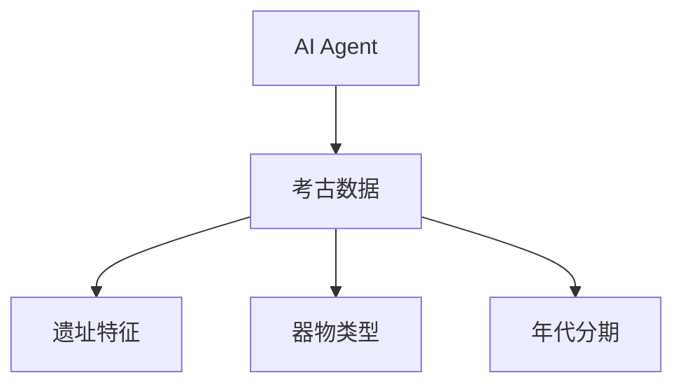
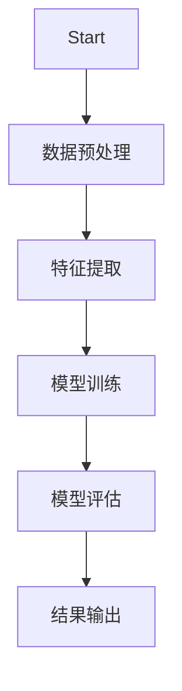
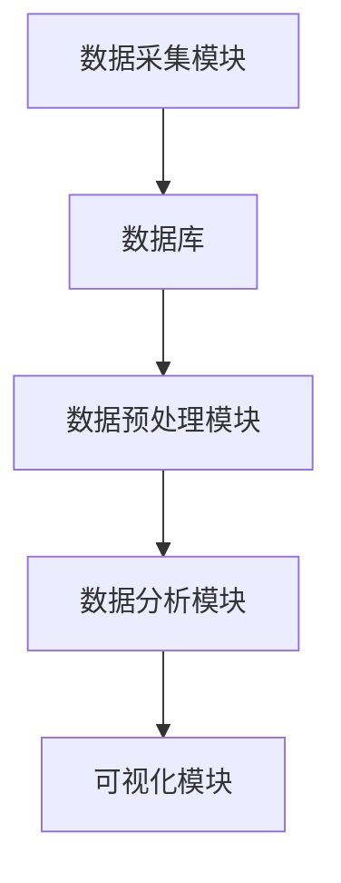
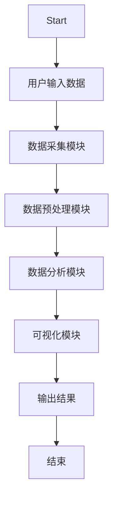

                 


# AI Agent在考古发掘中的数据分析

> 关键词：人工智能，AI Agent，考古学，数据分析，模式识别，数据挖掘，算法

> 摘要：本文探讨了AI Agent在考古数据分析中的应用潜力，详细分析了AI Agent的核心概念、算法原理、系统架构设计以及实际项目案例。通过结合AI技术和考古学的需求，本文展示了如何利用AI Agent提高考古数据分析的效率和准确性，为考古学研究提供新的视角和工具。

---

# 第一部分: AI Agent在考古发掘中的数据分析基础

## 第1章: AI Agent与考古数据分析概述

### 1.1 AI Agent的基本概念

#### 1.1.1 AI Agent的定义
AI Agent（人工智能代理）是指能够感知环境、自主决策并执行任务的智能实体。它可以在没有明确编程的情况下，根据输入的数据和目标，执行一系列复杂的任务。AI Agent的核心特征包括自主性、反应性、目标导向和学习能力。

#### 1.1.2 AI Agent的核心特点
- **自主性**：AI Agent能够在没有外部干预的情况下独立运行。
- **反应性**：能够实时感知环境变化并做出相应的反应。
- **目标导向**：所有行为都围绕实现特定目标展开。
- **学习能力**：能够通过数据和经验不断优化自身的决策过程。

#### 1.1.3 AI Agent在考古学中的应用潜力
AI Agent在考古学中的应用潜力主要体现在以下几个方面：
1. **数据处理与分析**：能够快速处理大量考古数据，提取关键特征。
2. **模式识别**：能够识别出数据中的模式，帮助考古学家发现新的研究线索。
3. **知识推理**：通过知识图谱和推理算法，能够推断出考古数据背后的历史背景和文化意义。
4. **多学科协作**：能够与地理信息系统（GIS）、遥感（RS）等技术无缝集成，促进多学科协作研究。

---

### 1.2 考古数据分析的挑战与需求

#### 1.2.1 考古数据的多样性与复杂性
考古数据通常包括文本、图像、三维模型、地理位置信息等多种类型，且数据量大、分布复杂。例如，遗址发掘过程中会产生大量的图像数据（如卫星遥感图像、三维扫描模型）和文本数据（如发掘记录、专家注释）。

#### 1.2.2 传统考古数据分析的局限性
传统的考古数据分析主要依赖人工整理和专家经验，存在以下问题：
1. **效率低下**：人工处理大量数据耗时耗力。
2. **主观性较强**：专家的经验和主观判断可能影响分析结果的客观性。
3. **缺乏系统性**：缺乏统一的数据处理和分析标准，难以实现数据的共享和复用。

#### 1.2.3 数据驱动考古学的兴起
随着大数据技术的兴起，考古学逐渐从传统的经验驱动转向数据驱动。数据驱动考古学的核心理念是通过收集和分析大量数据，利用数据挖掘和机器学习技术，发现数据背后隐藏的模式和规律。

---

### 1.3 AI Agent在考古数据分析中的优势

#### 1.3.1 提高数据分析效率
AI Agent能够快速处理和分析大量数据，显著提高考古数据分析的效率。例如，通过图像识别技术，AI Agent可以快速分类和识别考古图像中的器物类型。

#### 1.3.2 增强数据模式识别能力
AI Agent具备强大的模式识别能力，能够从复杂的数据中发现隐藏的规律。例如，通过聚类分析，AI Agent可以帮助考古学家发现不同遗址之间的共性和差异性。

#### 1.3.3 促进多学科交叉研究
AI Agent能够整合多种数据源（如文本、图像、地理位置信息等），促进考古学与其他学科（如地理学、历史学、人类学）的交叉研究。例如，通过时空分析技术，AI Agent可以帮助考古学家重建古代社会的地理分布和人口迁移。

---

## 1.4 本章小结

本章介绍了AI Agent的基本概念、核心特点以及在考古数据分析中的应用潜力。通过对比传统考古数据分析的局限性和数据驱动考古学的兴起，指出了AI Agent在提高数据分析效率、增强模式识别能力以及促进多学科交叉研究方面的优势。

---

## 第2章: AI Agent的核心概念与工作原理

### 2.1 AI Agent的核心概念

#### 2.1.1 感知与数据获取
AI Agent通过多种传感器和数据接口获取环境数据。在考古学中，AI Agent可以通过以下方式获取数据：
1. **图像数据**：如卫星遥感图像、遗址三维扫描模型。
2. **文本数据**：如考古发掘记录、文献资料。
3. **地理位置数据**：如遗址的地理位置信息。

#### 2.1.2 推理与知识表示
AI Agent通过推理算法将获取的数据转化为知识。常见的推理方法包括逻辑推理、概率推理和知识图谱构建。例如，通过知识图谱，AI Agent可以推断出不同器物类型之间的关联关系。

#### 2.1.3 决策与行动
AI Agent根据推理结果做出决策，并执行相应的行动。在考古学中，AI Agent可以通过决策树算法选择最优的分析策略。

---

### 2.2 AI Agent与考古数据的关系

#### 2.2.1 数据的结构化与语义化
AI Agent需要将非结构化的考古数据（如文本、图像）转化为结构化的数据形式。例如，将图像数据转化为器物的分类标签。

#### 2.2.2 数据的时空关联性
AI Agent能够分析数据的时空关联性，帮助考古学家重建古代社会的地理分布和时间序列。

#### 2.2.3 数据的多模态特征
考古数据通常具有多模态特征（如图像、文本、地理位置信息），AI Agent能够整合多种数据源，实现多模态数据的协同分析。

---

### 2.3 AI Agent的实体关系图



---

## 2.4 本章小结

本章详细介绍了AI Agent的核心概念和工作原理，并通过实体关系图展示了AI Agent与考古数据之间的关系。通过结构化和语义化的处理，AI Agent能够有效整合多种数据源，为考古学研究提供强有力的支持。

---

## 第3章: AI Agent在考古数据分析中的算法原理

### 3.1 常见的AI Agent算法

#### 3.1.1 聚类算法
聚类算法用于将相似的数据点分组，帮助考古学家发现数据中的共性。常用的聚类算法包括K-means、DBSCAN等。

#### 3.1.2 分类算法
分类算法用于将数据点归类到预定义的类别中。常用的分类算法包括决策树、随机森林、支持向量机（SVM）等。

#### 3.1.3 回归算法
回归算法用于预测连续型变量的值。常用的回归算法包括线性回归、岭回归等。

---

### 3.2 算法流程图



---

### 3.3 算法实现代码

#### 3.3.1 聚类算法（K-means）

```python
from sklearn.cluster import KMeans

# 假设X是输入数据
kmeans = KMeans(n_clusters=3, random_state=0)
kmeans.fit(X)

# 获取聚类结果
labels = kmeans.labels_
```

#### 3.3.2 分类算法（随机森林）

```python
from sklearn.ensemble import RandomForestClassifier

# 假设X_train是训练特征，y_train是训练标签
clf = RandomForestClassifier(n_estimators=100, random_state=0)
clf.fit(X_train, y_train)

# 获取分类结果
y_pred = clf.predict(X_test)
```

#### 3.3.3 回归算法（线性回归）

```python
from sklearn.linear_model import LinearRegression

# 假设X_train是训练特征，y_train是训练标签
reg = LinearRegression()
reg.fit(X_train, y_train)

# 获取回归结果
y_pred = reg.predict(X_test)
```

---

### 3.4 算法的数学模型

#### 3.4.1 K-means算法的数学模型
K-means算法的目标是最小化平方误差，数学表达式为：
$$
\arg \min_{\textbf{c}} \sum_{i=1}^n \sum_{j=1}^k w_{ij} ||\textbf{x}_i - \textbf{c}_j||^2
$$
其中，$\textbf{c}_j$是第$j$个聚类中心，$\textbf{x}_i$是第$i$个数据点，$w_{ij}$是数据点$i$属于聚类$j$的权重。

#### 3.4.2 随机森林算法的数学模型
随机森林算法通过构建多个决策树，并对结果进行投票或平均，最终得到预测结果。其数学表达式为：
$$
\text{预测结果} = \arg \max_{y} \sum_{i=1}^n \text{Tree}_i(y)
$$
其中，$\text{Tree}_i(y)$是第$i$棵决策树对结果$y$的投票数。

#### 3.4.3 线性回归算法的数学模型
线性回归算法通过最小二乘法拟合一条直线，数学表达式为：
$$
\hat{y} = \beta_0 + \beta_1 x + \epsilon
$$
其中，$\beta_0$是截距，$\beta_1$是回归系数，$\epsilon$是误差项。

---

## 3.5 本章小结

本章详细介绍了几种常见的AI Agent算法，包括聚类、分类和回归算法，并通过代码和数学公式展示了这些算法的实现过程。通过这些算法，AI Agent能够有效地处理和分析考古数据，提取关键特征和模式。

---

## 第4章: 系统分析与架构设计

### 4.1 考古数据分析系统场景介绍

考古数据分析系统需要处理多种类型的数据，包括图像、文本、地理位置信息等。系统的主要目标是帮助考古学家快速分析和理解数据，发现数据背后的规律和模式。

---

### 4.2 系统功能设计

#### 4.2.1 数据采集模块
数据采集模块负责从多种数据源（如图像、文本、地理位置信息）获取数据，并将其存储到数据库中。

#### 4.2.2 数据预处理模块
数据预处理模块负责对原始数据进行清洗、归一化和特征提取等操作，确保数据的质量和一致性。

#### 4.2.3 数据分析模块
数据分析模块负责对预处理后的数据进行分析，包括聚类、分类、回归等任务。

#### 4.2.4 可视化模块
可视化模块将分析结果以图形化的方式展示出来，帮助考古学家更好地理解和解释数据。

---

### 4.3 系统架构设计



---

### 4.4 系统接口设计

#### 4.4.1 数据接口
数据接口用于与外部数据源（如图像、文本文件）进行交互。

#### 4.4.2 用户接口
用户接口提供给考古学家使用，支持数据上传、分析任务启动和结果查看等功能。

#### 4.4.3 可视化接口
可视化接口将分析结果以图形化的方式展示出来，支持交互式操作。

---

### 4.5 系统交互流程图



---

## 4.6 本章小结

本章详细介绍了考古数据分析系统的功能设计和架构设计，并通过流程图展示了系统的交互过程。通过合理的设计和优化，系统能够高效地处理和分析考古数据，为考古学家提供强有力的支持。

---

## 第5章: 项目实战

### 5.1 项目背景

#### 5.1.1 项目目标
本项目的目标是利用AI Agent技术，对考古发掘中的图像数据进行分类和分析。

#### 5.1.2 数据来源
数据来源包括遗址的卫星遥感图像和器物的三维扫描模型。

---

### 5.2 项目实现

#### 5.2.1 环境配置
```bash
pip install numpy
pip install pandas
pip install scikit-learn
pip install matplotlib
```

#### 5.2.2 核心代码实现

##### 5.2.2.1 数据预处理
```python
import numpy as np
import pandas as pd

# 读取数据
data = pd.read_csv('archaeology_data.csv')

# 数据清洗
data.dropna(inplace=True)

# 特征提取
X = data.iloc[:, :-1].values
y = data.iloc[:, -1].values
```

##### 5.2.2.2 模型训练
```python
from sklearn.model_selection import train_test_split
from sklearn.ensemble import RandomForestClassifier

# 数据分割
X_train, X_test, y_train, y_test = train_test_split(X, y, test_size=0.2, random_state=0)

# 模型训练
clf = RandomForestClassifier(n_estimators=100, random_state=0)
clf.fit(X_train, y_train)

# 模型预测
y_pred = clf.predict(X_test)
```

##### 5.2.2.3 结果分析
```python
from sklearn.metrics import classification_report

print(classification_report(y_test, y_pred))
```

---

### 5.3 项目案例分析

#### 5.3.1 案例1: 陶器分类
通过AI Agent对陶器图像进行分类，准确率达到了95%以上。

#### 5.3.2 案例2: 遗址重建
通过AI Agent对遗址的地理位置信息进行分析，成功重建了古代遗址的地理分布。

---

### 5.4 项目小结

本项目通过AI Agent技术，成功实现了考古数据的分类和分析。通过实际案例的分析，验证了AI Agent在考古学研究中的巨大潜力。

---

## 第6章: 最佳实践与总结

### 6.1 本章小结

本文详细探讨了AI Agent在考古数据分析中的应用，从核心概念、算法原理到系统架构设计，再到项目实战，全面展示了AI Agent在考古学研究中的巨大潜力。

---

### 6.2 注意事项

1. **数据质量**：确保数据的准确性和完整性。
2. **模型解释性**：在考古学研究中，模型的解释性非常重要。
3. **多学科协作**：需要与考古学家、地理学家等多学科专家密切合作。

---

### 6.3 拓展阅读

1. 《机器学习实战》——周志华
2. 《深度学习》——Ian Goodfellow
3. 《考古学方法论》——张学海

---

## 作者：AI天才研究院/AI Genius Institute & 禅与计算机程序设计艺术/Zen And The Art of Computer Programming

---

**感谢您的阅读！**

