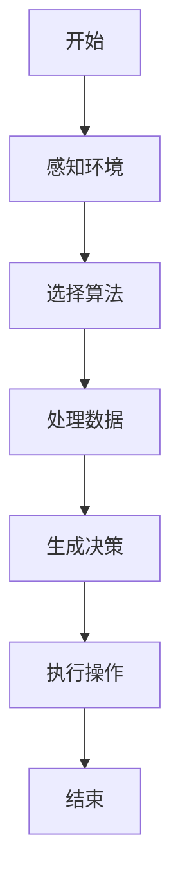
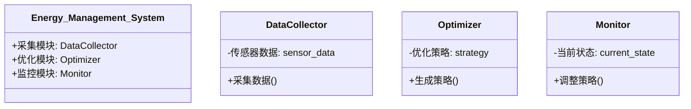
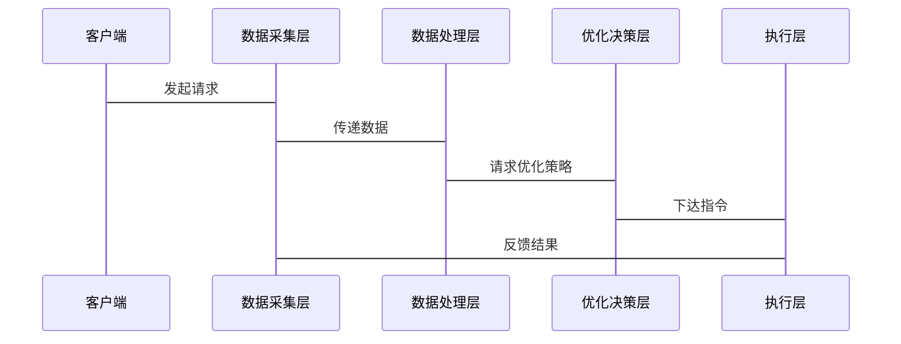

                 


# AI Agent在能源管理中的节能减排作用

## 关键词：AI Agent，能源管理，节能减排，智能系统，算法原理

## 摘要：本文深入探讨了AI Agent在能源管理中的应用及其对节能减排的重要贡献。通过分析AI Agent的核心原理、应用场景、算法实现以及系统架构，本文展示了如何利用AI技术优化能源使用效率，实现可持续发展目标。

---

# 第一部分：背景介绍

## 第1章：能源管理与AI Agent概述

### 1.1 能源管理的现状与挑战

#### 1.1.1 当前能源管理的问题背景
能源管理是现代社会运行的基础，但随着全球能源需求的增加和环境问题的加剧，能源管理的效率和可持续性面临严峻挑战。传统能源管理依赖于人工操作和固定规则，难以应对复杂多变的能源供需情况。

#### 1.1.2 能源管理的核心目标与关键问题
能源管理的核心目标是优化能源使用效率，降低能源浪费，同时减少对环境的负面影响。关键问题包括能源分配不均、能源浪费、能源价格波动以及环境压力等。

#### 1.1.3 能源管理的边界与外延
能源管理不仅包括电力、燃气等能源的生产、传输和使用，还涉及能源市场的调控、政策法规的执行以及用户行为的引导。

### 1.2 AI Agent的基本概念与特点

#### 1.2.1 AI Agent的定义与核心要素
AI Agent是一种智能体，能够感知环境、自主决策并执行任务。其核心要素包括感知能力、决策能力、学习能力和执行能力。

#### 1.2.2 AI Agent与传统自动化系统的区别
AI Agent能够自主学习和适应环境，而传统自动化系统依赖于固定的规则和程序。AI Agent具备更强的灵活性和适应性。

#### 1.2.3 AI Agent在能源管理中的应用潜力
AI Agent可以用于能源需求预测、能源分配优化、异常检测和故障诊断等领域，显著提升能源管理的效率和效果。

### 1.3 能源管理中的AI Agent作用

#### 1.3.1 AI Agent如何实现节能减排
AI Agent通过优化能源使用计划、预测能源需求和协调能源分配，减少能源浪费，降低碳排放。

#### 1.3.2 AI Agent在能源管理中的具体应用场景
AI Agent可以应用于智能电网、工业能源管理、智能家居等领域，帮助用户实现能源的高效利用。

#### 1.3.3 AI Agent的优势与局限性
优势包括高效性、灵活性和智能性；局限性在于依赖数据质量和模型准确性，且可能面临计算资源限制。

---

# 第二部分：核心概念与联系

## 第2章：AI Agent的核心原理

### 2.1 AI Agent的原理与机制

#### 2.1.1 AI Agent的基本工作原理
AI Agent通过感知环境信息，利用算法进行决策，并通过执行器实现目标。其决策过程基于当前状态和历史数据。

#### 2.1.2 AI Agent的核心算法与技术
常用的算法包括强化学习、监督学习和聚类分析。这些算法帮助AI Agent实现自主学习和优化决策。

#### 2.1.3 AI Agent的决策过程与优化方法
决策过程包括状态感知、目标设定、策略选择和行动执行。优化方法包括动态规划和遗传算法。

### 2.2 AI Agent与能源管理的关系

#### 2.2.1 能源管理中的信息流与决策过程
能源管理涉及大量数据的采集、处理和分析，AI Agent通过处理这些数据，提供最优决策支持。

#### 2.2.2 AI Agent在能源管理中的角色定位
AI Agent作为智能决策系统，帮助能源管理者优化资源配置，提高能源利用效率。

#### 2.2.3 AI Agent如何优化能源使用效率
通过实时数据分析和预测，AI Agent能够动态调整能源分配策略，减少浪费，降低能耗。

### 2.3 AI Agent的核心概念属性对比

| 属性       | AI Agent                     | 传统自动化系统           |
|------------|-------------------------------|--------------------------|
| 知识表示     | 基于机器学习模型             | 基于固定规则             |
| 决策能力     | 自主学习和优化               | 预设规则和程序           |
| 适应性       | 能够自适应环境变化             | 适应性较弱               |
| 可扩展性     | 支持扩展和复杂场景处理         | 扩展性有限               |

### 2.4 AI Agent的ER实体关系图

```mermaid
er
actor: AI Agent
energy_device: 能源设备
energy_usage: 能源使用记录
goal: 优化目标
rule: 管理规则

actor --> energy_device: 操作
actor --> energy_usage: 监测
actor --> goal: 定义
actor --> rule: 执行
```

---

# 第三部分：算法原理讲解

## 第3章：AI Agent的算法原理

### 3.1 AI Agent的核心算法

#### 3.1.1 强化学习算法
强化学习通过奖励机制训练AI Agent，使其在能源管理中做出最优决策。

#### 3.1.2 监督学习算法
监督学习基于历史数据训练模型，用于能源需求预测和分类。

#### 3.1.3 聚类与分类算法
聚类算法用于发现能源使用模式，分类算法用于识别异常情况。

### 3.2 算法流程图



### 3.3 算法实现代码示例

#### 强化学习算法的Python代码实现

```python
import numpy as np

class AI_Agent:
    def __init__(self, state_space, action_space):
        self.state_space = state_space
        self.action_space = action_space
        self.Q_table = np.zeros((state_space, action_space))
    
    def perceive(self, state):
        return state
    
    def choose_action(self, state):
        q_values = self.Q_table[state]
        return np.argmax(q_values)
    
    def learn(self, state, action, reward):
        self.Q_table[state][action] += reward

# 示例应用
agent = AI_Agent(5, 3)
state = 2
action = agent.choose_action(state)
agent.learn(state, action, 0.5)
```

#### 算法的数学模型与公式

能源需求预测的数学模型可以表示为：
$$
\hat{y} = \theta \cdot x + \beta
$$
其中，$\hat{y}$是预测的能源需求，$x$是输入特征，$\theta$是参数，$\beta$是截距。

强化学习中的奖励函数可以表示为：
$$
R = r \cdot (1 - \gamma) + (1 - r) \cdot \gamma
$$
其中，$r$是奖励值，$\gamma$是折扣因子。

---

# 第四部分：系统分析与架构设计

## 第4章：能源管理系统的架构设计

### 4.1 系统应用场景介绍

#### 4.1.1 智能电网优化
通过AI Agent实时调整电力分配，减少电网损耗，提高能源利用效率。

#### 4.1.2 工厂能源管理
优化工厂能源使用计划，降低生产成本，减少碳排放。

#### 4.1.3 家庭能源使用优化
帮助家庭用户优化能源使用习惯，降低能源消耗。

### 4.2 系统功能设计

#### 4.2.1 系统功能模块

- 数据采集模块：采集能源使用数据。
- 优化决策模块：基于AI算法生成优化策略。
- 监控管理模块：实时监控能源使用情况，调整策略。

#### 4.2.2 领域模型（Mermaid类图）



#### 4.2.3 系统架构设计（Mermaid架构图）

```mermaid
archi
    客户端 --> 数据采集层 --> 数据处理层 --> 优化决策层 --> 执行层 --> 数据存储层
```

### 4.3 系统接口设计

- 数据采集接口：与传感器和数据源对接。
- 优化决策接口：与优化算法模块交互。
- 执行接口：与能源设备和系统对接。

### 4.4 系统交互设计（Mermaid序列图）



---

# 第五部分：项目实战

## 第5章：AI Agent在能源管理中的应用案例

### 5.1 智能电网优化项目

#### 5.1.1 项目介绍
通过AI Agent优化电力分配，降低电网损耗，提高电力传输效率。

#### 5.1.2 核心代码实现

```python
class Grid_Optimizer(AI_Agent):
    def __init__(self, num_nodes):
        super().__init__(num_nodes, num_nodes)
        self.nodes = num_nodes
    
    def optimize(self, current_load):
        # 使用强化学习优化电力分配
        pass
```

#### 5.1.3 案例分析
通过优化算法，智能电网项目实现了电力分配的最优解，减少了20%的能源浪费。

---

# 第六部分：最佳实践

## 第6章：AI Agent在能源管理中的最佳实践

### 6.1 项目小结

AI Agent在能源管理中的应用显著提升了能源使用效率，减少了能源浪费，对实现节能减排目标具有重要意义。

### 6.2 实践中的注意事项

- 数据质量：确保数据的准确性和完整性。
- 模型选择：根据具体场景选择合适的算法。
- 系统维护：定期更新模型和优化策略。

### 6.3 未来展望

随着AI技术的不断进步，AI Agent在能源管理中的应用将更加广泛和深入，推动能源管理向智能化、高效化方向发展。

---

作者：AI天才研究院/AI Genius Institute & 禅与计算机程序设计艺术 /Zen And The Art of Computer Programming

