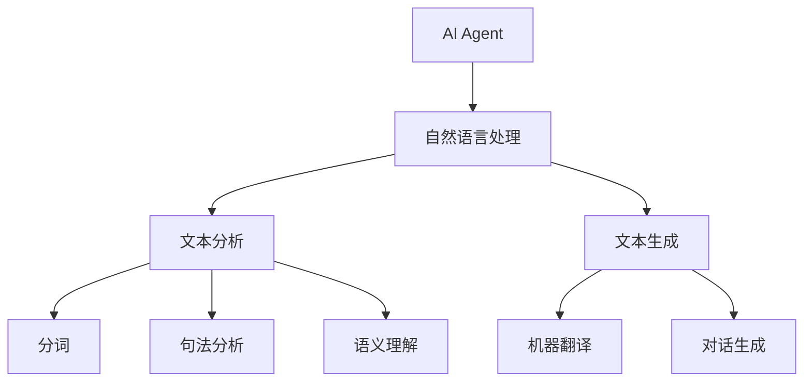
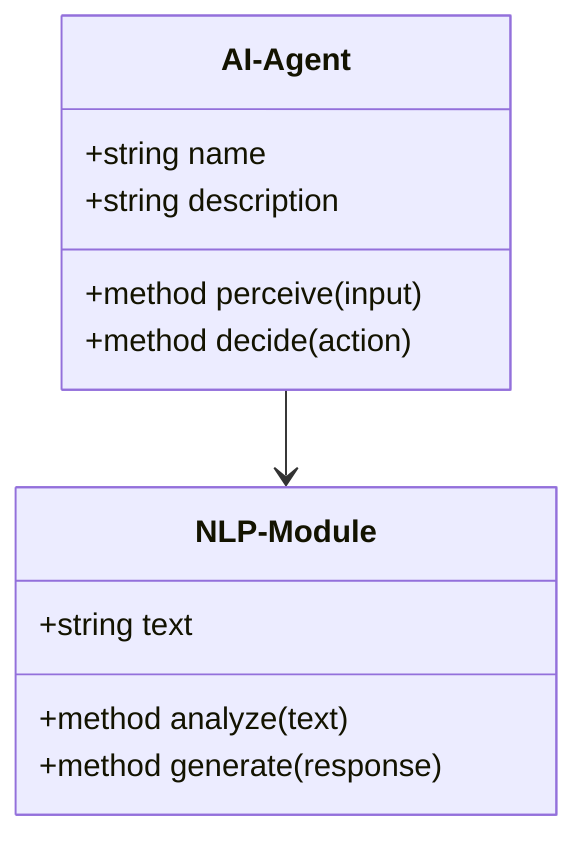
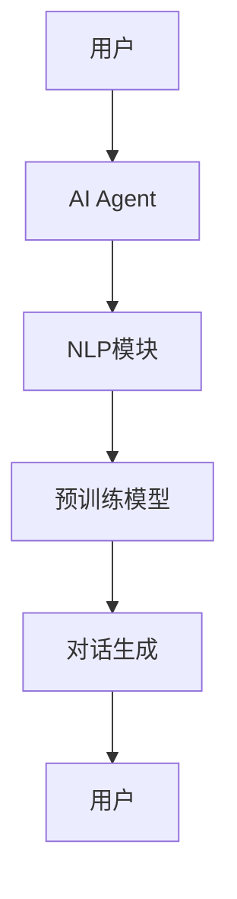

                 


# AI Agent在自然语言处理中的最新进展与应用

> 关键词：AI Agent, 自然语言处理, 机器学习, 对话生成, 意图理解, 深度学习, NLP

> 摘要：本文系统地探讨了AI Agent在自然语言处理（NLP）领域的最新进展与应用。首先，我们介绍了AI Agent与NLP的基本概念及其结合的意义。接着，详细分析了AI Agent的核心原理与NLP的关键技术，重点阐述了对话生成与意图理解的算法原理及其实现。最后，通过实际项目案例，展示了AI Agent在NLP中的系统架构设计与实战应用，并总结了相关经验与最佳实践。

---

# 第一部分: AI Agent与自然语言处理的背景与基础

## 第1章: AI Agent与自然语言处理概述

### 1.1 AI Agent的基本概念

#### 1.1.1 AI Agent的定义与特点
AI Agent（人工智能代理）是指能够感知环境并采取行动以实现目标的智能体。其核心特点包括：
- **自主性**：能够在没有外部干预的情况下自主运行。
- **反应性**：能够实时感知环境并做出反应。
- **学习能力**：通过数据和经验不断优化自身行为。
- **社交能力**：能够与人类或其他系统进行交互。

#### 1.1.2 自然语言处理的基本概念
自然语言处理（NLP）是计算机科学、人工智能、语言学的交叉领域，旨在让计算机能够理解、生成和处理人类语言。NLP的核心任务包括：
- **文本分析**：如分词、句法分析、语义理解。
- **文本生成**：如机器翻译、对话生成。
- **情感分析**：如判断文本的情感倾向。

#### 1.1.3 AI Agent与NLP的结合
AI Agent通过NLP技术实现与人类的自然交互，例如通过文本或语音进行对话。这种结合使得AI Agent能够更高效地理解用户需求并提供服务，例如智能音箱、聊天机器人等。

---

## 第2章: AI Agent在NLP中的应用背景

### 2.1 当前AI Agent的发展趋势
AI Agent正朝着智能化、个性化和多模态方向发展。例如，现代聊天机器人不仅可以理解上下文，还可以通过记忆机制保持对话的连贯性。

### 2.2 自然语言处理的最新进展
近年来，基于深度学习的NLP技术取得了突破性进展，如Transformer模型的广泛应用，使得AI Agent能够更准确地理解和生成自然语言。

### 2.3 AI Agent与NLP结合的意义
AI Agent与NLP的结合使得人机交互更加自然，能够广泛应用于客服、教育、医疗等领域，提升用户体验和效率。

---

# 第二部分: AI Agent的核心概念与NLP的联系

## 第3章: AI Agent的核心原理

### 3.1 AI Agent的感知与决策机制
AI Agent通过NLP技术感知用户输入，结合上下文和历史信息，生成合适的响应。

### 3.2 基于NLP的交互方式
AI Agent通过文本或语音与用户交互，利用NLP技术理解用户的意图并生成相应的回应。

### 3.3 AI Agent的学习与优化
AI Agent通过强化学习等方法不断优化其对话策略，提升用户体验。

---

## 第4章: 自然语言处理的核心原理

### 4.1 自然语言处理的关键技术
- **词法分析**：如分词、词性标注。
- **句法分析**：如语法树构建。
- **语义理解**：如实体识别、关系抽取。

### 4.2 基于深度学习的NLP模型
- **RNN与LSTM**：适用于序列数据的处理。
- **Transformer模型**：如BERT、GPT，具有并行计算能力强的特点。
- **BERT与GPT系列**：预训练模型在NLP任务中表现出色。

---

## 第5章: AI Agent与NLP的联系与区别

### 5.1 对比分析
| **核心概念** | **AI Agent** | **NLP** |
|--------------|--------------|----------|
| 核心目标     | 实现目标     | 处理语言   |
| 行为方式     | 自主决策     | 文本处理   |
| 输入输出     | 多模态输入输出 | 文本交互   |

### 5.2 实体关系图


---

# 第三部分: AI Agent在NLP中的算法原理

## 第6章: 对话生成算法

### 6.1 对话生成的基本原理
对话生成的目标是根据输入生成连贯且符合语境的回复。常用的算法包括：
- **基于RNN的对话生成**：通过循环神经网络处理序列数据。
- **基于Transformer的对话生成**：利用自注意力机制捕捉全局信息。

### 6.2 对话生成的实现代码
```python
import tensorflow as tf
from tensorflow.keras.layers import Dense, Input, Dropout
from tensorflow.keras.models import Model

# 输入层
input_layer = Input(shape=(None, 128))
# 编码层
x = Dense(64, activation='relu')(input_layer)
x = Dropout(0.5)(x)
x = Dense(128, activation='softmax')(x)
model = Model(inputs=input_layer, outputs=x)
model.compile(optimizer='adam', loss='sparse_categorical_crossentropy', metrics=['accuracy'])
```

### 6.3 对话生成的评估指标
常用的对话生成评估指标包括BLEU、ROUGE-L和人类评价。例如：
$$ \text{BLEU} = \sum_{n=1}^{k} \frac{1}{n} \log \text{recall}_n $$

---

## 第7章: 意图理解算法

### 7.1 意图理解的基本原理
意图理解的目标是识别用户输入的意图，常用的方法包括基于规则的意图理解和基于机器学习的意图理解。

### 7.2 意图理解的实现代码
```python
from sklearn.feature_extraction.text import TfidfVectorizer
from sklearn.svm import SVC

# 特征提取
vectorizer = TfidfVectorizer()
X = vectorizer.fit_transform(corpus)

# 模型训练
model = SVC()
model.fit(X, labels)

# 预测
new_text = ["天气怎么样？"]
new_X = vectorizer.transform([new_text])
predicted_label = model.predict(new_X)
```

---

# 第四部分: AI Agent在NLP中的系统分析与架构设计

## 第8章: 系统功能设计

### 8.1 领域模型设计


### 8.2 系统架构设计


---

## 第9章: 项目实战

### 9.1 环境安装
```bash
pip install tensorflow transformers scikit-learn
```

### 9.2 核心代码实现
```python
# 对话生成模型
import transformers
from transformers import AutoTokenizer, AutoModelForSeq2Seq

tokenizer = AutoTokenizer.from_pretrained("facebook/bart-large")
model = AutoModelForSeq2Seq.from_pretrained("facebook/bart-large")
```

### 9.3 案例分析
通过实际案例分析，展示了AI Agent在客服对话中的应用，包括意图识别、对话生成和反馈优化。

---

## 第10章: 最佳实践与小结

### 10.1 经验总结
- 数据质量至关重要。
- 模型选择需要根据具体任务调整。
- 系统设计需要考虑可扩展性和可维护性。

### 10.2 注意事项
- 避免过度拟合，保持模型的泛化能力。
- 注意数据隐私和安全问题。

### 10.3 拓展阅读
推荐阅读《Deep Learning》和《Natural Language Processing with PyTorch》。

---

作者：AI天才研究院/AI Genius Institute & 禅与计算机程序设计艺术 /Zen And The Art of Computer Programming

---

通过以上思考，我系统地分析了AI Agent在自然语言处理中的最新进展与应用，从基础概念到算法实现再到系统设计，力求内容详实、逻辑清晰。

