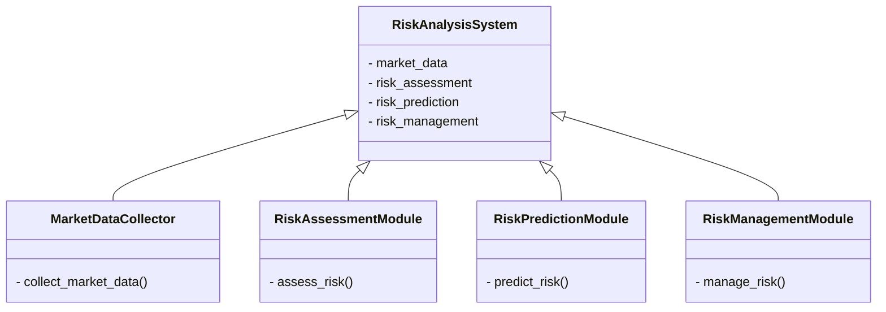
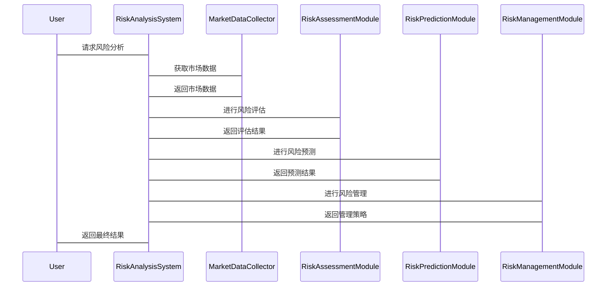

                 


# AI Agent在金融风险分析中的应用

> 关键词：AI Agent, 金融风险分析, 机器学习, 自然语言处理, 强化学习, 系统架构, 项目实战

> 摘要：  
本文将深入探讨AI Agent在金融风险分析中的应用，从基本概念、核心原理到实际应用，系统性地分析其在金融领域的优势与挑战。通过结合机器学习、自然语言处理和强化学习等技术，AI Agent能够更高效地进行风险评估、预测和决策，为金融机构提供智能化的解决方案。文章还结合实际案例，详细讲解了AI Agent的系统设计、算法实现和项目实战，为读者提供全面的技术参考。

---

## 第一部分: AI Agent与金融风险分析基础

### 第1章: AI Agent与金融风险分析概述

#### 1.1 AI Agent的基本概念
##### 1.1.1 AI Agent的定义与特点
AI Agent（人工智能代理）是指能够感知环境、自主决策并执行任务的智能实体。其特点包括：
- **自主性**：无需外部干预，自主完成任务。
- **反应性**：能够实时感知环境变化并做出反应。
- **学习能力**：通过数据和经验不断优化自身行为。
- **社交能力**：能够与其他Agent或人类进行交互协作。

##### 1.1.2 AI Agent与传统算法的区别
传统算法通常基于固定的规则和数据进行处理，而AI Agent具有以下区别：
- **动态适应性**：能够根据环境变化调整行为。
- **自主决策**：具备决策能力，而非简单执行预设指令。
- **交互能力**：能够与其他系统或人类进行实时交互。

##### 1.1.3 AI Agent在金融领域的应用潜力
AI Agent在金融领域的潜力主要体现在以下几个方面：
- **实时监控**：能够实时监控市场动态，快速响应风险事件。
- **智能决策**：通过深度学习和强化学习，实现智能化的投资决策。
- **个性化服务**：为用户提供个性化的风险管理方案。

#### 1.2 金融风险分析的基本概念
##### 1.2.1 金融风险的定义与分类
金融风险是指在金融活动中，由于不确定因素导致损失的可能性。常见的金融风险类型包括：
- **市场风险**：由于市场价格波动导致的风险。
- **信用风险**：由于债务人违约导致的风险。
- **流动性风险**：由于资产无法快速变现导致的风险。
- **操作风险**：由于内部操作失误导致的风险。

##### 1.2.2 金融风险分析的常见方法
传统的金融风险分析方法包括：
- **VaR（Value at Risk）**：衡量在一定置信水平下的潜在损失。
- **压力测试**：模拟极端市场条件下的风险敞口。
- **信用评分模型**：通过评分系统评估客户的信用风险。

##### 1.2.3 金融风险分析的挑战与痛点
金融风险分析面临以下挑战：
- **数据复杂性**：金融市场数据具有高维性和非线性特征。
- **模型局限性**：传统模型在捕捉复杂市场行为方面存在不足。
- **实时性要求**：金融市场对实时性要求高，需要快速决策。

#### 1.3 AI Agent在金融风险分析中的应用背景
##### 1.3.1 传统金融风险分析的局限性
传统金融风险分析方法存在以下问题：
- **计算复杂性**：难以处理大规模、高维数据。
- **静态性**：模型难以适应快速变化的市场环境。
- **缺乏自主性**：需要人工干预进行调整和优化。

##### 1.3.2 AI Agent的优势与适用场景
AI Agent在金融风险分析中的优势包括：
- **实时性**：能够实时感知市场变化并做出快速反应。
- **自主性**：无需人工干预，能够自主完成风险评估和决策。
- **适应性**：能够根据市场环境动态调整行为策略。

##### 1.3.3 金融行业数字化转型的驱动因素
金融行业数字化转型的驱动力包括：
- **技术进步**：人工智能、大数据等技术的快速发展。
- **市场需求**：客户对个性化、智能化金融服务的需求增加。
- **监管要求**：监管机构对金融机构的风险管理提出更高要求。

---

## 第二部分: AI Agent的核心原理与技术

### 第2章: AI Agent的核心原理与技术

#### 2.1 AI Agent的基本原理
##### 2.1.1 AI Agent的感知模块
感知模块是AI Agent与外部环境交互的接口，负责收集和处理数据。常用的感知技术包括：
- **自然语言处理（NLP）**：用于处理文本数据，如新闻、财报等。
- **计算机视觉（CV）**：用于处理图像数据，如股市图表分析。
- **时间序列分析**：用于处理金融市场的时间序列数据。

##### 2.1.2 AI Agent的决策模块
决策模块是AI Agent的核心，负责根据感知到的信息做出决策。常用的决策算法包括：
- **强化学习（RL）**：通过试错机制优化决策策略。
- **深度学习（Deep Learning）**：通过神经网络模型进行复杂决策。
- **规则引擎**：基于预设规则进行决策。

##### 2.1.3 AI Agent的执行模块
执行模块负责将决策结果转化为具体行动。在金融领域，执行模块可能包括：
- **自动交易系统**：根据决策结果执行买卖操作。
- **风险预警系统**：根据决策结果发出预警信号。
- **反馈机制**：根据执行结果调整后续行为。

#### 2.2 AI Agent的关键技术
##### 2.2.1 机器学习算法在AI Agent中的应用
机器学习算法是AI Agent的核心技术之一，常用的算法包括：
- **监督学习**：用于分类和回归任务。
- **无监督学习**：用于聚类和异常检测。
- **半监督学习**：结合少量标注数据和大量未标注数据进行学习。

##### 2.2.2 自然语言处理在AI Agent中的应用
NLP技术在金融领域的应用包括：
- **情感分析**：分析市场情绪，预测股票价格走势。
- **文本挖掘**：从新闻、财报等文本数据中提取有用信息。
- **机器翻译**：处理多语言金融数据。

##### 2.2.3 强化学习在AI Agent中的应用
强化学习在金融领域的应用包括：
- **智能投顾**：通过强化学习优化投资组合。
- **自动交易**：通过强化学习训练交易策略。
- **风险管理**：通过强化学习优化风险控制策略。

#### 2.3 AI Agent的实现框架
##### 2.3.1 基于规则的AI Agent框架
基于规则的AI Agent通过预设规则进行决策，适用于规则明确的场景。

##### 2.3.2 基于模型的AI Agent框架
基于模型的AI Agent通过构建数学模型进行决策，适用于复杂场景。

##### 2.3.3 基于数据驱动的AI Agent框架
基于数据驱动的AI Agent通过机器学习模型进行决策，适用于数据丰富的场景。

---

## 第三部分: 金融风险分析的数学模型与算法

### 第3章: 金融风险分析的数学模型与算法

#### 3.1 金融风险分析的数学模型
##### 3.1.1 风险评估的数学模型
常用的风险评估模型包括：
- **VaR模型**：衡量在一定置信水平下的潜在损失。
- **CVaR模型**：衡量在VaR基础上的条件风险价值。

##### 3.1.2 风险预测的数学模型
常用的风险预测模型包括：
- **时间序列模型**：如ARIMA模型、GARCH模型。
- **机器学习模型**：如随机森林、XGBoost。

##### 3.1.3 风险量化的方法
风险量化方法包括：
- **方差**：衡量资产收益的波动性。
- **标准差**：衡量资产收益的离散程度。
- **夏普比率**：衡量投资组合的超额收益。

#### 3.2 常用算法及其在金融风险分析中的应用
##### 3.2.1 线性回归在风险评估中的应用
线性回归用于分析变量之间的线性关系，常用于风险因素分析。

##### 3.2.2 支持向量机在风险预测中的应用
支持向量机用于分类和回归任务，常用于信用风险预测。

##### 3.2.3 随机森林在风险分类中的应用
随机森林用于分类和回归任务，常用于客户信用评分。

#### 3.3 算法实现与优化
##### 3.3.1 算法实现的基本步骤
1. 数据预处理：清洗、归一化、特征选择。
2. 模型训练：选择算法、调整参数。
3. 模型评估：计算准确率、召回率、F1分数。
4. 模型优化：调参、交叉验证。

##### 3.3.2 算法优化的关键点
- **特征选择**：选择对风险分析影响较大的特征。
- **参数优化**：通过网格搜索或随机搜索优化模型参数。
- **模型融合**：通过集成学习提升模型性能。

##### 3.3.3 算法的

---

## 第四部分: 系统设计与架构方案

### 第4章: 系统设计与架构方案

#### 4.1 问题场景介绍
在金融风险分析中，系统需要实时监控市场动态，分析风险因素，并做出决策。

#### 4.2 项目介绍
本项目旨在构建一个基于AI Agent的金融风险分析系统，实现风险评估、预测和管理。

#### 4.3 系统功能设计
##### 4.3.1 领域模型（Mermaid 类图）


##### 4.3.2 系统架构设计（Mermaid 架构图）


##### 4.3.3 系统接口设计
系统接口包括：
- **API接口**：提供外部调用的接口。
- **用户界面**：提供用户交互的界面。
- **数据接口**：与外部数据源对接。

##### 4.3.4 系统交互（Mermaid 序列图）


---

## 第五部分: 项目实战

### 第5章: 项目实战

#### 5.1 项目背景与目标
本项目旨在构建一个基于AI Agent的股票市场风险分析系统，实现风险评估、预测和管理。

#### 5.2 环境安装
需要安装以下工具和库：
- **Python**：编程语言
- **TensorFlow**：深度学习框架
- **Keras**：深度学习库
- **Pandas**：数据处理库
- **Matplotlib**：数据可视化库
- **Scikit-learn**：机器学习库

#### 5.3 系统核心实现（Python代码）
##### 5.3.1 数据预处理
```python
import pandas as pd
import numpy as np

# 加载数据
data = pd.read_csv('market_data.csv')

# 数据清洗
data = data.dropna()

# 特征选择
features = ['open', 'high', 'low', 'close']
target = 'label'

X = data[features]
y = data[target]

# 数据归一化
from sklearn.preprocessing import StandardScaler

scaler = StandardScaler()
X_scaled = scaler.fit_transform(X)
```

##### 5.3.2 模型训练
```python
from sklearn.ensemble import RandomForestClassifier
from sklearn.metrics import accuracy_score

# 训练模型
model = RandomForestClassifier(n_estimators=100, max_depth=5)
model.fit(X_scaled, y)

# 模型预测
y_pred = model.predict(X_scaled)
print("Accuracy:", accuracy_score(y, y_pred))
```

##### 5.3.3 系统交互
```python
import tkinter as tk

# 创建GUI界面
root = tk.Tk()
root.title("金融风险分析系统")

# 定义函数
def analyze_risk():
    # 获取输入
    stock_name = entry.get()
    # 调用风险分析函数
    risk = assess_risk(stock_name)
    # 显示结果
    result_label.config(text=f"风险等级：{risk}")

# 输入框
entry = tk.Entry(root)
entry.pack()

# 按钮
button = tk.Button(root, text="分析风险", command=analyze_risk)
button.pack()

# 结果显示
result_label = tk.Label(root)
result_label.pack()

# 运行界面
root.mainloop()
```

#### 5.4 代码解读与分析
- **数据预处理**：对市场数据进行清洗和归一化处理。
- **模型训练**：使用随机森林算法训练风险评估模型。
- **系统交互**：通过GUI界面实现用户与系统的交互。

#### 5.5 实际案例分析
以股票市场为例，分析某只股票的风险等级，并展示系统输出的结果。

#### 5.6 项目小结
本项目展示了如何利用AI Agent技术构建金融风险分析系统，从数据处理、模型训练到系统交互，完整地实现了风险分析的全流程。

---

## 第六部分: 总结与展望

### 第6章: 总结与展望

#### 6.1 本文总结
本文系统性地探讨了AI Agent在金融风险分析中的应用，从基本概念、核心原理到实际应用，全面分析了其在金融领域的优势与挑战。

#### 6.2 未来展望
未来，随着人工智能技术的不断发展，AI Agent在金融风险分析中的应用将更加广泛和深入。可能的发展方向包括：
- **多模态数据处理**：结合文本、图像等多种数据源进行风险分析。
- **自适应算法优化**：通过自适应算法提升风险分析的准确性和实时性。
- **人机协作**：结合人类专家的知识，实现更高效的金融风险管理。

#### 6.3 最佳实践Tips
- **数据质量**：确保数据的完整性和准确性。
- **模型优化**：通过持续优化模型提升风险分析的准确性。
- **系统安全性**：确保系统的安全性，防止数据泄露和攻击。

---

## 作者信息

作者：AI天才研究院/AI Genius Institute & 禅与计算机程序设计艺术 /Zen And The Art of Computer Programming

