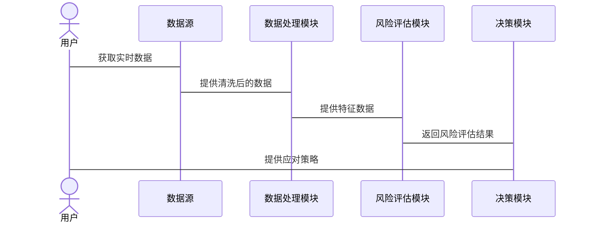

                 


# AI Agent在金融风险评估中的应用

## 关键词：AI Agent，金融风险评估，机器学习，强化学习，自然语言处理

## 摘要：
本文详细探讨了AI Agent在金融风险评估中的应用，分析了其核心原理、系统架构及在信用风险、市场风险等领域的具体应用。通过实例和代码，展示了如何利用AI Agent提升金融风险评估的效率和准确性，为读者提供了从理论到实践的全面指导。

---

# 第1章 AI Agent与金融风险评估的背景介绍

## 1.1 AI Agent的基本概念

### 1.1.1 AI Agent的定义
AI Agent是一种智能实体，能够感知环境、自主决策并采取行动，以实现特定目标。

### 1.1.2 AI Agent的核心特征
- **自主性**：无需外部干预，自主决策。
- **反应性**：实时响应环境变化。
- **学习能力**：通过数据和反馈优化决策模型。

### 1.1.3 AI Agent与传统算法的区别
AI Agent不仅执行预定义任务，还能根据环境反馈动态调整行为，具备更强的适应性。

## 1.2 金融风险评估的基本概念

### 1.2.1 金融风险的定义
金融风险指由于市场波动、信用状况或操作失误导致的财务损失。

### 1.2.2 金融风险的分类
- **信用风险**：债务人违约风险。
- **市场风险**：市场价格波动风险。
- **操作风险**：操作失误导致的损失。

### 1.2.3 金融风险评估的重要性
准确评估风险有助于金融机构制定策略，避免重大损失。

## 1.3 AI Agent在金融风险评估中的应用背景

### 1.3.1 传统金融风险评估的局限性
传统方法依赖历史数据，难以实时响应和处理复杂数据。

### 1.3.2 AI技术在金融领域的优势
AI技术能够处理海量数据，识别复杂模式，提供实时分析。

### 1.3.3 AI Agent在金融风险评估中的潜力
AI Agent能够实时监控市场变化，动态调整评估策略，显著提升风险控制能力。

## 1.4 本章小结
介绍了AI Agent的基本概念和金融风险评估的重要性，揭示了AI Agent在金融领域的潜力。

---

# 第2章 AI Agent的核心概念与原理

## 2.1 AI Agent的基本原理

### 2.1.1 AI Agent的感知与决策机制
AI Agent通过传感器或API获取数据，利用算法处理信息，生成决策。

### 2.1.2 AI Agent的自主学习能力
通过强化学习或监督学习，AI Agent优化模型参数，提升决策准确性。

### 2.1.3 AI Agent的实时响应能力
AI Agent能够快速处理数据，实时调整策略，应对环境变化。

## 2.2 AI Agent的算法原理

### 2.2.1 基于强化学习的AI Agent
AI Agent通过与环境互动，学习策略，最大化累积奖励。

### 2.2.2 基于监督学习的AI Agent
AI Agent通过大量标注数据，学习输入与输出的映射关系。

### 2.2.3 基于无监督学习的AI Agent
AI Agent识别数据中的隐藏模式，发现潜在风险。

## 2.3 AI Agent的数学模型与公式

### 2.3.1 强化学习的数学模型
强化学习的目标是找到最大化累积奖励的策略：
$$
Q(s, a) = r + \gamma \max_{a'} Q(s', a')
$$

### 2.3.2 监督学习的数学模型
监督学习通过最小化预测值与真实值的误差：
$$
\text{Loss} = \sum_{i=1}^{n} (y_i - \hat{y}_i)^2
$$

## 2.4 本章小结
详细介绍了AI Agent的核心原理和算法，为后续应用打下基础。

---

# 第3章 AI Agent在金融风险评估中的应用原理

## 3.1 传统金融风险评估方法

### 3.1.1 信用风险评估
使用历史数据和统计模型评估客户违约概率。

### 3.1.2 市场风险评估
通过VaR模型评估资产价格波动带来的潜在损失。

### 3.1.3 操作风险评估
分析历史操作失误和内部控制系统。

## 3.2 基于AI的金融风险评估方法

### 3.2.1 基于机器学习的风险评估
使用随机森林和梯度提升模型分析大量数据，识别风险因素。

### 3.2.2 基于深度学习的风险评估
利用神经网络分析非结构化数据，如新闻和社交媒体，预测市场情绪。

### 3.2.3 基于自然语言处理的风险评估
通过NLP技术分析文本数据，识别潜在风险信号。

## 3.3 AI Agent在金融风险评估中的独特优势

### 3.3.1 实时性与动态性
AI Agent能够实时监控市场变化，动态调整评估模型。

### 3.3.2 自适应性与自主性
AI Agent根据市场反馈优化策略，无需人工干预。

### 3.3.3 高效性与准确性
AI Agent处理海量数据，提供更准确的风险评估结果。

## 3.4 本章小结
探讨了AI Agent在金融风险评估中的独特优势，展示了其在实际应用中的潜力。

---

# 第4章 AI Agent在金融风险评估中的系统架构与设计

## 4.1 系统架构设计

### 4.1.1 数据输入模块
接收实时市场数据、财务报表和新闻信息。

### 4.1.2 数据处理模块
清洗和转换数据，提取特征。

### 4.1.3 风险评估模块
使用机器学习模型预测风险等级。

### 4.1.4 决策模块
根据风险评估结果生成应对策略。

## 4.2 系统交互设计



## 4.3 系统实现细节

### 4.3.1 数据输入接口
```python
import pandas as pd

def get_data():
    data = pd.read_csv('market_data.csv')
    return data
```

### 4.3.2 风险评估模型
```python
from sklearn.ensemble import RandomForestClassifier

model = RandomForestClassifier()
model.fit(X_train, y_train)
```

## 4.4 本章小结
详细描述了系统架构和交互流程，展示了AI Agent在金融风险评估中的具体实现。

---

# 第5章 项目实战：AI Agent在信用风险评估中的应用

## 5.1 项目背景
介绍项目目标和应用场景。

## 5.2 环境配置
安装必要的Python库：
```
pip install pandas numpy scikit-learn
```

## 5.3 核心代码实现

### 5.3.1 数据预处理
```python
import pandas as pd
import numpy as np

def preprocess_data(data):
    data = data.dropna()
    data['label'] = np.where(data['score'] < 600, 1, 0)
    return data
```

### 5.3.2 训练AI Agent模型
```python
from sklearn.model_selection import train_test_split
from sklearn.ensemble import RandomForestClassifier

def train_model(data):
    X = data.drop(columns=['label'])
    y = data['label']
    X_train, X_test, y_train, y_test = train_test_split(X, y, test_size=0.2)
    model = RandomForestClassifier()
    model.fit(X_train, y_train)
    return model
```

### 5.3.3 模型评估
```python
from sklearn.metrics import accuracy_score

def evaluate_model(model, X_test, y_test):
    y_pred = model.predict(X_test)
    print(f'Accuracy: {accuracy_score(y_test, y_pred)}')
```

## 5.4 实际案例分析
分析一个具体案例，展示AI Agent如何预测信用风险。

## 5.5 项目总结
总结项目成果和经验教训。

---

# 第6章 案例分析与优化策略

## 6.1 典型案例分析
分析AI Agent在市场风险中的应用，展示实际效果。

## 6.2 优化策略
### 6.2.1 模型优化
调整超参数，提升预测准确性。

### 6.2.2 数据优化
引入更多数据源，如社交媒体和新闻，提高模型鲁棒性。

### 6.2.3 策略优化
动态调整风险阈值，平衡风险与收益。

## 6.3 本章小结
展示了如何优化AI Agent在金融风险评估中的性能。

---

# 第7章 总结与展望

## 7.1 本章总结
回顾全文，总结AI Agent在金融风险评估中的优势和应用。

## 7.2 未来展望
探讨AI Agent技术的未来发展方向，如强化学习和多智能体协作。

---

# 作者：AI天才研究院 & 禅与计算机程序设计艺术

---

通过本文，读者可以全面了解AI Agent在金融风险评估中的应用，从理论到实践，从算法到系统设计，为实际应用提供了宝贵的指导和参考。

