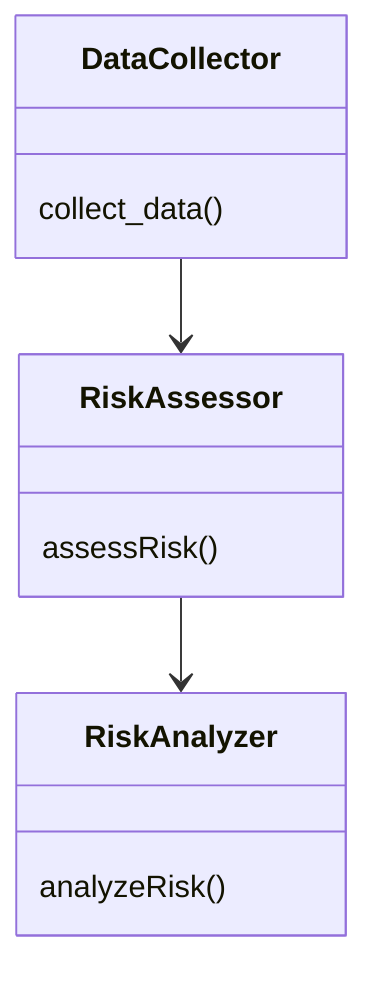
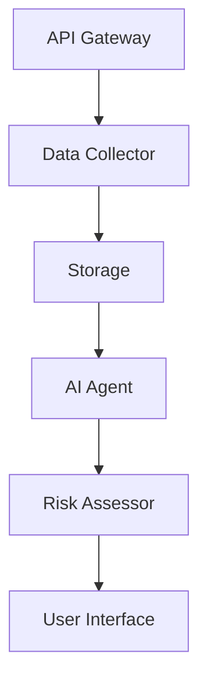
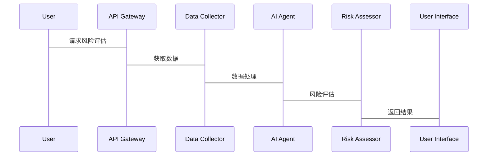

                 


# AI Agent在金融风险评估中的应用与挑战

**关键词**：AI Agent，金融风险评估，机器学习，深度学习，数据驱动决策

**摘要**：  
本文探讨AI Agent在金融风险评估中的应用与挑战，分析其核心算法、系统架构及实际案例，揭示AI Agent如何通过数据驱动的方法提升金融风险预测的准确性和效率。文章结构清晰，内容涵盖背景介绍、核心概念、算法原理、系统设计、项目实战和最佳实践，为读者提供全面的理论与实践指导。

---

## 第1章: 问题背景与核心概念

### 1.1 问题背景

#### 1.1.1 金融风险评估的传统方法
传统金融风险评估依赖统计模型（如VaR、CVaR）和历史数据分析，存在以下局限性：
- 数据依赖性强，难以捕捉新兴风险因素。
- 计算复杂度高，实时性不足。
- 无法应对非线性、复杂动态的金融市场变化。

#### 1.1.2 AI Agent的引入背景
AI Agent具备以下优势，使其成为金融领域的理想工具：
- 能够实时感知环境并自主决策。
- 强大的数据处理能力，适用于海量金融数据。
- 具备学习能力，能够适应市场变化。

#### 1.1.3 当前金融风险评估中的痛点
- 数据维度不足或质量不佳。
- 风险预测模型的泛化能力有限。
- 实时性要求高，传统方法难以满足。

### 1.2 问题描述

#### 1.2.1 金融风险的主要类型
- 市场风险：资产价格波动导致的损失。
- 信用风险：债务人或交易对手违约的风险。
- 操作风险：内部流程或人为错误导致的损失。

#### 1.2.2 传统方法的局限性
- 非线性关系难以建模。
- 数据稀疏性导致模型鲁棒性不足。
- 无法实时更新模型参数。

#### 1.2.3 AI Agent在金融风险评估中的定位
AI Agent作为数据驱动的智能决策工具，能够弥补传统方法的不足，提供更精准的风险评估。

### 1.3 问题解决

#### 1.3.1 AI Agent的核心优势
- 高效的数据处理能力。
- 强大的非线性建模能力。
- 实时性与适应性。

#### 1.3.2 数据驱动的金融风险评估
通过AI Agent处理多源异构数据，构建更精准的风险预测模型。

#### 1.3.3 AI Agent在风险预测中的应用
- 实时监控市场动态。
- 自动识别潜在风险因素。
- 提供个性化风险评估建议。

### 1.4 边界与外延

#### 1.4.1 AI Agent的应用边界
- 仅适用于数据驱动的决策场景。
- 依赖高质量的数据输入。
- 无法完全替代人类专家的判断。

#### 1.4.2 与传统金融模型的区分
- 数据需求：AI Agent需要大量数据，传统方法依赖统计假设。
- 计算复杂度：AI Agent的计算复杂度更高。

#### 1.4.3 未来可能的拓展方向
- 结合区块链技术提升数据安全性。
- 与云计算结合实现弹性扩展。
- 运用于量化投资策略优化。

### 1.5 核心概念组成

#### 1.5.1 AI Agent的基本结构
包括感知层、决策层和执行层，分别负责数据采集、模型推理和行动决策。

#### 1.5.2 金融风险评估的关键要素
- 风险类型：市场、信用、操作等。
- 数据源：市场数据、财务报表、新闻 sentiment。
- 风险指标：VaR、波动率、违约概率。

#### 1.5.3 AI Agent与金融数据的关系
AI Agent通过处理金融数据构建模型，反过来，金融数据为AI Agent提供输入和反馈。

---

## 第2章: 核心概念与联系

### 2.1 AI Agent的基本原理

#### 2.1.1 AI Agent的定义与分类
- 定义：智能体在环境中感知并采取行动以实现目标。
- 分类：基于反应式和基于规划的AI Agent。

#### 2.1.2 AI Agent的核心算法
包括监督学习、无监督学习和强化学习。

#### 2.1.3 AI Agent在金融领域的应用案例
- 自动化交易：高频交易中的价格预测。
- 风险管理：实时监控和预警。

### 2.2 金融风险评估的基本原理

#### 2.2.1 金融风险的分类与特征
- 市场风险：资产价格波动。
- 信用风险：债务违约。
- 操作风险：内部流程错误。

#### 2.2.2 金融风险评估的数学模型
包括线性回归、支持向量机和随机森林。

#### 2.2.3 金融风险评估的关键指标
- VaR：在给定置信水平下的潜在损失。
- 标准差：资产收益的波动性。

### 2.3 AI Agent与金融风险评估的联系

#### 2.3.1 数据驱动的风险评估
AI Agent通过机器学习模型处理多源异构数据，构建更精准的风险预测模型。

#### 2.3.2 AI Agent在风险预测中的优势
- 高效的数据处理能力。
- 强大的非线性建模能力。
- 实时性与适应性。

#### 2.3.3 AI Agent与传统金融模型的对比
- 数据需求：AI Agent需要大量数据，传统方法依赖统计假设。
- 计算复杂度：AI Agent的计算复杂度更高。

---

## 第3章: 核心概念原理与对比

### 3.1 AI Agent的核心原理

#### 3.1.1 监督学习与无监督学习
- 监督学习：有标签数据的分类和回归任务。
- 无监督学习：无标签数据的聚类和降维。

#### 3.1.2 强化学习与风险评估
通过与环境的交互，学习最优策略，应用于量化投资和风险对冲。

#### 3.1.3 深度学习在金融中的应用
利用神经网络处理非结构化数据，如新闻文本和图像。

### 3.2 金融风险评估的数学模型

#### 3.2.1 线性回归模型
用于预测资产收益，公式为：$$ y = \beta_0 + \beta_1x + \epsilon $$。

#### 3.2.2 支持向量机模型
通过构建超平面进行分类，适用于高维数据。

#### 3.2.3 随机森林与梯度提升树
集成学习方法，适用于高维数据和非线性关系。

### 3.3 AI Agent与金融风险评估的对比分析

#### 3.3.1 数据需求的对比
AI Agent需要大量数据，传统方法依赖统计假设。

#### 3.3.2 模型复杂度的对比
AI Agent的模型复杂度更高，但泛化能力更强。

#### 3.3.3 计算效率的对比
AI Agent的计算效率较低，但随着技术进步，差距在缩小。

---

## 第4章: 算法原理与实现

### 4.1 AI Agent的核心算法

#### 4.1.1 监督学习算法
- 线性回归：用于回归任务。
- 支持向量机：用于分类任务。
- 随机森林：用于分类和回归任务。

#### 4.1.2 无监督学习算法
- K-means：用于聚类。
- 主成分分析：用于降维。

#### 4.1.3 强化学习算法
- Q-learning：用于策略优化。
- Deep Q-Network：结合深度学习进行强化学习。

### 4.2 金融风险评估的核心算法

#### 4.2.1 线性回归模型
使用最小二乘法进行参数估计，公式为：$$ \hat{y} = \beta_0 + \beta_1x $$。

#### 4.2.2 随机森林模型
通过集成多个决策树提升模型鲁棒性。

#### 4.2.3 强化学习模型
通过与环境交互学习最优策略，应用于量化投资。

### 4.3 算法实现

#### 4.3.1 线性回归的Python实现
```python
import numpy as np
from sklearn.linear_model import LinearRegression

# 数据准备
X = np.array([1, 2, 3, 4, 5]).reshape(-1, 1)
y = np.array([2, 4, 5, 4, 5])

# 模型训练
model = LinearRegression()
model.fit(X, y)

# 预测
print(model.predict([[6]]))
```

#### 4.3.2 随机森林的Python实现
```python
from sklearn.ensemble import RandomForestRegressor

# 数据准备
X = [[1, 2], [3, 4], [5, 6], [7, 8], [9, 10]]
y = [2, 3, 5, 7, 11]

# 模型训练
model = RandomForestRegressor(n_estimators=100)
model.fit(X, y)

# 预测
print(model.predict([[11, 12]]))
```

---

## 第5章: 系统分析与架构设计方案

### 5.1 问题场景介绍
AI Agent用于实时监控金融市场，预测风险并提供预警。

### 5.2 项目介绍
构建一个基于AI Agent的金融风险评估系统，实现风险预测和预警功能。

### 5.3 系统功能设计

#### 5.3.1 领域模型


#### 5.3.2 系统架构


#### 5.3.3 系统交互


---

## 第6章: 项目实战

### 6.1 环境安装
安装Python、TensorFlow、Scikit-learn等工具。

### 6.2 核心代码实现

#### 6.2.1 数据预处理
```python
import pandas as pd
import numpy as np

# 加载数据
data = pd.read_csv('financial_data.csv')

# 数据清洗
data = data.dropna()
```

#### 6.2.2 模型训练
```python
from sklearn.model

