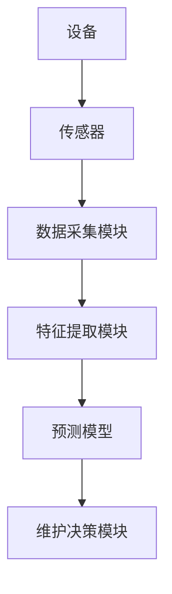
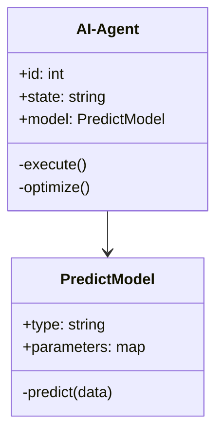
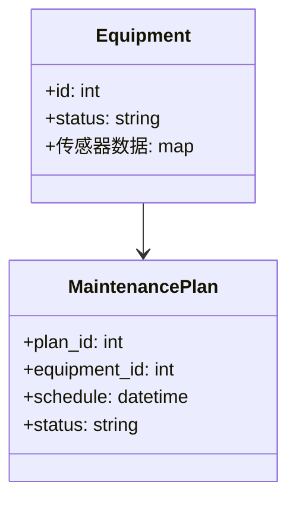
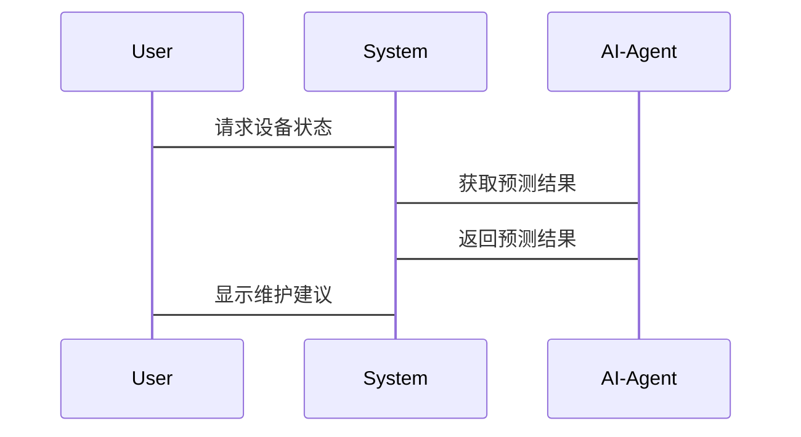

                 


# AI Agent在预测性维护中的实践

> 关键词：预测性维护, AI Agent, 工业智能化, 设备故障预测, 维护优化

> 摘要：本文详细探讨了AI Agent在预测性维护中的应用，从理论基础到实际案例，分析了预测性维护的核心概念、算法原理、系统架构以及项目实现。通过具体案例，展示了AI Agent如何通过数据驱动的方式提升设备维护的效率和准确性。

---

# 第1章: 预测性维护与AI Agent概述

## 1.1 预测性维护的基本概念

### 1.1.1 预测性维护的定义
预测性维护是一种基于设备状态数据的主动维护策略，旨在通过预测设备故障来优化维护计划，减少停机时间和维护成本。

### 1.1.2 预测性维护的优势
- 提高设备利用率
- 降低维护成本
- 减少意外停机风险
- 延长设备寿命

### 1.1.3 预测性维护的应用场景
- 制造业生产线
- 智慧能源系统
- 智能交通系统

## 1.2 AI Agent的核心概念

### 1.2.1 AI Agent的定义
AI Agent是一种能够感知环境、执行任务并做出决策的智能体，能够在复杂环境中自主完成目标。

### 1.2.2 AI Agent的特点
- 自主性
- 反应性
- 社会性
- 学习能力

### 1.2.3 AI Agent与传统预测性维护的区别
| 特性 | 传统预测性维护 | AI Agent预测性维护 |
|------|----------------|-------------------|
| 数据来源 | 历史数据为主 | 实时数据为主 |
| 决策方式 | 专家规则 | 数据驱动决策 |
| 灵活性 | 较低 | 较高 |

## 1.3 AI Agent在预测性维护中的作用

### 1.3.1 AI Agent如何提升预测性维护的效率
- 实时数据处理
- 自动化决策
- 智能优化

### 1.3.2 AI Agent在预测性维护中的应用场景
- 设备故障预警
- 维护计划优化
- 运营效率提升

## 1.4 当前预测性维护的现状与挑战

### 1.4.1 预测性维护的现状
- 技术成熟度高
- 应用范围广
- 数据量大

### 1.4.2 当前技术的局限性
- 数据质量问题
- 模型泛化能力不足
- 安全性问题

### 1.4.3 预测性维护的未来发展方向
- 更智能的AI Agent
- 更高效的数据处理技术
- 更广泛的应用场景

## 1.5 本章小结
本章介绍了预测性维护和AI Agent的基本概念，分析了AI Agent在预测性维护中的作用，并探讨了当前技术的现状与挑战。

---

# 第2章: AI Agent与预测性维护的核心概念与联系

## 2.1 AI Agent的核心原理

### 2.1.1 数据采集与处理
- 数据来源：传感器、日志、数据库
- 数据预处理：清洗、转换、特征提取

### 2.1.2 特征提取与选择
- 时间序列特征
- 统计特征
- 模糊特征

### 2.1.3 模型训练与优化
- 选择合适的算法
- 调参优化
- 模型评估

## 2.2 预测性维护的核心原理

### 2.2.1 设备状态监测
- 实时监测设备状态
- 异常检测
- 故障诊断

### 2.2.2 故障预测模型
- 时间序列预测
- 分类模型
- 回归模型

### 2.2.3 维护决策优化
- 决策树
- 动态规划
- 遗传算法

## 2.3 AI Agent与预测性维护的结合原理

### 2.3.1 数据流的传递过程


### 2.3.2 AI Agent在预测性维护中的角色
- 数据处理器
- 模型执行者
- 决策优化器

### 2.3.3 系统的整体架构


## 2.4 核心概念对比分析

### 2.4.1 AI Agent与传统预测性维护的对比
| 特性 | AI Agent | 传统预测性维护 |
|------|-----------|----------------|
| 决策速度 | 实时 | 周期性 |
| 决策依据 | 数据驱动 | 规则驱动 |

### 2.4.2 预测性维护与其他设备维护方式的对比
| 维护方式 | 预测性维护 | �状态监测维护 | 定期维护 |
|----------|------------|--------------|----------|
| 维护时机 | 故障前 | 状态异常时 | 定期进行 |

### 2.4.3 AI Agent与工业自动化的关系
- AI Agent是工业自动化的智能核心
- 工业自动化为AI Agent提供数据和应用场景
- 两者结合推动工业智能化

## 2.5 本章小结
本章详细分析了AI Agent与预测性维护的核心概念，并通过图表展示了它们的结合方式和系统架构。

---

# 第3章: AI Agent在预测性维护中的算法原理

## 3.1 预测性维护的常用算法

### 3.1.1 时间序列分析
- ARIMA模型
- LSTM网络

### 3.1.2 基于机器学习的预测模型
- 支持向量机（SVM）
- 随机森林（Random Forest）

### 3.1.3 基于深度学习的预测模型
- 卷积神经网络（CNN）
- Transformer模型

## 3.2 基于LSTM的时间序列预测模型

### 3.2.1 LSTM网络的数学模型
```latex
$$
\text{LSTM} = \text{Cell}(\text{Input}_t, \text{State}_{t-1})
$$
```

### 3.2.2 LSTM网络的实现
```python
import tensorflow as tf
from tensorflow.keras.layers import LSTM, Dense

model = tf.keras.Sequential([
    LSTM(64, input_shape=(None, input_dim)),
    Dense(1, activation='sigmoid')
])
model.compile(loss='binary_crossentropy', optimizer='adam', metrics=['accuracy'])
```

### 3.2.3 LSTM网络的训练与优化
- 选择合适的超参数
- 使用早停法防止过拟合
- 调整学习率优化器

## 3.3 算法原理的对比分析

### 3.3.1 不同算法的优缺点对比
| 算法 | 优点 | 缺点 |
|------|------|------|
| ARIMA | 简单易用 | 无法捕捉复杂模式 |
| LSTM | 强大学习能力 | 训练时间长 |
| SVM | 高精度 | 不适合高维数据 |

### 3.3.2 算法选择的注意事项
- 数据特性：时间序列 vs 静态数据
- 任务目标：分类 vs 回归
- 计算资源：训练时间 vs 成本

## 3.4 本章小结
本章详细介绍了预测性维护中常用的算法，并通过具体案例展示了LSTM网络的实现和优化方法。

---

# 第4章: AI Agent在预测性维护中的系统分析与架构设计

## 4.1 问题场景介绍
- 设备运行数据监测
- 故障预测与维护决策
- 系统集成与接口设计

## 4.2 项目介绍
- 项目目标：实现基于AI Agent的预测性维护系统
- 项目范围：制造业生产线设备维护
- 项目团队：数据科学家、软件工程师、运维人员

## 4.3 系统功能设计

### 4.3.1 领域模型设计


### 4.3.2 系统架构设计


### 4.3.3 系统接口设计
- API接口定义
- 接口调用流程
- 接口安全设计

### 4.3.4 系统交互设计


## 4.4 本章小结
本章通过系统分析和架构设计，展示了AI Agent在预测性维护中的具体实现方式和系统结构。

---

# 第5章: AI Agent在预测性维护中的项目实战

## 5.1 环境安装与配置

### 5.1.1 环境要求
- 操作系统：Linux/Windows
- 语言：Python 3.8+
- 框架：TensorFlow/PyTorch
- 数据库：MySQL/PostgreSQL

### 5.1.2 安装依赖
```bash
pip install tensorflow pandas numpy scikit-learn
```

## 5.2 系统核心实现

### 5.2.1 数据采集模块
```python
import pandas as pd
import requests

def fetch_data(api_url):
    response = requests.get(api_url)
    data = response.json()
    return pd.DataFrame(data)
```

### 5.2.2 特征提取模块
```python
from sklearn.feature_selection import SelectKBest, chi2

def extract_features(data, labels):
    selector = SelectKBest(score_func=chi2, k=10)
    features = selector.fit_transform(data, labels)
    return features
```

### 5.2.3 模型实现与优化
```python
from tensorflow.keras.models import Sequential
from tensorflow.keras.layers import LSTM, Dense

def build_model(input_shape):
    model = Sequential()
    model.add(LSTM(64, input_shape=input_shape))
    model.add(Dense(1, activation='sigmoid'))
    model.compile(loss='binary_crossentropy', optimizer='adam', metrics=['accuracy'])
    return model
```

### 5.2.4 维护决策模块
```python
def generate_maintenance_plan(predicted_faults, current_schedule):
    new_plan = []
    for fault in predicted_faults:
        if fault.time > current_schedule:
            new_plan.append(fault.time + 24)
    return new_plan
```

## 5.3 代码应用解读与分析
- 数据采集模块：实时获取设备传感器数据
- 特征提取模块：选择关键特征用于模型训练
- 模型实现与优化：构建并训练LSTM网络
- 维护决策模块：根据预测结果生成维护计划

## 5.4 实际案例分析
- 数据预处理与清洗
- 模型训练与验证
- 维护计划优化与实施
- 系统运行与监控

## 5.5 项目小结
本章通过具体项目实战，详细展示了AI Agent在预测性维护中的实现过程，从环境配置到代码实现，再到系统运行，全面解析了预测性维护的实际应用。

---

# 第6章: 预测性维护与AI Agent的未来展望

## 6.1 预测性维护的未来发展方向

### 6.1.1 更智能的AI Agent
- 强化学习的应用
- 多模态数据融合
- 自适应模型更新

### 6.1.2 更高效的数据处理技术
- 边缘计算
- 实时数据流处理
- 分布式计算

### 6.1.3 更广泛的应用场景
- 智能交通系统
- 智慧能源系统
- 智能制造

## 6.2 AI Agent在预测性维护中的最佳实践

### 6.2.1 数据质量管理
- 数据清洗
- 数据增强
- 数据安全

### 6.2.2 模型优化技巧
- 超参数调优
- 模型融合
- 持续学习

### 6.2.3 系统集成建议
- 系统模块化设计
- 接口标准化
- 安全与可靠性

## 6.3 预测性维护中的注意事项

### 6.3.1 数据依赖性
- 数据质量影响预测结果
- 数据实时性的重要性
- 数据隐私与安全

### 6.3.2 系统可靠性
- 系统稳定性
- 故障容错能力
- 系统可扩展性

## 6.4 拓展阅读

### 6.4.1 预测性维护的经典论文
- "Predictive Maintenance Using Machine Learning: A Review"
- "Deep Learning for Predictive Maintenance"

### 6.4.2 AI Agent领域的最新研究
- "Autonomous Agents in Industrial Maintenance"
- "Intelligent Systems for Predictive Maintenance"

## 6.5 本章小结
本章展望了预测性维护和AI Agent的未来发展方向，并提出了最佳实践和注意事项，为读者提供了进一步研究和实践的方向。

---

# 作者：AI天才研究院/AI Genius Institute & 禅与计算机程序设计艺术 /Zen And The Art of Computer Programming

---

以上是《AI Agent在预测性维护中的实践》的完整目录大纲和内容概要。

