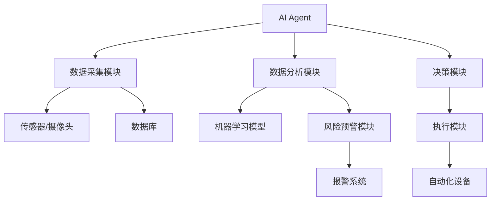
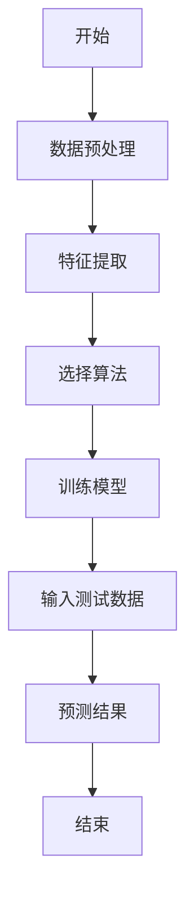
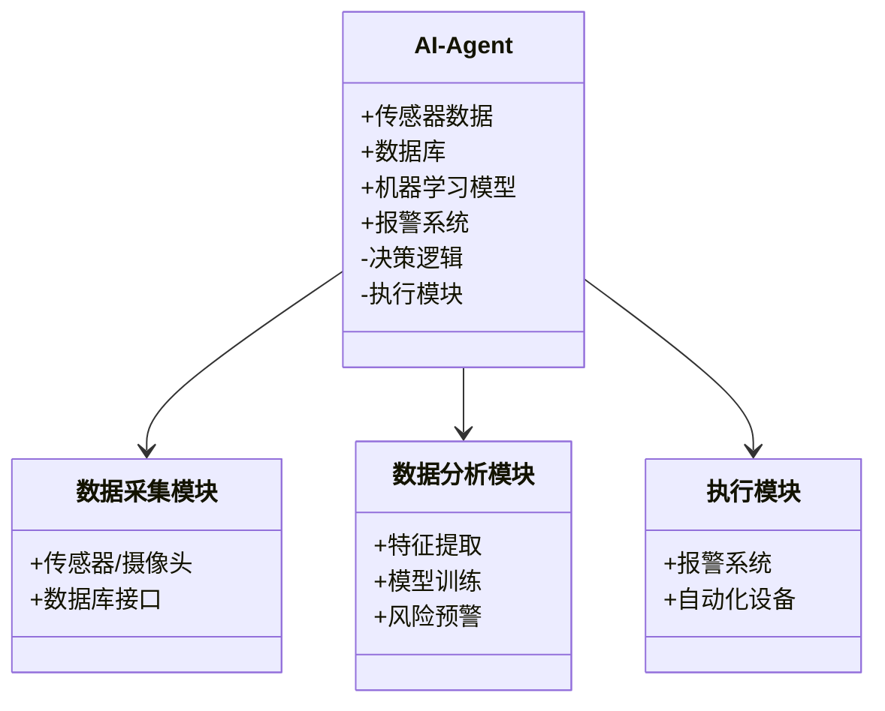
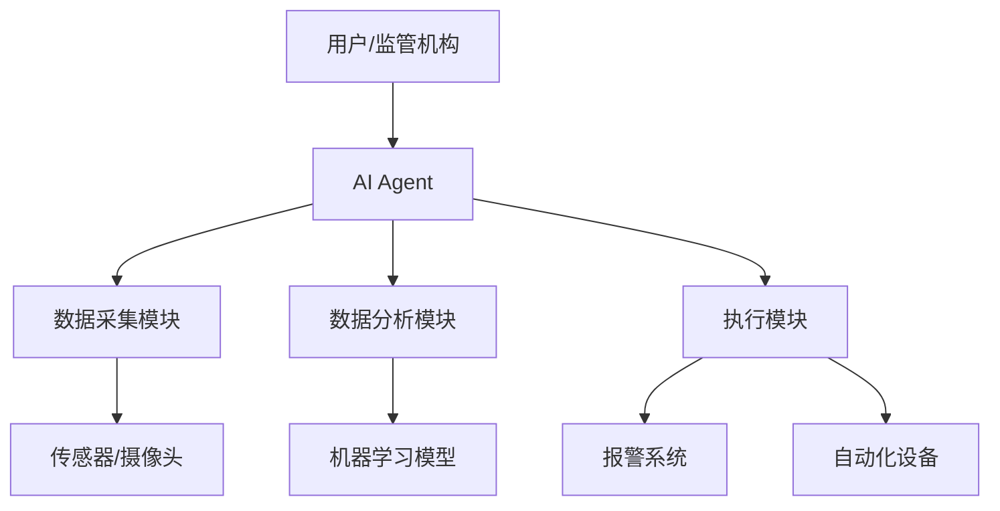
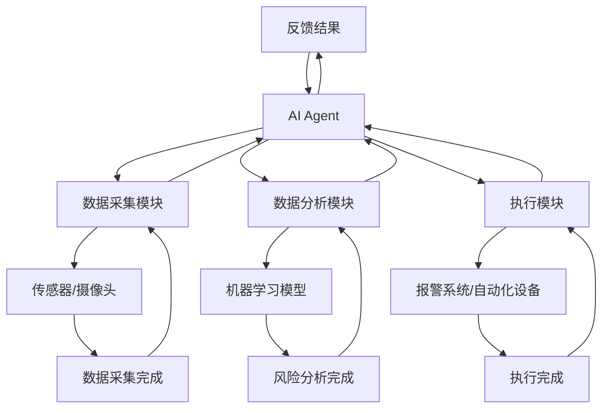

                 


# AI Agent在食品安全监管中的应用

## 关键词：AI Agent，食品安全，监管，人工智能，数据分析，机器学习

## 摘要：  
随着人工智能技术的快速发展，AI Agent（人工智能代理）在食品安全监管中的应用越来越广泛。本文将从AI Agent的基本概念、核心算法、系统架构、实际应用场景等多个方面进行详细分析，探讨AI Agent如何帮助提升食品安全监管的效率和准确性。通过结合实际案例和系统设计，本文将为读者提供一个全面的视角，展示AI Agent在食品安全监管中的巨大潜力和实际价值。

---

## 第一部分: AI Agent在食品安全监管中的应用概述

### 第1章: 背景介绍

#### 1.1 问题背景与描述
食品安全是关系到人民健康和生命安全的重要问题。随着食品生产和流通的复杂化，传统的监管方式已经难以应对以下挑战：
- **数据量大**：食品生产和流通过程中产生的数据种类繁多，包括生产记录、检验结果、供应链信息等。
- **监管效率低**：传统的人工监管方式效率低下，难以覆盖所有环节。
- **问题追溯难**：一旦出现食品安全问题，很难快速定位问题源头。

AI Agent作为一种智能代理，能够通过自动化的方式处理数据、识别风险、优化决策，为食品安全监管提供了一种高效、智能的解决方案。

#### 1.2 核心概念与定义
- **AI Agent**：AI Agent是一种智能实体，能够感知环境、自主决策并执行任务。在食品安全监管中，AI Agent可以用于数据采集、风险分析、问题定位等环节。
- **食品安全监管**：通过对食品生产、加工、流通和消费的全链条监管，确保食品的安全性。
- **AI Agent的核心要素**：
  - **感知**：通过传感器、摄像头等设备采集数据。
  - **决策**：基于数据进行分析，生成监管决策。
  - **执行**：通过自动化设备或系统执行决策。

### 第2章: 核心概念与联系

#### 2.1 AI Agent的原理与特点
- **感知阶段**：
  - 通过传感器、摄像头等设备采集食品生产、流通过程中的数据。
  - 数据包括温度、湿度、生产日期、检验结果等。
- **决策阶段**：
  - 利用机器学习算法对数据进行分析，识别潜在风险。
  - 例如，使用分类算法判断食品是否合格。
- **执行阶段**：
  - 根据决策结果采取行动，如报警、暂停生产、召回问题产品。

#### 2.2 核心概念对比表
| 对比维度         | 传统监管方式              | AI Agent监管方式              |
|------------------|--------------------------|-----------------------------|
| 数据处理效率     | 低，依赖人工分析          | 高，自动化处理               |
| 风险识别能力     | 有限，依赖经验判断        | 强大，基于数据驱动           |
| 监管范围         | 局限，难以覆盖全链条      | 宽，可以实时监控全链条       |

#### 2.3 系统架构图
以下是AI Agent在食品安全监管中的系统架构图：


---

## 第二部分: AI Agent的算法原理与数学模型

### 第3章: 算法原理与流程

#### 3.1 AI Agent的核心算法
- **监督学习算法**：
  - 用于分类问题，例如判断食品是否合格。
  - 常用算法：随机森林、支持向量机（SVM）、神经网络。
- **无监督学习算法**：
  - 用于聚类分析，例如识别异常生产批次。
  - 常用算法：K-means、DBSCAN。
- **强化学习算法**：
  - 用于优化决策过程，例如动态调整监管策略。
  - 常用算法：Q-Learning。

#### 3.2 算法流程图
以下是监督学习分类算法的流程图：


### 第4章: 数学模型与公式

#### 4.1 分类算法的数学模型
- 逻辑回归模型：
  $$ P(y=1|x) = \frac{1}{1 + e^{- (w \cdot x + b)}} $$
  其中，\( w \) 是权重，\( b \) 是偏置，\( x \) 是输入特征。

- 朴素贝叶斯模型：
  $$ P(y|x) = \frac{P(x|y)P(y)}{P(x)} $$
  其中，\( P(x|y) \) 是条件概率，\( P(y) \) 是先验概率。

---

## 第三部分: 系统分析与架构设计方案

### 第5章: 系统分析

#### 5.1 问题场景介绍
- **场景1**：食品生产过程中，AI Agent通过传感器实时监控温度、湿度等参数。
- **场景2**：食品流通环节中，AI Agent通过区块链技术追溯食品来源。

#### 5.2 领域模型设计
以下是领域模型类图：


### 第6章: 系统架构设计

#### 6.1 系统架构图
以下是系统架构图：


#### 6.2 接口设计
- **输入接口**：
  - 数据采集模块：接收传感器数据。
  - 数据分析模块：接收数据并进行处理。
- **输出接口**：
  - 风险预警模块：输出风险等级。
  - 报警系统：触发报警。

#### 6.3 交互流程图
以下是交互流程图：


---

## 第四部分: 项目实战

### 第7章: 项目实战

#### 7.1 环境安装
- **工具安装**：
  - Python 3.8+
  - NumPy, Pandas, Scikit-learn
  - Mermaid CLI
- **代码实现**：
  ```python
  import numpy as np
  from sklearn.tree import DecisionTreeClassifier
  from sklearn.metrics import accuracy_score

  # 数据准备
  X = np.array([[1, 2], [3, 4], [5, 6], [7, 8]])
  y = np.array([0, 1, 0, 1])

  # 模型训练
  model = DecisionTreeClassifier()
  model.fit(X, y)

  # 模型预测
  prediction = model.predict(X)
  print("准确率:", accuracy_score(y, prediction))
  ```

#### 7.2 核心代码实现
- **数据采集模块**：
  ```python
  import pandas as pd

  def collect_data():
      # 模拟传感器数据
      data = {
          '温度': [20, 22, 21, 23],
          '湿度': [60, 65, 62, 63]
      }
      df = pd.DataFrame(data)
      return df
  ```

- **数据分析模块**：
  ```python
  def analyze_data(df):
      # 数据预处理
      from sklearn.preprocessing import StandardScaler
      scaler = StandardScaler()
      X_scaled = scaler.fit_transform(df)
      
      # 模型训练
      from sklearn.svm import SVC
      model = SVC()
      model.fit(X_scaled, [0, 1, 0, 1])
      
      return model
  ```

#### 7.3 案例分析
- **案例背景**：某食品企业生产了一批酸奶，AI Agent需要实时监控生产过程中的温度和湿度。
- **实施步骤**：
  1. 数据采集模块采集传感器数据。
  2. 数据分析模块使用SVM模型进行分类。
  3. 如果预测结果为异常（例如温度超标），触发报警系统。
  4. 自动化设备暂停生产，召回问题批次。

---

## 第五部分: 总结与展望

### 第8章: 总结与展望

#### 8.1 总结
本文详细介绍了AI Agent在食品安全监管中的应用，包括其核心算法、系统架构和实际案例。通过AI Agent的引入，可以显著提高食品安全监管的效率和准确性。

#### 8.2 展望
未来，随着AI技术的不断发展，AI Agent在食品安全监管中的应用将更加广泛。例如，结合区块链技术实现食品全流程追溯，或通过强化学习优化监管策略。

---

## 附录

### 附录A: 术语表
- **AI Agent**：人工智能代理。
- **机器学习**：一种人工智能技术，通过数据训练模型。
- **区块链**：一种分布式账本技术，用于数据追溯。

### 附录B: 工具安装指南
- **安装Python**：https://www.python.org/
- **安装NumPy**：`pip install numpy`
- **安装Scikit-learn**：`pip install scikit-learn`

---

## 作者：AI天才研究院 & 禅与计算机程序设计艺术

---

以上是《AI Agent在食品安全监管中的应用》的技术博客文章的完整目录和内容概要。希望这篇文章能够帮助读者更好地理解AI Agent在食品安全监管中的潜力和应用。

