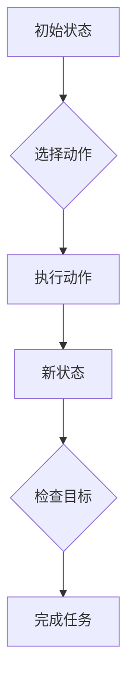
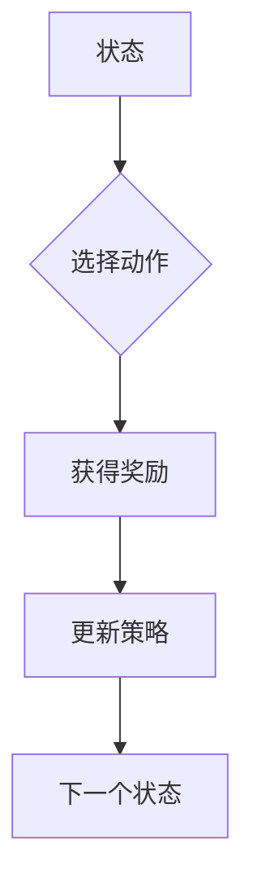
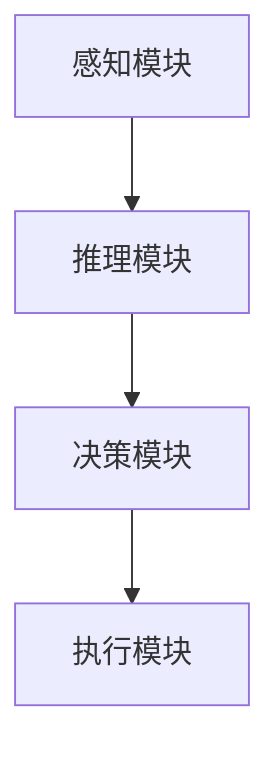
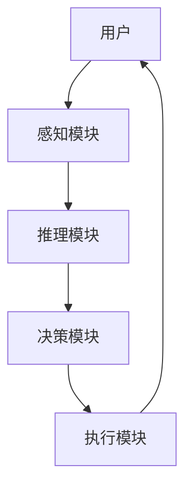

                 


# AI Agent基础概念：理解智能代理的核心

> 关键词：AI Agent，智能代理，人工智能，算法原理，系统架构  
> 摘要：本文将深入探讨AI Agent的基本概念、核心原理和系统架构。通过分析AI Agent的结构、类型和应用场景，结合具体的算法原理和数学模型，帮助读者全面理解智能代理的本质。文章还提供了一个实际项目案例，展示了AI Agent在智能助手中的应用，并总结了最佳实践和注意事项。

---

## 第1章: AI Agent的基本概念与背景

### 1.1 AI Agent的定义与特点

AI Agent（智能代理）是指能够感知环境、自主决策并执行任务的智能系统。与传统程序不同，AI Agent具有以下特点：

- **自主性**：能够独立运行，无需外部干预。
- **反应性**：能够实时感知环境并做出响应。
- **目标导向性**：具有明确的目标，通过行为实现目标。
- **学习能力**：能够通过经验改进性能。

### 1.2 AI Agent的核心问题

AI Agent的设计和实现涉及以下几个核心问题：

1. **感知**：如何获取环境信息？  
2. **推理**：如何处理信息并做出决策？  
3. **行动**：如何执行决策？  
4. **学习**：如何通过经验优化性能？

### 1.3 AI Agent的应用场景

AI Agent广泛应用于多个领域：

- **智能助手**：如Siri、Alexa，帮助用户完成日常任务。  
- **自动驾驶**：如特斯拉的Autopilot系统，实现自主驾驶。  
- **游戏AI**：如围棋程序AlphaGo，击败世界冠军。  
- **推荐系统**：根据用户行为推荐个性化内容。  

---

## 第2章: AI Agent的核心概念与联系

### 2.1 AI Agent的结构与组成

AI Agent的结构通常包括以下几个部分：

- **知识表示**：存储和处理信息的方式。  
- **行为规划**：制定实现目标的策略。  
- **感知与交互**：通过传感器或接口与环境互动。  
- **学习与优化**：通过反馈改进性能。  

### 2.2 AI Agent的类型与分类

AI Agent可以根据多个维度进行分类：

#### 按智能水平分类
- **反应式AI Agent**：基于当前感知做出反应，不依赖历史信息。  
- **认知式AI Agent**：具备推理和规划能力，能够处理复杂任务。  

#### 按应用场景分类
- **服务型AI Agent**：提供特定服务，如智能助手。  
- **控制型AI Agent**：用于自动化控制，如自动驾驶。  

#### 按决策方式分类
- **基于规则的AI Agent**：根据预设规则做出决策。  
- **基于模型的AI Agent**：利用数学模型进行推理和决策。  

### 2.3 AI Agent与其他概念的联系

以下是AI Agent与其他相关概念的对比表格：

| 概念       | 描述                                                                 |
|------------|------------------------------------------------------------------|
| AI Agent    | 具有自主性、反应性和目标导向性的智能系统。                      |
| 专家系统   | 基于知识库和推理规则解决特定领域问题的系统。                    |
| 机器学习   | 通过数据训练模型，实现模式识别和预测。                          |
| 自动化系统  | 实现任务自动化的系统，可能不具备智能性。                        |

---

## 第3章: AI Agent的算法原理讲解

### 3.1 常见AI Agent算法

#### 3.1.1 状态空间搜索算法

状态空间搜索是AI Agent中常用的一种算法，用于探索可能的行为序列。以下是其实现流程：



#### 3.1.2 强化学习算法

强化学习是一种通过奖励机制优化行为的算法。以下是其实现流程：



#### 3.1.3 马尔可夫决策过程（MDP）

马尔可夫决策过程是强化学习中的一个数学模型，描述了AI Agent在环境中的决策过程。以下是其数学公式：

$$
V(s) = \max_{a} \sum_{s'} P(s' | s, a) V(s')
$$

其中，\( V(s) \) 表示状态 \( s \) 的价值函数，\( P(s' | s, a) \) 表示从状态 \( s \) 执行动作 \( a \) 后转移到状态 \( s' \) 的概率。

---

## 第4章: AI Agent的数学模型与公式

### 4.1 概率模型

概率模型用于描述AI Agent在不确定环境中的决策过程。以下是贝叶斯网络的数学表示：

$$
P(A|B) = \frac{P(B|A)P(A)}{P(B)}
$$

其中，\( P(A|B) \) 表示在 \( B \) 发生的情况下，\( A \) 发生的概率。

### 4.2 决策树模型

决策树是一种用于分类和回归的树状结构。以下是决策树的简单示例：

$$
\text{如果 } X > Y \text{，则输出 } Z \text{；否则输出 } W
$$

---

## 第5章: AI Agent系统分析与架构设计

### 5.1 系统功能设计

AI Agent的系统功能设计通常包括以下几个模块：

- **感知模块**：负责获取环境信息。  
- **推理模块**：对信息进行处理和推理。  
- **决策模块**：制定行动策略。  
- **执行模块**：执行决策并输出结果。  

### 5.2 系统架构设计

以下是AI Agent的系统架构图：



### 5.3 接口设计与交互

AI Agent的接口设计需要考虑与外部系统或用户的交互。以下是交互流程图：



---

## 第6章: AI Agent的项目实战

### 6.1 智能助手项目

#### 6.1.1 环境安装

安装所需的Python库：

```bash
pip install numpy pandas scikit-learn
```

#### 6.1.2 核心代码实现

以下是智能助手的核心代码示例：

```python
class AIAssistant:
    def __init__(self):
        self knowledge_base = {}

    def perceive(self, input):
        # 处理输入并返回状态
        return self.process_input(input)

    def process_input(self, input):
        # 示例处理逻辑
        return "已完成任务"
```

#### 6.1.3 案例分析与优化

通过对用户反馈的分析，我们可以优化AI Agent的学习算法，例如引入强化学习机制来提升对话质量。

---

## 第7章: 最佳实践与注意事项

### 7.1 最佳实践

- **模块化设计**：确保系统各模块独立，便于维护和扩展。  
- **数据质量管理**：保证输入数据的准确性和完整性。  
- **持续优化**：定期收集反馈并优化模型性能。  

### 7.2 注意事项

- **性能瓶颈**：AI Agent的性能可能受限于计算能力和数据量。  
- **安全风险**：需要防范恶意攻击和数据泄露。  
- **用户体验**：设计简洁直观的交互界面，提升用户体验。  

### 7.3 拓展阅读

- **推荐书籍**：《人工智能：一种现代的方法》  
- **技术博客**：深入探讨AI Agent的最新研究成果和技术趋势。

---

## 作者

作者：AI天才研究院/AI Genius Institute & 禅与计算机程序设计艺术/Zen And The Art of Computer Programming

