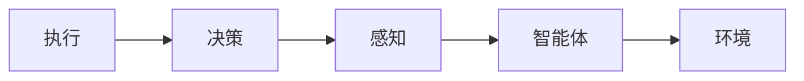
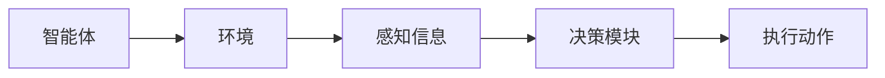
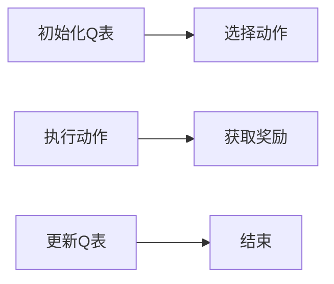
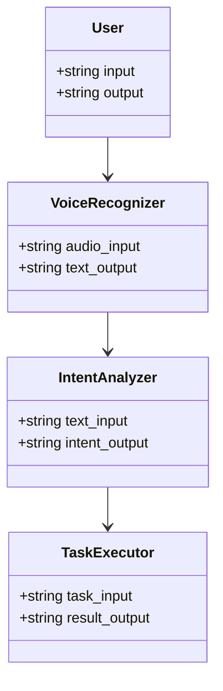
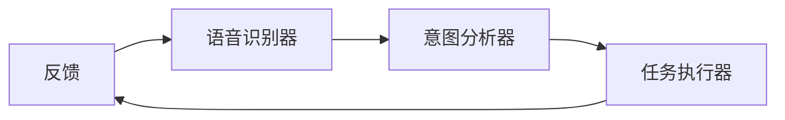

                 


# AI Agent架构设计：从概念到实现

> 关键词：AI Agent、架构设计、智能决策、算法原理、系统架构、项目实战

> 摘要：本文从AI Agent的基本概念出发，深入探讨其核心概念、算法原理、系统架构设计以及项目实战，通过详细的分析和实例，帮助读者全面理解AI Agent的设计与实现过程。

---

## 第1章: AI Agent的基本概念与背景

### 1.1 问题背景

AI Agent（人工智能代理）是指能够感知环境、自主决策并采取行动的智能实体。随着人工智能技术的快速发展，AI Agent在多个领域得到了广泛应用，如智能助手、自动驾驶、智能推荐系统等。

#### 1.1.1 人工智能的发展现状
人工智能技术近年来取得了显著进展，尤其是在深度学习和强化学习领域。AI Agent作为人工智能的核心组成部分，正在逐步从理论研究走向实际应用。

#### 1.1.2 AI Agent的定义与问题描述
AI Agent是一种能够感知环境、做出决策并执行动作的智能系统。它能够根据环境信息调整自己的行为，以实现特定目标。

#### 1.1.3 问题解决的核心思路
AI Agent的设计目标是实现智能化决策和自主行动。通过感知环境、分析问题、制定计划、执行动作并反馈结果，AI Agent能够高效地完成任务。

#### 1.1.4 AI Agent的边界与外延
AI Agent的边界包括感知能力、决策能力、行动能力和学习能力。其外延涉及智能体的类型、应用场景和性能指标。

### 1.2 AI Agent的核心要素

#### 1.2.1 智能体的基本结构
AI Agent通常由感知模块、决策模块和执行模块组成。感知模块负责获取环境信息，决策模块负责制定行动计划，执行模块负责执行具体动作。

#### 1.2.2 AI Agent的核心属性
AI Agent的核心属性包括自主性、反应性、目标导向性和学习能力。这些属性共同决定了AI Agent的智能水平和适应能力。

#### 1.2.3 AI Agent的组成要素
AI Agent的组成要素包括感知器、决策器、执行器和学习器。这些要素协同工作，实现智能化的决策和行动。

#### 1.2.4 核心概念之间的关系
AI Agent的核心概念包括智能体、环境、感知、决策和执行。这些概念之间相互关联，构成了AI Agent的完整架构。

### 1.3 AI Agent的应用领域

#### 1.3.1 智能助手
智能助手如Siri、Alexa等，通过语音交互为用户提供信息查询、任务执行等服务。

#### 1.3.2 自动驾驶
自动驾驶系统通过感知环境、决策路径并控制车辆动作，实现自主驾驶。

#### 1.3.3 智能推荐系统
智能推荐系统通过分析用户行为和偏好，推荐个性化的内容或产品。

#### 1.3.4 机器人控制
AI Agent可以控制机器人完成特定任务，如工业机器人、服务机器人等。

### 1.4 本章小结

本章从AI Agent的基本概念出发，介绍了其核心要素和应用领域。通过理解AI Agent的定义、结构和属性，读者可以更好地理解其设计和实现过程。

---

## 第2章: AI Agent的核心概念与联系

### 2.1 核心概念原理

#### 2.1.1 智能体的基本原理
智能体通过感知环境、分析信息、制定计划并执行动作，实现目标的达成。

#### 2.1.2 AI Agent的核心算法
AI Agent的核心算法包括状态空间搜索、强化学习、决策树等。这些算法为智能体的决策提供支持。

#### 2.1.3 状态空间与动作空间
状态空间是智能体可能遇到的所有状态的集合，动作空间是智能体可以执行的所有动作的集合。

#### 2.1.4 智能决策机制
智能决策机制通过分析环境信息，选择最优的动作以实现目标。

### 2.2 核心概念对比

#### 2.2.1 AI Agent与传统智能体的对比
AI Agent与传统智能体的主要区别在于自主性、学习能力和适应性。

#### 2.2.2 不同AI Agent类型的特点
AI Agent可以分为反应式智能体、基于模型的智能体、目标驱动的智能体和效用驱动的智能体。

#### 2.2.3 核心概念属性对比表格
| 概念         | 描述                                   |
|--------------|----------------------------------------|
| 智能体       | 能感知环境并自主决策的实体             |
| 状态空间     | 智能体可能遇到的所有状态的集合           |
| 动作空间     | 智能体可以执行的所有动作的集合           |
| 决策机制     | 分析环境信息，选择最优动作的机制           |

### 2.3 实体关系架构

#### 2.3.1 ER实体关系图


#### 2.3.2 Mermaid流程图


### 2.4 本章小结

本章通过对比分析，详细讲解了AI Agent的核心概念及其相互关系。通过ER实体关系图和Mermaid流程图，进一步明确了智能体与环境之间的交互关系。

---

## 第3章: AI Agent的核心算法原理

### 3.1 算法原理讲解

#### 3.1.1 状态空间搜索算法
状态空间搜索算法通过遍历所有可能的状态，找到最优路径。常用算法包括广度优先搜索（BFS）和深度优先搜索（DFS）。

#### 3.1.2 强化学习算法
强化学习通过智能体与环境的交互，学习最优策略。Q-learning是一种常用的强化学习算法，其更新公式如下：

$$ Q(s, a) = Q(s, a) + \alpha (r + \gamma \max Q(s', a') - Q(s, a)) $$

其中，$\alpha$ 是学习率，$\gamma$ 是折扣因子。

#### 3.1.3 决策树算法
决策树通过构建树状结构，帮助智能体做出最优决策。ID3、C4.5和C5.0是常见的决策树算法。

### 3.2 算法实现

#### 3.2.1 Q-learning算法实现
```python
class QLearning:
    def __init__(self, state_space, action_space):
        self.state_space = state_space
        self.action_space = action_space
        self.Q = np.zeros((state_space, action_space))
    
    def choose_action(self, state, epsilon):
        if np.random.random() < epsilon:
            return np.random.randint(self.action_space)
        return np.argmax(self.Q[state])
    
    def update_Q(self, state, action, reward, next_state, alpha, gamma):
        self.Q[state, action] += alpha * (reward + gamma * np.max(self.Q[next_state]) - self.Q[state, action])
```

#### 3.2.2 算法流程图


### 3.3 本章小结

本章详细讲解了AI Agent的核心算法，包括状态空间搜索、强化学习和决策树算法。通过Python代码实现和Mermaid流程图，读者可以更好地理解这些算法的工作原理。

---

## 第4章: 系统分析与架构设计

### 4.1 问题场景介绍

#### 4.1.1 问题描述
假设我们正在设计一个智能助手系统，需要实现语音识别、意图理解、任务执行等功能。

#### 4.1.2 项目介绍
智能助手系统需要通过语音交互，理解用户意图并执行相应任务。

### 4.2 系统功能设计

#### 4.2.1 领域模型设计


#### 4.2.2 系统架构设计


### 4.3 本章小结

本章通过系统分析与架构设计，明确了智能助手系统的功能模块和交互流程。通过类图和架构图，进一步优化了系统的整体结构。

---

## 第5章: 项目实战

### 5.1 环境安装

#### 5.1.1 安装Python
```bash
python --version
pip install --upgrade pip
```

#### 5.1.2 安装依赖库
```bash
pip install numpy
pip install scikit-learn
```

### 5.2 核心代码实现

#### 5.2.1 Q-learning算法实现
```python
import numpy as np

class QLearning:
    def __init__(self, state_space, action_space):
        self.state_space = state_space
        self.action_space = action_space
        self.Q = np.zeros((state_space, action_space))
    
    def choose_action(self, state, epsilon):
        if np.random.random() < epsilon:
            return np.random.randint(self.action_space)
        return np.argmax(self.Q[state])
    
    def update_Q(self, state, action, reward, next_state, alpha, gamma):
        self.Q[state, action] += alpha * (reward + gamma * np.max(self.Q[next_state]) - self.Q[state, action])
```

#### 5.2.2 智能助手实现
```python
class SmartAssistant:
    def __init__(self):
        self.recognizer = VoiceRecognizer()
        self.analyzer = IntentAnalyzer()
        self.executor = TaskExecutor()
    
    def process_request(self, audio_input):
        text_output = self.recognizer.recognize(audio_input)
        intent = self.analyzer.analyze(text_output)
        result = self.executor.execute(intent)
        return result
```

### 5.3 代码解读与分析

#### 5.3.1 Q-learning算法解读
Q-learning算法通过不断更新Q表，学习最优策略。代码中的`choose_action`方法用于选择动作，`update_Q`方法用于更新Q值。

#### 5.3.2 智能助手分析
智能助手系统通过语音识别器、意图分析器和任务执行器协同工作，实现语音交互功能。

### 5.4 案例分析与实现

#### 5.4.1 实际案例分析
以智能助手为例，用户通过语音指令查询天气信息。系统通过语音识别器将音频转换为文本，意图分析器理解用户的查询意图，并调用天气API获取天气信息。

#### 5.4.2 代码实现与分析
```python
assistant = SmartAssistant()
result = assistant.process_request("今天北京的天气如何？")
print(result)
```

### 5.5 本章小结

本章通过项目实战，详细讲解了AI Agent的实现过程。通过环境安装、代码实现和案例分析，读者可以掌握AI Agent的实际应用。

---

## 第6章: 最佳实践与总结

### 6.1 小结

本章总结了AI Agent的设计与实现过程，强调了算法选择和系统架构设计的重要性。

### 6.2 注意事项

在设计AI Agent时，需要注意算法的效率、系统的可扩展性和数据的安全性。

### 6.3 拓展阅读

建议读者进一步学习强化学习、决策树算法和系统架构设计的相关知识。

### 6.4 本章小结

本章通过总结和注意事项，帮助读者巩固所学内容，并指导进一步的学习方向。

---

## 附录

### 附录A: 术语表

- AI Agent：人工智能代理
- 状态空间：智能体可能遇到的所有状态的集合
- 动作空间：智能体可以执行的所有动作的集合
- 强化学习：通过与环境交互学习最优策略

### 附录B: 参考文献

1. Russell, S., & Norvig, P. (2010). Artificial Intelligence: A Modern Approach.
2. Sutton, R. S., & Barto, A. G. (2018). Reinforcement Learning: An Introduction.

---

## 作者

作者：AI天才研究院/AI Genius Institute  
& 禅与计算机程序设计艺术 /Zen And The Art of Computer Programming

