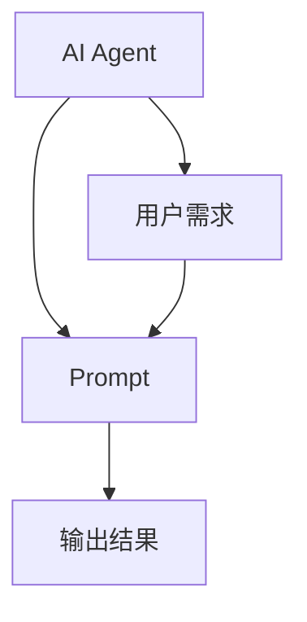
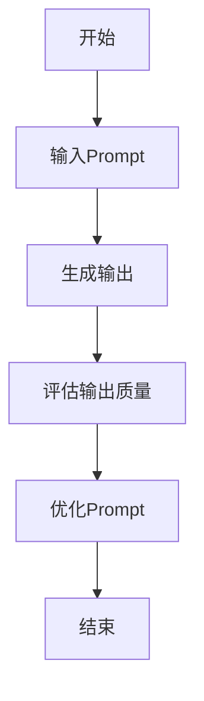
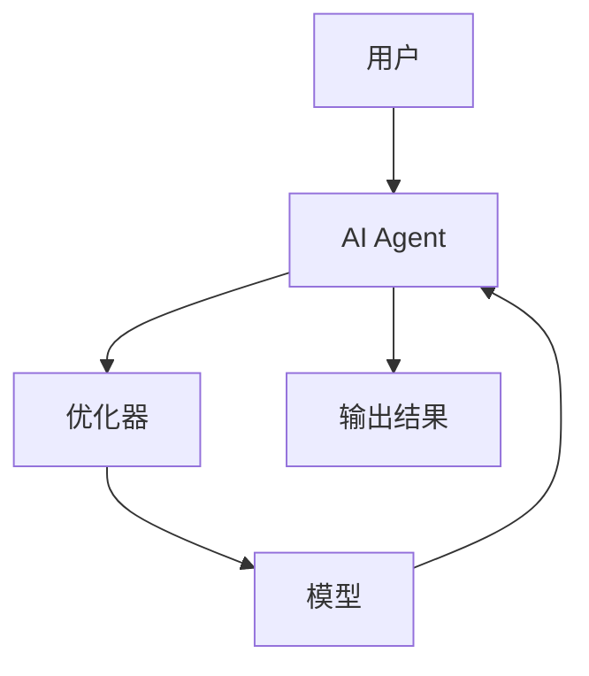

                 


# AI Agent的Prompt工程：优化输入以获得更好的输出

> 关键词：AI Agent，Prompt工程，自然语言处理，机器学习，人工智能，优化算法

> 摘要：本文深入探讨了AI Agent的Prompt工程，从基本概念到算法原理，再到系统架构和项目实战，全面解析如何通过优化输入提示来提升AI Agent的输出质量。文章结合理论与实践，提供详细的优化策略和实现方法，帮助读者更好地理解和应用Prompt工程。

---

## 第一部分: AI Agent与Prompt工程的背景

### 第1章: AI Agent与Prompt工程概述

#### 1.1 AI Agent的基本概念
- **AI Agent的定义**：AI Agent是指能够感知环境并采取行动以实现目标的智能体。它可以是软件程序，也可以是物理机器人，能够执行复杂任务并做出决策。
- **AI Agent的特点**：
  - 智能性：能够理解和处理复杂信息。
  - 反应性：能够实时响应环境变化。
  - 目标导向：通过行动实现特定目标。
- **AI Agent的应用场景**：
  - 自然语言处理：文本生成、对话系统。
  - 机器人控制：工业机器人、服务机器人。
  - 数据分析：自动数据处理和决策支持。

#### 1.2 Prompt工程的核心概念
- **Prompt的定义**：Prompt是用于引导AI模型生成特定输出的输入指令或提示。
- **Prompt工程的目标**：通过设计和优化Prompt，提升AI模型的输出质量、准确性和可控制性。
- **Prompt工程的意义**：
  - 提高AI模型的可解释性。
  - 优化用户体验，使AI输出更符合预期。
  - 提升AI模型的泛化能力和适应性。

#### 1.3 当前AI Agent与Prompt工程的发展现状
- **AI Agent技术的发展历程**：
  - 从规则驱动到数据驱动的演变。
  - 多模态AI Agent的崛起。
- **Prompt工程在AI Agent中的应用现状**：
  - 在自然语言处理领域的广泛应用。
  - 在图像生成和数据分析中的初步探索。
- **未来发展趋势与挑战**：
  - 提升Prompt的可解释性和可控制性。
  - 处理复杂场景下的Prompt优化问题。

---

### 第2章: Prompt工程的核心概念与联系

#### 2.1 核心概念原理
- **Prompt的结构**：包括目标、输入数据和约束条件。
- **Prompt与AI Agent的关系**：Prompt是AI Agent与用户或环境交互的桥梁，决定了AI Agent的输出方向和内容。
- **Prompt工程的核心要素**：
  - 输入设计：Prompt的结构和内容。
  - 输出优化：通过Prompt调整模型输出。
  - 评估反馈：根据输出结果优化Prompt。

#### 2.2 核心概念属性对比表格
| 概念 | 属性 | 描述 |
|------|------|------|
| Prompt | 输入形式 | 文本或结构化数据 |
| AI Agent | 输出形式 | 文本、图像、数据 |
| Prompt工程 | 目标 | 优化输入以获得更好的输出 |

#### 2.3 ER实体关系图


---

### 第3章: Prompt工程的算法原理

#### 3.1 算法原理概述
- **Prompt生成的算法流程**：
  1. 分析用户需求，生成初步Prompt。
  2. 输入模型，生成输出。
  3. 评估输出质量，调整Prompt。
  4. 重复优化，直到达到预期。

#### 3.2 算法流程图


#### 3.3 数学模型与公式
- **基本公式**：
  $$ P(output | prompt) = \theta \cdot prompt + \epsilon $$
  其中，$\theta$ 表示模型参数，$\epsilon$ 表示噪声。
- **优化公式**：
  $$ \text{loss} = \sum_{i=1}^n (y_i - \hat{y}_i)^2 $$
  其中，$y_i$ 是实际输出，$\hat{y}_i$ 是预测输出。

---

## 第二部分: AI Agent的系统架构与实现

### 第4章: 系统架构设计

#### 4.1 系统功能设计
- **领域模型**：
  ```mermaid
  classDiagram
  class AI-Agent {
    <属性>
    + prompt: string
    + output: string
    <方法>
    - generate_output(): string
    - optimize_prompt(): string
  }
  ```

- **系统架构图**：
  ```mermaid
  graph TD
  A[用户] --> B[AI Agent]
  B --> C[Prompt优化器]
  C --> D[模型]
  D --> E[输出结果]
  ```

- **系统接口设计**：
  - 用户接口：接收输入和显示输出。
  - 模型接口：与AI模型交互，生成输出。
  - 优化接口：调整Prompt以提升输出质量。

#### 4.2 系统交互设计


---

### 第5章: 项目实战

#### 5.1 项目环境安装
- **安装Python环境**：
  ```bash
  python --version
  pip install --upgrade pip
  ```

- **安装依赖库**：
  ```bash
  pip install numpy matplotlib scikit-learn
  ```

#### 5.2 核心代码实现
```python
def generate_output(prompt):
    # 示例代码：生成输出
    return f"Output generated from prompt: {prompt}"

def optimize_prompt(current_prompt, target_output):
    # 示例代码：优化Prompt
    return f"Optimized prompt for target output: {target_output}"
```

#### 5.3 实际案例分析
- **案例1**：优化文本生成。
  ```python
  initial_prompt = "Generate a paragraph about AI."
  optimized_prompt = optimize_prompt(initial_prompt, "AI is revolutionizing industries.")
  print(generate_output(optimized_prompt))
  ```

---

## 第三部分: 最佳实践与总结

### 第6章: 最佳实践与总结

#### 6.1 优化策略
- **逐步优化**：从简单Prompt开始，逐步增加复杂性。
- **反馈机制**：根据输出结果调整Prompt。
- **多模态结合**：结合图像、数据等多种输入形式。

#### 6.2 小结
- Prompt工程是AI Agent优化的关键环节。
- 通过科学的设计和优化，可以显著提升AI Agent的输出质量。

#### 6.3 注意事项
- **可解释性**：确保Prompt优化过程透明。
- **鲁棒性**：设计健壮的优化算法，避免过拟合。
- **用户体验**：优化Prompt以提升用户体验。

---

## 作者

作者：AI天才研究院/AI Genius Institute & 禅与计算机程序设计艺术 /Zen And The Art of Computer Programming

---

**注**：以上内容是按照您的要求逐步展开的思考过程，您可以根据需要进一步调整和优化内容。

