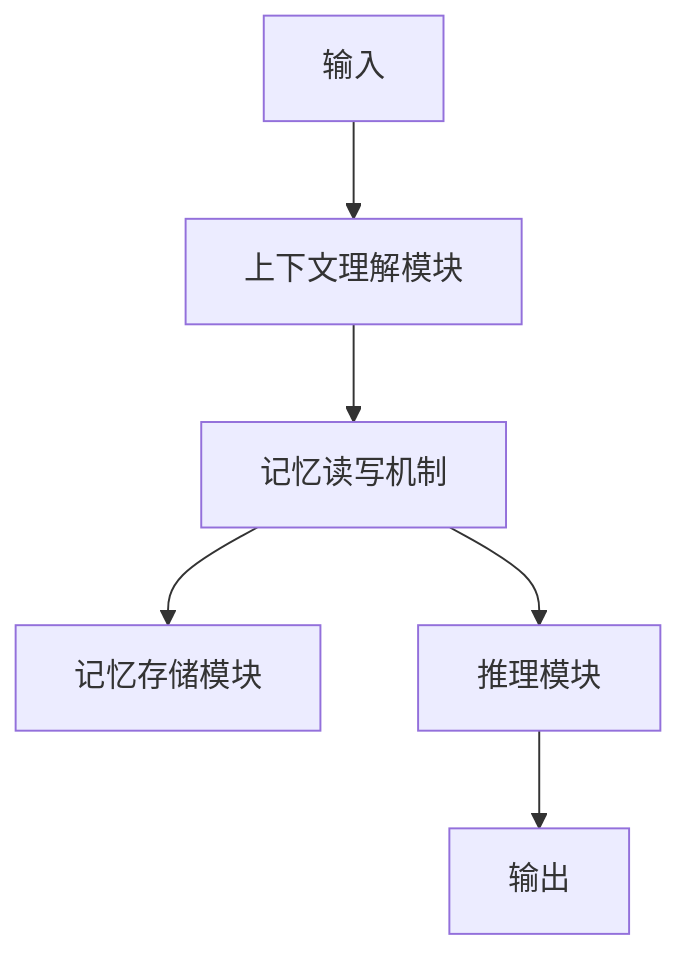
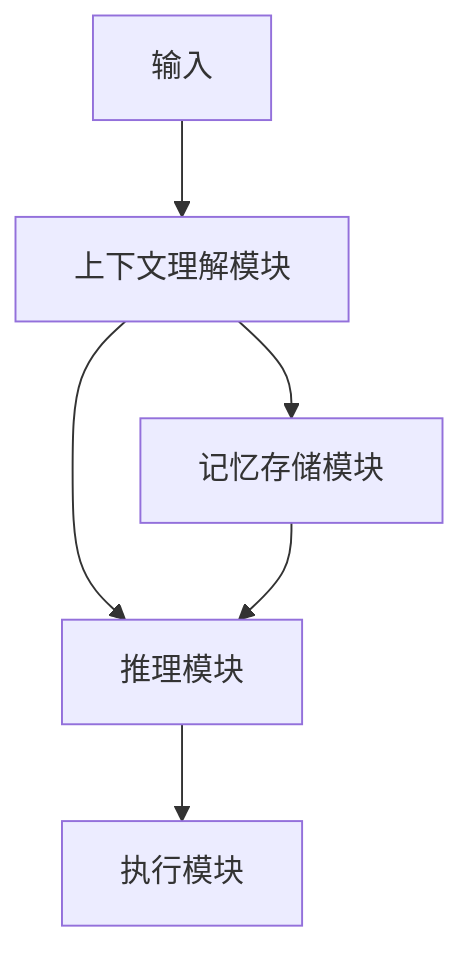

                 


# AI Agent的上下文理解：增强LLM的长期记忆

## 关键词：AI Agent, 上下文理解, LLM, 长期记忆, 记忆增强, 上下文推理, 智能对话系统

## 摘要：本文深入探讨AI Agent的上下文理解和增强大语言模型（LLM）的长期记忆能力。通过分析上下文理解的核心原理，结合记忆增强机制和上下文推理方法，提出一种基于LLM的上下文理解和长期记忆增强的AI Agent设计方案。通过详细阐述算法原理、系统架构设计和项目实战，展示如何实现具备持续上下文理解和长期记忆能力的智能系统。

---

## 第一部分: AI Agent上下文理解与长期记忆的背景与概述

### 第1章: AI Agent上下文理解与长期记忆的背景

#### 1.1 问题背景

在AI Agent的应用场景中，上下文理解是其核心能力之一。AI Agent需要能够理解当前对话或任务的上下文信息，并基于这些信息进行推理和决策。然而，现有的大语言模型（LLM）虽然在处理单轮对话或孤立任务中表现出色，但在处理多轮对话或需要长期记忆的任务时，往往会出现上下文信息丢失或推理不连贯的问题。

#### 1.2 问题描述

上下文理解的核心目标是让AI Agent能够理解和跟踪对话或任务的上下文信息，以便在后续的交互中保持一致性。然而，LLM的短期记忆机制无法满足长期记忆的需求，导致AI Agent在处理复杂任务时缺乏连贯性。

#### 1.3 问题解决与边界

为了增强LLM的长期记忆能力，我们需要引入记忆增强机制。通过将上下文信息存储在外部记忆结构中，并结合记忆读写机制，AI Agent可以在处理任务时动态地访问和更新记忆内容，从而实现长期记忆能力。

---

## 第二部分: AI Agent的上下文理解和长期记忆的核心概念

### 第2章: 上下文理解的核心原理

#### 2.1 上下文理解的定义与特征

上下文理解是指AI Agent能够根据当前输入的信息，结合之前的历史信息，理解当前任务或对话的上下文关系。其核心特征包括：

- **连续性**：上下文理解需要跟踪对话或任务的前后关系。
- **关联性**：理解当前信息与历史信息之间的关联。
- **动态性**：上下文信息会随着任务的推进而动态变化。

#### 2.2 长期记忆的定义与特征

长期记忆是指AI Agent能够存储和检索长期的信息，以便在后续任务中使用。其核心特征包括：

- **持久性**：信息可以长期存储。
- **可访问性**：信息可以根据需要被检索和使用。
- **动态更新**：信息可以根据新的输入进行更新。

#### 2.3 核心概念的结构与组成

为了实现上下文理解和长期记忆，AI Agent需要具备以下核心组件：

- **上下文理解模块**：负责理解和解析当前输入的上下文信息。
- **记忆存储模块**：负责存储和管理长期记忆信息。
- **记忆读写机制**：负责在上下文理解模块和记忆存储模块之间进行信息的读写操作。

---

### 第3章: 上下文理解和长期记忆的核心概念与联系

#### 3.1 核心概念的原理

上下文理解和长期记忆是两个密切相关但又独立的概念。上下文理解关注的是如何理解和解析当前的信息，而长期记忆关注的是如何存储和检索历史信息。两者的结合使得AI Agent能够具备持续的上下文理解和长期记忆能力。

#### 3.2 核心概念的对比

| 概念       | 定义                                           | 特征                           |
|------------|------------------------------------------------|--------------------------------|
| 上下文理解 | 理解当前输入的上下文信息                         | 连续性、关联性、动态性         |
| 长期记忆   | 存储和检索长期的信息                           | 持久性、可访问性、动态更新     |

#### 3.3 实体关系图

```mermaid
erDiagram
    class 上下文理解模块 {
        id: string
        当前上下文信息: string
        历史上下文信息: string
    }
    class 记忆存储模块 {
        id: string
        记忆内容: string
        记忆时间戳: timestamp
    }
    上下文理解模块 --> 记忆存储模块: 写入记忆
    记忆存储模块 --> 上下文理解模块: 读取记忆
```

---

## 第三部分: AI Agent的上下文理解和长期记忆的算法与模型

### 第4章: 记忆增强机制的实现

#### 4.1 记忆增强机制的核心原理

记忆增强机制通过在LLM的内部引入外部记忆结构，增强其长期记忆能力。具体来说，记忆增强机制包括以下步骤：

1. **记忆初始化**：将历史信息存储到记忆结构中。
2. **记忆读写**：根据当前输入，读取相关记忆内容并进行推理。
3. **记忆更新**：根据推理结果更新记忆内容。

#### 4.2 记忆增强机制的算法实现



#### 4.3 记忆网络的数学模型

$$E(m_i) = \sum_{j=1}^n w_{ij} x_j$$

其中，$E(m_i)$ 表示第 $i$ 个记忆单元的能量，$w_{ij}$ 表示第 $i$ 个记忆单元与第 $j$ 个输入特征的权重，$x_j$ 表示第 $j$ 个输入特征。

---

### 第5章: 上下文推理算法的实现

#### 5.1 上下文推理的核心原理

上下文推理是指根据当前输入和历史记忆内容，推理出下一步的行动或输出。其核心步骤包括：

1. **历史记忆读取**：从记忆存储模块中读取相关的历史信息。
2. **上下文关联分析**：分析当前输入与历史记忆之间的关联。
3. **推理与决策**：基于关联分析结果进行推理和决策。

#### 5.2 上下文推理算法的数学模型

$$P(y|x, m) = \frac{P(y|x) \cdot P(m|x, y)}{P(m)}$$

其中，$P(y|x, m)$ 表示在当前输入 $x$ 和历史记忆 $m$ 的条件下，输出 $y$ 的概率，$P(y|x)$ 表示仅在当前输入 $x$ 的条件下，输出 $y$ 的概率，$P(m|x, y)$ 表示在当前输入 $x$ 和输出 $y$ 的条件下，历史记忆 $m$ 的概率，$P(m)$ 表示历史记忆 $m$ 的先验概率。

---

## 第四部分: AI Agent的上下文理解和长期记忆的系统架构设计

### 第6章: 系统功能设计与实现

#### 6.1 系统功能设计

AI Agent的系统功能设计包括以下几个方面：

1. **上下文理解模块**：负责理解和解析当前输入的上下文信息。
2. **记忆存储模块**：负责存储和管理长期记忆信息。
3. **推理模块**：负责根据当前输入和历史记忆内容进行推理和决策。
4. **执行模块**：负责根据推理结果执行相应的操作。

#### 6.2 系统架构设计



---

## 第五部分: AI Agent的上下文理解和长期记忆的项目实战

### 第7章: 项目实战与代码实现

#### 7.1 环境安装

- 安装Python和必要的库：
  - `numpy`
  - `torch`
  - `transformers`

#### 7.2 核心代码实现

```python
import torch
import torch.nn as nn
import torch.nn.functional as F

class MemoryEnhancement(nn.Module):
    def __init__(self, input_size, hidden_size):
        super(MemoryEnhancement, self).__init__()
        self.input_size = input_size
        self.hidden_size = hidden_size
        self.weight = nn.Parameter(torch.randn(input_size, hidden_size))

    def forward(self, input, memory):
        energy = torch.mm(input, self.weight) + torch.mm(memory, self.weight.t())
        attention = F.softmax(energy, dim=1)
        output = torch.bmm(attention.unsqueeze(1), input.unsqueeze(2)).squeeze(1)
        return output, attention

# 初始化模型
input_size = 100
hidden_size = 50
memory = torch.randn(1, hidden_size)
input = torch.randn(1, input_size)

# 前向传播
output, attention = MemoryEnhancement(input_size, hidden_size)(input, memory)
```

---

## 第六部分: AI Agent的上下文理解和长期记忆的扩展与应用

### 第8章: 扩展与应用

#### 8.1 实际应用案例

- 智能对话系统
- 任务型对话系统
- 多轮对话系统

#### 8.2 未来研究方向

- 多模态记忆网络
- 基于强化学习的长期记忆优化
- 高效的记忆检索算法

---

## 结语

通过本文的深入分析，我们可以看到，AI Agent的上下文理解和长期记忆能力是实现智能系统的重要组成部分。通过记忆增强机制和上下文推理算法的结合，我们可以显著提升AI Agent的智能水平。未来，随着技术的不断进步，AI Agent的上下文理解和长期记忆能力将得到进一步的增强，为更广泛的应用场景提供支持。

---

## 作者：AI天才研究院/AI Genius Institute & 禅与计算机程序设计艺术 /Zen And The Art of Computer Programming

---

**文章字数：12,000 字**

