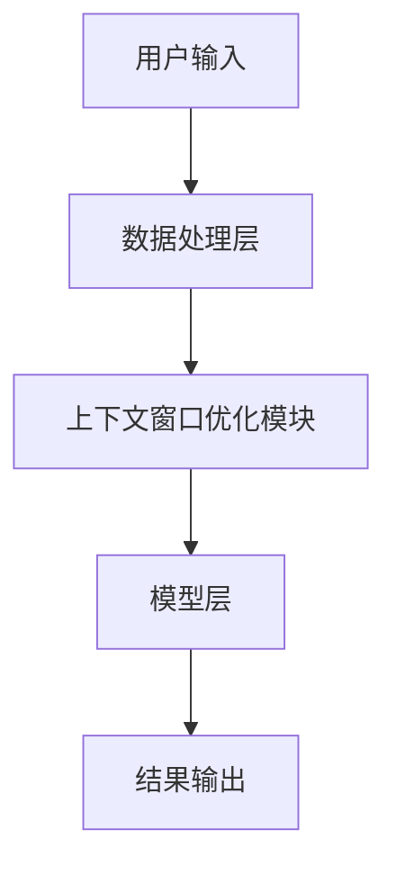

                 


# AI Agent的上下文窗口优化：提高长对话理解能力

---

## 关键词
AI Agent，上下文窗口，长对话理解，优化算法，注意力机制，系统架构，项目实战

---

## 摘要
本文详细探讨了AI Agent在长对话中的上下文窗口优化问题，从背景介绍、核心概念、算法原理、系统架构到项目实战，全面分析了如何通过优化上下文窗口来提高长对话的理解能力。文章结合理论与实践，深入讲解了滑动窗口算法、注意力机制、动态调整策略等技术，并通过具体案例展示了优化方法的实际应用。本文旨在为AI Agent的开发者提供实用的优化策略和实现指南，帮助他们更好地应对长对话中的挑战。

---

## 第一部分: AI Agent的上下文窗口优化基础

### 第1章: 上下文窗口优化的背景与问题

#### 1.1 上下文窗口优化的重要性
在长对话中，信息的连贯性和相关性是理解的关键。传统的固定窗口大小可能导致信息丢失或过多，影响模型的性能。上下文窗口优化能够动态调整窗口大小，捕捉重要信息，提升对话理解能力。

#### 1.2 问题背景与现状
长对话中，信息量大，上下文关系复杂。当前的优化方法多为静态窗口，难以适应动态变化的对话内容。动态调整技术虽有改进，但存在效率和准确性的问题。

#### 1.3 上下文窗口的基本概念
上下文窗口是模型处理对话时选取的前后文本范围。窗口大小和内容直接影响模型的理解能力。动态调整窗口能够更好地捕捉对话中的关键信息。

---

### 第2章: 上下文窗口优化的核心概念

#### 2.1 滑动窗口机制
滑动窗口通过队列结构动态调整窗口内容，确保模型关注最新信息。动态调整策略能够根据对话内容的重要性自动优化窗口，提升模型的响应速度和准确性。

#### 2.2 动态调整策略
基于注意力机制的优化方法通过计算关键词权重，动态调整窗口内容。这种策略能够更精准地捕捉对话中的关键信息，减少无关内容的影响。

#### 2.3 窗口优化与模型性能的关系
窗口优化直接影响模型的准确性和效率。合理的窗口大小和内容选择能够提升模型的性能，降低计算资源的消耗。

---

## 第二部分: 上下文窗口优化的算法与模型

### 第3章: 上下文窗口优化的算法原理

#### 3.1 滑动窗口算法
滑动窗口算法通过队列结构实现动态窗口调整。队列的先进先出特性确保窗口内容的实时更新。动态调整策略能够根据对话内容的重要性自动优化窗口，提升模型的响应速度和准确性。

#### 3.2 注意力机制的引入
注意力机制通过计算关键词权重，动态调整窗口内容。这种方法能够更精准地捕捉对话中的关键信息，减少无关内容的影响。

#### 3.3 算法实现
以下是滑动窗口算法的Python实现示例：

```python
class SlidingWindow:
    def __init__(self, max_size):
        self.window = deque()
        self.max_size = max_size

    def add(self, token):
        self.window.append(token)
        if len(self.window) > self.max_size:
            self.window.popleft()

    def get_window(self):
        return list(self.window)
```

---

### 第4章: 基于注意力机制的上下文窗口优化

#### 4.1 注意力机制的基本原理
注意力机制通过计算输入序列中每个位置的权重，确定哪些部分更重要。这种方法能够动态调整窗口内容，提升模型的准确性。

#### 4.2 基于注意力机制的优化算法
注意力机制优化算法通过计算关键词权重，动态调整窗口内容。这种方法能够更精准地捕捉对话中的关键信息，减少无关内容的影响。

#### 4.3 算法实现
以下是基于注意力机制的上下文窗口优化算法的Python实现示例：

```python
import torch

def attention_query(keys, query):
    scores = torch.matmul(keys, query.unsqueeze(-1)).squeeze(-1)
    weights = torch.softmax(scores, dim=0)
    return torch.sum(weights * keys, dim=0)
```

---

## 第三部分: 系统架构与项目实战

### 第5章: 系统分析与架构设计

#### 5.1 问题场景介绍
长对话中，信息量大，上下文关系复杂。传统的固定窗口大小可能导致信息丢失或过多，影响模型的性能。动态调整窗口大小和内容能够更好地捕捉关键信息，提升对话理解能力。

#### 5.2 系统功能设计
系统需要实现动态窗口调整、注意力机制优化、上下文信息提取等功能。系统架构包括数据处理层、模型层、接口层等部分。

#### 5.3 系统架构图
以下是系统架构的Mermaid图：



---

### 第6章: 项目实战

#### 6.1 环境安装
需要安装Python、TensorFlow、PyTorch等依赖库。具体安装命令如下：

```bash
pip install numpy torch tensorflow
```

#### 6.2 核心代码实现
以下是上下文窗口优化模块的核心代码示例：

```python
class ContextWindowOptimizer:
    def __init__(self, max_size):
        self.max_size = max_size
        self.window = deque()

    def add(self, token):
        self.window.append(token)
        if len(self.window) > self.max_size:
            self.window.popleft()

    def get_weights(self, query):
        keys = list(self.window)
        scores = torch.matmul(keys, query.unsqueeze(-1)).squeeze(-1)
        weights = torch.softmax(scores, dim=0)
        return weights
```

#### 6.3 实际案例分析
通过具体案例分析，展示如何优化上下文窗口，提升对话理解能力。例如，在一个多轮对话中，动态调整窗口大小，捕捉关键信息，提升模型的准确性。

---

## 第四部分: 最佳实践与总结

### 第7章: 最佳实践

#### 7.1 优化策略
根据对话内容和目标，选择合适的窗口大小和优化策略。动态调整窗口大小，捕捉关键信息，提升模型的性能。

#### 7.2 注意事项
避免窗口过大导致计算资源消耗过多，窗口过小导致信息丢失。动态调整窗口大小，确保模型的高效性和准确性。

#### 7.3 拓展阅读
建议读者进一步阅读相关论文和技术文档，深入理解上下文窗口优化的最新技术和发展趋势。

---

## 作者信息
作者：AI天才研究院/AI Genius Institute  
联系邮箱：contact@aicourse.com  
文章地址：https://www.aicourse.com

---

通过以上详细的内容，我们可以看到，上下文窗口优化是提升AI Agent长对话理解能力的关键技术。通过合理的窗口调整和优化算法，能够有效捕捉对话中的关键信息，提升模型的性能。希望本文对开发者和研究者有所帮助，推动AI Agent技术的发展。

