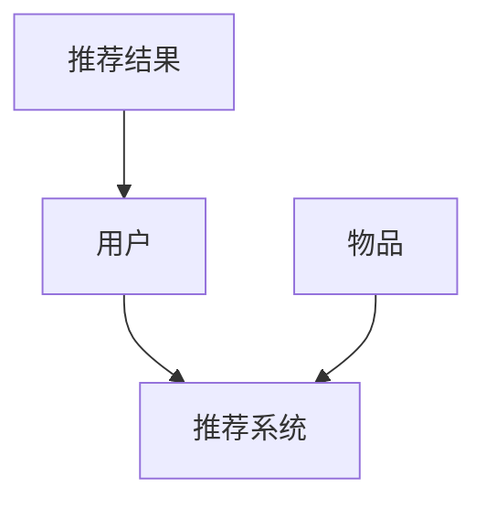
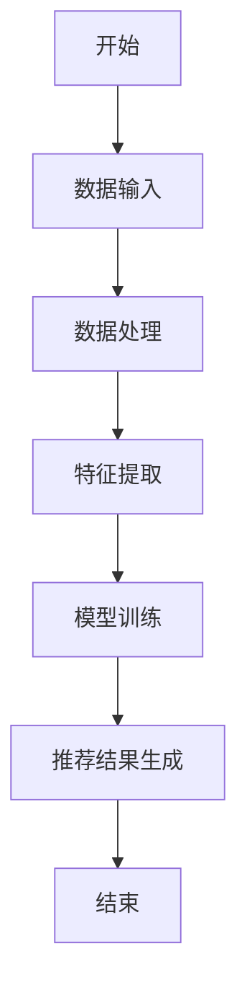

                 

# AI Agent的个性化推荐系统优化

---

## 关键词：
AI Agent, 个性化推荐系统, 算法优化, 深度学习, 系统设计, 推荐系统

---

## 摘要：
本文从AI Agent与个性化推荐系统的结合出发，深入分析推荐系统的算法原理、系统架构和优化策略。通过实际案例，详细讲解如何利用AI Agent技术提升推荐系统的个性化和实时性。文章涵盖从理论到实践的全过程，包括协同过滤、深度学习推荐算法、系统架构设计、项目实现与优化等内容，为读者提供全面的技术指导。

---

# 第一部分: AI Agent与个性化推荐系统概述

---

## 第1章: AI Agent与个性化推荐系统背景

### 1.1 AI Agent的基本概念
- 1.1.1 什么是AI Agent
  - AI Agent的定义
  - AI Agent的核心特征
  - AI Agent与传统推荐系统的区别

- 1.1.2 AI Agent的核心特征
  - 智能性
  - 自适应性
  - 实时性

- 1.1.3 AI Agent与传统推荐系统的区别
  - 数据处理能力
  - 个性化能力
  - 实时性与动态性

### 1.2 个性化推荐系统的定义与特点
- 1.2.1 个性化推荐的定义
  - 推荐系统的基本概念
  - 个性化推荐的核心目标

- 1.2.2 个性化推荐的核心特点
  - 用户个性化需求的捕捉
  - 数据驱动的推荐
  - 实时性与动态性

- 1.2.3 个性化推荐与AI Agent的结合
  - AI Agent在推荐系统中的角色
  - AI Agent如何提升推荐的个性化与实时性

### 1.3 AI Agent在推荐系统中的应用背景
- 1.3.1 当前推荐系统的痛点
  - 传统推荐系统的局限性
  - 用户需求的多样化与动态性
  - 数据量与计算能力的挑战

- 1.3.2 AI Agent如何解决推荐问题
  - AI Agent的智能性与适应性
  - AI Agent在推荐系统中的具体应用

- 1.3.3 个性化推荐的边界与外延
  - 推荐系统的适用场景
  - 个性化推荐的未来发展方向

---

## 第2章: AI Agent与个性化推荐的核心概念

### 2.1 AI Agent的核心原理
- 2.1.1 知识表示与推理
  - 知识表示的基本概念
  - 推理机制的实现

- 2.1.2 意图识别与目标设定
  - 意图识别的核心算法
  - 目标设定的动态调整

- 2.1.3 自适应学习机制
  - 自适应学习的定义
  - 自适应学习的具体实现

### 2.2 个性化推荐的原理
- 2.2.1 协同过滤算法
  - 基于用户的协同过滤
  - 基于物品的协同过滤
  - 混合协同过滤

- 2.2.2 基于内容的推荐
  - 文本挖掘与特征提取
  - 基于向量空间模型的推荐
  - 基于深度学习的内容推荐

- 2.2.3 混合推荐模型
  - 混合推荐模型的优缺点
  - 混合推荐模型的实现方法

### 2.3 AI Agent与推荐系统的关联
- 2.3.1 AI Agent在推荐中的角色
  - 数据处理与分析
  - 推荐策略的制定
  - 实时反馈的处理

- 2.3.2 推荐系统的数据流
  - 数据的输入与处理
  - 数据的分析与挖掘
  - 数据的输出与反馈

- 2.3.3 AI Agent如何优化推荐过程
  - AI Agent在推荐过程中的具体应用
  - AI Agent如何提升推荐的实时性和个性化

### 2.4 核心概念对比表
- 2.4.1 AI Agent与传统推荐系统的对比
  - 对比维度：数据处理能力、个性化能力、实时性

- 2.4.2 不同推荐算法的优缺点对比
  - 协同过滤算法：优点与缺点
  - 基于内容的推荐：优点与缺点
  - 混合推荐模型：优点与缺点

### 2.5 ER实体关系图

---

## 第3章: AI Agent推荐系统的算法原理

### 3.1 协同过滤算法
- 3.1.1 基于用户的协同过滤
  - 算法原理
  - 具体实现步骤
  - 优缺点分析

- 3.1.2 基于物品的协同过滤
  - 算法原理
  - 具体实现步骤
  - 优缺点分析

- 3.1.3 混合协同过滤
  - 算法原理
  - 具体实现步骤
  - 优缺点分析

### 3.2 基于内容的推荐算法
- 3.2.1 文本挖掘与特征提取
  - 文本挖掘的基本概念
  - 特征提取的具体方法

- 3.2.2 基于向量空间模型的推荐
  - 向量空间模型的定义
  - 基于向量空间模型的推荐算法实现

- 3.2.3 基于深度学习的内容推荐
  - 深度学习在内容推荐中的应用
  - 具体实现方法

### 3.3 基于深度学习的推荐算法
- 3.3.1 神经网络在推荐中的应用
  - 神经网络的基本概念
  - 神经网络在推荐中的具体应用

- 3.3.2 基于序列的推荐模型
  - 序列推荐的基本概念
  - 基于序列的推荐模型实现

- 3.3.3 基于图的推荐模型
  - 图推荐的基本概念
  - 基于图的推荐模型实现

### 3.4 算法流程图

---

## 第4章: 推荐系统的系统分析与架构设计

### 4.1 系统分析
- 4.1.1 问题场景介绍
  - 推荐系统的应用场景
  - 系统的输入与输出

- 4.1.2 项目介绍
  - 项目的背景
  - 项目的总体目标

### 4.2 系统功能设计
- 4.2.1 领域模型
  - 领域模型的定义
  - 领域模型的mermaid类图

### 4.3 系统架构设计
- 4.3.1 系统架构的mermaid架构图
  - 系统架构的组成
  - 各组件之间的关系

### 4.4 系统接口设计
- 4.4.1 接口的设计
  - 接口的定义
  - 接口的实现

### 4.5 系统交互流程设计
- 4.5.1 系统交互的mermaid序列图
  - 系统交互的基本流程
  - 具体实现步骤

---

## 第5章: 项目实战——个性化推荐系统实现

### 5.1 环境安装
- 5.1.1 开发环境的选择
  - 开发工具的安装与配置
  - 依赖库的安装

### 5.2 系统核心实现
- 5.2.1 推荐算法的实现
  - 协同过滤算法的实现
  - 基于内容的推荐算法的实现

- 5.2.2 系统架构的实现
  - 系统架构的具体实现
  - 接口的设计与实现

### 5.3 代码实现与解读
- 5.3.1 协同过滤算法的代码实现
  - Python代码示例
  - 代码解读

- 5.3.2 基于深度学习的推荐算法实现
  - Python代码示例
  - 代码解读

### 5.4 实际案例分析
- 5.4.1 案例背景介绍
  - 案例的具体应用场景
  - 案例的目标

- 5.4.2 案例实现与分析
  - 案例的具体实现
  - 案例的分析与优化

---

## 第6章: 推荐系统的优化策略

### 6.1 算法优化
- 6.1.1 算法优化的具体方法
  - 算法优化的核心思想
  - 算法优化的具体步骤

- 6.1.2 基于深度学习的优化策略
  - 深度学习模型的优化方法
  - 优化策略的具体实现

### 6.2 系统优化
- 6.2.1 系统架构的优化
  - 系统架构优化的具体方法
  - 优化后的系统架构

- 6.2.2 系统性能优化
  - 系统性能优化的核心思想
  - 优化的具体步骤

### 6.3 实时反馈优化
- 6.3.1 实时反馈的核心思想
  - 实时反馈的定义
  - 实时反馈的具体实现

- 6.3.2 基于用户反馈的优化策略
  - 用户反馈的收集与处理
  - 基于用户反馈的优化方法

---

## 第7章: 总结与展望

### 7.1 本章总结
- 7.1.1 全文总结
  - 全文的核心内容
  - 全文的主要结论

### 7.2 未来展望
- 7.2.1 个性化推荐系统的未来发展方向
  - 技术发展的趋势
  - 应用场景的扩展

- 7.2.2 AI Agent在推荐系统中的未来应用
  - AI Agent技术的进一步发展
  - AI Agent在推荐系统中的更多应用可能性

---

## 作者：AI天才研究院/AI Genius Institute & 禅与计算机程序设计艺术 /Zen And The Art of Computer Programming

