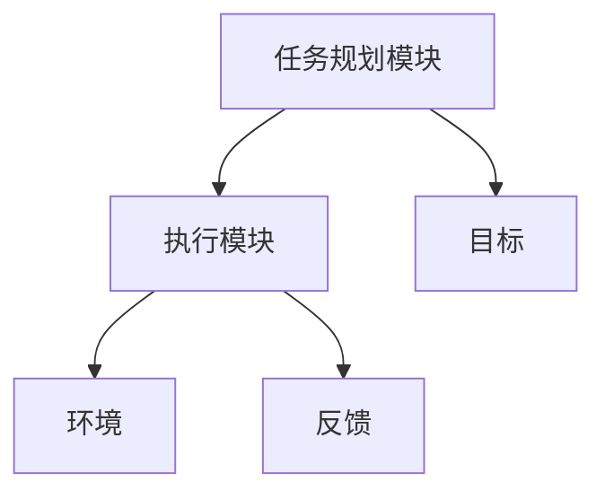
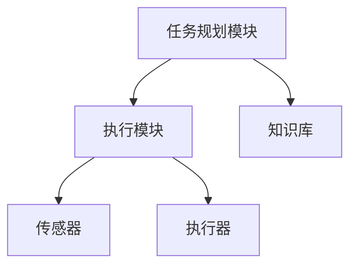
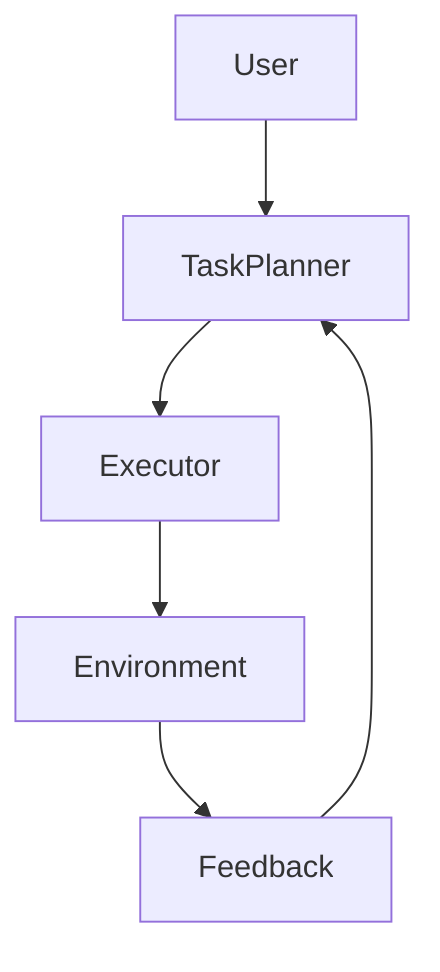

                 


# AI Agent的任务规划与执行模块设计

## 关键词：
AI Agent，任务规划，执行模块，算法原理，系统架构，项目实战

## 摘要：
AI Agent的任务规划与执行模块设计是实现智能系统核心功能的关键部分。本文将从AI Agent的基本概念出发，详细探讨任务规划与执行模块的设计原理、算法实现、系统架构，并通过具体案例分析，帮助读者理解如何设计和实现高效的AI Agent任务规划与执行模块。

---

## 第一部分：AI Agent的任务规划与执行模块背景介绍

### 第1章：AI Agent的基本概念与任务规划的重要性

#### 1.1 AI Agent的定义与核心特征
- **AI Agent的定义**：AI Agent是一种能够感知环境、自主决策并采取行动以实现目标的智能实体。
- **AI Agent的核心特征**：
  - **自主性**：能够在没有外部干预的情况下独立运作。
  - **反应性**：能够根据环境的变化实时调整行为。
  - **目标导向性**：所有行动都围绕实现特定目标展开。
  - **学习能力**：通过经验改进性能。

#### 1.2 任务规划与执行模块的定义
- **任务规划的定义**：根据目标和环境状态，生成一系列行动步骤的过程。
- **任务执行模块的定义**：将规划好的步骤转化为实际行动的模块。
- **任务规划与执行模块的重要性**：是AI Agent完成任务的核心部分，决定了系统的效率和准确性。

#### 1.3 任务规划与执行模块的背景与应用
- **当前AI Agent的发展趋势**：从简单规则驱动向复杂自主决策发展。
- **任务规划与执行模块在AI Agent中的地位**：是连接感知与行动的桥梁。
- **实际应用场景**：
  - 智能助手（如Siri、Alexa）
  - 自动驾驶汽车
  - 机器人控制
  - 任务调度系统

---

### 第2章：任务规划与执行模块的核心概念与联系

#### 2.1 核心概念原理
- **任务规划的基本原理**：
  - 分析目标，分解任务，生成可行的行动序列。
- **任务执行的基本原理**：
  - 根据规划的步骤，通过传感器和执行器与环境交互。
- **任务规划与执行的协同机制**：
  - 规划模块生成计划，执行模块将其转化为实际操作。
  - 执行过程中，反馈信息用于调整或优化计划。

#### 2.2 核心概念属性特征对比表格

| **概念**       | **任务规划**            | **任务执行**            |
|----------------|-------------------------|-------------------------|
| **核心功能**    | 生成行动序列           | 执行具体动作           |
| **输入**        | 状态、目标              | 行动序列、环境反馈     |
| **输出**        | 行动序列               | 实际环境变化           |
| **依赖模块**    | 知识库、推理引擎        | 执行器、传感器          |

#### 2.3 ER实体关系图架构


---

## 第二部分：任务规划与执行模块的设计与实现

### 第3章：算法原理讲解

#### 3.1 任务规划算法原理
- **A*算法**：
  - 结合启发式搜索，找到从初始状态到目标状态的最短路径。
  - 启发式函数评估当前状态距离目标的剩余成本。
- **分层规划方法**：
  - 将复杂任务分解为子任务，逐层规划。

#### 3.2 任务执行模块算法
- **行为树（Behavior Tree）**：
  - 将任务分解为多个行为节点，通过优先级和依赖关系控制执行顺序。
- **状态机（State Machine）**：
  - 根据当前状态和输入，切换到下一个状态。

#### 3.3 任务规划算法流程图
```mermaid
graph TD
    Start --> AnalyzeState
    AnalyzeState --> GenerateActions
    GenerateActions --> SelectBestAction
    SelectBestAction --> ExecuteAction
    ExecuteAction --> CheckGoal
    CheckGoal --> (是) --> End
    CheckGoal --> (否) --> Start
```

#### 3.4 任务执行模块的Python代码实现
```python
def task_planner(current_state, goal):
    # 使用A*算法生成行动序列
    open_set = {current_state}
    came_from = {}
    g_score = {current_state: 0}
    f_score = {current_state: heuristic(current_state, goal)}
    
    while open_set:
        current = pop_lowest_f_score(open_set)
        if current == goal:
            return reconstruct_path(came_from, current)
        for neighbor in get_neighbors(current):
            tentative_g_score = g_score[current] + cost(current, neighbor)
            if neighbor not in g_score or tentative_g_score < g_score[neighbor]:
                came_from[neighbor] = current
                g_score[neighbor] = tentative_g_score
                f_score[neighbor] = g_score[neighbor] + heuristic(neighbor, goal)
                if neighbor not in open_set:
                    heappush(open_set, (f_score[neighbor], neighbor))
    return None

def execute_action(action, environment):
    # 根据动作执行操作
    if action == "move_forward":
        environment.move()
    elif action == "turn_left":
        environment.turn("left")
    # 其他动作处理
```

---

### 第4章：数学模型与公式

#### 4.1 任务规划的数学模型
- **状态空间**：$S = \{s_1, s_2, ..., s_n\}$
- **动作空间**：$A = \{a_1, a_2, ..., a_m\}$
- **效用函数**：$U: S \times A \rightarrow \mathbb{R}$

#### 4.2 A*算法的数学公式
- **启发式函数**：$h(s) = \text{估计从状态}s到目标状态的距离}$
- **总评估函数**：$f(s) = g(s) + h(s)$，其中$g(s)$是当前状态的成本。

#### 4.3 分层规划的公式
- **子任务分解**：$T = T_1 \cup T_2 \cup ... \cup T_k$，其中$T_i$是子任务。
- **层次化规划**：每个子任务独立规划，然后合并成全局计划。

---

### 第5章：系统分析与架构设计方案

#### 5.1 系统架构设计
- **模块划分**：
  - 任务规划模块
  - 任务执行模块
  - 传感器与执行器接口
  - 知识库与规则库
- **系统架构图**


#### 5.2 系统接口设计
- **规划模块接口**：
  - 输入：当前状态、目标
  - 输出：行动序列
- **执行模块接口**：
  - 输入：行动序列
  - 输出：环境状态反馈

#### 5.3 系统交互流程图


---

### 第6章：项目实战

#### 6.1 环境安装
- **Python环境**：安装Python 3.x
- **依赖库**：安装numpy、scipy、mermaid等。

#### 6.2 核心代码实现
```python
def main():
    # 初始化环境
    environment = Environment()
    current_state = environment.get_state()
    goal = '完成任务'
    
    # 调用任务规划模块
    plan = task_planner(current_state, goal)
    
    # 执行任务
    for action in plan:
        execute_action(action, environment)
        print(f"执行动作：{action}")
    
    # 检查是否完成
    if environment.is_goal_achieved():
        print("任务完成！")
    else:
        print("任务失败！")

if __name__ == "__main__":
    main()
```

#### 6.3 代码解读与分析
- **任务规划模块**：使用A*算法生成行动序列。
- **任务执行模块**：根据规划的步骤，调用环境中的传感器和执行器。
- **反馈机制**：执行过程中不断接收反馈，调整规划。

#### 6.4 实际案例分析
- **案例：智能助手的任务规划与执行模块设计**
  - 目标：安排会议时间。
  - 规划：查找空闲时间，发送邀请，确认时间。
  - 执行：发送邮件，接收反馈，确认最终时间。

---

## 第三部分：总结与拓展阅读

### 第7章：总结与展望
- **总结**：任务规划与执行模块是AI Agent的核心，决定了系统的智能水平。
- **展望**：结合强化学习和分布式计算，实现更高效的任务规划与执行。

### 第8章：最佳实践与注意事项
- **最佳实践**：
  - 确保任务规划的高效性，避免过度复杂的计划。
  - 任务执行模块要与环境良好交互。
- **注意事项**：
  - 处理不确定性，设计容错机制。
  - 定期优化算法，适应新环境。

---

## 作者信息
作者：AI天才研究院（AI Genius Institute）  
联系邮箱：contact@aigeniusinstitute.com  
GitHub：https://github.com/AI-Genius-Institute  

---

以上是《AI Agent的任务规划与执行模块设计》的技术博客文章的完整大纲和内容，涵盖了从基础概念到实际应用的各个方面，结合理论与实践，帮助读者全面理解AI Agent的任务规划与执行模块的设计与实现。

