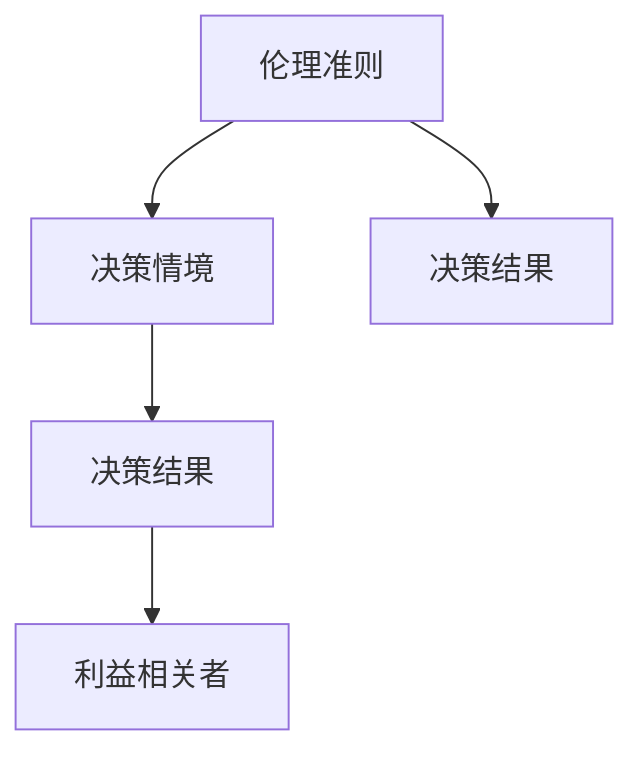
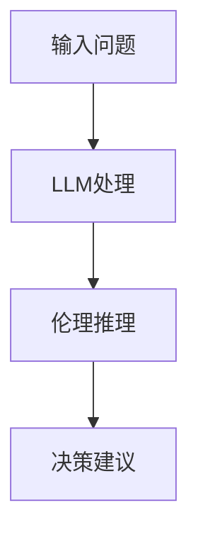
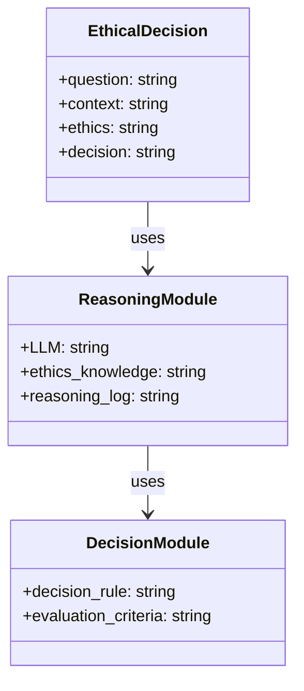
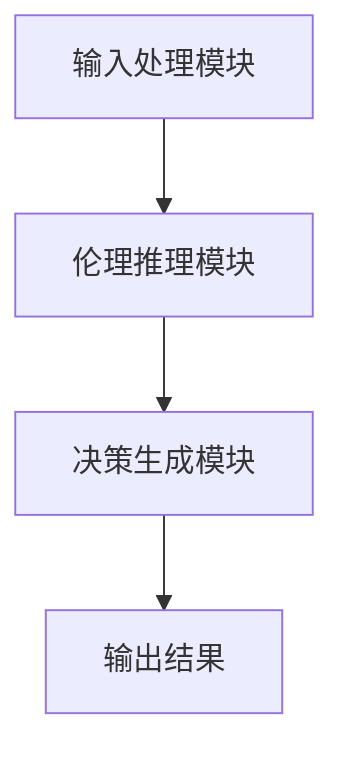
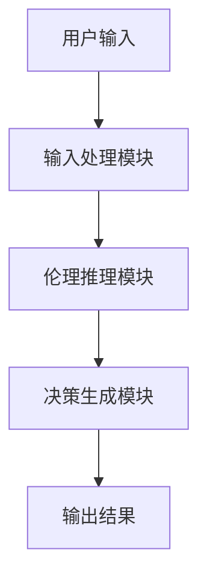
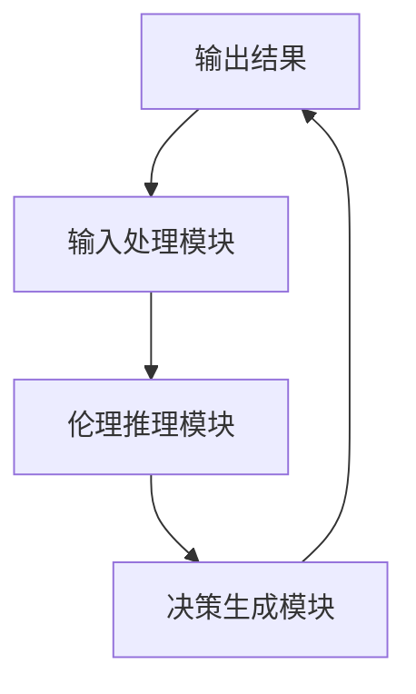

                 


# AI Agent的伦理决策：在LLM中实现道德推理

> 关键词：AI Agent、伦理决策、LLM、道德推理、人工智能、算法、系统架构

> 摘要：本文探讨AI Agent在LLM（大语言模型）中的伦理决策实现，分析其技术原理、算法设计、系统架构和实际应用。文章从背景、概念、算法、系统架构、项目实战、最佳实践等多维度展开，深入剖析伦理决策的核心要素及其在LLM中的实现方式，为AI Agent的伦理决策研究提供理论和实践指导。

---

# 第一部分: AI Agent的伦理决策背景与核心概念

## 第1章: AI Agent与伦理决策的背景

### 1.1 AI Agent的基本概念

#### 1.1.1 AI Agent的定义
AI Agent（人工智能代理）是指能够感知环境、自主决策并执行任务的智能实体。它可以是一个软件程序、机器人或其他智能系统，具备以下核心特征：
- **自主性**：能够在没有外部干预的情况下独立运行。
- **反应性**：能够根据环境反馈实时调整行为。
- **目标导向性**：以明确的目标为导向，执行特定任务。

#### 1.1.2 AI Agent的分类
AI Agent可以根据功能、智能水平和应用场景进行分类：
- **按功能分类**：包括信息检索Agent、推荐系统Agent、对话Agent等。
- **按智能水平分类**：包括基于规则的Agent、基于知识的Agent、基于学习的Agent。
- **按应用场景分类**：包括服务机器人、自动驾驶系统、智能助手等。

#### 1.1.3 AI Agent在现代社会中的作用
AI Agent广泛应用于各个领域，如医疗、金融、教育和交通等。它们通过自动化决策和执行任务，显著提高了效率，但也带来了伦理决策的挑战。

### 1.2 伦理决策的定义与重要性

#### 1.2.1 伦理决策的核心概念
伦理决策是指在涉及人类价值观和道德准则的情况下，AI Agent做出符合伦理规范的选择。它需要考虑以下要素：
- **利益相关者**：决策可能影响的个体或群体。
- **伦理准则**：如诚实、公正、不伤害等。
- **决策情境**：包括紧急情况、资源有限等情况。

#### 1.2.2 伦理决策在AI Agent中的必要性
随着AI Agent在社会中的角色越来越重要，它们需要处理复杂的社会问题，例如自动驾驶中的事故预防和医疗诊断中的患者隐私保护。伦理决策是确保AI Agent行为符合社会规范的关键。

#### 1.2.3 伦理决策的边界与外延
伦理决策的边界包括：
- **适用范围**：AI Agent是否具备处理所有类型伦理问题的能力。
- **责任归属**：当AI Agent的决策导致负面后果时，责任应由谁承担。
- **文化差异**：不同文化背景下，伦理决策的标准可能不同。

### 1.3 LLM与伦理决策的结合

#### 1.3.1 LLM的基本原理
LLM（Large Language Model）是一种基于深度学习的自然语言处理模型，能够理解和生成人类语言。其核心是通过大量数据训练，学习语言的模式和语义。

#### 1.3.2 LLM在伦理决策中的优势
LLM具备以下优势：
- **强大的语言理解能力**：能够处理复杂的伦理问题描述。
- **多语言支持**：可以处理不同语言的伦理决策问题。
- **可扩展性**：能够应用于多个领域和场景。

#### 1.3.3 LLM与AI Agent的融合
通过将LLM嵌入AI Agent，可以实现更智能的伦理决策。LLM作为AI Agent的“大脑”，负责分析问题、推理解决方案，并指导行为。

### 1.4 本章小结
本章介绍了AI Agent的基本概念、伦理决策的核心要素以及LLM在伦理决策中的作用。理解这些内容是后续分析的基础。

---

## 第2章: 伦理决策的核心概念

### 2.1 伦理决策的原理

#### 2.1.1 伦理推理的基本模型
伦理推理是通过逻辑推理和知识库，结合伦理准则，生成符合伦理规范的决策。其基本步骤包括：
1. **问题识别**：识别需要决策的具体问题。
2. **知识检索**：从知识库中检索相关伦理准则和背景信息。
3. **推理与评估**：根据伦理准则和情境，评估不同选项的伦理价值。
4. **决策生成**：选择最优的决策方案。

#### 2.1.2 基于LLM的伦理推理机制
基于LLM的伦理推理机制包括：
- **输入处理**：将伦理问题转化为LLM可理解的输入。
- **内部推理**：LLM根据训练数据和内部参数生成伦理推理结果。
- **输出生成**：将推理结果转化为人类可理解的决策建议。

#### 2.1.3 伦理推理中的关键因素
- **伦理准则的权重**：不同准则在特定情境下的重要性。
- **情境敏感性**：决策需要根据具体情境灵活调整。
- **结果可解释性**：决策过程和结果需要对人类用户可解释。

### 2.2 核心概念对比分析

#### 2.2.1 不同伦理决策模型的特征对比
以下是几种常见伦理决策模型的对比：

| 模型名称          | 基于规则的伦理决策 | 基于知识的伦理决策 | 基于学习的伦理决策 |
|-------------------|--------------------|--------------------|--------------------|
| 基础原理          | 预定义的伦理规则    | 专家知识库         | 数据驱动的模型     |
| 优势              | 实现简单，易于解释  | 知识覆盖面广       | 自适应性强         |
| 局限性            | 难以处理复杂问题    | 知识更新成本高     | 黑箱问题，难以解释   |

#### 2.2.2 基于表格的核心概念对比
以下是伦理决策的核心概念对比：

| 核心概念          | 定义                              | 特征                              |
|-------------------|----------------------------------|----------------------------------|
| 伦理准则          | 用于指导决策的基本道德规范      | 可以是通用的（如诚实）或领域特定的（如医疗隐私） |
| 决策情境          | 决策发生的具体场景              | 可能涉及利益冲突、资源限制等     |
| 决策结果          | 决策的最终输出                  | 需要符合伦理准则和情境要求       |

#### 2.2.3 实体关系图的构建与分析
以下是伦理决策核心概念的实体关系图：



### 2.3 伦理决策的数学模型

#### 2.3.1 伦理决策的基本公式
伦理决策的数学模型可以表示为：
$$
D = f(e, c, k)
$$
其中：
- $D$ 表示决策结果
- $e$ 表示决策情境
- $c$ 表示伦理准则
- $k$ 表示其他相关参数
- $f$ 表示伦理推理函数

#### 2.3.2 伦理推理的概率模型
基于概率的伦理推理模型可以表示为：
$$
P(d_i | e, c) = \frac{\text{伦理得分}(d_i)}{\sum_j \text{伦理得分}(d_j)}
$$
其中：
- $d_i$ 表示第i个决策选项
- $e$ 表示决策情境
- $c$ 表示伦理准则

#### 2.3.3 伦理决策的优化算法
伦理决策的优化可以通过以下步骤实现：
1. 确定决策目标和约束条件。
2. 生成多个候选决策方案。
3. 计算每个方案的伦理得分。
4. 选择伦理得分最高的方案作为最终决策。

### 2.4 本章小结
本章详细介绍了伦理决策的核心概念、数学模型和优化算法，为后续章节的实现提供了理论基础。

---

## 第3章: 伦理决策算法的原理

### 3.1 伦理决策算法的基本流程

#### 3.1.1 输入处理
输入处理包括：
1. **问题描述**：将伦理问题转化为LLM可理解的格式。
2. **上下文信息**：提供决策情境的相关背景信息。
3. **伦理准则**：指定需要遵循的伦理准则。

#### 3.1.2 决策推理
决策推理包括：
1. **知识检索**：从知识库中检索与当前问题相关的伦理准则和案例。
2. **逻辑推理**：基于伦理准则和情境，生成多个决策选项。
3. **伦理评估**：评估每个选项的伦理得分。

#### 3.1.3 输出生成
输出生成包括：
1. **决策建议**：生成符合伦理规范的决策建议。
2. **可解释性报告**：提供决策过程和结果的解释。

### 3.2 基于LLM的伦理推理算法

#### 3.2.1 算法流程图
以下是基于LLM的伦理推理算法的流程图：



#### 3.2.2 算法实现代码
以下是Python代码实现：

```python
def ethical_reasoning(question, context, ethics):
    # 输入处理
    input_str = f"问题：{question}\n上下文：{context}\n伦理准则：{ethics}"
    
    # 决策推理
    reasoning = generate_reasoning(input_str)
    
    # 输出生成
    decision = generate_decision(reasoning)
    return decision

def generate_reasoning(input_str):
    # 具体实现可以根据LLM进行调用
    pass

def generate_decision(reasoning):
    # 具体实现可以根据推理结果生成决策
    pass
```

#### 3.2.3 算法的数学模型
算法的数学模型可以表示为：
$$
D = \argmax_i (P(d_i | e, c))
$$
其中：
- $D$ 表示最终决策
- $d_i$ 表示第i个决策选项
- $e$ 表示决策情境
- $c$ 表示伦理准则
- $P(d_i | e, c)$ 表示第i个决策选项在情境$e$和准则$c$下的概率

### 3.3 算法的优化与改进

#### 3.3.1 算法优化策略
1. **优化伦理准则权重**：根据具体情境调整伦理准则的重要性。
2. **增强可解释性**：通过引入可解释性模块，提高决策过程的透明度。
3. **动态更新模型**：根据反馈不断优化模型性能。

#### 3.3.2 算法改进方案
1. **多模态输入**：结合图像、语音等多种模态信息，提高决策的准确性。
2. **分布式推理**：通过分布式计算提高推理效率。
3. **自适应学习**：根据新数据不断更新模型参数。

#### 3.3.3 算法性能评估
算法性能可以通过以下指标进行评估：
- **准确率**：决策结果与预期结果的匹配程度。
- **可解释性**：决策过程的透明度和可解释性。
- **响应时间**：算法的执行效率。

### 3.4 本章小结
本章详细介绍了伦理决策算法的基本流程、实现方法和优化策略，为后续章节的系统设计提供了算法基础。

---

## 第4章: 系统架构设计方案

### 4.1 问题场景介绍

#### 4.1.1 问题背景
在医疗领域，AI Agent需要在患者隐私保护和诊断准确性之间做出决策。例如，在处理敏感医疗数据时，AI Agent需要在保护隐私和提供准确诊断之间找到平衡。

#### 4.1.2 问题分析
AI Agent在处理医疗数据时，需要考虑以下问题：
- **数据隐私**：如何在不泄露患者隐私的前提下提供准确诊断。
- **伦理准则**：如何确保决策符合医疗伦理规范。
- **决策情境**：如何在紧急情况下快速做出决策。

#### 4.1.3 问题解决方案
通过基于LLM的伦理推理算法，AI Agent可以在保护患者隐私的前提下，提供准确的诊断建议。

### 4.2 系统功能设计

#### 4.2.1 领域模型设计
以下是领域模型的类图：



#### 4.2.2 功能模块划分
系统功能模块包括：
1. **输入处理模块**：接收伦理问题和相关背景信息。
2. **伦理推理模块**：基于LLM进行伦理推理。
3. **决策生成模块**：生成最终决策并输出。

#### 4.2.3 功能交互流程
以下是功能交互流程图：



### 4.3 系统架构设计

#### 4.3.1 系统架构图
以下是系统架构图：



#### 4.3.2 模块间关系
模块间关系包括：
- **输入处理模块**与**伦理推理模块**之间是顺序调用关系。
- **伦理推理模块**与**决策生成模块**之间是顺序调用关系。

#### 4.3.3 系统接口设计
系统接口包括：
1. **输入接口**：接收伦理问题和背景信息。
2. **输出接口**：输出决策结果和解释。

### 4.4 系统交互设计

#### 4.4.1 交互流程图
以下是系统交互流程图：



#### 4.4.2 交互逻辑分析
用户首先输入伦理问题和背景信息，系统通过输入处理模块将其传递给伦理推理模块，伦理推理模块基于LLM进行推理，最后决策生成模块生成最终决策并输出结果。

#### 4.4.3 交互优化建议
1. **增加反馈机制**：用户可以对决策结果进行反馈，系统可以根据反馈优化决策模型。
2. **提高响应速度**：通过优化算法和增加并行计算，提高系统响应速度。

### 4.5 本章小结
本章详细介绍了系统架构设计方案，包括功能模块划分、架构图和交互设计，为后续章节的项目实现提供了系统设计基础。

---

## 第5章: 项目实战

### 5.1 环境安装

#### 5.1.1 安装Python
```bash
# 安装Python
# 根据需要选择Python版本，例如Python 3.8或更高
```

#### 5.1.2 安装LLM框架
```bash
# 安装LLM框架，例如Hugging Face的Transformers库
pip install transformers
```

#### 5.1.3 安装其他依赖
```bash
pip install mermaid.py
```

### 5.2 系统核心实现源代码

#### 5.2.1 输入处理模块
```python
def input_handler(question, context):
    input_str = f"问题：{question}\n上下文：{context}"
    return input_str
```

#### 5.2.2 伦理推理模块
```python
def ethical_reasoning(input_str):
    # 假设使用Hugging Face的LLM进行推理
    from transformers import pipeline
    generator = pipeline('text-generation', model='gpt2')
    result = generator(input_str, max_length=50, num_return_sequences=1)
    return result[0]['generated_text']
```

#### 5.2.3 决策生成模块
```python
def decision_generator(reasoning):
    # 简单实现，假设直接返回推理结果
    return reasoning
```

### 5.3 代码应用解读与分析
1. **输入处理模块**：将用户输入的伦理问题和背景信息转化为LLM可处理的输入格式。
2. **伦理推理模块**：使用LLM对输入内容进行推理，生成决策建议。
3. **决策生成模块**：根据推理结果生成最终决策。

### 5.4 实际案例分析
假设AI Agent需要在医疗领域做出决策，具体案例如下：
**问题**：在诊断患者时，AI Agent需要使用患者的历史医疗数据，但这些数据包含敏感的个人隐私信息。
**决策情境**：如何在保护患者隐私的前提下，提供准确的诊断建议。

**解决过程**：
1. **输入处理**：AI Agent接收问题和背景信息。
2. **伦理推理**：LLM根据伦理准则（如患者隐私保护）和情境（如紧急诊断需求）进行推理。
3. **决策生成**：生成最终决策，例如：在保护患者隐私的前提下，使用匿名化数据进行诊断。

### 5.5 详细讲解剖析
1. **问题分析**：明确问题的关键点，如隐私保护与诊断准确性之间的平衡。
2. **推理过程**：LLM结合伦理准则和情境，生成多个决策选项。
3. **决策评估**：评估每个选项的伦理得分，选择最优解。

### 5.6 项目小结
本章通过具体案例展示了基于LLM的伦理决策系统的实现过程，从环境安装到代码实现，再到案例分析，帮助读者理解如何将理论应用于实践。

---

## 第6章: 最佳实践、小结、注意事项、拓展阅读

### 6.1 最佳实践

#### 6.1.1 确保伦理准则的可调整性
在实际应用中，伦理准则可能因场景和文化差异而不同，因此需要设计可调整的伦理准则模块。

#### 6.1.2 提高系统的可解释性
决策过程和结果的可解释性是用户信任系统的关键，可以通过引入可解释性模块来实现。

#### 6.1.3 定期更新模型
随着社会的发展和伦理观念的变迁，需要定期更新模型的伦理准则和决策逻辑。

### 6.2 小结
本文详细介绍了AI Agent在LLM中的伦理决策实现，从背景、核心概念、算法原理、系统架构到项目实战，为读者提供了全面的指导。

### 6.3 注意事项

#### 6.3.1 数据隐私保护
在实际应用中，需要严格保护用户数据隐私，避免数据泄露风险。

#### 6.3.2 模型的局限性
当前的LLM模型可能存在偏见和不准确的情况，需要通过不断优化模型和引入人工审核机制来减少风险。

#### 6.3.3 伦理决策的法律合规性
在实际应用中，需要确保伦理决策的法律合规性，避免法律纠纷。

### 6.4 拓展阅读
1. **相关书籍**：
   - 《人工智能：一种现代的方法》（Russell & Norvig）
   - 《伦理学与人工智能》（Bryson & others）
2. **相关论文**：
   - "Ethics of AI in Healthcare"（Nature Digital Medicine）
   - "Fairness and Accountability in Machine Learning"（ACM Computing Surveys）

---

# 作者：AI天才研究院/AI Genius Institute & 禅与计算机程序设计艺术 /Zen And The Art of Computer Programming

---

**文章结尾**：通过本文的深入分析，读者可以全面理解AI Agent的伦理决策在LLM中的实现，掌握其技术原理和实际应用。未来，随着技术的不断发展，伦理决策的实现将更加复杂和精细，需要我们持续关注和研究。

