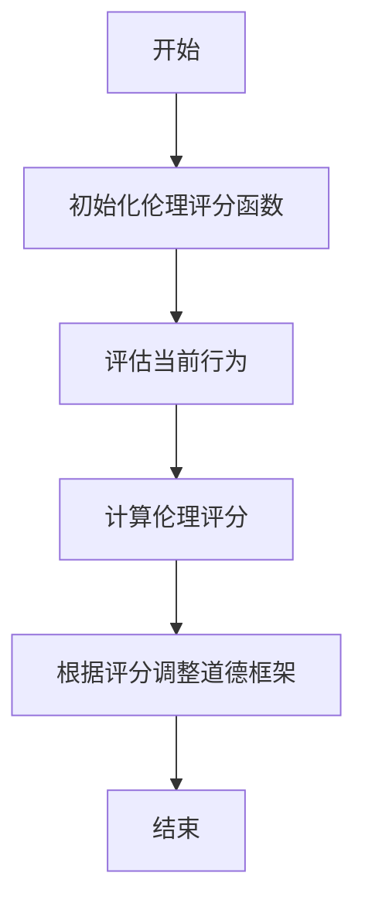
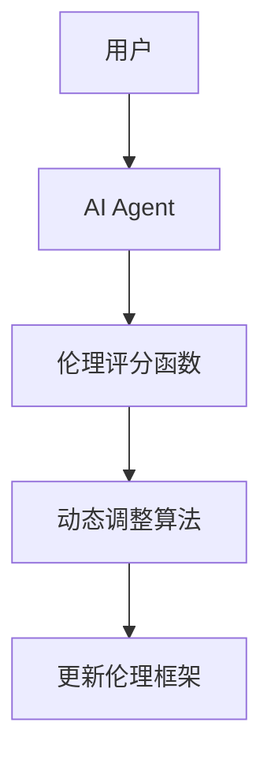
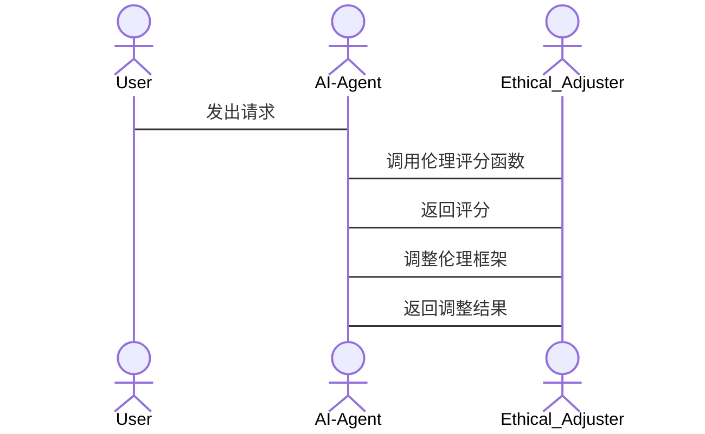

                 


# AI Agent的伦理学习机制：动态调整LLM的道德框架

> 关键词：AI Agent，伦理学习机制，动态调整，LLM，道德框架，伦理评分函数，系统架构，项目实战，数学模型

> 摘要：本文详细探讨了AI Agent的伦理学习机制，特别是如何动态调整大语言模型（LLM）的道德框架。文章首先介绍了问题背景和核心概念，随后深入分析了伦理评分函数的设计、算法原理及数学模型。接着，文章从系统架构设计的角度，详细阐述了问题场景、功能设计和接口交互。最后，通过项目实战部分，展示了如何实现伦理评分函数，并通过实际案例分析验证了动态调整LLM道德框架的有效性。

---

## 第一部分: AI Agent的伦理学习机制概述

### 第1章: 问题背景与核心概念

#### 1.1 问题背景

AI Agent（人工智能代理）在现代技术中的应用越来越广泛，从智能音箱到自动驾驶汽车，再到企业级的知识管理系统，AI Agent几乎无处不在。然而，随着AI Agent的普及，其在实际应用中面临的伦理问题也日益凸显。例如，在自动驾驶汽车中，如何在紧急情况下做出最优决策以最小化伤害？在医疗AI系统中，如何在尊重患者隐私的同时，确保诊断的准确性？

这些问题的核心在于，AI Agent需要具备动态调整其“道德框架”的能力。传统的静态道德框架无法应对复杂多变的现实场景，因此，动态调整LLM（大语言模型）的道德框架成为一种必然趋势。

#### 1.2 核心概念与定义

##### 1.2.1 AI Agent的定义与特征

AI Agent是一种能够感知环境并采取行动以实现目标的智能实体。其核心特征包括：

- **自主性**：能够在没有外部干预的情况下独立运作。
- **反应性**：能够根据环境反馈实时调整行为。
- **目标导向性**：所有行为都以实现特定目标为导向。

##### 1.2.2 伦理学习机制的定义

伦理学习机制是指AI Agent通过学习和适应，动态调整其行为准则和道德框架的过程。这种机制使得AI Agent能够在不同的场景和约束条件下，做出符合伦理规范的决策。

##### 1.2.3 动态调整LLM的道德框架

动态调整LLM的道德框架是指根据实时反馈和上下文，动态修改LLM的行为准则和伦理偏好。这种调整可以通过参数微调、规则强化或用户反馈等方式实现。

#### 1.3 问题描述与解决思路

##### 1.3.1 伦理冲突的场景分析

在实际应用中，AI Agent可能面临多种伦理冲突。例如，在金融投资中，AI Agent可能需要在追求最大收益和遵守伦理规范之间做出权衡。

##### 1.3.2 动态调整的必要性

静态的道德框架难以应对动态变化的环境。动态调整使得AI Agent能够在不同场景下灵活适应，做出更符合伦理的决策。

##### 1.3.3 解决问题的初步思路

- **定义伦理评分函数**：用于评估AI Agent行为的伦理合规性。
- **设计动态调整算法**：根据评分结果，动态优化道德框架。
- **实现系统架构**：构建支持动态调整的系统结构。

---

### 第2章: 核心概念与联系

#### 2.1 伦理学习机制的原理

##### 2.1.1 基于LLM的伦理推理

LLM（大语言模型）通过预训练掌握了大量人类知识和语言规则。结合伦理学习机制，LLM可以进行基于知识的伦理推理。

##### 2.1.2 动态调整的实现方式

动态调整可以通过以下方式实现：
1. **参数微调**：通过微调模型参数，改变LLM的输出偏好。
2. **规则强化**：在LLM的输出中加入特定的伦理规则。
3. **用户反馈**：根据用户的实时反馈调整模型的输出偏好。

##### 2.1.3 伦理评分函数的设计

伦理评分函数用于评估AI Agent行为的伦理合规性。其设计需要考虑以下因素：
- **评分标准**：基于伦理准则，定义具体的评分指标。
- **权重分配**：根据场景的重要性，分配不同的权重。

#### 2.2 核心概念对比与ER图

##### 2.2.1 伦理学习机制与传统伦理框架的对比

| 对比维度 | 伦理学习机制 | 传统伦理框架 |
|----------|--------------|---------------|
| 可塑性   | 高           | 低            |
| 适应性   | 强           | 弱            |
| 灵活性   | 高           | 低            |

##### 2.2.2 实体关系图（ER图）展示

```mermaid
erd
    actor User
    actor EthicalAdjuster
    actor AI-Agent
    database Ethical_Framework
    User --> Ethical_Adjuster: 提供反馈
    Ethical_Adjuster --> Ethical_Framework: 更新规则
    AI-Agent --> Ethical_Framework: 查询规则
```

---

## 第二部分: 算法原理与数学模型

### 第3章: 算法原理与数学模型

#### 3.1 算法原理

##### 3.1.1 伦理评分函数的定义

伦理评分函数是一个将AI Agent行为映射到伦理评分的函数。其数学表达式为：

$$ f(e) = \sum_{i=1}^{n} w_i \cdot s_i $$

其中，$e$ 表示AI Agent的行为，$w_i$ 是评分指标$s_i$的权重。

##### 3.1.2 动态调整的实现流程

动态调整的实现流程如下：



##### 3.1.3 算法的优化与改进

- **基于梯度的优化**：通过梯度下降等方法优化伦理评分函数。
- **强化学习**：通过奖励机制强化符合伦理的行为。

#### 3.2 数学模型与公式

##### 3.2.1 伦理评分函数的数学表达式

$$ f(e) = \sum_{i=1}^{n} w_i \cdot s_i $$

其中，$w_i$ 是评分指标$s_i$的权重。

##### 3.2.2 动态调整的数学模型

动态调整的数学模型可以表示为：

$$ w_i(t+1) = w_i(t) + \alpha \cdot \Delta w_i $$

其中，$\alpha$ 是学习率，$\Delta w_i$ 是权重调整量。

##### 3.2.3 相关公式推导与解释

通过伦理评分函数的优化，可以推导出伦理框架的动态调整策略。

---

## 第三部分: 系统分析与架构设计

### 第4章: 系统分析与架构设计

#### 4.1 问题场景分析

##### 4.1.1 典型应用场景

- **医疗领域**：AI Agent需要在诊断和治疗中遵守医疗伦理。
- **金融领域**：AI Agent需要在投资决策中遵守金融伦理。

##### 4.1.2 系统功能需求

- **伦理评分**：实时评估AI Agent的行为。
- **动态调整**：根据评分结果动态调整伦理框架。
- **用户反馈**：收集用户反馈以优化伦理框架。

##### 4.1.3 系统性能指标

- **响应时间**：系统对伦理评分的响应时间。
- **准确性**：伦理评分的准确率。

#### 4.2 系统架构设计

##### 4.2.1 分层架构设计



##### 4.2.2 组件间交互关系

- **用户**：提供反馈和输入。
- **AI Agent**：执行任务并调用伦理评分函数。
- **伦理评分函数**：评估行为并返回评分。
- **动态调整算法**：根据评分调整伦理框架。

##### 4.2.3 系统接口设计

- **输入接口**：接收用户输入和反馈。
- **输出接口**：输出伦理评分和调整结果。

#### 4.3 系统交互流程

##### 4.3.1 交互流程图



---

## 第四部分: 项目实战与实现

### 第5章: 项目实战与实现

#### 5.1 环境安装与配置

- **开发环境**：建议使用Python 3.8及以上版本。
- **依赖库安装**：需要安装`numpy`、`pandas`、`scikit-learn`等库。

#### 5.2 核心代码实现

##### 5.2.1 伦理评分函数的Python实现

```python
def ethical_score(e, weights):
    scores = [s(e) for s in metrics]
    return sum(w * s for w, s in zip(weights, scores))
```

##### 5.2.2 动态调整算法的代码实现

```python
def adjust_framework(e, current_weights):
    scores = ethical_score(e, current_weights)
    new_weights = current_weights + alpha * (desired_scores - scores)
    return new_weights
```

##### 5.2.3 系统功能模块实现

```python
class AI-Agent:
    def __init__(self, ethical_framework):
        self.ethical_framework = ethical_framework

    def act(self, input):
        score = self.ethical_framework.evaluate(input)
        adjusted_framework = self.ethical_framework.adjust(score)
        return adjusted_framework.decide(input)
```

#### 5.3 代码解读与分析

##### 5.3.1 代码结构分析

- **`ethical_score`函数**：计算AI Agent行为的伦理评分。
- **`adjust_framework`函数**：根据评分调整伦理框架。
- **`AI-Agent`类**：实现AI Agent的行为决策过程。

##### 5.3.2 关键函数解读

- **`ethical_score`函数**：通过加权求和的方式计算伦理评分。
- **`adjust_framework`函数**：通过梯度下降的方式调整伦理框架。

#### 5.4 实际案例分析

##### 5.4.1 案例背景

在医疗领域，AI Agent需要在诊断和治疗中遵守医疗伦理。

##### 5.4.2 案例分析

假设AI Agent在诊断中误诊，伦理评分函数会根据误诊率调整诊断规则，确保诊断的准确性。

---

## 第五部分: 最佳实践与总结

### 第6章: 最佳实践

#### 6.1 小结

- **伦理评分函数**：是动态调整的基础。
- **动态调整算法**：是实现动态调整的关键。
- **系统架构设计**：是实现动态调整的基础。

#### 6.2 注意事项

- **权重调整**：需要根据具体场景调整权重。
- **用户反馈**：需要及时收集和处理用户反馈。
- **系统性能**：需要优化系统的响应时间和准确性。

#### 6.3 拓展阅读

- **推荐书籍**：《伦理与人工智能》
- **推荐论文**：《动态伦理框架在AI Agent中的应用》

---

## 作者：AI天才研究院/AI Genius Institute & 禅与计算机程序设计艺术 /Zen And The Art of Computer Programming

