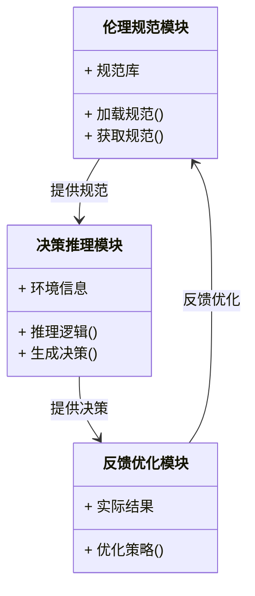
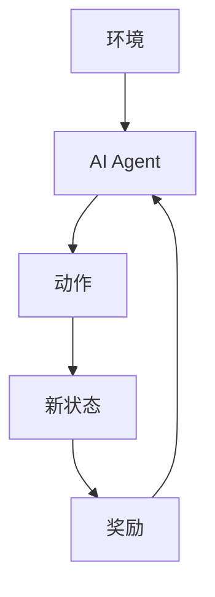
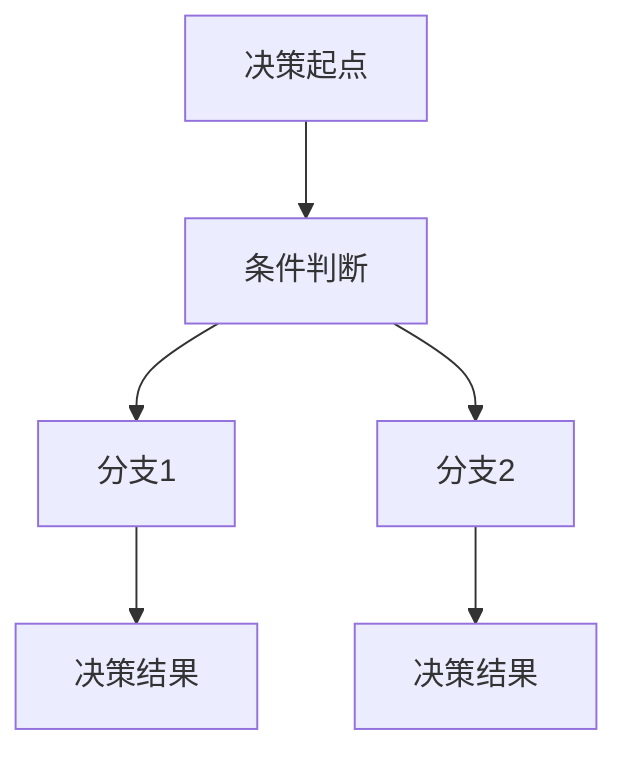
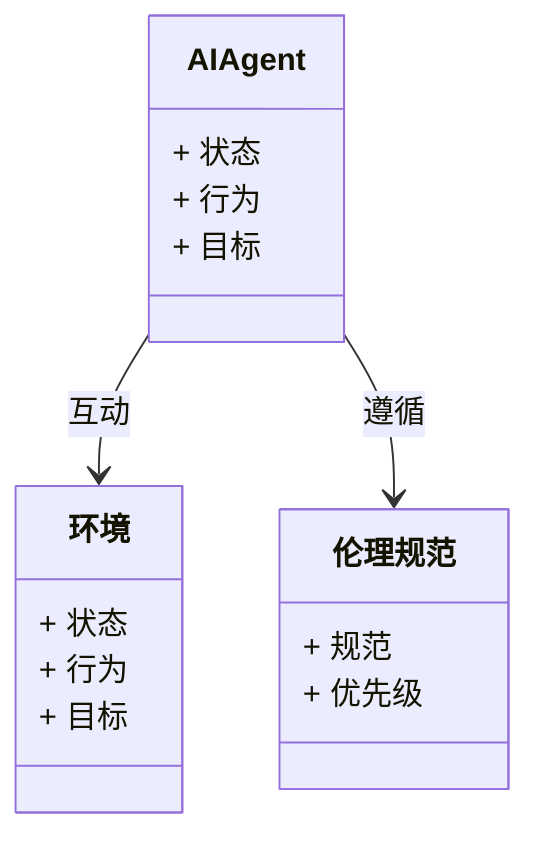
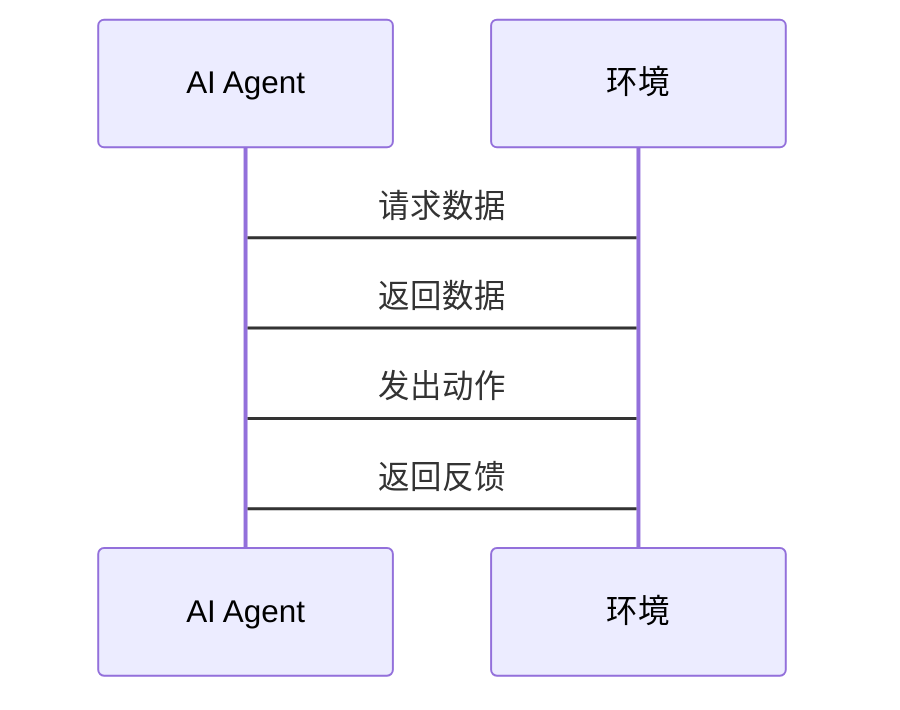

                 


```markdown
# AI Agent的伦理学习：在LLM中植入道德决策框架

> 关键词：AI Agent, 伦理学习, 道德决策框架, 大语言模型, 伦理决策, 人工智能伦理

> 摘要：随着人工智能技术的快速发展，AI Agent在各个领域的应用越来越广泛。然而，AI Agent在实际应用中面临的伦理问题也日益凸显。本文将从AI Agent的伦理学习入手，详细探讨在大语言模型（LLM）中植入道德决策框架的方法和实现过程。通过系统化的分析和设计，提出了一种基于伦理决策的AI Agent架构，并通过具体案例展示了其实际应用效果。本文内容涵盖AI Agent的基本概念、伦理学习的核心要素、伦理决策框架的构建、相关算法原理、系统架构设计以及项目实战，旨在为AI开发者和研究人员提供有价值的参考。

---

# 第1章: AI Agent与伦理学习概述

## 1.1 AI Agent的基本概念
### 1.1.1 AI Agent的定义
AI Agent（人工智能代理）是指能够感知环境、自主决策并执行任务的智能体。它可以是一个软件程序、机器人或其他形式的智能系统，其核心目标是通过感知和行动实现特定目标。

### 1.1.2 AI Agent的核心特征
- **自主性**：能够在没有外部干预的情况下自主决策。
- **反应性**：能够根据环境变化实时调整行为。
- **目标导向性**：所有行为均以实现特定目标为导向。
- **学习能力**：能够通过经验或数据改进自身的决策能力。

### 1.1.3 AI Agent的分类与应用场景
- **简单反射型AI Agent**：基于预定义规则进行简单决策，适用于规则明确的任务。
- **基于模型的AI Agent**：利用环境模型进行决策，适用于复杂动态环境。
- **学习型AI Agent**：通过机器学习技术不断优化决策策略，适用于需要自适应的任务。
- **人机协作型AI Agent**：与人类协同工作，结合人类的决策和AI的辅助。

---

## 1.2 伦理学习的背景与重要性
### 1.2.1 伦理学习的定义
伦理学习是指AI Agent在决策过程中，不仅考虑实现目标的效率和效果，还需遵循伦理规范和价值观，确保决策的公平性、透明性和伦理性。

### 1.2.2 伦理学习在AI Agent中的作用
- **避免伦理风险**：确保AI Agent的决策不会对人类或社会造成负面影响。
- **提升社会接受度**：通过符合伦理规范的决策，增强人类对AI技术的信任。
- **实现人机协作**：在人机协作场景中，伦理学习是实现高效协作的基础。

### 1.2.3 当前AI Agent伦理学习的挑战
- **伦理规范的多样性**：不同文化、社会对伦理的定义和优先级存在差异。
- **动态变化的环境**：AI Agent需要在动态环境中实时调整伦理决策。
- **技术实现的复杂性**：将伦理决策框架融入AI Agent的技术实现难度较高。

---

## 1.3 本章小结
本章从AI Agent的基本概念出发，介绍了其核心特征和应用场景，并重点探讨了伦理学习的背景与重要性。通过分析当前AI Agent伦理学习面临的挑战，为后续章节的深入研究奠定了基础。

---

# 第2章: AI Agent的伦理学习框架

## 2.1 伦理决策的核心要素
### 2.1.1 伦理决策的定义
伦理决策是指在考虑伦理规范和价值观的基础上，做出最优决策的过程。

### 2.1.2 核心要素分析
- **决策主体**：AI Agent或人类决策者。
- **决策目标**：实现特定目标，同时遵循伦理规范。
- **决策环境**：包括物理环境、社会环境和法律环境。
- **伦理规范**：包括道德准则、法律法规和社会价值观。

### 2.1.3 要素之间的关系
通过对比表格和ER图，可以清晰地看出各要素之间的关系：

```mermaid
erDiagram
    actor 人类决策者
    actor AI Agent
    actor 决策环境
    actor 伦理规范
    actor 决策目标
    人类决策者 --> 决策环境 : 互动
    AI Agent --> 决策环境 : 互动
    决策目标 --> 伦理规范 : 受约束于
    AI Agent --> 决策目标 : 追求
```

---

## 2.2 伦理决策框架的构建
### 2.2.1 框架设计原则
- **可解释性**：决策过程和结果应具有可解释性，便于人类理解和监督。
- **可扩展性**：框架应能够适应不同场景和伦理规范的变化。
- **动态适应性**：能够根据环境变化实时调整决策策略。

### 2.2.2 框架的核心模块
- **伦理规范模块**：定义和存储伦理规范和价值观。
- **决策推理模块**：根据伦理规范和环境信息进行推理和决策。
- **反馈优化模块**：根据实际结果优化伦理决策框架。

### 2.2.3 模块之间的关系
通过类图可以清晰地展示模块之间的关系：



---

## 2.3 伦理学习与决策框架的对比分析
通过对比表格和ER图，可以更直观地理解伦理学习与决策框架之间的差异与联系：

```mermaid
erDiagram
    actor 伦理学习
    actor 决策框架
    actor 伦理规范
    actor 决策结果
    伦理学习 --> 决策框架 : 实现
    决策框架 --> 伦理规范 : 遵循
    决策结果 --> 伦理学习 : 优化
```

---

## 2.4 本章小结
本章详细探讨了AI Agent伦理决策的核心要素和框架构建原则，通过类图和ER图展示了各模块之间的关系，为后续算法设计奠定了基础。

---

# 第3章: AI Agent伦理学习的算法原理

## 3.1 基于伦理决策的强化学习算法
### 3.1.1 算法原理
强化学习（Reinforcement Learning）是一种通过试错机制优化决策策略的算法。在伦理决策框架中，强化学习可以用来优化AI Agent的决策策略，使其在遵循伦理规范的前提下实现目标。

### 3.1.2 算法流程图（Mermaid）



### 3.1.3 算法实现的数学模型
强化学习的核心是Q-learning算法，其数学公式如下：

$$ Q(s, a) = Q(s, a) + \alpha (r + \gamma \max Q(s', a') - Q(s, a)) $$

其中：
- \( s \) 表示当前状态
- \( a \) 表示动作
- \( r \) 表示奖励
- \( \gamma \) 表示折扣因子
- \( \alpha \) 表示学习率

---

## 3.2 基于伦理决策的决策树算法
### 3.2.1 算法原理
决策树是一种通过树状结构进行决策的方法。在伦理决策框架中，决策树可以用来根据伦理规范和环境信息生成决策路径。

### 3.2.2 算法流程图（Mermaid）



### 3.2.3 算法实现的数学模型
决策树的决策规则可以用以下公式表示：

$$ \text{选择} = \arg\max_{i} \sum_{j=1}^{n} w_{ij} \cdot x_{j} $$

其中：
- \( w_{ij} \) 表示第 \( i \) 个决策选项的权重
- \( x_{j} \) 表示第 \( j \) 个特征的值

---

## 3.3 本章小结
本章通过强化学习和决策树两种算法，详细探讨了AI Agent伦理学习的实现方法，并通过数学公式和流程图展示了算法的原理和实现过程。

---

# 第4章: AI Agent伦理学习的系统架构设计

## 4.1 系统功能设计
### 4.1.1 领域模型（Mermaid类图）



---

## 4.2 系统架构设计
### 4.2.1 系统架构图（Mermaid架构图）


---

## 4.3 系统接口设计
### 4.3.1 接口交互流程（Mermaid序列图）



---

## 4.4 本章小结
本章通过类图、架构图和序列图，详细展示了AI Agent伦理学习系统的功能设计、架构设计和接口设计。

---

# 第5章: 项目实战——伦理学习框架的实现

## 5.1 环境安装与配置
### 5.1.1 开发环境搭建
- 安装Python 3.8及以上版本
- 安装必要的库：numpy、pandas、scikit-learn、tensorflow

### 5.1.2 依赖库安装
```bash
pip install numpy pandas scikit-learn tensorflow
```

---

## 5.2 核心算法实现
### 5.2.1 强化学习算法实现
```python
import numpy as np

class QLearning:
    def __init__(self, state_space, action_space):
        self.state_space = state_space
        self.action_space = action_space
        self.Q = np.zeros((state_space, action_space))
    
    def choose_action(self, state, epsilon):
        if np.random.random() < epsilon:
            return np.random.randint(self.action_space)
        else:
            return np.argmax(self.Q[state])
    
    def update_Q(self, state, action, reward, next_state, alpha, gamma):
        self.Q[state, action] = self.Q[state, action] + alpha * (reward + gamma * np.max(self.Q[next_state]) - self.Q[state, action])
```

### 5.2.2 决策树算法实现
```python
from sklearn.tree import DecisionTreeClassifier

class EthicalDecisionTree:
    def __init__(self):
        self.tree = DecisionTreeClassifier()
    
    def fit(self, X, y):
        self.tree.fit(X, y)
    
    def predict(self, X):
        return self.tree.predict(X)
```

---

## 5.3 代码应用解读与分析
### 5.3.1 代码结构分析
- `QLearning` 类实现强化学习算法，包括选择动作和更新Q值。
- `EthicalDecisionTree` 类实现决策树算法，包括训练和预测。

### 5.3.2 代码实现细节
- 强化学习算法中，`epsilon` 表示随机选择的概率，用于平衡探索和利用。
- 决策树算法中，`fit` 方法用于训练模型，`predict` 方法用于生成决策。

---

## 5.4 实际案例分析与详细讲解
### 5.4.1 案例背景
假设我们正在开发一个AI Agent，用于自动驾驶汽车的决策系统。我们需要确保自动驾驶汽车在紧急情况下做出符合伦理的决策。

### 5.4.2 案例实现过程
1. **环境搭建**：安装必要的库并配置开发环境。
2. **数据准备**：收集自动驾驶汽车在不同场景下的数据，包括车速、距离、行人位置等。
3. **模型训练**：使用强化学习和决策树算法训练模型。
4. **决策测试**：在模拟环境中测试模型的决策效果。

### 5.4.3 案例结果分析
通过测试，我们发现强化学习算法在复杂场景下的决策效果优于决策树算法。然而，决策树算法在简单场景下的决策速度更快。

---

## 5.5 本章小结
本章通过一个实际案例，详细展示了AI Agent伦理学习框架的实现过程，包括环境搭建、算法实现和结果分析。

---

# 第6章: 最佳实践与未来展望

## 6.1 最佳实践
- **明确伦理规范**：在AI Agent的设计中，必须明确伦理规范的优先级和适用范围。
- **可解释性设计**：确保AI Agent的决策过程具有可解释性，便于人类理解和监督。
- **动态适应性**：AI Agent应能够根据环境变化实时调整伦理决策策略。

## 6.2 未来展望
随着人工智能技术的不断发展，AI Agent的伦理学习将更加复杂和多样化。未来的研究方向包括：
- **多模态伦理学习**：结合文本、图像等多种模态信息进行伦理决策。
- **自适应伦理框架**：能够根据不同场景和文化背景动态调整伦理规范。
- **人机协作优化**：通过人机协作进一步优化伦理决策框架。

---

## 6.3 本章小结
本章总结了AI Agent伦理学习的最佳实践，并展望了未来的研究方向，为读者提供了进一步思考和探索的空间。

---

# 作者：AI天才研究院/AI Genius Institute & 禅与计算机程序设计艺术 /Zen And The Art of Computer Programming
```

