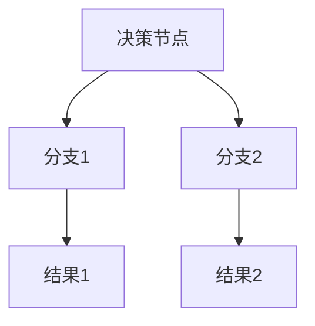
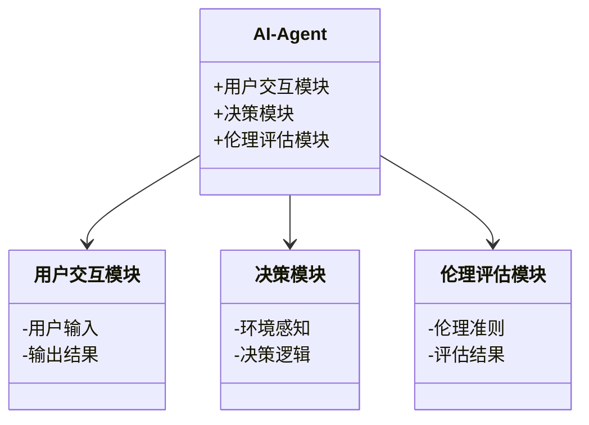

                 


# AI Agent的伦理设计：遵循AI伦理准则

> 关键词：AI Agent，伦理设计，AI伦理准则，决策机制，系统架构，算法原理

> 摘要：本文将探讨AI Agent的伦理设计，从基本概念到实际应用，详细分析如何在AI Agent的设计与实现过程中遵循AI伦理准则。通过系统化的分析和案例研究，我们将揭示AI Agent的核心原理、伦理设计的原则与方法，以及在实际场景中的应用。文章内容丰富，涵盖背景介绍、算法原理、系统架构、项目实战等多方面内容，旨在为读者提供全面的伦理设计指南。

---

# 第一部分: AI Agent的伦理设计基础

## 第1章: AI Agent的基本概念与背景

### 1.1 AI Agent的定义与特点
#### 1.1.1 AI Agent的定义
AI Agent（人工智能代理）是一种能够感知环境、自主决策并执行任务的智能实体。它具备以下核心特点：
- **自主性**：能够在没有外部干预的情况下独立运作。
- **反应性**：能够实时感知环境并做出响应。
- **目标导向**：通过实现目标来完成任务。
- **学习能力**：能够通过经验改进自身的性能。

#### 1.1.2 AI Agent的特点对比
| 特性       | 描述                               |
|------------|------------------------------------|
| 自主性      | 独立运作，无需外部干预             |
| 反应性      | 实时感知并响应环境变化             |
| 目标导向    | 以实现特定目标为导向               |
| 学习能力    | 通过经验优化自身性能               |

#### 1.1.3 AI Agent与传统AI的区别
AI Agent不仅能够执行预设任务，还能在动态环境中自主调整策略。例如，在智能助手领域，AI Agent能够根据用户的反馈实时优化交互流程。

### 1.2 AI Agent的应用场景
AI Agent广泛应用于多个领域，以下是几个典型场景：
- **智能助手**：如Siri、Alexa，提供个性化服务。
- **自动驾驶**：通过实时感知和决策确保行车安全。
- **医疗领域**：辅助医生进行诊断和治疗方案制定。

### 1.3 AI Agent的伦理问题概述
AI Agent的决策可能对人类产生重大影响，因此必须考虑伦理问题。例如，在自动驾驶中，AI Agent在紧急情况下如何做出决策，是否符合伦理标准。

---

## 第2章: AI伦理准则的核心概念

### 2.1 AI伦理准则的定义与分类
AI伦理准则是指导AI行为的规则，确保其符合人类价值观。主要分类包括：
- **透明性**：AI的行为必须可解释。
- **隐私保护**：保护用户隐私。
- **公正性**：避免偏见和歧视。

### 2.2 AI伦理准则的属性特征对比
| 特性       | 描述                               |
|------------|------------------------------------|
| 透明性      | 用户能够理解AI的决策过程           |
| 隐私保护    | 保护用户数据不被滥用               |
| 公正性      | 确保决策不受偏见影响               |

### 2.3 AI伦理准则的ER实体关系图
通过ER图分析，AI Agent与伦理准则之间的关系可以清晰展示。AI Agent需要遵循多个伦理准则，每个准则可能涉及不同的约束条件。

---

## 第3章: AI Agent的决策机制与伦理设计

### 3.1 AI Agent的决策机制原理
AI Agent的决策机制基于算法，能够根据环境信息做出选择。例如，使用强化学习算法优化决策过程。

#### 3.1.1 决策机制的数学模型
决策树是一种常见的决策模型，通过树状结构展示决策过程。例如，以下是一个简单的决策树示例：



### 3.2 AI Agent的伦理设计原则
伦理设计原则包括透明性、隐私保护和公正性。例如，在医疗领域，AI Agent需要确保诊断过程的透明性和结果的公正性。

---

## 第4章: AI Agent的算法原理与伦理实现

### 4.1 AI Agent的算法原理
AI Agent的算法设计需要考虑伦理因素，例如使用强化学习算法优化决策过程。

#### 4.1.1 算法原理的数学模型
强化学习的目标是通过最大化奖励函数来优化决策策略。数学公式如下：
$$ R = \sum_{t} \gamma^{t} r_t $$
其中，$\gamma$ 是折扣因子，$r_t$ 是第$t$步的奖励。

### 4.2 AI Agent的伦理实现方法
通过在算法中加入伦理约束，确保AI Agent的行为符合伦理准则。例如，使用公平性约束确保决策不受偏见影响。

---

## 第5章: AI Agent的系统架构与伦理评估

### 5.1 AI Agent的系统架构设计
系统架构设计需要考虑伦理因素，例如用户交互模块需要确保透明性。

#### 5.1.1 系统架构的类图
以下是一个AI Agent系统架构的类图：



### 5.2 AI Agent的伦理评估方法
通过伦理评估模块确保AI Agent的行为符合伦理准则。例如，使用伦理评分系统评估决策的公正性。

---

## 第6章: AI Agent的项目实战

### 6.1 环境安装与配置
安装必要的开发工具，例如Python、TensorFlow等。

### 6.2 核心代码实现
以下是AI Agent决策模块的Python代码示例：

```python
class AI-Agent:
    def __init__(self):
        self.伦理准则 = ["透明性", "隐私保护", "公正性"]
        
    def 决策(self, 输入):
        # 实现决策逻辑
        pass
```

### 6.3 实际案例分析
通过具体案例分析AI Agent的伦理设计，例如在自动驾驶中的紧急决策问题。

---

## 第7章: 最佳实践与总结

### 7.1 小结
AI Agent的伦理设计需要在算法、架构和实现等多个方面进行综合考虑。

### 7.2 注意事项
在设计AI Agent时，必须确保透明性、隐私保护和公正性。

### 7.3 拓展阅读
建议阅读相关伦理准则和算法设计的文献，深入理解AI伦理设计的核心思想。

---

作者：AI天才研究院/AI Genius Institute & 禅与计算机程序设计艺术 /Zen And The Art of Computer Programming

