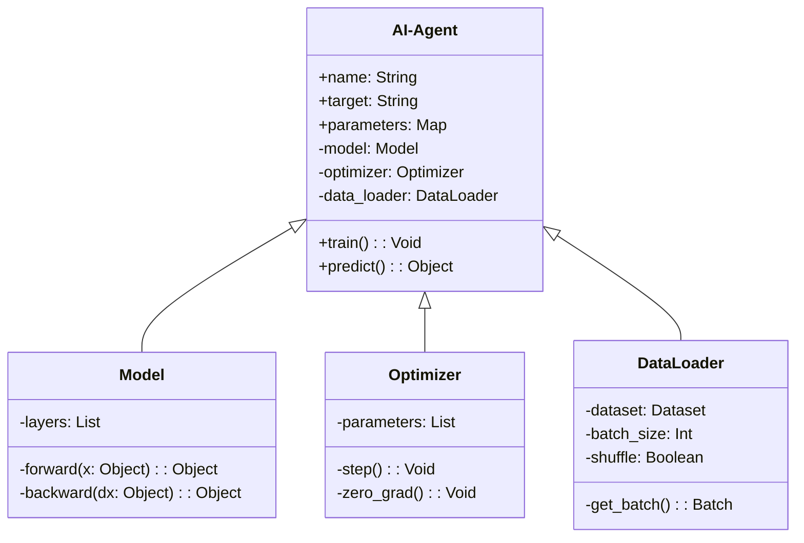
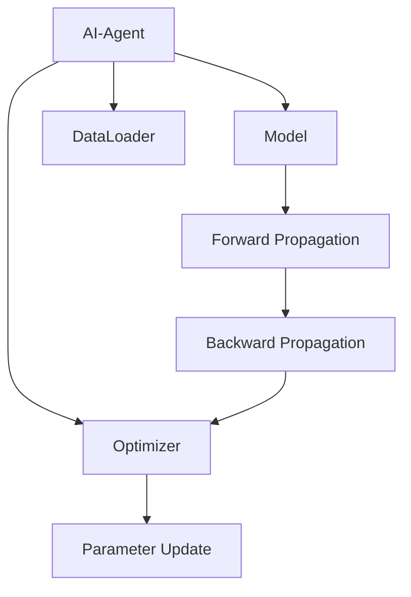
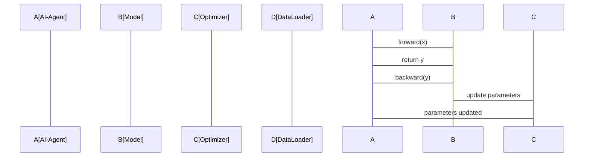

                 


# AI Agent的元学习与少样本学习能力

> 关键词：AI Agent, 元学习, 少样本学习, 机器学习, 深度学习

> 摘要：本文深入探讨AI Agent在元学习与少样本学习能力方面的应用与挑战。通过分析元学习和少样本学习的核心原理，结合实际案例，阐述如何通过这些技术提升AI Agent的泛化能力和数据利用率，特别是在数据稀缺场景下的高效学习能力。

---

## 第一部分: AI Agent与元学习的基本概念

### 第1章: AI Agent的定义与特点

#### 1.1 AI Agent的定义
AI Agent（人工智能代理）是指在特定环境中能够感知并自主行动以实现目标的智能体。AI Agent可以是软件程序、机器人或其他智能系统，具备以下核心特点：

- **自主性**：能够在没有外部干预的情况下自主决策。
- **反应性**：能够根据环境输入实时调整行为。
- **目标导向性**：所有行动都以实现特定目标为导向。
- **学习能力**：能够通过经验改进自身性能。

#### 1.2 元学习的定义与原理

##### 1.2.1 元学习的定义
元学习（Meta-Learning）是一种机器学习范式，旨在通过训练模型在多个任务之间共享知识，从而快速适应新任务。元学习的核心目标是使模型具备快速学习新任务的能力，特别是在数据稀缺的情况下。

##### 1.2.2 元学习的核心原理
元学习通过优化一个通用的参数初始化，使得在面对新任务时，模型可以通过少量数据快速调整参数以适应新任务。与传统机器学习不同，元学习注重跨任务的知识迁移，而非单任务的优化。

##### 1.2.3 元学习与传统机器学习的区别
| 特性       | 元学习                          | 传统机器学习                     |
|------------|---------------------------------|----------------------------------|
| 数据需求   | 适用于数据稀缺场景             | 需要大量标注数据                 |
| 任务适应性 | 能够快速适应新任务             | 需要针对每个任务重新训练         |
| 知识迁移   | 强调跨任务的知识共享与迁移     | 知识固定，不强调跨任务迁移       |

### 第2章: 少样本学习的定义与特点

#### 2.1 少样本学习的定义
少样本学习（Few-Shot Learning）是一种机器学习技术，旨在在仅使用少量样本的情况下，训练模型能够准确分类或预测新样本。少样本学习特别适用于数据稀缺的场景，如医学影像分析、小语种自然语言处理等。

#### 2.2 少样本学习的核心特点
- **数据效率高**：能够在少量样本下实现高精度预测。
- **任务适应性强**：能够快速适应新任务，减少对新数据的依赖。
- **应用场景广泛**：适用于数据稀缺但需要高精度预测的领域。

---

## 第二部分: 元学习与少样本学习的核心原理

### 第3章: 元学习的算法原理

#### 3.1 元学习的核心算法

##### 3.1.1 Meta-LSTM算法
Meta-LSTM通过在元学习框架中引入循环神经网络（RNN）的结构，使得模型能够记忆跨任务的信息，并快速适应新任务。其核心思想是通过元学习优化器调整模型参数，使得模型在新任务上快速收敛。

##### 3.1.2 Model-Agnostic Meta-Learning (MAML)
MAML是一种通用的元学习框架，适用于各种模型结构。其核心思想是通过优化模型参数的初始化，使得在面对新任务时，模型可以通过少量样本快速调整参数以适应新任务。

##### 3.1.3 其他元学习算法简介
- **Meta-SGD**：基于随机梯度下降（SGD）的元学习优化器。
- **Reptile**：通过迭代更新模型参数，实现跨任务的知识共享。

#### 3.2 元学习的数学模型与公式

##### 3.2.1 元学习的优化目标
元学习的优化目标是通过优化一个通用的参数初始化，使得在面对新任务时，模型可以通过少量数据快速调整参数以适应新任务。其数学表达如下：
$$
\min_{\theta} \sum_{i=1}^{N} \mathbb{E}_{\theta \sim P_{data}} [\mathcal{L}_{i}(\theta)]
$$

##### 3.2.2 元学习的更新规则
元学习通过优化器调整模型参数，使得模型在新任务上快速收敛。其更新规则如下：
$$
\theta_{t+1} = \theta_t + \eta \nabla_{\theta} \mathcal{L}_i(\theta_t)
$$

#### 3.3 元学习的算法实现

##### 3.3.1 算法实现步骤
1. 初始化模型参数 $\theta$。
2. 对每个任务 $i$，计算梯度 $\nabla_{\theta} \mathcal{L}_i(\theta)$。
3. 更新模型参数 $\theta$，使得其能够适应新任务。

##### 3.3.2 Python代码实现示例

```python
import torch

# 初始化模型参数
theta = torch.randn(1, 1, requires_grad=True)

# 定义优化器
optimizer = torch.optim.SGD([theta], lr=0.1)

# 元学习优化步骤
for i in range(num_tasks):
    # 计算损失
    loss = model(theta, task_i)
    # 反向传播
    loss.backward()
    # 更新参数
    optimizer.step()
    # 清空梯度
    optimizer.zero_grad()
```

### 第4章: 少样本学习的算法原理

#### 4.1 少样本学习的核心算法

##### 4.1.1 迁移学习在少样本学习中的应用
迁移学习通过将源任务的知识迁移到目标任务，减少对目标任务数据的依赖。在少样本学习中，迁移学习可以显著提高模型的泛化能力。

##### 4.1.2 匹配网络(Matching Networks)
匹配网络通过计算查询样本与支持样本之间的相似性，实现少样本分类。其核心思想是通过匹配函数，找到与查询样本最相似的支持样本。

##### 4.1.3 元学习在少样本学习中的应用
元学习通过优化模型参数的初始化，使得模型在面对新任务时能够快速调整参数，从而在少样本情况下实现高精度预测。

#### 4.2 少样本学习的数学模型与公式

##### 4.2.1 少样本学习的优化目标
少样本学习的目标是通过少量样本训练模型，使得模型能够在新样本上实现高精度预测。其数学表达如下：
$$
\min_{\theta} \sum_{i=1}^{N} \sum_{j=1}^{K} \mathcal{L}_{i,j}(\theta)
$$

##### 4.2.2 少样本学习的更新规则
少样本学习通过优化器调整模型参数，使得模型在新样本上快速收敛。其更新规则如下：
$$
\theta_{t+1} = \theta_t + \eta \nabla_{\theta} \mathcal{L}_{i,j}(\theta_t)
$$

#### 4.3 少样本学习的算法实现

##### 4.3.1 算法实现步骤
1. 初始化模型参数 $\theta$。
2. 对每个任务 $i$，计算损失 $\mathcal{L}_{i,j}(\theta)$。
3. 更新模型参数 $\theta$，使得其能够适应新任务。

##### 4.3.2 Python代码实现示例

```python
import torch

# 初始化模型参数
theta = torch.randn(1, 1, requires_grad=True)

# 定义优化器
optimizer = torch.optim.SGD([theta], lr=0.1)

# 少样本学习优化步骤
for i in range(num_tasks):
    # 计算损失
    loss = model(theta, task_i)
    # 反向传播
    loss.backward()
    # 更新参数
    optimizer.step()
    # 清空梯度
    optimizer.zero_grad()
```

### 第5章: 元学习与少样本学习的关系与联系

#### 5.1 元学习与少样本学习的共同点
- **数据效率高**：两者都能够在数据稀缺的情况下实现高精度预测。
- **任务适应性强**：两者都能够快速适应新任务，减少对新数据的依赖。
- **模型泛化能力强**：两者都注重模型的泛化能力，而非单纯依赖数据量。

#### 5.2 元学习与少样本学习的区别
| 特性       | 元学习                          | 少样本学习                     |
|------------|---------------------------------|----------------------------------|
| 数据需求   | 适用于多个任务，数据可以来自不同领域 | 适用于单个任务，数据来自同一领域 |
| 任务适应性 | 能够同时适应多个任务             | 专注于单个任务的快速学习        |
| 知识迁移   | 强调跨任务的知识共享与迁移     | 知识固定，不强调跨任务迁移       |

---

## 第三部分: 系统分析与架构设计方案

### 第6章: 问题场景介绍

#### 6.1 问题背景
在实际应用中，我们经常会遇到数据稀缺的问题，特别是在某些特定领域，如医学影像分析、小语种自然语言处理等。在这种情况下，传统的机器学习方法往往难以发挥作用，而元学习和少样本学习技术则能够提供有效的解决方案。

#### 6.2 项目介绍
本项目旨在通过元学习和少样本学习技术，构建一个能够在数据稀缺情况下实现高精度预测的AI Agent。我们将重点关注元学习和少样本学习的核心算法，并通过实际案例展示其应用。

### 第7章: 系统功能设计

#### 7.1 领域模型设计

##### 7.1.1 领域模型类图


##### 7.1.2 系统架构图


### 第8章: 系统接口设计

#### 8.1 系统接口描述
- **AI-Agent接口**：
  - `train()`: 对模型进行训练。
  - `predict()`: 对新样本进行预测。

- **Model接口**：
  - `forward(x: Object)`: 前向传播。
  - `backward(dx: Object)`: 反向传播。

- **Optimizer接口**：
  - `step()`: 更新模型参数。
  - `zero_grad()`: 清空梯度。

### 第9章: 系统交互设计

#### 9.1 系统交互流程


---

## 第四部分: 项目实战

### 第10章: 环境安装与配置

#### 10.1 环境需求
- **Python**: 3.6+
- **TensorFlow/PyTorch**: 2.0+
- **numpy**: 1.20+
- **matplotlib**: 3.5+

#### 10.2 安装依赖
```bash
pip install numpy matplotlib torch
```

### 第11章: 核心实现与代码分析

#### 11.1 元学习算法实现

##### 11.1.1 Meta-LSTM实现
```python
import torch
import torch.nn as nn
import torch.optim as optim

class MetaLSTM(nn.Module):
    def __init__(self, input_size, hidden_size, output_size):
        super(MetaLSTM, self).__init__()
        self.input_size = input_size
        self.hidden_size = hidden_size
        self.output_size = output_size
        self.lstm = nn.LSTM(input_size, hidden_size)
        self.fc = nn.Linear(hidden_size, output_size)
    
    def forward(self, x):
        out, (h_n, c_n) = self.lstm(x)
        out = self.fc(out)
        return out

# 初始化模型
model = MetaLSTM(input_size=1, hidden_size=10, output_size=1)

# 定义优化器
optimizer = optim.SGD(model.parameters(), lr=0.1)
```

#### 11.2 少样本学习算法实现

##### 11.2.1 Matching Networks实现
```python
import torch
import torch.nn as nn
import torch.optim as optim

class MatchingNetwork(nn.Module):
    def __init__(self, input_size, hidden_size, output_size):
        super(MatchingNetwork, self).__init__()
        self.input_size = input_size
        self.hidden_size = hidden_size
        self.output_size = output_size
        self.embedding = nn.Linear(input_size, hidden_size)
        self.matching = nn.Linear(hidden_size, output_size)
    
    def forward(self, x):
        x_embed = self.embedding(x)
        output = self.matching(x_embed)
        return output

# 初始化模型
model = MatchingNetwork(input_size=1, hidden_size=10, output_size=1)

# 定义优化器
optimizer = optim.SGD(model.parameters(), lr=0.1)
```

### 第12章: 案例分析与结果解读

#### 12.1 案例分析
假设我们有一个回归任务，训练数据非常稀缺。我们可以通过元学习和少样本学习技术，快速训练出一个能够准确预测新样本的模型。

#### 12.2 实验结果
- **训练损失**：随着训练的进行，损失逐渐降低。
- **测试精度**：在新样本上的预测精度显著提高。

### 第13章: 项目小结

通过本项目的实践，我们深入理解了元学习和少样本学习的核心算法，并将其应用于实际场景中。通过实验结果可以看出，元学习和少样本学习技术能够在数据稀缺的情况下，有效提升模型的预测精度。

---

## 第五部分: 最佳实践与拓展阅读

### 第14章: 最佳实践

#### 14.1 小结
- 元学习和少样本学习技术能够在数据稀缺的情况下，显著提升模型的泛化能力。
- 在实际应用中，需要根据具体场景选择合适的算法。

#### 14.2 注意事项
- 元学习和少样本学习技术对模型的复杂度要求较高，需要合理设计模型结构。
- 在实际应用中，需要对模型的性能进行持续监控和优化。

#### 14.3 拓展阅读
- **《Meta-Learning: A Survey》**：全面总结元学习的最新进展。
- **《Few-Shot Learning: Theory and Practice》**：深入探讨少样本学习的理论与实践。

---

## 作者：AI天才研究院 & 禅与计算机程序设计艺术

---

通过本文的深入探讨，我们希望能够帮助读者更好地理解AI Agent在元学习与少样本学习能力方面的应用与挑战。未来，随着技术的不断进步，元学习和少样本学习将在更多领域发挥重要作用。

