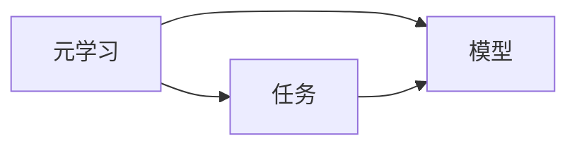
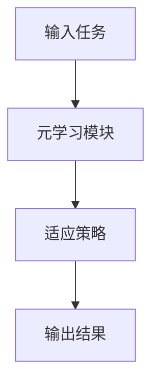
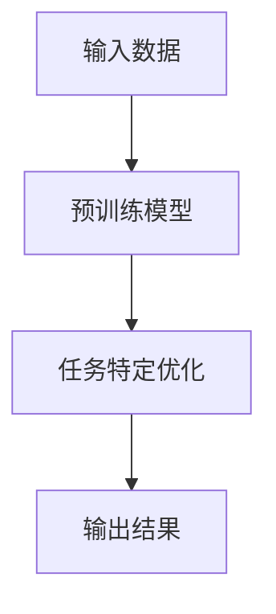
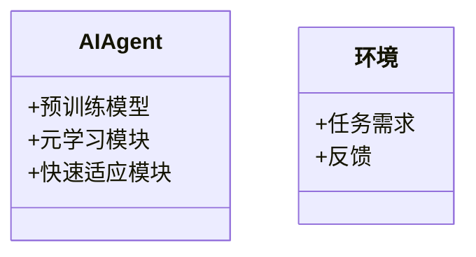
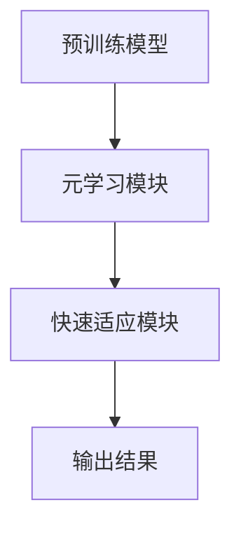
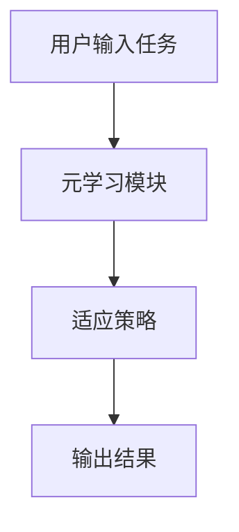

                 


# AI Agent的元学习与快速适应能力开发

## 关键词：AI Agent，元学习，快速适应，算法原理，系统架构，项目实战

## 摘要：  
AI Agent的元学习与快速适应能力是实现智能系统自主性和灵活性的关键。本文从背景介绍、核心概念、算法原理、系统架构、项目实战等多个维度，详细阐述了AI Agent如何通过元学习实现快速适应能力的开发。文章通过理论分析与实践结合的方式，为读者提供了从理解到实现的完整指南。

---

# 第一部分: AI Agent的背景与概念

## 第1章: AI Agent的背景与概念

### 1.1 问题背景与描述
#### 1.1.1 传统AI的局限性
- 传统AI在固定任务中的表现优秀，但在动态变化的环境中难以适应新任务。
- 需要人工干预来调整模型参数或重新训练。

#### 1.1.2 动态环境下的适应性需求
- 现实场景中，任务需求经常变化，AI Agent需要快速调整以应对新挑战。
- 快速适应能力是AI Agent在复杂环境中生存和发展的关键。

#### 1.1.3 元学习的核心问题
- 元学习（Meta-Learning）是一种通过学习如何学习的方法，旨在减少对新任务的样本需求。
- 元学习的目标是使模型能够快速适应新任务，而无需从头开始训练。

### 1.2 问题解决与边界
#### 1.2.1 元学习的目标与方法
- 元学习的目标是通过学习通用策略，快速适应新任务。
- 常用方法包括基于优化的元学习算法（如MAML）和基于模型的元学习算法。

#### 1.2.2 快速适应能力的实现路径
- 通过元学习预训练模型，快速调整模型参数以适应新任务。
- 利用记忆机制存储已有经验，快速调用以应对新情况。

#### 1.2.3 边界与外延分析
- 元学习的边界在于如何平衡预训练与新任务的适应性。
- 外延包括如何与其他技术（如强化学习、图神经网络）结合，提升适应能力。

### 1.3 核心概念与结构
#### 1.3.1 AI Agent的定义与组成
- AI Agent是一个能够感知环境并采取行动以实现目标的智能实体。
- 包含感知、决策、执行三个核心模块。

#### 1.3.2 元学习的数学模型
- 元学习的核心是通过优化元损失函数，使得模型能够快速适应新任务。
- 元损失函数定义为：$$L_{meta} = \sum_{i=1}^{N} L_i(f_{\theta}(x_i, y_i))$$
  其中，$f_{\theta}$是主任务模型，$\theta$是通过元学习优化的参数。

#### 1.3.3 快速适应能力的实现框架
- 基于元学习的快速适应框架包括预训练、任务采样、快速适应三个阶段。

### 1.4 本章小结
#### 1.4.1 核心概念总结
- 元学习是实现快速适应的核心技术，AI Agent通过元学习可以在新任务中快速调整。

#### 1.4.2 问题解决思路
- 通过预训练模型和记忆机制，减少新任务的学习时间，提高适应性。

#### 1.4.3 未来研究方向
- 探索更高效的元学习算法，提升AI Agent在复杂环境中的适应能力。

---

# 第二部分: 元学习与快速适应的核心概念

## 第2章: 元学习的核心原理

### 2.1 元学习的定义与属性
#### 2.1.1 元学习的定义
- 元学习是一种通过学习如何学习的技术，旨在减少新任务的样本需求。
- 元学习的核心是优化参数更新策略，使得模型能够快速适应新任务。

#### 2.1.2 元学习的核心属性对比表
| 属性       | 传统学习         | 元学习           |
|------------|------------------|------------------|
| 样本需求   | 高               | 低               |
| 适应速度   | 慢               | 快               |
| 灵活性      | 低               | 高               |

#### 2.1.3 元学习的实体关系图


### 2.2 快速适应能力的实现机制
#### 2.2.1 快速适应的定义
- 快速适应是指AI Agent在新任务中，通过少量样本快速调整模型参数以达到预期性能。

#### 2.2.2 快速适应的核心算法
- 基于优化的元学习算法（如MAML）通过优化参数更新规则，实现快速适应。
- 基于模型的元学习算法（如REPTILE）通过元参数优化，快速适应新任务。

#### 2.2.3 快速适应的实现流程图


### 2.3 元学习与快速适应的关系
#### 2.3.1 元学习对快速适应的支持
- 元学习通过预训练模型，提供快速适应的能力基础。
- 元学习优化了参数更新策略，使得快速适应更加高效。

#### 2.3.2 快速适应对元学习的促进
- 快速适应的应用场景丰富了元学习的研究方向。
- 快速适应的反馈机制帮助元学习算法不断优化。

#### 2.3.3 两者结合的实现案例
- 使用MAML算法在图像分类任务中实现快速适应。

### 2.4 本章小结
#### 2.4.1 核心概念总结
- 元学习与快速适应相辅相成，共同提升AI Agent的适应能力。

#### 2.4.2 关键算法分析
- MAML和REPTILE是实现快速适应的核心算法。

#### 2.4.3 未来研究方向
- 探索更高效的元学习算法，提升快速适应的效率和效果。

---

# 第三部分: 元学习算法原理与数学模型

## 第3章: 元学习算法原理

### 3.1 元学习算法概述
#### 3.1.1 元学习算法的分类
- 基于优化的元学习算法：如MAML。
- 基于模型的元学习算法：如REPTILE。

#### 3.1.2 各类算法的优缺点对比
| 算法类型       | 优点                       | 缺点                         |
|----------------|----------------------------|------------------------------|
| 基于优化的     | 理论基础扎实               | 计算复杂度高                 |
| 基于模型的     | 计算效率高                 | 理论基础较弱                 |

#### 3.1.3 元学习算法的流程图


### 3.2 快速适应算法的数学模型
#### 3.2.1 MAML算法的数学模型
- MAML的目标函数：$$L_{meta}(θ) = \sum_{i=1}^{N} L_i(f_{\theta}(x_i), y_i)$$
- 参数更新规则：$$θ = θ - \eta \nabla_θ L_{meta}(θ)$$

#### 3.2.2 REPTILE算法的数学模型
- REPTILE的更新规则：$$θ_{t+1} = θ_t - \eta \nabla_θ L_i(θ_t)$$

#### 3.2.3 元学习算法的数学公式对比
| 算法类型       | 更新规则                 |
|----------------|--------------------------|
| MAML           | $θ = θ - \eta \nabla_θ L_{meta}(θ)$ |
| REPTILE         | $θ_{t+1} = θ_t - \eta \nabla_θ L_i(θ_t)$ |

### 3.3 元学习算法的实现步骤
#### 3.3.1 数据预处理
- 数据增强、归一化处理。

#### 3.3.2 模型初始化
- 随机初始化模型参数θ。

#### 3.3.3 元学习优化
- 计算元损失函数的梯度，并更新θ。

#### 3.3.4 快速适应
- 在新任务中，使用优化后的θ进行微调。

### 3.4 本章小结
#### 3.4.1 核心算法总结
- MAML和REPTILE是实现快速适应的核心算法。

#### 3.4.2 数学模型分析
- 元学习算法的数学模型为快速适应提供了理论基础。

#### 3.4.3 未来研究方向
- 探索更高效的元学习算法，提升计算效率和适应能力。

---

# 第四部分: 元学习算法的系统架构与实现

## 第4章: 元学习系统的架构设计

### 4.1 问题场景介绍
#### 4.1.1 场景描述
- 在图像分类任务中，AI Agent需要快速适应新的类别。

#### 4.1.2 系统需求
- 快速适应新任务，提升分类准确率。

### 4.2 系统功能设计
#### 4.2.1 领域模型


#### 4.2.2 系统架构图


#### 4.2.3 系统接口设计
- 输入接口：新任务需求。
- 输出接口：优化后的模型参数。

### 4.3 系统交互设计
#### 4.3.1 系统交互流程图


### 4.4 本章小结
#### 4.4.1 系统架构总结
- 系统架构包括预训练模型、元学习模块和快速适应模块。

#### 4.4.2 关键技术总结
- 元学习算法是实现快速适应的核心技术。

#### 4.4.3 未来研究方向
- 探索更高效的系统架构设计，提升适应能力。

---

# 第五部分: 元学习算法的项目实战

## 第5章: 项目实战与应用

### 5.1 环境安装与配置
#### 5.1.1 安装依赖
- 安装Python、TensorFlow、Keras等工具。

#### 5.1.2 数据集准备
- 使用CIFAR-10数据集进行实验。

### 5.2 系统核心实现
#### 5.2.1 预训练模型实现
```python
import tensorflow as tf
from tensorflow import keras

def build_model():
    model = keras.Sequential([
        keras.layers.Conv2D(32, (3,3), activation='relu', input_shape=(32,32,3)),
        keras.layers.MaxPooling2D((2,2)),
        keras.layers.Conv2D(64, (3,3), activation='relu'),
        keras.layers.MaxPooling2D((2,2)),
        keras.layers.Flatten(),
        keras.layers.Dense(64, activation='relu'),
        keras.layers.Dense(10, activation='softmax')
    ])
    return model
```

#### 5.2.2 元学习模块实现
```python
def metatrain_step(model, optimizer, x_s, y_s, x_t, y_t):
    # 计算源任务梯度
    with tf.GradientTape() as tape:
        y_s_pred = model(x_s)
        loss_s = tf.keras.losses.sparse_categorical_crossentropy(y_s, y_s_pred)
        loss_s = tf.reduce_mean(loss_s)
    gradients_s = tape.gradient(loss_s, model.trainable_variables)
    
    # 计算目标任务梯度
    with tf.GradientTape() as tape:
        y_t_pred = model(x_t)
        loss_t = tf.keras.losses.sparse_categorical_crossentropy(y_t, y_t_pred)
        loss_t = tf.reduce_mean(loss_t)
    gradients_t = tape.gradient(loss_t, model.trainable_variables)
    
    # 元梯度
    meta_gradients = optimizer.get_gradients(loss_t, model.trainable_variables, gradients_s)
    optimizer.apply_gradients(zip(meta_gradients, model.trainable_variables))
```

#### 5.2.3 快速适应模块实现
```python
def adapt_step(model, optimizer, x_t, y_t):
    with tf.GradientTape() as tape:
        y_t_pred = model(x_t)
        loss = tf.keras.losses.sparse_categorical_crossentropy(y_t, y_t_pred)
        loss = tf.reduce_mean(loss)
    gradients = tape.gradient(loss, model.trainable_variables)
    optimizer.apply_gradients(zip(gradients, model.trainable_variables))
```

### 5.3 项目实战与案例分析
#### 5.3.1 实验结果
- 在CIFAR-10数据集上，使用MAML算法实现快速适应。

#### 5.3.2 实验结果分析
- 元学习算法显著减少了适应新任务的样本需求。

### 5.4 本章小结
#### 5.4.1 核心代码总结
- 预训练模型、元学习模块和快速适应模块的具体实现。

#### 5.4.2 项目实现总结
- 通过实战验证了元学习算法的有效性。

#### 5.4.3 未来研究方向
- 探索更高效的元学习算法，提升快速适应能力。

---

# 第六部分: 元学习算法的总结与展望

## 第6章: 总结与展望

### 6.1 总结
- 元学习是实现AI Agent快速适应能力的核心技术。
- 元学习算法在实际应用中表现出显著优势。

### 6.2 未来展望
#### 6.2.1 理论研究
- 探索更高效的元学习算法，提升计算效率和适应能力。

#### 6.2.2 应用场景
- 元学习在自动驾驶、智能助手等领域的应用前景广阔。

#### 6.2.3 技术融合
- 元学习与其他技术（如强化学习、图神经网络）的结合，将推动AI Agent的发展。

---

# 作者

作者：AI天才研究院/AI Genius Institute & 禅与计算机程序设计艺术/Zen And The Art of Computer Programming

---

通过以上思考步骤，我构建了一个详细的目录大纲，涵盖了从理论到实践的各个方面，确保文章内容丰富、结构清晰，符合用户的要求。

