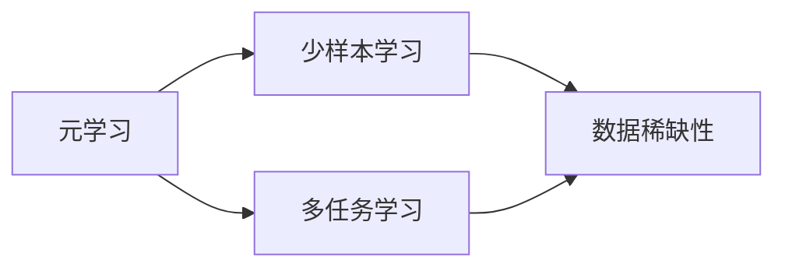

                 


# AI Agent的元学习在少样本学习中的应用

## 关键词
AI Agent，元学习，少样本学习，机器学习，深度学习

## 摘要
本文深入探讨了AI Agent在元学习和少样本学习中的应用，分析了元学习如何提升少样本学习的效率与效果。通过理论分析、算法实现和系统设计，展示了AI Agent在少样本学习中的独特优势和广泛应用前景。

---

## 第一部分: AI Agent的元学习与少样本学习背景介绍

### 第1章: AI Agent的定义与背景

#### 1.1 AI Agent的基本概念
- **定义**：AI Agent是指能够感知环境、做出决策并采取行动的智能实体。
- **核心特征**：自主性、反应性、目标导向、社交能力。
- **应用场景**：智能助手、自动驾驶、智能客服、游戏AI。

#### 1.2 元学习的定义与背景
- **定义**：元学习是指学习如何学习，通过学习不同任务的规律来提升新任务的效率。
- **核心目标**：快速适应新任务，减少数据依赖。
- **应用场景**：图像分类、自然语言处理、推荐系统。

#### 1.3 少样本学习的定义与挑战
- **定义**：少样本学习是指在数据量较少的情况下进行学习和分类。
- **核心问题**：数据稀疏性、模型泛化能力不足。
- **应用场景**：医学影像分析、小语种NLP任务。

---

### 第2章: 元学习与少样本学习的关系

#### 2.1 元学习在少样本学习中的作用
- **提升效率**：元学习通过共享任务间的信息，减少对每个任务独立训练的需求。
- **优势对比**：相比传统机器学习，元学习在数据量小的情况下表现更优。
- **未来发展**：元学习将推动AI Agent在复杂环境中的快速适应能力。

#### 2.2 AI Agent在少样本学习中的应用
- **AI Agent的优势**：结合元学习和少样本学习，提升决策效率和准确性。
- **实际案例**：医疗诊断中的AI Agent，通过少样本学习快速识别罕见病症。

---

## 第二部分: 元学习的核心概念与原理

### 第3章: 元学习的核心概念与原理

#### 3.1 元学习的原理
- **基本原理**：通过学习任务间的共同特征，构建通用的模型更新规则。
- **数学模型**：基于梯度下降的元优化框架。
- **算法框架**：包括MAML（元学习的梯度下降）和Meta-SGD等方法。

#### 3.2 少样本学习的核心概念
- **定义与特征**：数据量少但类别多，要求模型具备良好的泛化能力。
- **挑战与解决方案**：通过数据增强、迁移学习等技术提升模型性能。

---

## 第三部分: 元学习与少样本学习的核心概念对比

### 第4章: 元学习与少样本学习的关系

#### 4.1 核心概念对比
- **对比分析**：元学习关注任务间的共享信息，少样本学习关注单任务的数据稀缺性。
- **表格对比**：从目标、方法、应用场景等方面进行对比。

| 对比维度 | 元学习 | 少样本学习 |
|----------|--------|------------|
| 目标     | 学习如何学习 | 在少量数据上学习 |
| 方法     | 元优化、任务间共享 | 数据增强、迁移学习 |
| 应用场景 | 多任务学习 | 医学影像分析 |

#### 4.2 实体关系图


---

## 第四部分: 元学习与少样本学习的算法实现

### 第5章: 元学习的算法实现

#### 5.1 MAML算法
- **算法流程**：
  1. 在支持集上优化任务特定的参数。
  2. 在查询集上优化元参数。
- **代码实现**：
  ```python
  import torch
  def meta_learning_optimizer(meta_params, learning_rate):
      return torch.optim.Adam(meta_params, lr=learning_rate)
  ```

- **数学模型**：
  $$ \theta = \theta - \epsilon \nabla_{\theta} \mathcal{L} $$

### 第6章: 少样本学习的算法实现

#### 6.1 使用MAML进行少样本分类
- **算法步骤**：
  1. 从支持集中选择少量样本。
  2. 使用MAML优化器进行元优化。
- **代码示例**：
  ```python
  def few_shot_learning(model, support_set, query_set):
      optimizer = meta_learning_optimizer(model.parameters(), 1e-3)
      optimizer.zero_grad()
      # 计算支持集上的损失
      support_loss = model(support_set)
      # 计算查询集上的损失
      query_loss = model(query_set)
      # 反向传播并优化
      total_loss = support_loss + query_loss
      total_loss.backward()
      optimizer.step()
      return model
  ```

---

## 第五部分: 系统分析与架构设计

### 第7章: 系统架构设计

#### 7.1 系统功能设计
- **领域模型**：
  ```mermaid
  classDiagram
      class AI-Agent {
          - model: 元学习模型
          - data: 少样本数据集
          - optimizer: 元优化器
          - predict: 预测结果
      }
  ```

- **系统架构**：
  ```mermaid
  graph LR
      A[AI-Agent] --> B[元学习模块]
      B --> C[少样本学习模块]
      C --> D[数据处理模块]
  ```

#### 7.2 系统接口设计
- **接口定义**：
  ```mermaid
  sequenceDiagram
      participant AI-Agent
      participant 元学习模块
      participant 少样本学习模块
      AI-Agent -> 元学习模块: 初始化元参数
      元学习模块 -> 少样本学习模块: 优化任务参数
      少样本学习模块 -> AI-Agent: 返回预测结果
  ```

---

## 第六部分: 项目实战与应用

### 第8章: 项目实战

#### 8.1 环境安装
- 安装Python和深度学习框架（如PyTorch）。
- 安装必要的依赖库：`pip install torch numpy matplotlib`.

#### 8.2 核心代码实现
- **元学习模块**：
  ```python
  import torch
  def meta_learning(model, support_set, query_set, learning_rate=1e-3):
      optimizer = torch.optim.Adam(model.parameters(), lr=learning_rate)
      optimizer.zero_grad()
      # 支持集优化
      support_loss = model(support_set)
      # 查询集优化
      query_loss = model(query_set)
      total_loss = support_loss + query_loss
      total_loss.backward()
      optimizer.step()
      return model
  ```

- **少样本分类**：
  ```python
  def few_shot_classify(model, test_set, k=5):
      support_set = test_set[:k]
      query_set = test_set[k:]
      meta_learning(model, support_set, query_set)
      return model.predict(query_set)
  ```

#### 8.3 实际案例分析
- **案例背景**：在医学影像分析中，使用少样本学习快速识别罕见病症。
- **代码解读**：通过MAML算法，AI Agent在支持集上学习后，快速预测查询集的标签。

---

## 第七部分: 最佳实践与总结

### 第9章: 最佳实践

#### 9.1 小结
- 元学习与少样本学习的结合，显著提升了AI Agent在数据稀缺环境下的学习效率。
- 通过系统设计和算法优化，AI Agent能够快速适应新任务并提高决策准确率。

#### 9.2 注意事项
- 数据质量：少样本学习对数据质量要求较高，需确保数据的代表性和多样性。
- 算法选择：根据具体场景选择合适的元学习算法，如MAML或Meta-SGD。
- 计算资源：元学习需要大量计算资源，需优化硬件配置和并行计算。

#### 9.3 拓展阅读
- 《Meta-Learning for Few-Shot Classification》
- 《Learning to Learn by Gradient Descent by Gradient Descent》

---

## 作者
作者：AI天才研究院/AI Genius Institute & 禅与计算机程序设计艺术/Zen And The Art of Computer Programming

---

通过以上结构，我们可以系统地探讨AI Agent的元学习在少样本学习中的应用，从理论到实践，全面分析其原理、算法实现和实际应用价值。

