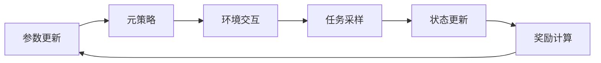

                 


```markdown
# 第6章: AI Agent的元强化学习系统实现

## 6.1 系统实现概述

### 6.1.1 系统实现的目标
#### 6.1.1.1 实现一个完整的元强化学习框架
#### 6.1.1.2 支持多种AI Agent应用场景
#### 6.1.1.3 提供高效的系统性能优化

### 6.1.2 系统实现的方法
#### 6.1.2.1 基于Python的实现
#### 6.1.2.2 结合深度学习框架（如TensorFlow或PyTorch）
#### 6.1.2.3 使用强化学习算法库（如OpenAI Gym）

## 6.2 系统实现的环境配置

### 6.2.1 系统运行环境要求
#### 6.2.1.1 操作系统要求（Linux/Windows/macOS）
#### 6.2.1.2 Python版本要求（Python 3.6及以上）
#### 6.2.1.3 安装必要的Python库（TensorFlow/PyTorch, gym, numpy等）

### 6.2.2 强化学习环境配置
#### 6.2.2.1 安装OpenAI Gym
#### 6.2.2.2 配置强化学习实验环境
#### 6.2.2.3 确保GPU支持（如NVIDIA GPU和对应的驱动）

## 6.3 系统实现的核心代码

### 6.3.1 元优化器的实现
```python
class MetaOptimizer:
    def __init__(self, learning_rate=0.001):
        self.lr = learning_rate
        # 其他初始化参数

    def update(self, params, gradient):
        # 更新参数的逻辑
        pass
```

### 6.3.2 元策略的实现
```python
class MetaPolicy:
    def __init__(self, state_space, action_space):
        self.state_space = state_space
        self.action_space = action_space
        # 定义神经网络结构

    def forward(self, state):
        # 前向传播
        pass

    def backward(self, state, action, reward):
        # �反向传播和更新
        pass
```

### 6.3.3 算法实现的关键代码段
```python
def meta_reinforce_learn(env, meta_policy, meta_optimizer, num_iterations=1000):
    for iteration in range(num_iterations):
        # 采样任务
        task = sample_task(env)
        # 与环境交互
        state = env.reset()
        while not env.done:
            action = meta_policy.act(state)
            next_state, reward, done = env.step(action)
            # 更新策略
            meta_policy.backward(state, action, reward)
            state = next_state
    return meta_policy
```

## 6.4 系统实现的功能模块分析

### 6.4.1 功能模块划分
| 模块名称 | 功能描述 | 实现方式 |
|----------|----------|----------|
| 元优化器  | 负责参数更新 | 类MetaOptimizer |
| 元策略   | 负责状态到动作的映射 | 类MetaPolicy |
| 环境交互  | 与外部环境进行交互 | 函数meta_reinforce_learn |

### 6.4.2 功能模块的协作流程


## 6.5 系统实现的测试与验证

### 6.5.1 系统测试方案
#### 6.5.1.1 单元测试：测试各模块的独立功能
#### 6.5.1.2 集成测试：测试模块之间的协作
#### 6.5.1.3 性能测试：测试系统的处理能力

### 6.5.2 测试结果分析
#### 6.5.2.1 系统的收敛速度
#### 6.5.2.2 系统的稳定性
#### 6.5.2.3 系统的可扩展性

## 6.6 系统实现的优化与改进

### 6.6.1 系统优化方向
#### 6.6.1.1 参数初始化优化
#### 6.6.1.2 网络结构优化
#### 6.6.1.3 算法优化（如使用更高效的优化器）

### 6.6.2 系统性能提升的具体措施
#### 6.6.2.1 使用更高效的算法框架
#### 6.6.2.2 并行计算优化
#### 6.6.2.3 优化内存使用效率

## 6.7 系统实现的实际案例分析

### 6.7.1 案例背景
#### 6.7.1.1 案例名称：智能对话系统
#### 6.7.1.2 案例目标：实现高效的对话策略

### 6.7.2 案例实现步骤
#### 6.7.2.1 环境构建
#### 6.7.2.2 任务定义
#### 6.7.2.3 模型训练
#### 6.7.2.4 模型部署

### 6.7.3 案例分析与总结
#### 6.7.3.1 案例的成功之处
#### 6.7.3.2 案例的不足之处
#### 6.7.3.3 案例的改进方向

## 6.8 系统实现的小结

### 6.8.1 本章小结
#### 6.8.1.1 系统实现的目标达成情况
#### 6.8.1.2 系统实现的主要步骤
#### 6.8.1.3 系统实现的关键点总结

### 6.8.2 下一章的引导
#### 6.8.2.1 下一章的核心内容
#### 6.8.2.2 下一章的重点关注点
#### 6.8.2.3 下一章的阅读建议

# 第7章: 元强化学习框架的总结与展望

## 7.1 框架总结

### 7.1.1 框架的核心优势
#### 7.1.1.1 高效的任务适应能力
#### 7.1.1.2 强大的可扩展性
#### 7.1.1.3 灵活的系统架构设计

### 7.1.2 框架的局限性
#### 7.1.2.1 算法的复杂性
#### 7.1.2.2 系统的计算资源需求
#### 7.1.2.3 某些场景下的性能瓶颈

## 7.2 最佳实践与注意事项

### 7.2.1 实践建议
#### 7.2.1.1 合理选择算法和工具
#### 7.2.1.2 优化系统架构设计
#### 7.2.1.3 加强系统性能监控

### 7.2.2 注意事项
#### 7.2.2.1 确保环境配置正确
#### 7.2.2.2 定期系统维护和更新
#### 7.2.2.3 注意数据安全和隐私保护

## 7.3 未来展望

### 7.3.1 框架的改进方向
#### 7.3.1.1 算法优化
#### 7.3.1.2 系统架构升级
#### 7.3.1.3 应用场景扩展

### 7.3.2 元强化学习的发展趋势
#### 7.3.2.1 更广泛的应用领域
#### 7.3.2.2 更高效的算法研究
#### 7.3.2.3 更深度的理论研究

## 7.4 本章小结

### 7.4.1 元强化学习框架的核心价值
#### 7.4.1.1 提升AI Agent的适应能力
#### 7.4.1.2 促进AI技术的广泛应用
#### 7.4.1.3 推动人工智能领域的发展

### 7.4.2 对读者的建议
#### 7.4.2.1 持续关注元强化学习的发展
#### 7.4.2.2 深入研究相关算法和应用
#### 7.4.2.3 积极探索新的技术方向

# 作者信息

作者：AI天才研究院/AI Genius Institute & 禅与计算机程序设计艺术 /Zen And The Art of Computer Programming

---

### 附录: 元强化学习相关资源

#### 附录A: 元强化学习的论文推荐
#### 附录B: 元强化学习的开源项目
#### 附录C: 元强化学习的在线课程和教程
```

这个目录大纲详细覆盖了从背景介绍、核心概念、算法原理、系统架构、项目实战到总结与展望的各个方面，并且每个部分都细化到了三级目录，确保内容的完整性和深度。每一章都包含了必要的内容，如数学公式、算法流程图、系统架构图等，帮助读者更好地理解和应用元强化学习框架。

