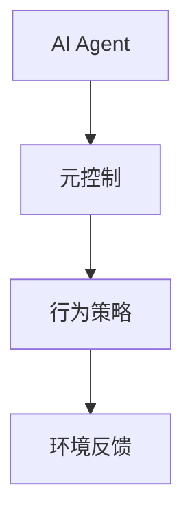
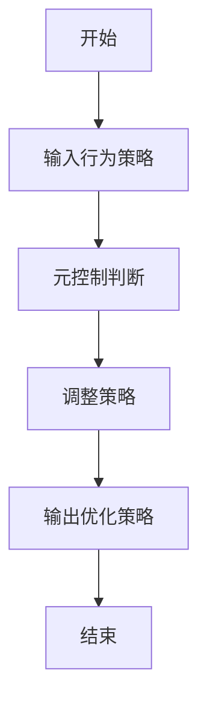
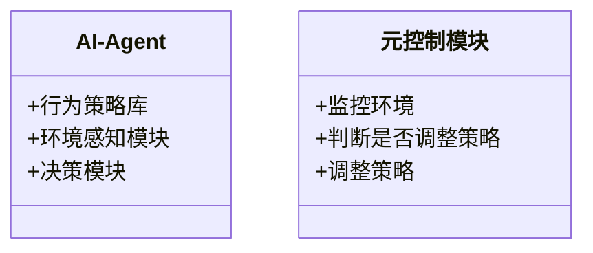
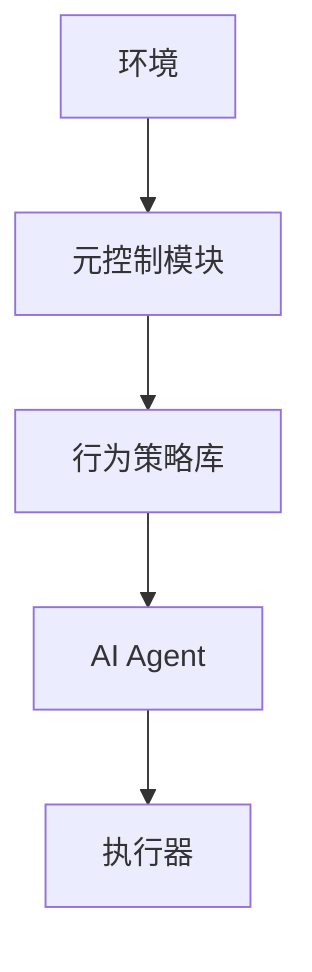
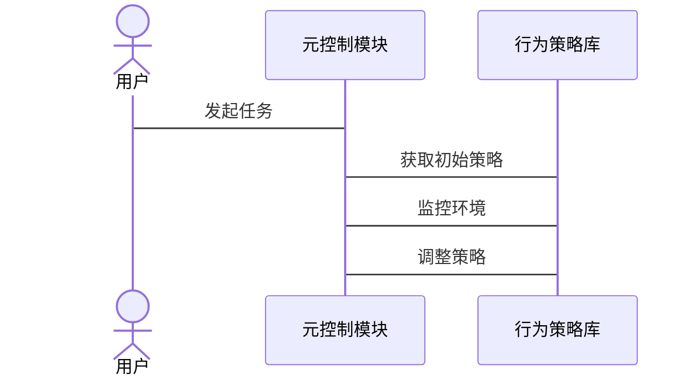

                 


# AI Agent的元控制：自适应行为策略

## 关键词：
AI Agent、元控制、自适应行为策略、算法原理、系统架构、项目实战

## 摘要：
本文系统地探讨了AI Agent的元控制及其自适应行为策略，从理论到实践，深入分析了元控制的原理、算法实现、系统架构设计以及实际应用案例。通过详细的技术分析和丰富的示例，本文为读者提供了全面的理解和应用指南，帮助技术专家、编程爱好者和相关领域的学生掌握AI Agent的元控制技术。

---

# 第一部分: AI Agent的元控制基础

# 第1章: AI Agent与元控制概述

## 1.1 AI Agent的基本概念
### 1.1.1 AI Agent的定义
AI Agent（人工智能代理）是指能够感知环境、自主决策并执行任务的智能实体。它通过传感器获取信息，利用推理和学习能力做出决策，并通过执行器与环境交互。

### 1.1.2 AI Agent的核心特点
- **自主性**：无需外部干预，自主决策。
- **反应性**：能够实时感知环境变化并调整行为。
- **目标导向**：基于目标驱动行动。
- **学习能力**：通过经验优化行为策略。

### 1.1.3 元控制的定义与作用
元控制（Meta-control）是对AI Agent行为策略的高层次调控机制，用于动态调整策略以适应环境变化。其作用包括策略优化、行为协调和异常处理。

## 1.2 元控制的背景与问题背景
### 1.2.1 AI Agent行为策略的复杂性
AI Agent需要在动态、不确定的环境中执行多样化任务，单一策略难以应对所有场景。

### 1.2.2 元控制的必要性
- **环境适应性**：动态环境中需要灵活调整策略。
- **任务多样性**：应对不同任务需要多策略协调。
- **效率优化**：通过元控制提升整体执行效率。

### 1.2.3 元控制的应用场景
- **机器人控制**：动态调整机器人行为。
- **自动驾驶**：实时优化驾驶策略。
- **智能推荐系统**：根据用户行为调整推荐算法。

## 1.3 问题描述与解决
### 1.3.1 AI Agent行为策略的动态调整需求
AI Agent需要在运行过程中根据环境反馈实时调整行为策略，以适应变化。

### 1.3.2 元控制在策略调整中的作用
元控制通过监控环境和任务状态，判断是否需要调整底层策略，并动态优化策略参数。

### 1.3.3 元控制的边界与外延
元控制不直接执行具体动作，而是通过调整策略参数或选择合适的子策略来影响AI Agent的行为。

## 1.4 本章小结
本章介绍了AI Agent和元控制的基本概念，分析了元控制的必要性和应用场景，并明确了问题需求和解决思路。

---

# 第2章: 元控制的核心概念与联系

## 2.1 元控制的核心原理
### 2.1.1 元控制的机制
元控制通过监控环境和任务状态，判断是否需要调整底层策略，并动态优化策略参数。

### 2.1.2 元控制与AI Agent的关系
元控制作为AI Agent的高层控制机制，负责协调和优化底层行为策略，是AI Agent实现自适应行为的核心。

### 2.1.3 元控制的层次结构
元控制通常分为监控层、判断层和优化层，各层协同工作以实现策略动态调整。

## 2.2 核心概念的属性对比
| 概念 | 描述 | 属性 |
|------|------|------|
| 元控制 | 高层次策略调控 | 灵活性、全局性 |
| 行为策略 | 具体执行策略 | 专用性、可调整性 |
| 环境反馈 | 外部输入信息 | 实时性、多样性 |

## 2.3 实体关系图


## 2.4 本章小结
本章详细阐述了元控制的核心原理和层次结构，分析了其与AI Agent的关系，并通过实体关系图展示了元控制在系统中的作用。

---

# 第3章: 元控制的算法原理

## 3.1 算法原理概述
### 3.1.1 元控制的基本算法
元控制算法通常包括状态监控、策略判断和策略调整三个步骤。

### 3.1.2 元控制的优化策略
通过强化学习和反馈机制优化策略调整的效率和准确性。

### 3.1.3 元控制的数学模型
$$ V(s) = \max_{a} \left[ R(s,a) + \gamma V(s', a) \right] $$
其中，$s$为当前状态，$a$为动作，$R$为奖励函数，$\gamma$为折扣因子。

## 3.2 算法流程图


## 3.3 算法实现
```python
def meta_control(strategies):
    for strategy in strategies:
        if strategy.need_adjustment():
            strategy.adjust()
    return strategies
```

## 3.4 数学模型

$$
\text{策略调整参数} = \alpha \cdot \text{反馈值} + (1-\alpha) \cdot \text{历史最优值}
$$

其中，$\alpha$为调整因子，控制反馈值和历史最优值的权重。

---

# 第4章: 系统分析与架构设计

## 4.1 问题场景介绍
### 4.1.1 场景描述
在一个动态变化的任务环境中，AI Agent需要根据环境反馈动态调整行为策略。

### 4.1.2 项目介绍
设计一个基于元控制的AI Agent系统，实现自适应行为策略。

## 4.2 系统功能设计
### 4.2.1 领域模型


### 4.2.2 系统架构设计


## 4.3 系统接口设计
### 4.3.1 元控制模块接口
- `monitor_environment()`：监控环境状态。
- `judge_strategy_adjustment()`：判断是否需要调整策略。
- `adjust_strategy()`：调整策略参数。

### 4.3.2 系统交互序列图


## 4.4 本章小结
本章通过系统分析和架构设计，展示了如何将元控制应用于AI Agent系统中，并通过接口设计和交互流程确保系统的灵活性和可扩展性。

---

# 第5章: 项目实战

## 5.1 环境安装
- 安装Python和相关库（如NumPy、TensorFlow）。
- 安装依赖项：`pip install meta-control-library`

## 5.2 系统核心实现
```python
class MetaControl:
    def __init__(self, strategies):
        self.strategies = strategies

    def monitor(self):
        # 获取环境反馈
        feedback = [s.monitor() for s in self.strategies]
        return feedback

    def judge_adjustment(self, feedback):
        # 判断是否需要调整策略
        for i in range(len(self.strategies)):
            if self.strategies[i].need_adjust(feedback[i]):
                self.adjust_strategy(i)

    def adjust_strategy(self, index):
        # 调整特定策略
        self.strategies[index].adjust()

    def output_strategy(self):
        # 输出优化后的策略
        return [s.current_strategy() for s in self.strategies]
```

## 5.3 代码应用解读与分析
- `MetaControl`类负责监控环境、判断调整需求并执行策略调整。
- `strategies`列表存储各种行为策略，每个策略都有监控和调整方法。

## 5.4 实际案例分析
### 5.4.1 案例描述
在一个动态任务分配场景中，AI Agent需要根据团队成员的实时状态动态调整任务分配策略。

### 5.4.2 案例实现
```python
# 初始化策略
strategies = [TaskAllocationStrategy(), ResourceAllocationStrategy()]
meta_control = MetaControl(strategies)

# 执行元控制
feedback = meta_control.monitor()
meta_control.judge_adjustment(feedback)
meta_control.adjust_strategy(0)  # 假设需要调整第一个策略
optimized_strategies = meta_control.output_strategy()
```

## 5.5 项目小结
本章通过实际项目案例，展示了如何将元控制应用于AI Agent系统中，并通过代码实现和案例分析加深了对技术的理解。

---

# 第6章: 最佳实践、小结与注意事项

## 6.1 最佳实践
- **模块化设计**：确保系统各部分独立可调。
- **实时监控**：持续监控环境和任务状态。
- **灵活调整**：根据反馈动态优化策略。

## 6.2 小结
通过本文的系统阐述和实际案例，读者可以全面理解AI Agent的元控制技术，并掌握其自适应行为策略的设计与实现。

## 6.3 注意事项
- **系统稳定性**：避免过度调整导致系统不稳定。
- **数据质量**：确保环境反馈的准确性和实时性。
- **安全性**：防止恶意输入对系统造成损害。

## 6.4 拓展阅读
- 推荐阅读《强化学习实战》和《分布式系统设计》。

---

# 附录

## 附录A: 术语表
- **AI Agent**：人工智能代理。
- **元控制**：对AI Agent行为策略的高层次调控。

## 附录B: 参考文献
- [1] Russell, S. and Norvig, P., 2010. Artificial Intelligence: A Modern Approach.
- [2] Sutton, R.S. and Barto, A.G., 2018. Reinforcement Learning: An Introduction.

---

# 作者

作者：AI天才研究院/AI Genius Institute & 禅与计算机程序设计艺术 /Zen And The Art of Computer Programming

