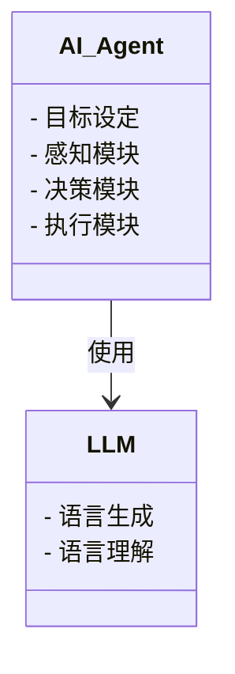
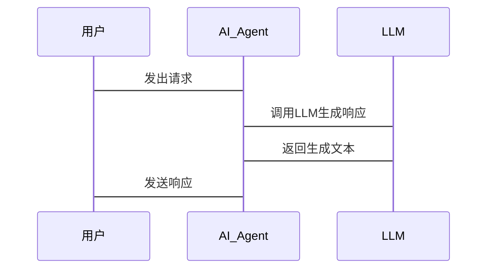

                 


# AI Agent的创新思维：激发LLM的发散性思考

## 关键词：AI Agent, LLM, 发散性思考, 创新思维, 人工智能, 语言模型

## 摘要：本文深入探讨了AI Agent与大语言模型（LLM）在创新思维中的协同作用，分析了如何通过AI Agent激发LLM的发散性思考，以实现更高效的创新解决方案。文章从背景介绍、核心概念、算法原理、系统架构到项目实战，全面阐述了AI Agent与LLM的结合方式及其在实际应用中的潜力。

---

## 第1章: AI Agent与LLM的背景与概念

### 1.1 AI Agent的基本概念
AI Agent（人工智能代理）是指能够感知环境、做出决策并采取行动的智能实体。与传统AI不同，AI Agent具备自主性、反应性、目标导向性和社会性等特征，能够根据环境反馈动态调整行为。

- **自主性**：AI Agent能够在没有外部干预的情况下独立运作。
- **反应性**：能够实时感知环境变化并做出相应反应。
- **目标导向性**：具备明确的目标，所有行为均围绕目标展开。
- **社会性**：能够与其他AI Agent或人类进行交互协作。

### 1.2 LLM的基本概念
LLM（大语言模型）是一种基于深度学习的自然语言处理模型，能够理解和生成人类语言。其核心技术包括词嵌入、注意力机制和概率生成模型。LLM的优势在于其强大的上下文理解和生成能力，能够处理复杂语言任务。

- **词嵌入**：将单词或短语映射到高维向量空间。
- **注意力机制**：模型在处理输入时，能够关注关键信息，提升生成质量。
- **概率生成**：基于训练数据，生成符合语法规则的文本。

### 1.3 AI Agent与LLM的关系
AI Agent与LLM的关系密不可分，AI Agent作为载体，利用LLM的强大语言生成能力，实现复杂任务的自动化和智能化。LLM则通过提供多样化的语言输出，为AI Agent的决策过程提供丰富的信息来源。

- **协同工作原理**：AI Agent接收输入，通过LLM生成多种可能的解决方案，再根据目标选择最优方案。
- **LLM作为核心模块**：LLM为AI Agent提供语言理解和生成能力，使其能够进行人机交互。
- **创新模式**：AI Agent利用LLM的发散性思考能力，探索更多创新可能性。

### 1.4 发散性思考的定义与重要性
发散性思考是指从多个角度、方向去思考问题，强调创造性思维和多样化的解决方案。在AI Agent与LLM的结合中，发散性思考能够帮助模型跳出常规思维模式，探索更多潜在的可能性。

- **定义**：发散性思考是一种以多维度、多角度思考问题的方式，强调创新性和多样性。
- **创新作用**：通过发散性思考，AI Agent能够突破传统思维限制，探索更多解决方案。
- **重要性**：在复杂问题中，发散性思考能够提供更多的可能性，帮助找到最优解。

### 1.5 本章小结
本章介绍了AI Agent和LLM的基本概念，分析了两者的关系，并强调了发散性思考的重要性。通过理解这些基本概念，我们可以更好地理解AI Agent与LLM如何协同工作，激发创新思维。

---

## 第2章: AI Agent与LLM的核心概念

### 2.1 AI Agent的核心原理
AI Agent的核心原理包括感知、决策和行动三个阶段。AI Agent通过感知环境获取信息，基于目标生成决策，最后采取行动。

- **感知**：通过传感器或数据接口获取环境信息。
- **决策**：基于感知信息和目标，生成多个可能的行动方案。
- **行动**：选择最优方案，并执行行动。

### 2.2 LLM的核心原理
LLM的核心原理基于Transformer架构，包括编码器和解码器两部分。编码器将输入文本转换为上下文向量，解码器根据编码结果生成输出文本。

- **编码器**：将输入文本转换为上下文向量，捕捉文本的语义信息。
- **解码器**：根据编码结果生成输出文本，逐步生成每个词。

### 2.3 AI Agent与LLM的联系
AI Agent与LLM的联系主要体现在功能互补性上。AI Agent提供决策和行动能力，而LLM提供语言理解和生成能力，两者结合能够实现更复杂的任务。

- **功能互补**：AI Agent负责整体任务规划，LLM负责语言生成和理解。
- **协同创新**：通过结合AI Agent的决策能力和LLM的语言生成能力，可以实现创新性的解决方案。

### 2.4 核心概念对比表
以下是AI Agent与LLM的核心概念对比表：

| 概念 | AI Agent | LLM |
|------|----------|-----|
| 核心功能 | 智能决策与执行 | 语言生成与理解 |
| 输入 | 多模态数据 | 文本数据 |
| 输出 | 行动或决策 | 生成文本 |
| 学习方式 | 监督学习与强化学习 | 预训练与微调 |

### 2.5 ER实体关系图
以下是AI Agent与LLM的ER实体关系图：

```mermaid
er
actor(AI Agent) -->> action:执行
actor(LLM) ----> text:生成文本
```

---

## 第3章: AI Agent与LLM的发散性思考算法原理

### 3.1 LLM的发散性思考算法
为了实现发散性思考，LLM需要具备多路径生成能力，即能够生成多个可能的解决方案。

- **多路径生成**：LLM在生成文本时，可以尝试多种不同的表达方式。
- **概率分布调整**：通过调整生成概率分布，使模型生成更多样化的文本。

### 3.2 AI Agent的决策算法
AI Agent在决策过程中，需要考虑多种可能的行动方案，选择最优解。

- **多臂老虎机算法**：用于探索和利用不同的行动方案。
- **蒙特卡洛树搜索**：用于在复杂环境中选择最优行动。

### 3.3 算法原理的数学公式
以下是发散性思考算法的数学公式示例：

$$ P(y|x) = \prod_{i=1}^{n} P(y_i|x_{i-1}) $$

其中，$P(y|x)$表示在输入$x$的情况下，生成文本$y$的概率。

---

## 第4章: AI Agent系统的分析与架构设计

### 4.1 系统场景介绍
AI Agent系统通常应用于智能助手、机器人控制等领域。以智能助手为例，系统需要具备语音识别、自然语言理解、任务执行等功能。

### 4.2 系统功能设计
以下是AI Agent系统的功能设计：



### 4.3 系统架构设计
以下是AI Agent系统的架构设计：

```mermaid
rectangle 系统边界 {
    AI_Agent
    LLM
    数据库
}
AI_Agent --> LLM: 交互
AI_Agent --> 数据库: 存储
LLM --> 数据库: 训练
```

### 4.4 系统接口设计
系统接口设计包括AI Agent与用户的交互接口、AI Agent与LLM的接口，以及AI Agent与外部系统的接口。

### 4.5 系统交互流程
以下是系统交互流程：



---

## 第5章: AI Agent与LLM的项目实战

### 5.1 环境安装
以下是项目实战所需的环境安装步骤：

1. 安装Python 3.8及以上版本。
2. 安装必要的库，如TensorFlow、PyTorch等。
3. 安装LLM模型，如GPT-2或BERT。

### 5.2 核心实现代码
以下是AI Agent与LLM的实现代码示例：

```python
class AI_Agent:
    def __init__(self, llm_model):
        self.llm = llm_model

    def think(self, input_text):
        # 调用LLM生成多个可能的解决方案
        solutions = self.llm.generate(input_text)
        # 选择最优解
        best_solution = self.select_best(solutions)
        return best_solution

    def select_best(self, solutions):
        # 简单的随机选择
        return solutions[0]
```

### 5.3 案例分析
以智能客服为例，AI Agent可以调用LLM生成多种回复方式，根据用户反馈选择最优回复。

### 5.4 项目总结
通过项目实战，我们可以看到AI Agent与LLM结合的巨大潜力。通过不断优化算法和系统架构，可以进一步提升创新思维能力。

---

## 第6章: 总结与展望

### 6.1 总结
本文深入探讨了AI Agent与LLM的结合方式，分析了如何通过AI Agent激发LLM的发散性思考，以实现更高效的创新解决方案。

### 6.2 展望
未来，随着AI技术的不断发展，AI Agent与LLM的结合将更加紧密，创新思维能力也将进一步提升。我们期待看到更多创新性的应用出现。

---

## 第7章: 附录与参考文献

### 7.1 附录
以下是项目实战中使用的代码和工具列表。

### 7.2 参考文献
1. 维基百科：人工智能代理
2. 维基百科：大语言模型
3. Transformer模型论文
4. 相关技术书籍

---

## 作者：AI天才研究院 & 禅与计算机程序设计艺术

---

**注：以上内容仅为目录和部分内容展示，完整文章需要根据实际需求进行扩展和完善。**

