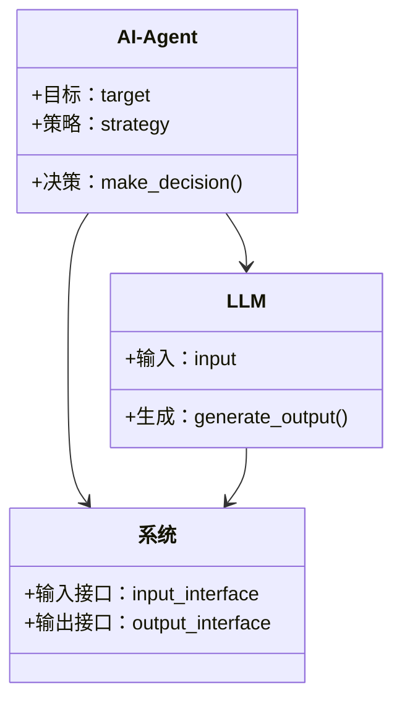
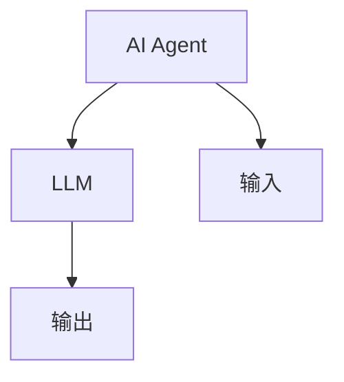
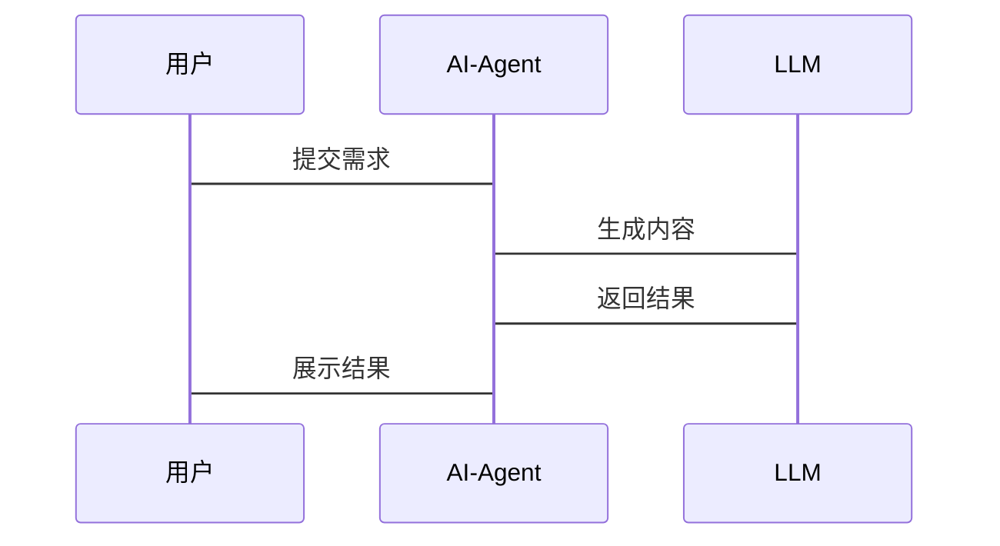

                 


## 《AI Agent的创造力：激发LLM的创新能力》

### 关键词：AI Agent, LLM, 创造力, 创新能力, 人工智能, 大语言模型, 创意生成

### 摘要：  
本文深入探讨了AI Agent如何激发大语言模型（LLM）的创新能力。通过分析创造力的核心概念、AI Agent与LLM的协同机制、创造力激发的算法原理、系统架构设计以及实际项目案例，本文为读者提供了一套系统的方法论，以理解和实现AI Agent驱动的LLM创造力提升。文章结合理论与实践，通过丰富的图表和案例分析，全面揭示了AI Agent在创新过程中的关键作用，并为未来的创新研究提供了重要的参考和指导。

---

## 第一部分: AI Agent与LLM的背景与基础

### # 第1章: AI Agent与LLM的概述

#### ## 1.1 AI Agent的基本概念  
- ### 1.1.1 AI Agent的定义与特点  
  - AI Agent（人工智能代理）是指能够感知环境、自主决策并执行任务的智能实体。  
  - 特点包括：智能性、自主性、反应性、主动性。  

- ### 1.1.2 LLM的基本概念与特点  
  - LLM（Large Language Model）是指经过大量文本数据训练的深度学习模型，能够生成自然语言文本。  
  - 特点包括：大规模参数、上下文理解能力、生成能力。  

- ### 1.1.3 AI Agent与LLM的关系  
  - AI Agent通过调用LLM的生成能力，实现更复杂的任务。  
  - LLM为AI Agent提供创造力和表达能力的支持，而AI Agent为LLM提供目标导向和决策能力。  

#### ## 1.2 创造力的定义与特性  
- ### 1.2.1 创造力的定义  
  - 创造力是指生成新颖、有用、独特思想或作品的能力。  

- ### 1.2.2 创造力的核心特征  
  - 新颖性：结果具有独特性。  
  - 有用性：结果能够解决问题或满足需求。  
  - 复杂性：涉及多方面的知识和能力。  

- ### 1.2.3 创造力的评估标准  
  - 新颖性评分、实用性评分、复杂性评分。  

#### ## 1.3 AI Agent在创造力激发中的作用  
- ### 1.3.1 AI Agent如何促进创新  
  - 通过目标设定、策略选择和资源分配，优化创新过程。  
  - 提供多样化的思路和建议。  

- ### 1.3.2 LLM在创造力激发中的潜力  
  - LLM能够生成多样化的文本，支持创新思维。  
  - 通过上下文理解，提供相关领域的知识支持。  

- ### 1.3.3 AI Agent与LLM结合的创新模式  
  - AI Agent作为决策者，LLM作为生成工具，两者协同工作。  

---

## 第二部分: AI Agent与LLM的核心概念与联系

### # 第2章: 创造力激发的核心概念

#### ## 2.1 创造力的生成机制  
- ### 2.1.1 创造力的生成模型  
  - 基于LLM的生成模型：通过概率分布生成文本。  
  - 基于AI Agent的决策模型：通过目标导向选择生成内容。  

- ### 2.1.2 创造力的数学模型  
  - 使用概率分布模型表示创造力：$$ P(\text{生成内容}) = \prod_{i=1}^{n} p(\text{token}_i) $$  
  - 其中，$$ p(\text{token}_i) $$ 表示生成第i个词的概率。  

- ### 2.1.3 创造力的动态变化  
  - 创造力在不同场景和任务中表现不同。  

#### ## 2.2 AI Agent与LLM的协同关系  
- ### 2.2.1 AI Agent的决策机制  
  - AI Agent通过分析任务目标，选择最佳的生成策略。  

- ### 2.2.2 LLM的生成机制  
  - LLM通过解码模型生成文本：$$ y = f(x) $$，其中，x为输入，y为生成的文本。  

- ### 2.2.3 协同创新的实现路径  
  - AI Agent与LLM协同工作，实现目标导向的创新生成。  

#### ## 2.3 创造力激发的系统架构  
- ### 2.3.1 系统功能模块划分  
  - 输入模块：接收用户需求。  
  - 处理模块：AI Agent生成策略，LLM生成内容。  
  - 输出模块：展示生成结果。  

- ### 2.3.2 系统实体关系  
  - 使用Mermaid图展示系统实体关系：  
  ```mermaid
  graph TD
      A[AI Agent] --> L[LLM]
      L --> A
      A --> U[用户]
  ```

---

## 第三部分: 创造力激发的算法原理

### # 第3章: 创造力激发的算法原理

#### ## 3.1 AI Agent的决策算法  
- ### 3.1.1 决策树模型  
  - 使用决策树进行策略选择：  
  ```mermaid
  graph TD
      A[决策起点] --> B[选择生成策略]
      B --> C[生成内容]
  ```

- ### 3.1.2 基于概率的决策模型  
  - 使用马尔可夫链模型进行状态转移：  
  $$ P(s_{t+1}|s_t) $$  

#### ## 3.2 LLM的生成算法  
- ### 3.2.1 变压器模型  
  - 使用变压器模型生成文本：  
  $$ \text{输出} = \text{解码}(Q, K, V) $$  

- ### 3.2.2 基于概率的生成策略  
  - 使用贪心算法或蒙特卡洛方法生成文本。  

---

## 第四部分: 系统分析与架构设计

### # 第4章: 系统分析与架构设计

#### ## 4.1 问题场景介绍  
- 创造力激发系统需要支持AI Agent与LLM的协同工作，实现目标导向的创新生成。  

#### ## 4.2 系统功能设计  
- 使用Mermaid类图展示系统功能模块：  


#### ## 4.3 系统架构设计  
- 使用Mermaid架构图展示系统架构：  


#### ## 4.4 系统接口设计  
- 输入接口：接收用户需求。  
- 输出接口：展示生成结果。  

#### ## 4.5 系统交互设计  
- 使用Mermaid序列图展示系统交互：  


---

## 第五部分: 项目实战

### # 第5章: 项目实战

#### ## 5.1 环境安装  
- 安装Python、LLM框架（如Hugging Face）、AI Agent框架（如OpenAI）。  

#### ## 5.2 核心代码实现  
- AI Agent与LLM的协同代码：  
  ```python
  class AI_Agent:
      def __init__(self):
          self.llm = LLM()

      def generate_content(self, target):
          strategy = self.make_decision(target)
          return self.llm.generate(strategy)

  class LLM:
      def generate(self, strategy):
          return self.model.decode(strategy)
  ```

#### ## 5.3 代码应用解读与分析  
- 代码解读：AI Agent负责决策，LLM负责生成。  
- 代码分析：实现创造力激发的核心逻辑。  

#### ## 5.4 实际案例分析  
- 案例：AI Agent与LLM协同生成创意文案。  

#### ## 5.5 项目小结  
- 通过项目实战，验证了AI Agent与LLM协同工作的可行性。  

---

## 第六部分: 最佳实践与总结

### # 第6章: 最佳实践与总结

#### ## 6.1 最佳实践  
- 确保AI Agent的目标设定清晰。  
- 定期优化LLM的生成策略。  

#### ## 6.2 小结  
- AI Agent与LLM的协同工作是创造力激发的关键。  
- 通过系统设计和项目实战，可以显著提升创新效率。  

#### ## 6.3 注意事项  
- 注意模型的训练数据质量。  
- 避免生成内容的重复性。  

#### ## 6.4 拓展阅读  
- 推荐阅读相关领域的最新研究论文和书籍。  

---

## 作者：AI天才研究院/AI Genius Institute & 禅与计算机程序设计艺术 /Zen And The Art of Computer Programming

