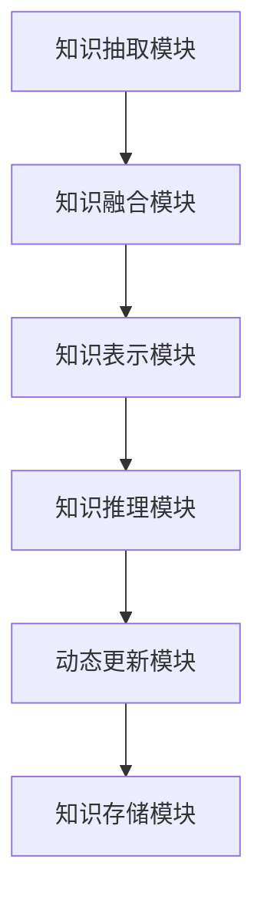
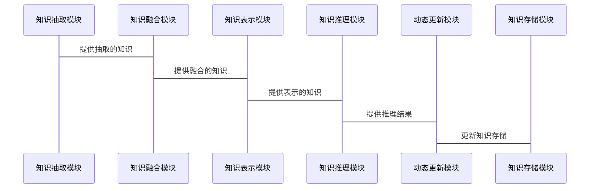

                 


```markdown
# AI Agent的动态知识图谱构建与更新

> 关键词：AI Agent，动态知识图谱，知识图谱构建，知识更新，知识表示，实时推理，系统架构

> 摘要：本文系统地探讨了AI Agent的动态知识图谱构建与更新的关键技术与方法。首先介绍了动态知识图谱的基本概念及其在AI Agent中的作用，接着详细分析了动态知识图谱的核心概念与构建算法，随后从系统架构和接口设计的角度探讨了其实现方式，最后通过一个实际案例展示了动态知识图谱在AI Agent中的应用，并总结了相关经验和最佳实践。

---

## 第1章: AI Agent的动态知识图谱构建背景

### 1.1 知识图谱的基本概念
#### 1.1.1 知识图谱的定义
知识图谱是一种以图结构形式表示知识的语义网络，由实体、关系、属性及其组合构成，用于描述真实世界中的概念及其关系。

#### 1.1.2 知识图谱的特点
- **结构化**：通过实体和关系构建语义网络。
- **动态性**：能够实时更新以反映最新信息。
- **可扩展性**：支持大规模数据的扩展。

#### 1.1.3 知识图谱的构建目标
- 提供统一的知识表示。
- 支持智能系统进行推理和决策。
- 实现实时知识更新与维护。

### 1.2 AI Agent的基本概念
#### 1.2.1 AI Agent的定义
AI Agent是一种智能实体，能够感知环境、自主决策并执行任务，具备学习和适应能力。

#### 1.2.2 AI Agent的分类
- **简单反射式Agent**：基于当前感知直接行动。
- **基于模型的反射式Agent**：维护内部状态并基于模型进行推理。
- **实用_AGENT**：基于效用函数进行决策。

#### 1.2.3 AI Agent的核心技术
- **感知**：从环境中获取信息。
- **推理**：基于知识进行逻辑推理。
- **决策**：根据推理结果制定行动方案。

### 1.3 动态知识图谱的背景与意义
#### 1.3.1 动态知识图谱的背景
随着实时数据流的增加，传统静态知识图谱已无法满足AI Agent对实时知识的需求。

#### 1.3.2 动态知识图谱的意义
- 提高AI Agent的知识表示能力。
- 实现实时知识更新，适应动态环境。
- 支持AI Agent的实时推理与决策。

#### 1.3.3 动态知识图谱的应用场景
- 智能客服：实时更新产品信息，提供准确回答。
- 智能推荐：根据最新数据调整推荐策略。
- 自动驾驶：实时更新交通数据，提高决策准确性。

---

## 第2章: 动态知识图谱的核心概念与联系

### 2.1 动态知识图谱的核心概念
#### 2.1.1 实体与关系
- **实体**：知识图谱中的基本单元，代表具体事物。
- **关系**：实体之间的关联，表示实体间的关系类型。

#### 2.1.2 属性与值
- **属性**：描述实体的特征或性质。
- **值**：属性的取值，可以是单值或多值。

#### 2.1.3 时间戳与版本控制
- **时间戳**：记录知识更新的时间，确保数据的时序性。
- **版本控制**：管理知识图谱的修订版本，支持回溯查询。

### 2.2 动态知识图谱与AI Agent的关系
#### 2.2.1 动态知识图谱是AI Agent的知识基础
AI Agent依赖知识图谱进行推理和决策，动态知识图谱为AI Agent提供实时、准确的知识支持。

#### 2.2.2 AI Agent驱动动态知识图谱的更新
AI Agent通过与环境交互，不断获取新信息，驱动知识图谱的动态更新。

#### 2.2.3 两者的相互作用与依赖
- 动态知识图谱为AI Agent提供知识支持。
- AI Agent通过交互生成新知识，反哺动态知识图谱。

### 2.3 动态知识图谱的核心要素
- 实体：代表具体事物，如“产品”、“用户”等。
- 关系：描述实体之间的关联，如“属于”、“购买”等。
- 属性：描述实体的特征，如“价格”、“时间”等。
- 时间戳：记录知识的更新时间，确保数据的实时性。

---

## 第3章: 动态知识图谱的构建算法原理

### 3.1 动态知识图谱构建的基本原理
#### 3.1.1 知识抽取与融合
- **知识抽取**：从结构化数据、非结构化数据中提取知识。
- **知识融合**：整合多个数据源的知识，消除冗余和冲突。

#### 3.1.2 知识表示与推理
- **知识表示**：使用图结构表示知识，支持语义推理。
- **知识推理**：基于知识图谱进行逻辑推理，推导隐含知识。

#### 3.1.3 知识存储与管理
- **知识存储**：将知识以图结构存储，支持高效查询。
- **知识管理**：管理知识的生命周期，包括创建、更新、删除。

### 3.2 动态知识图谱的更新算法
#### 3.2.1 基于规则的动态更新算法
- **规则定义**：制定知识更新的规则，如“当价格变化时，更新知识图谱中的价格属性”。
- **规则执行**：根据触发条件自动执行知识更新。

#### 3.2.2 基于机器学习的动态更新算法
- **模型训练**：训练机器学习模型，预测知识的变化。
- **模型应用**：基于模型预测结果，自动更新知识图谱。

### 3.3 算法的数学模型与公式
#### 3.3.1 基于规则的更新模型
$$
\text{如果}(p \text{变化}) \Rightarrow \text{更新}(p)
$$
其中，\( p \) 表示需要更新的属性值。

#### 3.3.2 基于机器学习的更新模型
$$
f(x) = w_1x_1 + w_2x_2 + \dots + w_nx_n + b
$$
其中，\( f(x) \) 是预测的结果，\( w_i \) 是权重，\( x_i \) 是输入特征，\( b \) 是偏置。

---

## 第4章: 动态知识图谱的系统架构设计

### 4.1 系统功能设计
#### 4.1.1 知识抽取模块
- 从多种数据源抽取知识，包括结构化数据和非结构化数据。

#### 4.1.2 知识融合模块
- 整合多个数据源的知识，消除冗余和冲突。

#### 4.1.3 知识表示模块
- 使用图结构表示知识，支持语义推理。

#### 4.1.4 知识推理模块
- 基于知识图谱进行逻辑推理，推导隐含知识。

#### 4.1.5 动态更新模块
- 根据规则或模型预测结果，自动更新知识图谱。

### 4.2 系统架构设计


### 4.3 系统接口设计
- **输入接口**：接收实时数据流，触发知识更新。
- **输出接口**：提供知识查询和推理结果。

### 4.4 系统交互流程


---

## 第5章: 动态知识图谱的项目实战

### 5.1 电商推荐系统案例
#### 5.1.1 系统介绍
电商推荐系统通过动态知识图谱，实时更新用户行为数据，提升推荐算法的准确性。

#### 5.1.2 核心代码实现
```python
class KnowledgeGraph:
    def __init__(self):
        self.graph = {}

    def add_entity(self, entity, properties):
        self.graph[entity] = properties

    def update_property(self, entity, property, value):
        self.graph[entity][property] = value

# 示例代码：动态更新知识图谱
kg = KnowledgeGraph()
kg.add_entity("用户1", {"购买时间": "2023-10-01", "产品": "产品A"})
kg.update_property("用户1", "价格", 99.99)
```

#### 5.1.3 案例分析
通过动态更新知识图谱，电商推荐系统能够实时反映用户的最新购买行为，提升推荐算法的效果。

---

## 第6章: 最佳实践与总结

### 6.1 小结
动态知识图谱的构建与更新是实现AI Agent智能决策的关键技术，其核心在于实时更新和高效管理知识。

### 6.2 注意事项
- 确保知识更新的实时性和准确性。
- 处理好知识图谱的扩展性和维护性。
- 注意数据的隐私和安全问题。

### 6.3 未来研究方向
- 研究更高效的动态知识图谱构建算法。
- 探索新的知识表示方法，如图嵌入和知识图谱增强学习。
- 结合分布式计算和边缘计算，提升知识更新的效率。

### 6.4 拓展阅读
推荐阅读以下书籍和论文：
- 《知识图谱：概念、方法与应用》
- “Dynamic Knowledge Graph Construction for Real-Time Decision Making in AI Agents”

---

## 作者：AI天才研究院/AI Genius Institute & 禅与计算机程序设计艺术 /Zen And The Art of Computer Programming
```

