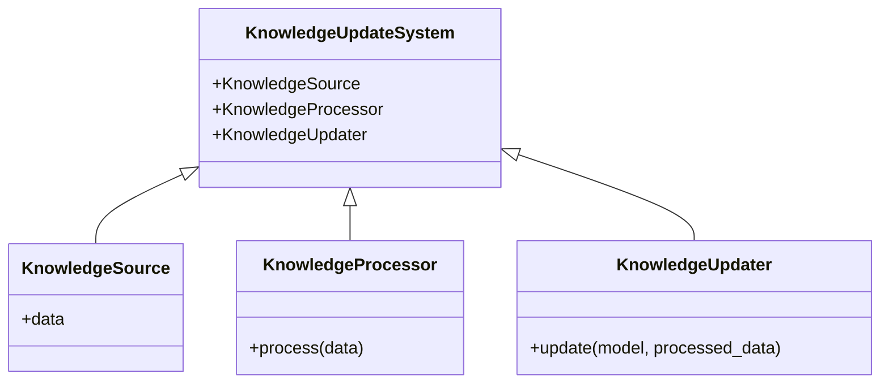
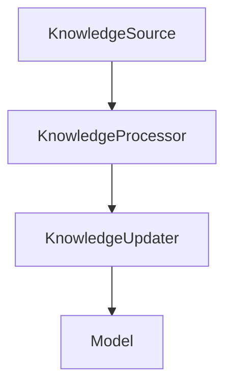

                 


# AI Agent的动态知识更新：保持LLM知识的实时性

> 关键词：AI Agent，动态知识更新，LLM，实时性，知识库，增量学习，在线更新

> 摘要：本文详细探讨了AI Agent的动态知识更新机制，重点分析了如何保持大语言模型（LLM）知识的实时性。文章从动态知识更新的背景与概念出发，深入讲解了其核心算法原理，并通过系统架构设计与项目实战，展示了如何实现高效的动态知识更新。最后，本文总结了动态知识更新的关键点和未来发展方向。

---

## 第1章: AI Agent与动态知识更新概述

### 1.1 AI Agent的基本概念
#### 1.1.1 AI Agent的定义与特点
AI Agent（人工智能代理）是指能够感知环境并采取行动以实现目标的智能实体。其特点包括自主性、反应性、目标导向性和社交能力。

#### 1.1.2 动态知识更新的必要性
在动态环境中，知识需要实时更新以适应变化。动态知识更新是AI Agent保持高效运作的关键。

#### 1.1.3 LLM在AI Agent中的作用
大语言模型（LLM）通过处理海量数据，能够生成和更新知识，为AI Agent提供强大的语义理解和生成能力。

---

### 1.2 动态知识更新的背景与问题背景
#### 1.2.1 知识实时性的挑战
知识库的实时性要求AI Agent能够快速响应最新信息，避免知识过时。

#### 1.2.2 LLM知识更新的痛点
LLM的知识更新需要高效、频繁地进行，以应对不断变化的环境。

#### 1.2.3 动态知识更新的核心问题
如何在保证知识准确性的前提下，实现快速、高效的动态更新。

---

### 1.3 动态知识更新的核心概念
#### 1.3.1 动态知识更新的定义
动态知识更新是指在运行时，通过持续学习和调整，保持知识库内容实时性的一种机制。

#### 1.3.2 知识更新的机制与流程
知识更新包括知识获取、处理、存储和应用四个步骤。

#### 1.3.3 实时性与准确性的平衡
实时性要求快速更新，而准确性则需要确保知识的正确性，两者需要在动态更新中找到平衡点。

---

## 第2章: 动态知识更新的核心概念与联系

### 2.1 动态知识更新的机制
#### 2.1.1 知识获取与处理流程
知识获取包括数据采集、预处理和特征提取，处理流程包括数据清洗和向量化。

#### 2.1.2 知识存储与检索方式
知识存储可以采用数据库或知识图谱形式，检索方式包括基于关键词和基于语义的检索。

#### 2.1.3 知识更新的触发条件
触发条件包括时间间隔、事件驱动和用户反馈。

---

### 2.2 动态知识更新与传统知识库的对比
#### 2.2.1 传统知识库的特点
传统知识库静态、结构化，更新周期长。

#### 2.2.2 动态知识更新的优势
动态更新实时性强、适应性高。

#### 2.2.3 两者的对比分析
动态知识更新在实时性上有明显优势，但准确性可能稍逊于传统知识库。

---

### 2.3 动态知识更新的实时性分析
#### 2.3.1 实时性的重要性
实时性是动态更新的核心目标，直接影响AI Agent的响应速度和决策能力。

#### 2.3.2 实时更新的实现方式
包括增量学习和在线更新两种方式。

#### 2.3.3 实时性与准确性的权衡
动态更新需要在实时性和准确性之间找到平衡，避免过度更新导致的错误。

---

## 第3章: 动态知识更新的算法原理

### 3.1 动态知识更新的算法概述
#### 3.1.1 增量学习算法
增量学习通过逐步更新模型，适应新数据的变化。

#### 3.1.2 在线更新算法
在线更新在数据流中实时调整模型参数。

#### 3.1.3 混合更新算法
结合增量和在线更新的优点，提高更新效率。

---

### 3.2 增量学习算法的实现
#### 3.2.1 增量学习的基本原理
增量学习在每次新数据输入时，仅更新模型的部分参数。

#### 3.2.2 增量学习的数学模型
增量学习的更新公式可以表示为：
$$ \theta_{new} = \theta_{old} + \eta \cdot (y - \hat{y}) $$

#### 3.2.3 增量学习的实现步骤
1. 初始化模型参数。
2. 读取新数据，计算预测值。
3. 更新模型参数。

---

### 3.3 在线更新算法的实现
#### 3.3.1 在线更新的基本原理
在线更新通过实时处理数据流，不断优化模型。

#### 3.3.2 在线更新的数学模型
在线更新的公式可以表示为：
$$ \theta_{t+1} = \theta_t + \eta \cdot (y_t - \hat{y}_t) $$

#### 3.3.3 在线更新的实现步骤
1. 初始化模型参数。
2. 读取实时数据，计算预测值。
3. 更新模型参数。

---

### 3.4 算法对比与优化
#### 3.4.1 算法对比分析
增量学习适合批量更新，而在线更新适合实时处理。

#### 3.4.2 算法优化策略
采用小批量梯度下降和动量优化方法。

#### 3.4.3 算法实现的注意事项
确保数据流的稳定性和模型的收敛性。

---

## 第4章: 动态知识更新的系统架构设计

### 4.1 系统架构概述
#### 4.1.1 系统功能模块划分
包括知识获取、知识处理、知识更新和知识应用四个模块。

#### 4.1.2 系统架构的组成
系统架构由数据层、模型层和应用层组成。

#### 4.1.3 系统架构的优缺点
优点是模块化强，缺点是可能增加系统复杂性。

---

### 4.2 系统功能设计
#### 4.2.1 知识获取模块
负责从数据源获取新知识。

#### 4.2.2 知识处理模块
对获取的知识进行清洗和向量化处理。

#### 4.2.3 知识更新模块
根据处理后的知识，更新模型参数。

---

### 4.3 系统架构设计
#### 4.3.1 系统架构的Mermaid类图


#### 4.3.2 系统架构的Mermaid架构图


---

## 第5章: 动态知识更新的项目实战

### 5.1 项目环境安装
安装必要的Python库，如TensorFlow和PyTorch。

### 5.2 系统核心实现
#### 5.2.1 知识获取与处理
读取数据并进行预处理。

#### 5.2.2 模型训练与更新
使用增量学习或在线更新方法训练模型。

#### 5.2.3 知识应用与验证
验证更新后的模型是否准确。

---

### 5.3 代码实现与解读
#### 5.3.1 增量学习的代码实现
```python
class IncrementalLearner:
    def __init__(self, model):
        self.model = model
        self.optimizer = Adam(model.parameters(), lr=0.001)
    
    def update(self, x, y):
        outputs = self.model(x)
        loss = F.cross_entropy(outputs, y)
        self.optimizer.zero_grad()
        loss.backward()
        self.optimizer.step()
```

#### 5.3.2 在线更新的代码实现
```python
class OnlineUpdater:
    def __init__(self, model):
        self.model = model
        self.optimizer = SGD(model.parameters(), lr=0.1)
    
    def update(self, x, y):
        outputs = self.model(x)
        loss = F.mse_loss(outputs, y)
        self.optimizer.zero_grad()
        loss.backward()
        self.optimizer.step()
```

---

### 5.4 实际案例分析
通过具体案例说明动态知识更新的实际应用和效果。

---

## 第6章: 最佳实践与未来展望

### 6.1 动态知识更新的最佳实践
确保数据质量和更新频率，选择合适的算法和模型。

### 6.2 小结
动态知识更新是保持LLM实时性的重要手段，需要综合考虑算法和系统架构。

### 6.3 注意事项
注意数据质量、更新频率和模型收敛性。

### 6.4 未来研究方向
探索更高效的算法和更智能的更新策略。

---

## 参考文献
[1] Brown T, et al. "Language Models are Few-Shot Learners." arXiv preprint arXiv:2005.14169, 2020.

[2] Goodfellow I, Bengio Y, & Courville A. "Deep Learning." MIT Press, 2016.

---

## 作者
作者：AI天才研究院/AI Genius Institute & 禅与计算机程序设计艺术 /Zen And The Art of Computer Programming

