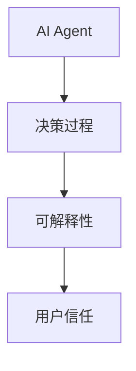
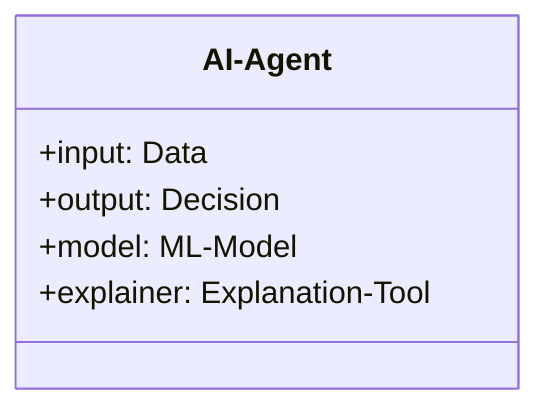
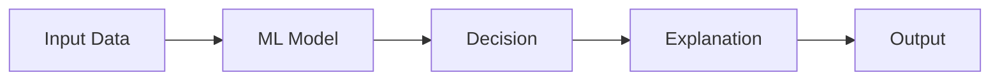
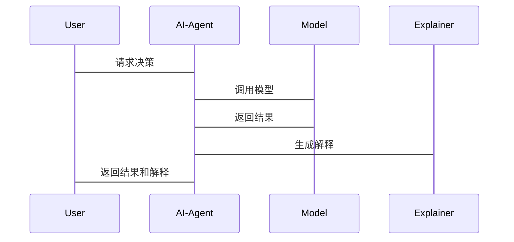

                 


# AI Agent的可解释性设计：提高模型决策的透明度

## 关键词：
- AI Agent
- 可解释性
- 决策透明度
- 机器学习模型
- 解释性算法

## 摘要：
在AI Agent的应用日益广泛的今天，可解释性设计成为了提高模型决策透明度的关键。本文深入探讨了AI Agent的决策机制，分析了可解释性的重要性，并通过具体的算法和系统设计展示了如何实现透明和可解释的AI决策过程。文章从背景介绍、核心概念到算法实现、系统架构，再到项目实战，全面解析了可解释性设计的各个方面，为读者提供了从理论到实践的详细指南。

---

# 第1章: AI Agent与可解释性概述

## 1.1 问题背景与定义
### 1.1.1 AI Agent的基本概念
AI Agent（智能体）是指能够感知环境、做出决策并执行动作的智能实体。它可以在没有人类干预的情况下自主完成任务，例如自动驾驶汽车、智能音箱和推荐系统等。

### 1.1.2 可解释性的重要性
随着AI Agent在各个领域的广泛应用，其决策过程的透明性和可解释性变得至关重要。用户和开发者需要理解AI Agent的决策逻辑，以便信任、调试和优化系统。

### 1.1.3 问题的边界与外延
可解释性AI的边界包括解释范围、解释深度和解释准确性。外延则涉及法律合规、伦理道德和技术性能等多个方面。

---

## 1.2 可解释性AI的核心要素
### 1.2.1 可解释性AI的定义
可解释性AI是指AI系统能够以人类可理解的方式解释其决策过程和结果。

### 1.2.2 核心概念与属性特征对比表
| 概念 | 可解释性AI | 不可解释性AI |
|------|------------|-------------|
| 决策透明度 | 高 | 低 |
| 用户信任 | 易建立 | 难建立 |
| 调试难度 | 易 | 难 |

### 1.2.3 ER实体关系图（Mermaid流程图）


---

# 第2章: 可解释性AI的核心概念与联系

## 2.1 核心概念原理
### 2.1.1 可解释性AI的原理
可解释性AI通过模型的解释性方法，将复杂的决策过程转化为人类可理解的形式。

### 2.1.2 AI Agent决策过程的透明化
透明化决策过程包括输入、处理、输出和解释四个步骤。

### 2.1.3 可解释性与不可解释性AI的对比
可解释性AI更注重决策过程的透明和可理解，而不可解释性AI则难以解释其决策逻辑。

---

## 2.2 核心概念属性特征对比表
| 概念 | 可解释性AI | 不可解释性AI |
|------|------------|-------------|
| 解释性 | 易 | 难 |
| 信任度 | 高 | 低 |

---

## 2.3 ER实体关系图（Mermaid流程图）


---

# 第3章: AI Agent的决策过程与可解释性

## 3.1 AI Agent的决策机制
### 3.1.1 基于规则的决策
基于规则的决策通过预定义的规则进行判断，例如简单的条件判断语句。

### 3.1.2 基于模型的决策
基于模型的决策依赖于训练好的机器学习模型，如线性回归和随机森林。

### 3.1.3 基于强化学习的决策
基于强化学习的决策通过奖励机制优化决策过程，例如游戏AI的决策。

---

## 3.2 可解释性在决策过程中的作用
### 3.2.1 提高用户信任
用户更愿意信任能够解释其决策过程的AI系统。

### 3.2.2 便于调试与优化
可解释性帮助开发者识别和修正模型中的问题。

### 3.2.3 法律与伦理合规
可解释性AI符合法律和伦理要求，特别是在医疗和金融领域。

---

# 第4章: 可解释性AI的评估方法

## 4.1 定性评估
### 4.1.1 专家评估法
专家对AI系统的决策过程进行评估和打分。

### 4.1.2 用户感知法
通过用户调查和反馈评估AI系统的可解释性。

### 4.1.3 对比分析法
将可解释性AI与不可解释性AI进行对比分析。

---

## 4.2 定量评估
### 4.2.1 可解释性指标
常用的指标包括解释性分数和透明度分数。

### 4.2.2 模型透明度评估
通过模型结构和参数评估其透明度。

### 4.2.3 决策可追溯性评估
评估决策过程的可追溯性和可验证性。

---

## 4.3 可解释性AI的工具与技术
### 4.3.1 可视化工具
例如使用TensorBoard进行模型可视化。

### 4.3.2 解释生成工具
例如LIME和SHAP解释方法。

### 4.3.3 模型分析工具
例如使用eli5库对模型进行解释。

---

# 第5章: 可解释性AI的算法原理

## 5.1 模型可解释性方法
### 5.1.1 LIME解释方法（Mermaid流程图）
```mermaid
graph TD
    A[Input] --> B[Predict]
    B --> C[Interpret]
    C --> D[Explan
```

### 5.1.2 SHAP解释方法
SHAP（Shapley Additive exPlanations）是一种基于博弈论的解释方法。

---

## 5.2 算法实现
### 5.2.1 LIME解释代码
```python
import lime
from lime import lime_tabular

explainer = lime_tabular.LimeTabularExplainer(X_train, feature_names=feature_names)
explanation = explainer.explain_instance(X_test[0], model.predict, num_features=5)
```

### 5.2.2 SHAP解释代码
```python
import shap

explainer = shap.TreeExplainer(model)
shap_values = explainer.shap_values(X_test)
```

---

## 5.3 数学公式
### 5.3.1 LIME解释公式
$$ \text{weight} = \sum_{i} w_i \cdot f(x_i) $$

### 5.3.2 SHAP解释公式
$$ \text{shapley value} = \sum_{i} \phi_i $$

---

# 第6章: 可解释性AI的系统架构设计

## 6.1 问题场景介绍
AI Agent应用于医疗诊断、金融风控和自动驾驶等领域。

## 6.2 系统功能设计
### 6.2.1 领域模型（Mermaid类图）


## 6.3 系统架构设计（Mermaid架构图）


---

## 6.4 系统接口设计
### 6.4.1 输入接口
接收输入数据并进行预处理。

### 6.4.2 输出接口
输出决策结果及其解释。

## 6.5 系统交互（Mermaid序列图）


---

# 第7章: 可解释性AI的项目实战

## 7.1 环境安装
安装必要的库，例如LIME、SHAP和scikit-learn。

## 7.2 系统核心实现源代码
### 7.2.1 模型训练代码
```python
from sklearn.ensemble import RandomForestClassifier
model = RandomForestClassifier().fit(X_train, y_train)
```

### 7.2.2 解释生成代码
```python
explainer = lime_tabular.LimeTabularExplainer(X_train, feature_names=feature_names)
explanation = explainer.explain_instance(X_test[0], model.predict, num_features=5)
```

## 7.3 代码应用解读与分析
通过代码生成解释，并分析其对决策的影响。

## 7.4 实际案例分析
以医疗诊断为例，分析AI Agent的决策过程及其解释。

## 7.5 项目小结
总结项目实现的关键点和经验教训。

---

# 第8章: 可解释性AI的最佳实践与未来发展

## 8.1 最佳实践
### 8.1.1 选择合适的解释方法
根据具体场景选择LIME或SHAP等方法。

### 8.1.2 保持解释的简洁性
避免过于复杂的解释，确保用户能够理解。

## 8.2 未来研究方向
### 8.2.1 更高级的解释方法
开发新的算法以提高解释的准确性。

### 8.2.2 多模态解释
结合文本和视觉信息提供更丰富的解释。

---

## 小结
可解释性设计是实现AI Agent透明决策的关键。通过本文的深入解析，读者可以掌握从理论到实践的可解释性设计方法，为未来的AI应用提供有力支持。

---

## 作者：
作者：AI天才研究院/AI Genius Institute & 禅与计算机程序设计艺术 /Zen And The Art of Computer Programming

---

这篇文章详细解析了AI Agent的可解释性设计，涵盖了从背景到实战的各个方面，为读者提供了全面的指导和实用的代码示例。

