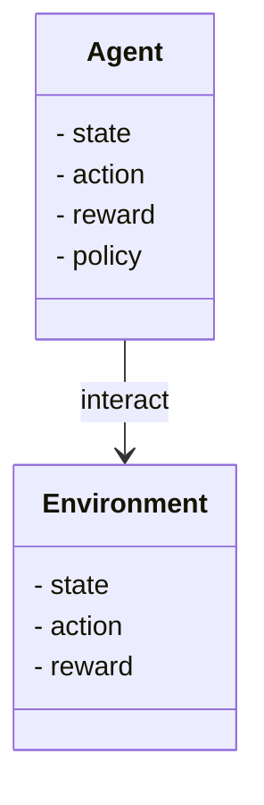
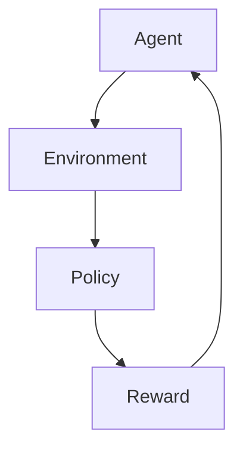
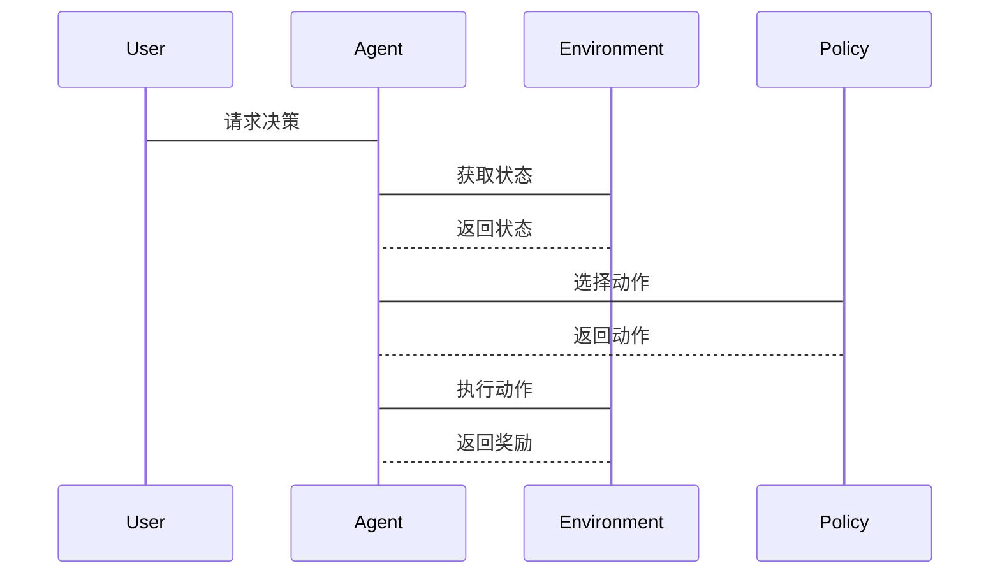

                 


# AI Agent的可解释性设计：理解AI决策过程

## 关键词
AI Agent, 可解释性, 决策过程, 算法原理, 系统设计

## 摘要
AI Agent的可解释性设计是当前人工智能领域的重要研究方向。随着AI技术的广泛应用，理解AI Agent的决策过程变得至关重要。本文通过分析AI Agent的核心概念、决策过程、可解释性设计的原理和方法，结合实际案例，深入探讨如何实现AI Agent的可解释性设计。文章内容涵盖从基础理论到算法实现，再到系统设计的全过程，为读者提供全面的知识体系。

---

## 第一部分: AI Agent的可解释性设计背景

### 第1章: AI Agent的基本概念

#### 1.1 AI Agent的定义与类型
##### 1.1.1 什么是AI Agent
AI Agent（人工智能代理）是指能够感知环境、自主决策并执行任务的智能实体。它可以是一个软件程序、机器人或其他智能系统，通过与环境交互来实现特定目标。

##### 1.1.2 AI Agent的类型
AI Agent可以分为以下几类：
- **基于规则的Agent**：基于预定义的规则进行决策。
- **基于模型的Agent**：利用内部模型来表示状态和目标。
- **基于学习的Agent**：通过机器学习算法从经验中学习。
- **基于强化学习的Agent**：通过与环境交互获得奖励，优化决策策略。

##### 1.1.3 AI Agent的核心特征
AI Agent的核心特征包括自主性、反应性、目标导向性和社交能力。这些特征使得AI Agent能够在复杂环境中独立完成任务。

#### 1.2 可解释性的重要性
##### 1.2.1 为什么需要AI决策的可解释性
可解释性是AI Agent的信任基础。用户需要理解AI的决策过程，才能信任并依赖AI系统。

##### 1.2.2 可解释性在实际应用中的价值
在医疗、金融、司法等领域，AI的决策需要可解释，以满足法规合规性和用户信任需求。

##### 1.2.3 可解释性与用户信任的关系
可解释性是用户信任AI系统的关键因素。只有当用户能够理解AI的决策过程时，才会真正信任AI系统。

#### 1.3 本书的核心问题
##### 1.3.1 问题背景
随着AI技术的广泛应用，AI Agent的决策过程变得越来越复杂，用户对AI的可解释性需求也在增加。

##### 1.3.2 问题描述
如何设计AI Agent，使其决策过程能够被用户理解和解释。

##### 1.3.3 问题解决的思路
通过分析AI Agent的决策过程，设计可解释性模型，提供透明的决策路径。

##### 1.3.4 边界与外延
可解释性设计的边界包括决策过程的透明度和用户理解能力的限制。

##### 1.3.5 核心概念与组成要素
AI Agent的可解释性设计涉及决策过程、解释性模型和用户交互等多个方面。

### 第2章: AI Agent的决策过程分析

#### 2.1 决策过程的分解
##### 2.1.1 输入处理
AI Agent首先接收输入数据，进行预处理和特征提取。

##### 2.1.2 状态分析
AI Agent根据输入数据和内部状态，分析当前环境。

##### 2.1.3 动作选择
AI Agent基于分析结果，选择最优动作。

##### 2.1.4 输出结果
AI Agent执行选择的动作，并输出结果。

#### 2.2 决策过程中的可解释性要素
##### 2.2.1 决策路径的透明度
用户需要了解AI Agent在决策过程中选择了哪些路径。

##### 2.2.2 决策依据的可追溯性
用户需要知道AI Agent的决策依据是什么。

##### 2.2.3 决策结果的可验证性
用户需要能够验证AI Agent的决策结果是否合理。

---

## 第二部分: AI Agent的可解释性设计的核心概念与联系

### 第3章: 可解释性设计的核心概念与联系

#### 3.1 可解释性设计的原理
##### 3.1.1 解释性模型的构建
通过构建解释性模型，帮助用户理解AI Agent的决策过程。

##### 3.1.2 解释性特征的提取
从AI Agent的决策过程中提取关键特征，用于解释。

##### 3.1.3 解释性信息的呈现
将解释性信息以用户友好的方式呈现。

#### 3.2 核心概念对比表
##### 3.2.1 可解释性与不可解释性的对比
| 特性         | 可解释性            | 不可解释性          |
|--------------|---------------------|---------------------|
| 理解难度     | 低                  | 高                  |
| 用户信任     | 高                  | 低                  |
| 应用场景     | 需要信任的场景      | 不需要信任的场景    |

##### 3.2.2 解释性模型的类型对比
| 类型         | 基于规则的模型      | 基于学习的模型      |
|--------------|---------------------|---------------------|
| 可解释性     | 高                  | 低                  |
| 灵活性       | 低                  | 高                  |

##### 3.2.3 解释性特征的权重对比
| 特征         | 重要性权重          | 解释性权重          |
|--------------|---------------------|---------------------|
| 用户需求     | 高                  | 高                  |
| 系统性能     | 高                  | 低                  |

#### 3.3 实体关系图（ER图）
```mermaid
er
    title 核心概念实体关系图
    Agent [核心概念]
    has
    --> 解释性模型
   解释性模型
    has
    --> 解释性特征
    解释性特征
    has
    --> 解释性信息
```

---

## 第三部分: AI Agent的可解释性设计的算法原理

### 第4章: 可解释性设计的算法原理

#### 4.1 基于规则的解释性模型
##### 4.1.1 算法原理
基于规则的解释性模型通过预定义的规则进行决策，并提供规则的解释。

##### 4.1.2 优缺点分析
- **优点**：规则清晰，易于解释。
- **缺点**：规则可能不够灵活，难以应对复杂场景。

#### 4.2 基于模型的解释性算法
##### 4.2.1 算法原理
基于模型的解释性算法通过构建内部模型来解释决策过程。

##### 4.2.2 优缺点分析
- **优点**：模型具有较高的解释性。
- **缺点**：模型复杂性较高。

#### 4.3 基于强化学习的解释性算法
##### 4.3.1 算法原理
基于强化学习的解释性算法通过与环境交互，优化决策策略，并提供决策的解释。

##### 4.3.2 优缺点分析
- **优点**：决策策略具有较高的灵活性。
- **缺点**：解释性较低。

---

## 第四部分: AI Agent的可解释性设计的系统分析与架构设计

### 第5章: 系统分析与架构设计

#### 5.1 问题场景介绍
##### 5.1.1 项目介绍
设计一个基于强化学习的AI Agent，用于股票交易。

#### 5.2 系统功能设计
##### 5.2.1 领域模型


##### 5.2.2 系统架构设计


#### 5.3 系统接口设计
##### 5.3.1 系统接口


---

## 第五部分: AI Agent的可解释性设计的项目实战

### 第6章: 项目实战

#### 6.1 环境安装
##### 6.1.1 安装Python
```bash
python --version
```

##### 6.1.2 安装相关库
```bash
pip install numpy matplotlib
```

#### 6.2 系统核心实现
##### 6.2.1 核心代码
```python
import numpy as np
import matplotlib.pyplot as plt

class Agent:
    def __init__(self):
        self.state = None
        self.policy = None

    def perceive(self, environment):
        self.state = environment.get_state()
        return self.state

    def decide(self):
        # 假设policy是一个简单的规则
        if self.state > 0:
            return 1
        else:
            return 0

def environment_get_state():
    return np.random.randint(0, 2)

# 创建Agent和环境
agent = Agent()
state = environment_get_state()
action = agent.decide()

print(f"状态: {state}, 动作: {action}")
```

#### 6.3 代码应用解读与分析
##### 6.3.1 代码功能解读
上述代码实现了一个简单的基于规则的AI Agent，能够根据环境状态做出动作决策。

##### 6.3.2 案例分析
通过实际案例分析，展示AI Agent的可解释性设计如何帮助用户理解决策过程。

---

## 第六部分: 总结与展望

### 第7章: 总结与展望

#### 7.1 总结
本文系统地探讨了AI Agent的可解释性设计，从核心概念到算法实现，再到系统设计，为读者提供了全面的知识体系。

#### 7.2 未来展望
随着AI技术的不断发展，可解释性设计将成为AI Agent研究的重要方向。

---

## 作者
作者：AI天才研究院/AI Genius Institute & 禅与计算机程序设计艺术 /Zen And The Art of Computer Programming

