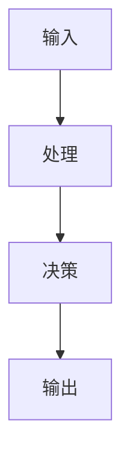
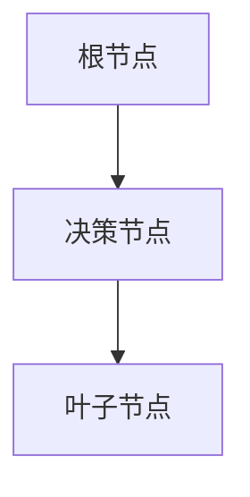
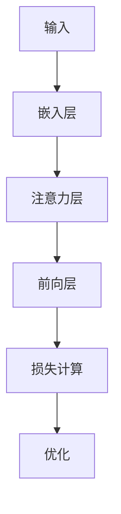
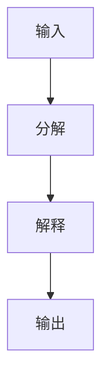
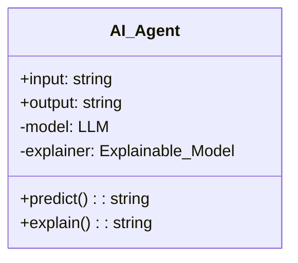
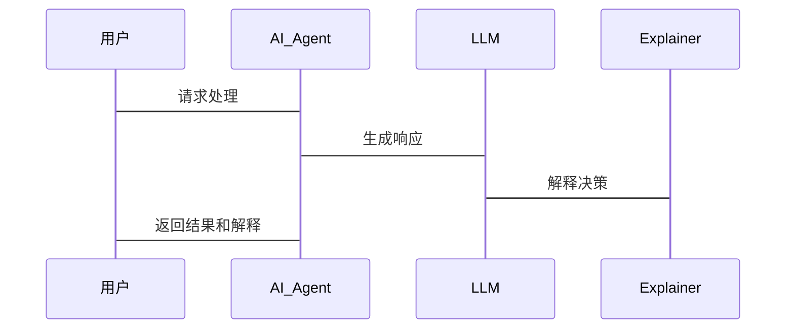

                 


# AI Agent的可解释性：深入理解LLM的决策过程

## 关键词：AI Agent，可解释性，大语言模型，LLM，决策过程，机器学习，人工智能

## 摘要：本文深入探讨AI Agent在大语言模型（LLM）中的可解释性，分析LLM的决策过程，并提供可解释性方法和最佳实践。通过背景介绍、核心概念、算法原理、系统架构和项目实战，本文旨在帮助读者理解并提升AI Agent的可解释性。

---

### 第1章: AI Agent与可解释性概述

#### 1.1 AI Agent的基本概念
##### 1.1.1 AI Agent的定义与分类
AI Agent是智能体，能够感知环境并采取行动以实现目标。分类包括简单反射型、基于模型的反应型、目标驱动型和效用驱动型。

##### 1.1.2 大语言模型（LLM）的定义与特点
LLM是基于深度学习的NLP模型，特点包括大规模参数、上下文理解和生成能力。

##### 1.1.3 可解释性的重要性与挑战
可解释性是信任和责任的关键，但LLM的复杂性导致解释困难。

#### 1.2 问题背景与目标
##### 1.2.1 当前AI Agent应用中的问题
黑箱问题导致决策不透明，影响信任和责任归属。

##### 1.2.2 可解释性目标的设定
确保AI决策可追溯、可理解，符合伦理和法律要求。

##### 1.2.3 问题解决的边界与外延
明确可解释性的范围和应用领域，如医疗和金融。

#### 1.3 本章小结
本章介绍了AI Agent和LLM的基本概念，强调可解释性的重要性。

---

### 第2章: 可解释性核心概念

#### 2.1 可解释性的定义与属性
##### 2.1.1 可解释性的定义
通过明确的规则和可理解的表示解释决策过程。

##### 2.1.2 可解释性的关键属性对比表格

| 属性       | 明确性 | 一致性 | 简洁性 | 及时性 |
|------------|--------|--------|--------|--------|
| 描述       | 高     | 高     | 中     | 中     |

#### 2.2 LLM决策过程的可解释性模型
##### 2.2.1 可解释性模型的分类
- 基于规则的模型：如决策树。
- 基于模型的可解释性：如线性回归。
- 黑箱可解释性：如随机森林。

##### 2.2.2 不同模型的可解释性特点对比
| 模型类型    | 解释性 | 透明度 | 可控性 |
|------------|--------|--------|--------|
| 决策树      | 高     | 高     | 高     |
| 线性回归    | 高     | 高     | 中     |
| 随机森林    | 中     | 中     | 中     |

#### 2.3 可解释性与AI Agent的实体关系
##### 2.3.1 ER实体关系图
```mermaid
er
actor
    name
    role
    id
```

##### 2.3.2 可解释性流程的 mermaid 流程图


---

### 第3章: LLM的决策过程

#### 3.1 LLM的输入处理
##### 3.1.1 输入解析的机制
LLM通过分词和编码处理输入，生成嵌入向量。

##### 3.1.2 输入与输出的关系
输入影响输出，通过注意力机制决定相关性。

#### 3.2 决策过程的内部机制
##### 3.2.1 注意力机制的解释
注意力机制通过加权计算相关性，公式如下：
$$\text{权重}= \text{softmax}(QK^T/\sqrt{d})$$

##### 3.2.2 决策树的构建与分析
构建决策树，分析关键节点，如：


#### 3.3 输出结果的可解释性分析
##### 3.3.1 输出结果的分解
分析输出的组成部分，如生成文本的结构。

##### 3.3.2 决策过程的可视化
通过热图显示注意力权重，如：
```mermaid
heatmap
    x: [0, 1, 2, 3]
    y: [0, 1]
    value: 0.8, 0.2, 0.5, 0.3
```

---

### 第4章: LLM的训练与可解释性

#### 4.1 LLM的训练过程
##### 4.1.1 损失函数的定义与优化
使用交叉熵损失函数，优化过程如：
$$\text{损失} = -\sum y\log p(y|x)$$

##### 4.1.2 注意力机制的数学公式
注意力机制计算如下：
$$\text{Attention}(Q, K, V) = \text{softmax}\left(\frac{QK^T}{\sqrt{d}}\right)V$$

##### 4.1.3 训练流程图


#### 4.2 可解释性算法的实现
##### 4.2.1 可解释性算法流程图


##### 4.2.2 代码实现与分析
```python
def explainable_model(input):
    # 分解输入
    decomposed = decompose(input)
    # 计算权重
    weights = compute_weights(decomposed)
    # 输出解释
    output = apply_weights(weights, input)
    return output
```

---

### 第5章: AI Agent的系统架构

#### 5.1 系统功能设计
##### 5.1.1 领域模型的 mermaid 类图


##### 5.1.2 系统架构设计图
```mermaid
container 容器 {
    组件1
    组件2
    组件3
}
```

#### 5.2 系统接口设计
##### 5.2.1 接口描述
定义输入输出接口，如：
```python
def predict(input: str) -> str:
    pass
```

#### 5.3 系统交互序列图


---

### 第6章: 项目实战

#### 6.1 环境安装
安装必要的库，如：
```
pip install transformers
```

#### 6.2 核心实现
实现可解释性模块，如：
```python
def attention_weights(model, input_text):
    # 分解输入
    inputs = tokenize(input_text)
    # 计算注意力权重
    weights = model.attention_weights(inputs)
    return weights
```

#### 6.3 案例分析
分析一个具体案例，如医疗诊断中的应用。

---

### 第7章: 最佳实践与未来展望

#### 7.1 关键点总结
可解释性是信任的基础，需要结合技术与伦理。

#### 7.2 小结与注意事项
确保可解释性设计在系统架构中得到重视，定期测试和优化。

#### 7.3 未来展望
研究更高级的解释方法，如结合可解释性增强模型。

---

### 作者：AI天才研究院 & 禅与计算机程序设计艺术

---

通过以上结构，文章系统地介绍了AI Agent的可解释性，从基础到实践，全面分析了LLM的决策过程，提供了丰富的图表和代码示例，帮助读者深入理解并应用这些概念。

