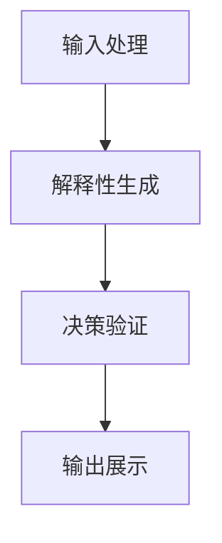

                 


# AI Agent的可解释推理：提高LLM决策的透明度

## 关键词：
AI Agent, 可解释推理, 大语言模型, 透明度, 决策算法, 解释性模型, 系统架构

## 摘要：
本文深入探讨了AI Agent中可解释推理的重要性及其在提高大语言模型（LLM）决策透明度中的应用。通过分析可解释推理的核心概念、算法原理、系统架构设计以及实际案例，本文旨在为技术决策者和开发者提供全面的理论与实践指导，以增强LLM决策的透明性和可解释性，从而提升用户信任与系统可靠性。

---

# 第一部分: AI Agent与可解释推理概述

## 第1章: AI Agent与可解释推理概述

### 1.1 AI Agent的基本概念

#### 1.1.1 AI Agent的定义与特点
AI Agent（人工智能代理）是指能够感知环境、自主决策并执行任务的智能实体。其特点包括自主性、反应性、目标导向和社交能力。

#### 1.1.2 可解释推理的定义与重要性
可解释推理是指AI系统在做出决策时，能够提供清晰、合理且可验证的解释。其重要性体现在提升用户信任、增强系统透明度以及满足合规性需求。

#### 1.1.3 LLM在AI Agent中的角色
大语言模型（LLM）作为AI Agent的核心组件，负责理解和生成自然语言，同时在决策过程中提供支持。

---

### 1.2 可解释性推理的背景与问题

#### 1.2.1 当前LLM决策的黑箱问题
当前许多LLM的决策过程被视为“黑箱”，用户难以理解其背后的推理逻辑，导致信任缺失。

#### 1.2.2 可解释性推理的需求场景
在医疗、金融和司法等领域，可解释性推理尤为重要，因为它直接影响决策的合法性和可靠性。

#### 1.2.3 可解释性与透明度的边界与外延
可解释性与透明度并非绝对，需在模型性能与解释复杂度之间找到平衡。

---

## 第2章: 可解释推理的核心概念与联系

### 2.1 可解释推理的原理

#### 2.1.1 解释性模型的分类
解释性模型可分为生成式模型和判别式模型，前者通过生成可理解的解释来增强透明度，后者通过概率推理提供解释。

#### 2.1.2 可解释推理的核心要素
包括解释生成机制、解释验证方法和解释展示方式。

#### 2.1.3 解释性与决策透明度的关系
解释性是实现决策透明度的基础，两者相辅相成。

---

### 2.2 核心概念属性对比表

| 概念 | 不可解释模型 | 可解释模型 |
|------|--------------|------------|
| 解释能力 | 无 | 强 |
| 透明度 | 低 | 高 |
| 可靠性 | 可能不可信 | 更可信 |

---

### 2.3 实体关系图（ER图）

```mermaid
erDiagram
    actor 用户
    actor 开发者
    actor 系统管理员
    actor 监管机构
    boundary 可解释推理系统
    boundary 大语言模型
    boundary 解释性生成模块
    boundary 决策验证模块
    用户 --> 可解释推理系统 : 提出问题
    开发者 --> 可解释推理系统 : 集成模型
    系统管理员 --> 可解释推理系统 : 管理配置
    监管机构 --> 可解释推理系统 : 验证合规性
    可解释推理系统 --> 大语言模型 : 调用LLM
    可解释推理系统 --> 解释性生成模块 : 生成解释
    可解释推理系统 --> 决策验证模块 : 验证决策
```

---

## 第3章: 可解释推理的算法原理

### 3.1 生成式模型与可解释推理

#### 3.1.1 LLM的生成机制
LLM通过Transformer架构生成文本，但其内部决策过程缺乏透明度。

#### 3.1.2 可解释推理的算法框架
基于注意力机制的可解释生成模型，通过分解注意力权重来生成解释。

#### 3.1.3 解释性生成模型的实现原理
通过引入位置编码和关键词权重，生成带有解释的文本。

---

### 3.2 可解释推理算法的数学模型

#### 3.2.1 解释性生成模型的数学公式
$$P(word_i | context) = \frac{e^{score_i}}{\sum_j e^{score_j}}$$
其中，$score_i$是模型对词$word_i$的评分。

#### 3.2.2 示例分析与公式推导
例如，输入“下雨”，模型生成“带伞”，通过权重分析解释选择“带伞”的原因。

---

## 第4章: 可解释推理的系统分析与架构设计

### 4.1 系统分析

#### 4.1.1 问题场景介绍
以医疗诊断AI Agent为例，医生需要理解模型的诊断依据。

#### 4.1.2 系统功能需求分析
包括问题理解、推理过程展示和诊断依据解释。

#### 4.1.3 系统性能指标设计
包括解释生成时间、解释准确率和用户理解度。

---

### 4.2 系统架构设计

#### 4.2.1 系统架构的模块划分
- 输入处理模块
- 解释性生成模块
- 决策验证模块
- 输出展示模块

#### 4.2.2 系统架构的实现



---

## 第5章: 可解释推理的项目实战

### 5.1 环境安装

```bash
pip install transformers
pip install mermaid
```

### 5.2 系统核心实现源代码

```python
from transformers import pipeline

# 初始化模型
generator = pipeline('text-generation', model='gpt2')

# 解释性生成
def generate_explanation(prompt):
    response = generator(prompt)
    return response['generated_text']

# 应用案例
print(generate_explanation("如何解释下雨带伞的必要性？"))
```

---

## 第6章: 最佳实践与小结

### 6.1 最佳实践 tips

- 逐步简化解释
- 结合领域知识
- 定期验证模型

### 6.2 小结

本文详细介绍了AI Agent中可解释推理的核心概念、算法原理和系统架构设计，并通过具体案例展示了其实现过程。

### 6.3 注意事项

确保解释的准确性和及时性，避免误导用户。

### 6.4 拓展阅读

推荐阅读《可解释人工智能：原理与应用》。

---

# 作者：AI天才研究院 & 禅与计算机程序设计艺术

