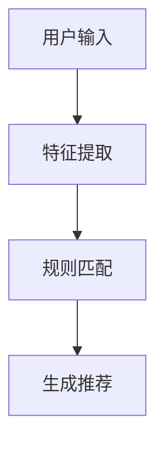
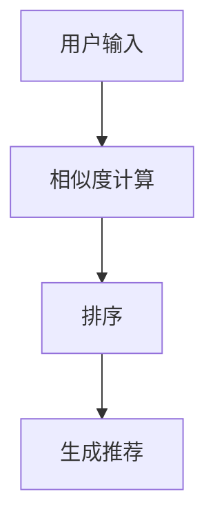
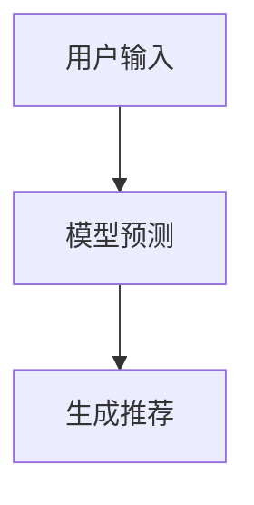
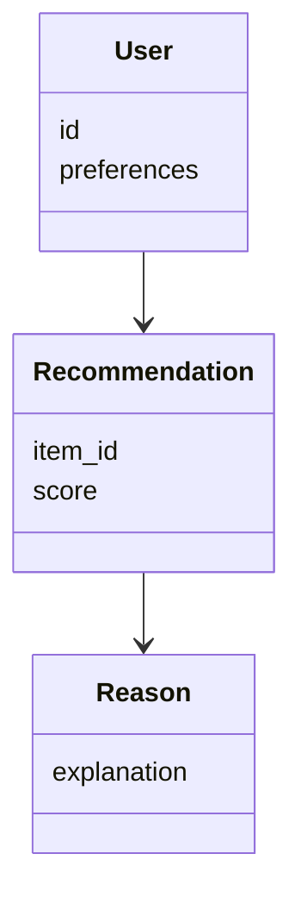
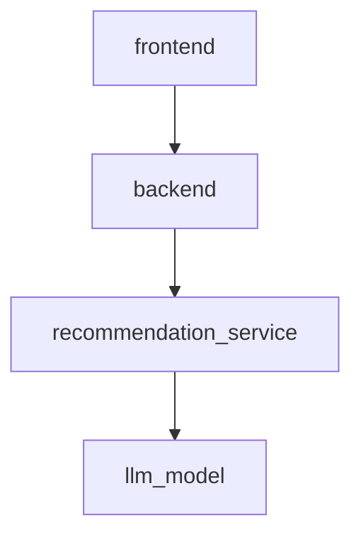
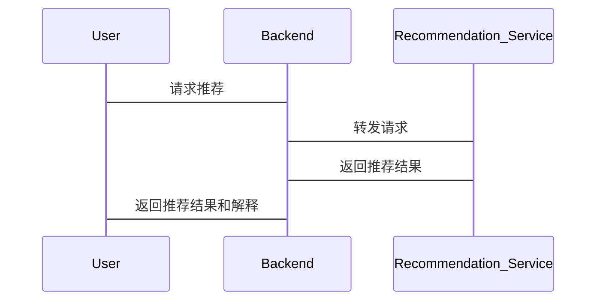

                 


# AI Agent的可解释推荐：提高LLM决策的透明度

> **关键词**：AI Agent、可解释推荐、LLM决策、透明度、推荐系统

> **摘要**：随着AI Agent和大语言模型（LLM）的应用越来越广泛，提高LLM决策的透明度变得至关重要。本文系统地探讨了可解释推荐的核心概念、算法原理、系统架构以及实际应用，旨在为技术从业者和研究人员提供深入的理论和实践指导，帮助他们更好地理解和实现可解释推荐系统。

---

## 第一部分: AI Agent与可解释推荐概述

### 第1章: AI Agent与可解释推荐的背景

#### 1.1 问题背景

##### 1.1.1 AI Agent的基本概念
AI Agent是一种智能体，能够感知环境并采取行动以实现目标。在推荐系统中，AI Agent通过分析用户行为和偏好，提供个性化建议。

##### 1.1.2 LLM决策的透明度问题
大语言模型（LLM）在推荐系统中广泛应用，但其决策过程往往缺乏透明性，导致用户难以理解推荐的原因。

##### 1.1.3 可解释推荐的重要性
可解释推荐通过揭示推荐的依据，增强用户信任，同时帮助优化模型性能。

#### 1.2 问题描述

##### 1.2.1 LLM在推荐系统中的应用
LLM通过自然语言处理能力，分析用户输入，生成个性化推荐。

##### 1.2.2 当前推荐系统的可解释性挑战
现有推荐系统常以黑箱形式运作，用户难以理解推荐逻辑。

##### 1.2.3 提高LLM决策透明度的必要性
提高透明度有助于提升用户体验，满足合规性要求，并支持模型优化。

#### 1.3 问题解决

##### 1.3.1 可解释推荐的核心目标
通过揭示推荐依据，提升用户信任和系统可信度。

##### 1.3.2 提高LLM透明度的方法
包括模型解释性技术和推荐理由生成。

##### 1.3.3 可解释推荐的实际应用场景
如电商推荐、医疗建议等领域，需用户信任和决策透明。

#### 1.4 边界与外延

##### 1.4.1 可解释推荐的边界
仅关注推荐过程的透明度，不涉及模型内部机制的完全解释。

##### 1.4.2 LLM决策透明度的范围
涵盖推荐理由生成、决策逻辑展示等方面。

##### 1.4.3 相关领域的联系
与解释性AI（XAI）、人机交互等领域密切相关。

#### 1.5 概念结构与核心要素

##### 1.5.1 可解释推荐的构成要素
包括输入数据、推荐算法、解释生成、用户反馈等。

##### 1.5.2 LLM决策的核心要素
涉及模型训练、输入处理、输出生成等步骤。

##### 1.5.3 相关概念的对比
通过对比可解释推荐与传统推荐、LLM决策等概念，明确其独特性。

---

## 第二部分: 可解释推荐的核心概念与原理

### 第2章: 可解释推荐的核心概念

#### 2.1 可解释推荐的定义与特点

##### 2.1.1 可解释推荐的定义
可解释推荐是指推荐系统能够清晰地解释推荐的依据和逻辑。

##### 2.1.2 可解释推荐的特点
包括透明性、可理解性、可追溯性等。

##### 2.1.3 可解释推荐与传统推荐的区别
传统推荐系统通常缺乏透明性，而可解释推荐注重解释生成。

#### 2.2 LLM决策透明度的实现原理

##### 2.2.1 LLM的决策过程
LLM通过文本分析生成推荐，涉及特征提取、语义理解等步骤。

##### 2.2.2 可解释推荐的实现机制
包括基于规则的解释生成和基于模型的解释生成。

##### 2.2.3 透明度的度量方法
通过解释性指标（如可解释性分数）评估推荐系统的透明度。

#### 2.3 核心概念的属性对比

##### 2.3.1 可解释推荐的属性
透明性、可理解性、可追溯性。

##### 2.3.2 LLM决策透明度的属性
解释性、可验证性、用户可控制性。

##### 2.3.3 属性对比表格

| 属性         | 可解释推荐 | LLM决策透明度 |
|--------------|------------|---------------|
| 透明性       | 高         | 高             |
| 可理解性     | 高         | 高             |
| 可追溯性     | 高         | 中             |
| 解释性       | 高         | 高             |
| 用户控制     | 中         | 高             |

#### 2.4 实体关系图

##### 2.4.1 可解释推荐的实体关系
用户、推荐系统、推荐理由。

##### 2.4.2 LLM决策透明度的实体关系
用户、LLM模型、推荐结果。

##### 2.4.3 ER图展示
```mermaid
erDiagram
    user [*------* recommendation
    recommendation [*------* reason
    reason [*------* llm_model
```

---

## 第三部分: 可解释推荐的算法原理

### 第3章: 可解释推荐算法的数学模型

#### 3.1 基于规则的推荐算法

##### 3.1.1 算法原理
基于预定义规则生成推荐，如基于用户行为的协同过滤。

##### 3.1.2 算法实现


##### 3.1.3 数学公式
协同过滤的相似度计算公式：
$$ sim(i,j) = \frac{\sum_{k} (r_{ik} - \bar{r_i})(r_{jk} - \bar{r_j})}{\sqrt{\sum_{k} (r_{ik} - \bar{r_i})^2} \sqrt{\sum_{k} (r_{jk} - \bar{r_j})^2}} $$

#### 3.2 基于相似度的推荐算法

##### 3.2.1 算法原理
通过计算用户或物品的相似度进行推荐。

##### 3.2.2 算法实现


##### 3.2.3 数学公式
余弦相似度计算公式：
$$ \text{similarity}(u, v) = \frac{\sum u_i v_i}{\sqrt{\sum u_i^2} \sqrt{\sum v_i^2}} $$

#### 3.3 基于模型的推荐算法

##### 3.3.1 算法原理
使用机器学习模型生成推荐，如矩阵分解。

##### 3.3.2 算法实现


##### 3.3.3 数学公式
矩阵分解模型的损失函数：
$$ L = \sum_{i,j} (R_{i,j} - P_i Q_j)^2 + \lambda (|P|^2 + |Q|^2) $$

---

## 第四部分: 可解释推荐系统的实现

### 第4章: 系统分析与架构设计

#### 4.1 问题场景介绍

##### 4.1.1 推荐系统的应用场景
如电商、社交媒体、新闻推荐等。

##### 4.1.2 系统功能需求
包括用户输入、推荐生成、解释展示等。

#### 4.2 系统功能设计

##### 4.2.1 领域模型类图


##### 4.2.2 系统架构设计


#### 4.3 系统接口设计

##### 4.3.1 接口描述
如`/recommend?user_id=123`，返回推荐列表和解释。

##### 4.3.2 接口交互流程


---

## 第五部分: 项目实战

### 第5章: 可解释推荐系统的实现

#### 5.1 环境安装

##### 5.1.1 Python环境
安装Python 3.8+，确保安装`scikit-learn`、`llm`库。

#### 5.2 核心实现

##### 5.2.1 推荐算法实现
基于协同过滤的推荐系统。

##### 5.2.2 解释生成实现
使用`shap`库生成解释。

##### 5.2.3 系统代码示例
```python
import numpy as np
from sklearn.metrics.pairwise import cosine_similarity

def generate_recommendations(user_input, items):
    # 特征提取
    user_vector = extract_features(user_input)
    # 计算相似度
    similarity_scores = cosine_similarity(user_vector.reshape(1, -1), items)
    # 排序并返回
    return top_n(similarity_scores, 5)
```

#### 5.3 代码解读与分析

##### 5.3.1 代码功能
解释推荐结果的生成过程。

##### 5.3.2 代码优化
提高解释的可读性和系统性能。

#### 5.4 实际案例分析

##### 5.4.1 案例背景
电商推荐系统。

##### 5.4.2 数据分析
用户行为分析，生成推荐理由。

#### 5.5 项目小结

##### 5.5.1 项目总结
实现了一个可解释推荐系统，验证了算法的有效性。

##### 5.5.2 经验分享
强调模块化设计和代码复用的重要性。

---

## 第六部分: 最佳实践与总结

### 第6章: 小结与注意事项

#### 6.1 小结

##### 6.1.1 核心要点回顾
可解释推荐的核心概念、算法原理和系统实现。

##### 6.1.2 实际应用中的挑战
数据隐私、模型解释性等。

#### 6.2 注意事项

##### 6.2.1 开发中的注意事项
确保解释的准确性和可读性。

##### 6.2.2 使用中的注意事项
保护用户隐私，避免信息泄露。

##### 6.2.3 持续优化的注意事项
定期更新模型，优化解释生成。

### 第7章: 拓展阅读

#### 7.1 相关技术与工具

##### 7.1.1 可解释性AI（XAI）
研究如何使AI系统更透明和可解释。

##### 7.1.2 可视化工具
如`shap`、`lime`等，用于生成可解释性报告。

#### 7.2 未来研究方向

##### 7.2.1 更高效的解释方法
探索更高效的模型解释技术。

##### 7.2.2 更强大的推荐系统
结合多模态数据，提升推荐精度。

##### 7.2.3 更好的用户交互
设计更友好的用户界面，展示解释信息。

---

## 作者

作者：AI天才研究院/AI Genius Institute & 禅与计算机程序设计艺术 /Zen And The Art of Computer Programming

