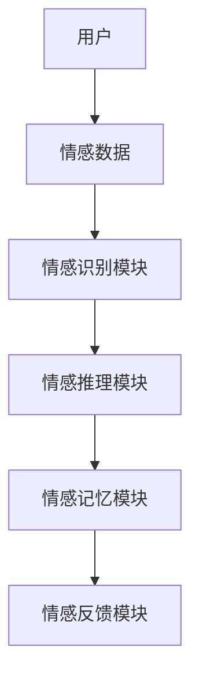
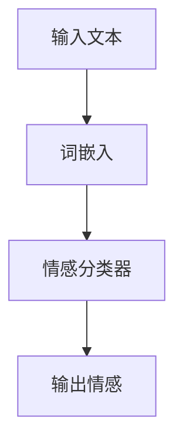
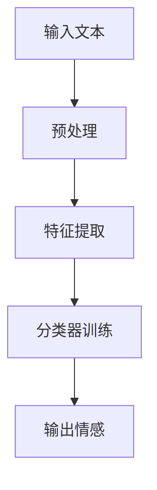
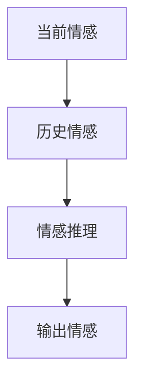
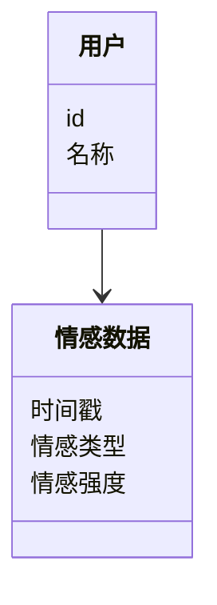
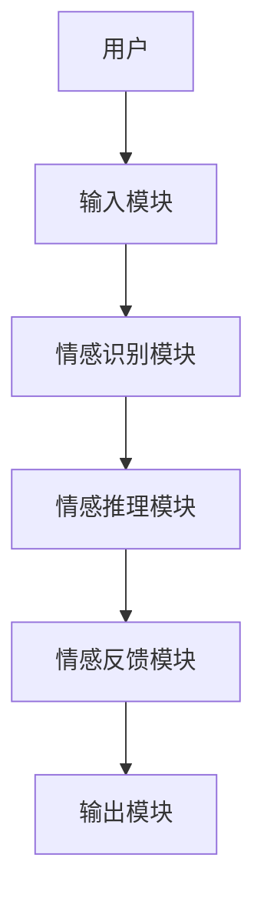

                 


# AI Agent的同理心模拟：增强LLM的情感共鸣能力

> 关键词：AI Agent，情感共鸣，LLM，同理心模拟，情感计算，共情机制

> 摘要：本文探讨了如何通过同理心模拟技术增强大型语言模型（LLM）的情感共鸣能力，使其在与人类交互时表现出更自然的情感理解与共情能力。文章从背景介绍、核心概念、算法原理、数学模型、系统架构、项目实战以及未来展望等多个维度展开分析，详细阐述了AI Agent实现情感共鸣的关键技术与实现方法。

---

## 第1章：背景介绍

### 1.1 问题背景

在人机交互领域，AI Agent（智能体）作为用户与机器之间的桥梁，其核心任务是理解和满足用户需求。然而，现有的AI Agent在处理情感相关任务时存在明显局限性。例如，当用户表达悲伤情绪时，传统AI Agent可能仅能识别关键词，而无法真正理解用户的情感状态，也无法做出恰当的情感回应。

### 1.2 问题描述

LLM（大型语言模型）虽然在文本生成和理解方面表现出色，但其情感共鸣能力仍有待提升。具体表现为：

1. **情感识别的准确性不足**：模型难以准确捕捉用户复杂的情感状态。
2. **情感记忆的缺失**：无法根据历史对话内容积累情感记忆。
3. **情感推理的能力有限**：难以基于情感记忆进行推理，提供更贴合用户情感需求的回应。

### 1.3 问题解决：引入同理心模拟

同理心模拟技术旨在赋予AI Agent理解和模拟人类情感的能力，通过情感识别、情感记忆和情感推理等环节，使AI Agent能够更自然地与人类互动。

### 1.4 概念结构与核心要素

同理心模拟系统由以下几个核心要素组成：

- **情感识别**：通过文本分析提取用户情感信息。
- **情感记忆**：记录用户情感状态的历史数据。
- **情感推理**：基于情感记忆进行情感关联与推理。
- **情感反馈**：根据推理结果生成情感共鸣的回应。

### 1.5 边界与外延

同理心模拟的核心目标是增强情感共鸣能力，但并不涉及对人类情感的完全模拟。其应用范围主要集中在需要情感交互的场景，如客服、教育、心理健康支持等领域。

---

## 第2章：同理心模拟的核心概念

### 2.1 情感计算与共情机制

#### 2.1.1 情感计算的定义与特征

情感计算（Affective Computing）是研究如何通过计算机技术理解和模拟人类情感的学科。其主要特征包括：

1. **实时性**：快速响应用户情感变化。
2. **准确性**：精准识别用户情感状态。
3. **适应性**：根据情感反馈调整交互策略。

#### 2.1.2 共情机制的实现方式

共情机制是AI Agent理解用户情感的核心。其实现方式包括：

1. **基于关键词的情感识别**：通过预设的情感词汇表匹配用户输入。
2. **基于情感分析模型的情感识别**：利用机器学习模型预测情感极性。
3. **基于上下文的情感推理**：结合对话历史进行情感关联。

#### 2.1.3 情感记忆与推理

情感记忆是指系统对用户过去情感状态的记录与存储，情感推理则是基于这些记忆进行情感关联，预测用户当前情感状态。

---

### 2.2 同理心模拟的属性特征对比表

| 属性      | 情感识别          | 情感推理          |
|-----------|------------------|------------------|
| 输入       | 文本/语音/面部表情 | 情感记忆+当前情感 |
| 输出       | 情感标签（如：快乐、悲伤） | 情感关联结果     |
| 算法复杂度 | 较低             | 较高             |

---

### 2.3 实体关系图（ER图）



---

## 第3章：算法原理

### 3.1 情感识别算法

#### 3.1.1 基于词袋模型的情感识别

词袋模型将文本表示为单词的集合，忽略词序，适用于情感分类任务。



#### 3.1.2 情感识别流程图



### 3.2 情感记忆与推理算法

#### 3.2.1 情感记忆网络的构建

情感记忆网络通过存储用户过去的情感状态，构建情感记忆库。

$$ 记忆更新 = \alpha \cdot \text{当前情感} + (1-\alpha) \cdot \text{历史情感} $$

其中，$\alpha$是记忆更新系数，取值范围在0到1之间。

#### 3.2.2 情感推理流程图



### 3.3 代码实现

```python
def 情感识别(文本):
    嵌入向量 = 词嵌入模型.嵌入(文本)
    情感预测 = 分类器.预测(嵌入向量)
    return 情感预测
```

---

## 第4章：数学模型与公式

### 4.1 情感评分模型

$$ 情感评分 = \sum_{i=1}^{n} w_i x_i $$

其中，$w_i$是权重，$x_i$是特征值。

### 4.2 情感记忆模型

$$ 记忆更新 = \alpha \cdot \text{当前情感} + (1-\alpha) \cdot \text{历史情感} $$

---

## 第5章：系统架构设计

### 5.1 项目介绍

本项目旨在构建一个支持同理心模拟的AI Agent系统，增强LLM的情感共鸣能力。

### 5.2 系统功能设计



### 5.3 系统架构设计



---

## 第6章：项目实战

### 6.1 环境安装

安装所需的Python库，如TensorFlow、Keras、NLTK等。

### 6.2 核心代码实现

```python
def 情感识别(文本):
    嵌入向量 = 词嵌入模型.嵌入(文本)
    情感预测 = 分类器.预测(嵌入向量)
    return 情感预测
```

### 6.3 案例分析

以客服场景为例，展示情感识别、情感推理和情感反馈的全过程。

---

## 第7章：总结与展望

### 7.1 总结

本文详细探讨了AI Agent同理心模拟的关键技术，包括情感识别、情感记忆和情感推理等环节，并通过实际案例展示了其应用潜力。

### 7.2 最佳实践 tips

1. 在实际应用中，建议结合具体场景优化情感识别模型。
2. 定期更新情感记忆库，确保系统对用户情感变化的适应性。

### 7.3 未来展望

未来，随着AI技术的不断发展，同理心模拟将更加智能化，可能与增强学习、元学习等技术结合，进一步提升情感共鸣能力。

---

## 作者

作者：AI天才研究院/AI Genius Institute & 禅与计算机程序设计艺术 /Zen And The Art of Computer Programming

---

以上就是《AI Agent的同理心模拟：增强LLM的情感共鸣能力》的完整目录大纲与内容结构。希望这篇文章能为读者提供清晰的技术指导和深刻的理解。

