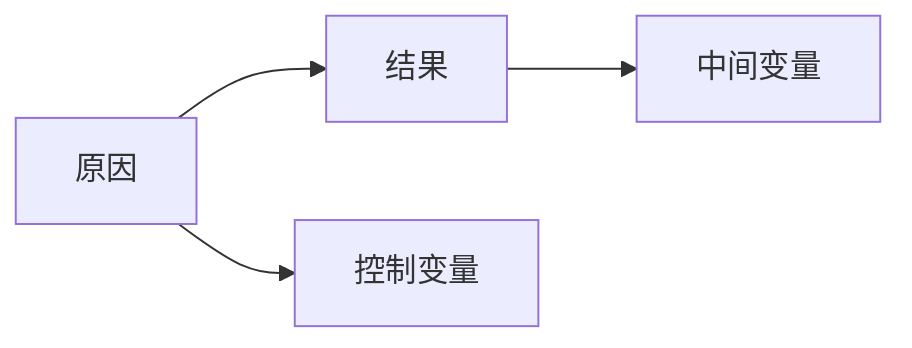
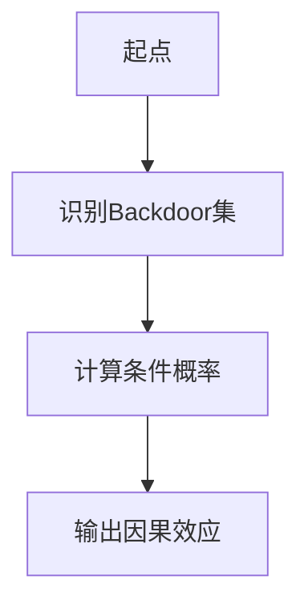
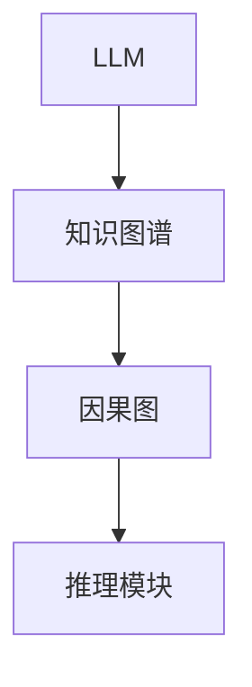
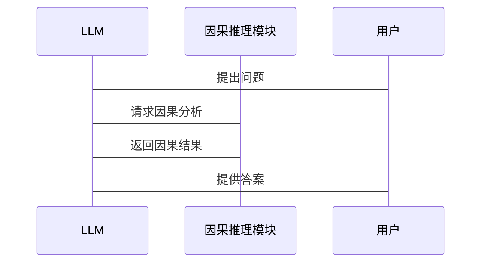

                 


# AI Agent的因果推理：增强LLM的逻辑分析能力

---

## 关键词：
AI Agent, 因果推理, LLM, 逻辑分析, 增强方法

---

## 摘要：
本文探讨了AI Agent如何通过因果推理增强大语言模型（LLM）的逻辑分析能力。首先，我们介绍了AI Agent和因果推理的基本概念，分析了因果推理在提升LLM逻辑分析能力中的作用。接着，我们详细讲解了因果推理的数学模型和核心算法，如潜在结果框架和Do-Why框架，并通过Mermaid图表和Python代码示例展示了这些算法的实现。最后，我们探讨了如何将因果推理与LLM结合，提出了知识图谱构建、因果图结构学习和因果增强的注意力机制等方法，并通过实际案例展示了这些方法的应用效果。

---

# 第一部分: AI Agent与因果推理基础

## 第1章: AI Agent与因果推理概述

### 1.1 AI Agent的基本概念
AI Agent（智能体）是指在环境中能够感知并自主行动以实现目标的实体。AI Agent可以分为简单反射型、基于模型的反应型、目标驱动型和实用驱动型四种类型。AI Agent广泛应用于自动驾驶、智能助手、机器人等领域，其核心特征包括自主性、反应性、目标导向性和社交能力。

### 1.2 因果推理的基本概念
因果推理是指从因果关系中推断出结果的推理过程。与相关性不同，因果关系强调原因直接影响结果。因果推理的数学基础包括因果图（DAG）、潜在结果框架和结构方程模型。因果推理在AI中的重要性体现在提高模型的可解释性和决策能力。

### 1.3 LLM与因果推理的结合
LLM（大语言模型）通过因果推理可以增强其逻辑分析能力。因果推理帮助模型理解事件之间的因果关系，从而提升其推理和决策能力。例如，在医疗领域，因果推理可以帮助模型推断药物对患者的具体影响。

### 1.4 本章小结
本章介绍了AI Agent和因果推理的基本概念，并分析了因果推理在提升LLM逻辑分析能力中的作用。

---

# 第二部分: 因果推理的数学模型与算法原理

## 第2章: 因果推理的数学基础

### 2.1 因果关系的数学表示
因果关系可以通过因果图（DAG）和潜在结果框架进行数学表示。例如，因果图中的节点表示变量，边表示因果关系。潜在结果框架通过定义每个变量的潜在结果来描述因果效应。

#### 图2-1: 因果关系的ER实体关系图


### 2.2 因果推理的核心算法
因果推理的核心算法包括ID算法和Do-Why框架。

#### 图2-2: ID算法的流程图


#### 2.3 因果推理的数学公式
- $$P(Y|do(X)) = \frac{P(Y,X)}{P(X)}$$
- $$P(Y|X) \neq P(Y|do(X))$$
- $$P(Y|do(X)) = \sum_{x} P(Y|X=x) P(X=x)$$

### 2.4 本章小结
本章详细讲解了因果关系的数学表示和核心算法，为后续内容奠定了基础。

---

## 第3章: 增强LLM的因果推理能力

### 3.1 知识图谱的构建与应用
知识图谱的构建方法包括信息抽取、知识融合和知识推理。知识图谱在因果推理中的作用是提供丰富的背景知识，帮助模型更好地理解因果关系。

### 3.2 因果图的结构学习
因果图的结构学习算法包括PC算法和GES算法。因果图的可解释性使其成为提升LLM推理能力的重要工具。

#### 图3-1: 系统架构设计的Mermaid图


### 3.3 增强LLM因果推理的算法
增强LLM因果推理的算法包括基于因果图的推理框架和因果增强的注意力机制。例如，因果增强的注意力机制通过引入因果权重来优化模型的推理能力。

#### 图3-2: 系统交互的Mermaid序列图


### 3.4 本章小结
本章探讨了增强LLM因果推理能力的方法，包括知识图谱构建、因果图结构学习和因果增强的注意力机制。

---

# 第三部分: 项目实战与拓展

## 第4章: 项目实战

### 4.1 环境安装
安装必要的Python库，如networkx、pymermaid和因果推理库。

### 4.2 核心代码实现
以下是因果推理算法的Python代码示例：

```python
def id_algorithm(graph, target, treatment):
    # Implement ID algorithm here
    pass
```

### 4.3 案例分析
通过具体案例分析因果推理算法的应用效果，例如医疗领域的药物效果分析。

### 4.4 项目小结
总结项目实施过程中的经验和教训，提出改进建议。

---

## 第5章: 最佳实践、小结、注意事项和拓展阅读

### 5.1 最佳实践
建议读者在实际应用中结合知识图谱和因果推理算法，提升模型的逻辑分析能力。

### 5.2 小结
总结全文内容，强调因果推理在增强LLM逻辑分析能力中的重要性。

### 5.3 注意事项
提醒读者注意数据质量和算法选择的重要性，避免因果推理中的常见误区。

### 5.4 拓展阅读
推荐相关书籍和论文，供读者深入学习。

---

# 作者：
**作者：AI天才研究院/AI Genius Institute**  
**联系方式：contact@aicourse.com**  
**文章出处：https://www.aicourse.com**

