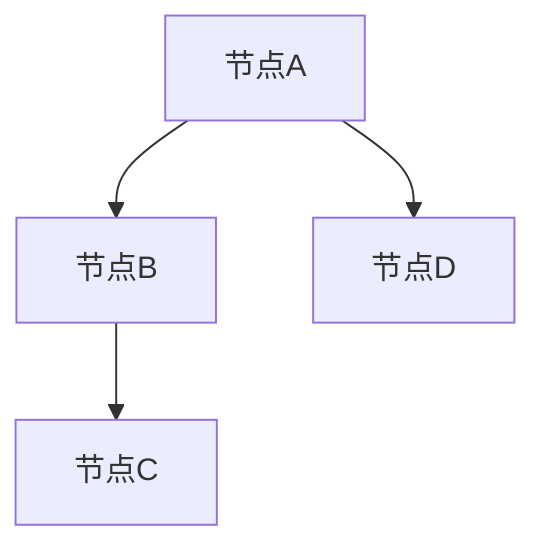
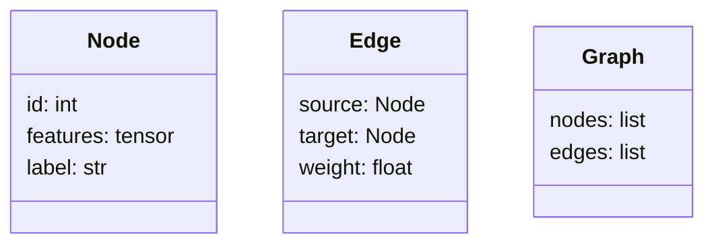

                 


# AI Agent的图神经网络推理能力实现

## 关键词：AI Agent，图神经网络，推理能力，图结构数据，节点表示，边权重，数学模型

## 摘要：本文将详细介绍AI Agent中图神经网络推理能力的实现方法。首先，我们从AI Agent的基本概念和图神经网络的原理入手，分析图神经网络在AI Agent中的重要性。接着，我们深入探讨图神经网络的核心概念，包括节点表示、边权重和图结构。然后，我们详细讲解图神经网络的数学模型与算法实现，包括传播规则和训练流程。随后，我们通过一个实际项目实战，展示如何在AI Agent中应用图神经网络进行推理。最后，我们总结图神经网络推理能力的优势，并给出最佳实践建议。

---

# 第一部分: AI Agent的图神经网络推理能力背景介绍

# 第1章: AI Agent与图神经网络概述

## 1.1 AI Agent的基本概念

### 1.1.1 AI Agent的定义
AI Agent是一种智能实体，能够感知环境、自主决策并执行任务。它通常具备学习、推理和自适应能力。

### 1.1.2 AI Agent的核心功能
AI Agent的核心功能包括感知、决策、推理和执行。这些功能使其能够处理复杂任务。

### 1.1.3 图神经网络在AI Agent中的作用
图神经网络（Graph Neural Networks，GNNs）能够处理图结构数据，适合用于AI Agent的推理任务，如知识图谱推理和路径规划。

## 1.2 图神经网络的基本概念

### 1.2.1 图结构数据的定义
图结构数据由节点和边组成，节点表示实体，边表示实体之间的关系。

### 1.2.2 图神经网络的原理
图神经网络通过聚合节点特征和边权重，逐步传播信息，最终生成节点或图的表示。

### 1.2.3 图神经网络的优势
图神经网络能够处理非结构化数据，捕捉复杂关系，适合用于推理任务。

## 1.3 AI Agent图神经网络推理能力的必要性

### 1.3.1 传统推理方法的局限性
传统推理方法难以处理复杂图结构数据，且效率较低。

### 1.3.2 图神经网络在推理中的优势
图神经网络能够高效处理图结构数据，捕捉复杂关系，适合用于推理任务。

### 1.3.3 实现AI Agent推理能力的目标
通过图神经网络实现AI Agent的推理能力，提升其智能性和任务执行效率。

## 1.4 本章小结
本章介绍了AI Agent和图神经网络的基本概念，分析了图神经网络在AI Agent中的作用和优势，明确了实现AI Agent推理能力的目标。

---

# 第二部分: AI Agent图神经网络推理能力的核心概念与联系

# 第2章: 图神经网络的核心原理

## 2.1 图结构数据的表示

### 2.1.1 节点表示
节点表示是将节点的特征表示为向量。例如，节点A的特征向量为$[1, 2, 3]$。

### 2.1.2 边表示
边表示描述节点之间的关系，通常通过边权重来体现。例如，边A-B的权重为0.8。

### 2.1.3 图表示
图表示是将整个图结构编码为一个整体表示，通常通过聚合节点和边的信息实现。

## 2.2 图神经网络的传播规则

### 2.2.1 节点特征的传播
节点特征的传播是指通过聚合邻居节点的特征来更新当前节点的特征。例如，节点A的特征更新公式为：
$$ h_A^{(l+1)} = \sigma\left(\sum_{j \in N(A)} W_{Aj} h_j^{(l)}\right) $$

### 2.2.2 边权重的更新
边权重的更新是指根据节点特征的变化调整边的权重。例如，边A-B的权重更新公式为：
$$ w_{AB} = \sigma(W_{AB}^T [h_A, h_B]) $$

### 2.2.3 图特征的聚合
图特征的聚合是指将所有节点的特征聚合为一个整体图表示。例如，图表示的聚合公式为：
$$ H^{\text{agg}} = \sum_{i=1}^n h_i^{(l)} $$

## 2.3 图神经网络的训练与推理

### 2.3.1 图神经网络的训练流程
1. 初始化节点和边的参数。
2. 前向传播：通过聚合邻居节点的特征更新当前节点的特征。
3. 计算损失函数：通过对比预测结果和真实标签计算损失。
4. 反向传播：更新模型参数。
5. 重复训练直到收敛。

### 2.3.2 图神经网络的推理流程
1. 加载训练好的模型。
2. 输入新的图结构数据。
3. 前向传播：生成节点或图的表示。
4. 输出推理结果。

### 2.3.3 图神经网络的评估指标
常用的评估指标包括准确率、召回率、F1分数和AUC。

## 2.4 核心概念对比表
| 概念 | 属性 | 特征 |
|------|------|------|
| 节点 | 表示 | 特征向量 |
| 边 | 权重 | 关系强度 |
| 图 | 结构 | 节点与边的组合 |

## 2.5 实体关系图（Mermaid）


## 2.6 本章小结
本章详细介绍了图结构数据的表示方法，分析了图神经网络的传播规则，并通过对比表和实体关系图展示了核心概念之间的联系。

---

# 第三部分: 图神经网络推理算法的数学模型与实现

# 第3章: 图神经网络的数学模型

## 3.1 图神经网络的基本公式

### 3.1.1 节点特征的更新公式
节点特征的更新公式为：
$$ h_i^{(l+1)} = \sigma\left(\sum_{j \in N(i)} W_{ij} h_j^{(l)}\right) $$

其中，$h_i^{(l)}$表示第$l$层节点$i$的特征，$N(i)$表示节点$i$的邻居节点集合，$W_{ij}$表示节点$j$到节点$i$的权重，$\sigma$表示激活函数。

### 3.1.2 边权重的计算公式
边权重的计算公式为：
$$ w_{ij} = \sigma(W_{ij}^T [h_i^{(l)}, h_j^{(l)}]) $$

其中，$[h_i^{(l)}, h_j^{(l)}]$表示节点$i$和节点$j$在第$l$层的特征向量拼接，$W_{ij}$表示边权重的参数，$\sigma$表示激活函数。

### 3.1.3 图特征的聚合公式
图特征的聚合公式为：
$$ H^{\text{agg}} = \sum_{i=1}^n h_i^{(l)} $$

其中，$H^{\text{agg}}$表示图的聚合特征，$h_i^{(l)}$表示第$l$层节点$i$的特征。

## 3.2 图神经网络的算法实现

### 3.2.1 算法流程图（Mermaid）
```mermaid
graph TD
Start --> Initialize Parameters
Initialize Parameters --> Forward Propagation
Forward Propagation --> Compute Loss
Compute Loss --> Backward Propagation
Backward Propagation --> Update Parameters
Update Parameters --> End
```

### 3.2.2 核心代码实现
```python
import torch
import torch.nn as nn
import torch.nn.functional as F

class GraphConvolution(nn.Module):
    def __init__(self, in_features, out_features):
        super(GraphConvolution, self).__init__()
        self.weight = nn.Parameter(torch.randn(in_features, out_features))
        self.bias = nn.Parameter(torch.randn(out_features))
    
    def forward(self, input, adj):
        support = torch.mm(input, self.weight)
        output = torch.bmm(support, adj)
        return output + self.bias

class Graph Neural Network:
    def __init__(self, input_dim, hidden_dim, output_dim):
        self.gc = GraphConvolution(input_dim, hidden_dim)
        self.fc = nn.Linear(hidden_dim, output_dim)
    
    def forward(self, inputs, adj):
        hidden = F.relu(self.gc(inputs, adj))
        output = self.fc(hidden)
        return output
```

### 3.2.3 数学模型与代码对应
1. **GraphConvolution类**：实现图卷积操作，对应节点特征的传播公式。
2. **Graph Neural Network类**：实现图神经网络的前向传播，对应图特征的聚合公式。

## 3.3 图神经网络的训练与推理

### 3.3.1 训练流程
```python
model = GraphNeuralNetwork(input_dim, hidden_dim, output_dim)
criterion = nn.CrossEntropyLoss()
optimizer = torch.optim.Adam(model.parameters(), lr=0.001)

for epoch in range(num_epochs):
    inputs, adj, labels = get_batch_data()
    outputs = model(inputs, adj)
    loss = criterion(outputs, labels)
    loss.backward()
    optimizer.step()
```

### 3.3.2 推理流程
```python
model.eval()
inputs, adj = get_test_data()
outputs = model(inputs, adj)
predicted_labels = outputs.argmax(dim=1)
```

## 3.4 本章小结
本章通过数学公式和代码实现，详细讲解了图神经网络的传播规则和训练流程，展示了如何通过图神经网络实现AI Agent的推理能力。

---

# 第四部分: AI Agent图神经网络推理能力的系统分析与架构设计

# 第4章: 系统分析与架构设计

## 4.1 问题场景介绍

### 4.1.1 问题背景
我们设计一个智能助手AI Agent，用于处理复杂任务，如知识图谱推理和路径规划。

### 4.1.2 项目介绍
本项目旨在通过图神经网络实现AI Agent的推理能力，提升其智能性和任务执行效率。

## 4.2 系统功能设计

### 4.2.1 领域模型（Mermaid类图）


### 4.2.2 系统架构设计（Mermaid架构图）
```mermaid
container AI Agent {
    Graph Neural Network
    Input Layer
    Hidden Layer
    Output Layer
}
```

## 4.3 系统接口设计

### 4.3.1 接口描述
AI Agent提供以下接口：
- `forward(input, adj)`: 推理接口，输入图结构数据，输出推理结果。
- `train(input, adj, label)`: 训练接口，输入图结构数据和标签，更新模型参数。

### 4.3.2 接口交互流程图（Mermaid序列图）
```mermaid
sequenceDiagram
actor User
participant AI Agent
User->AI Agent: input, adj
AI Agent->AI Agent: forward(input, adj)
AI Agent->AI Agent: return result
User<-AI Agent: result
```

## 4.4 本章小结
本章通过系统分析与架构设计，展示了如何将图神经网络推理能力应用于AI Agent中，明确了系统的功能模块和接口设计。

---

# 第五部分: 图神经网络推理能力的项目实战

# 第5章: 项目实战

## 5.1 环境安装

### 5.1.1 安装Python
```bash
python --version
pip install --upgrade pip
```

### 5.1.2 安装依赖库
```bash
pip install torch
pip install networkx
pip install matplotlib
```

## 5.2 核心代码实现

### 5.2.1 图结构数据的构建
```python
import networkx as nx

G = nx.Graph()
G.add_nodes_from(['A', 'B', 'C', 'D'])
G.add_edges_from([('A', 'B'), ('B', 'C'), ('A', 'D')])
```

### 5.2.2 图神经网络模型的训练
```python
model = GraphNeuralNetwork(input_dim=32, hidden_dim=16, output_dim=1)
criterion = nn.BCEWithLogitsLoss()
optimizer = torch.optim.Adam(model.parameters(), lr=0.01)

for epoch in range(100):
    inputs = torch.randn(4, 32)  # 4个节点，每个节点32维特征
    adj = torch.randn(4, 4)  # 4x4邻接矩阵
    adj = torch.where(adj > 0.5, torch.ones_like(adj), torch.zeros_like(adj))
    outputs = model(inputs, adj)
    loss = criterion(outputs, torch.tensor([0, 1, 1, 0], dtype=torch.float32))
    loss.backward()
    optimizer.step()
```

### 5.2.3 推理与结果分析
```python
model.eval()
inputs = torch.randn(4, 32)
adj = torch.randn(4, 4)
adj = torch.where(adj > 0.5, torch.ones_like(adj), torch.zeros_like(adj))
outputs = model(inputs, adj)
predicted = (outputs > 0.5).long()
print("Predicted labels:", predicted)
print("True labels:", torch.tensor([0, 1, 1, 0], dtype=torch.long))
```

## 5.3 实际案例分析

### 5.3.1 案例描述
我们构建一个包含4个节点的知识图谱，节点表示不同实体，边表示实体之间的关系。

### 5.3.2 推理过程
通过训练好的模型，输入新的图结构数据，生成推理结果。

### 5.3.3 结果分析
分析推理结果，验证模型的准确性和有效性。

## 5.4 本章小结
本章通过实际项目实战，展示了如何在AI Agent中应用图神经网络进行推理，验证了模型的有效性和准确性。

---

# 第六部分: 图神经网络推理能力的优化与扩展

# 第6章: 最佳实践

## 6.1 小结
通过本篇文章，我们详细讲解了AI Agent图神经网络推理能力的实现方法，包括背景、核心概念、算法原理、系统架构和项目实战。

## 6.2 注意事项

### 6.2.1 数据预处理
确保输入数据的格式和维度符合模型要求。

### 6.2.2 模型调优
通过调整模型参数和优化算法，提升模型性能。

### 6.2.3 性能监控
实时监控模型训练和推理的性能，及时发现和解决问题。

## 6.3 拓展阅读

### 6.3.1 图神经网络的最新研究
阅读最新的图神经网络论文，了解前沿技术。

### 6.3.2 AI Agent的应用场景
探索AI Agent在更多领域的应用，如智能客服和自动驾驶。

## 6.4 本章小结
本章总结了AI Agent图神经网络推理能力实现的关键点，提出了优化建议，并展望了未来的研究方向。

---

# 作者：AI天才研究院/AI Genius Institute & 禅与计算机程序设计艺术 /Zen And The Art of Computer Programming

---

以上是《AI Agent的图神经网络推理能力实现》的技术博客文章的完整目录和内容概要。希望这篇文章能为您提供清晰的思路和详细的实现方法。

